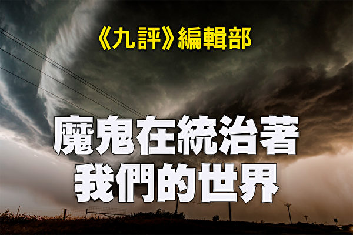
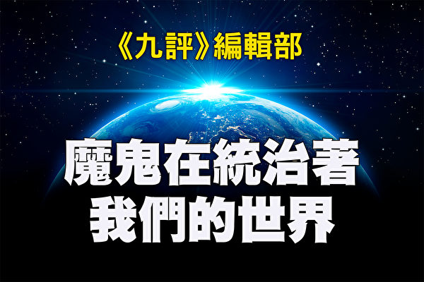

<a href=#27>第十八章 魔鬼安排下中共的全球野心（上）</a> 
<a href=#28>第十八章 魔鬼安排下中共的全球野心（下）</a> 
<a href=#29>结束语</a> 

<a name=27><h1 align="center"><b>魔鬼在统治着我们的世界(26)：全球野心(上)</b></h1>
<h3 align="center"><b>共产党的幽灵并没有随着东欧共产党的解体而消失</b></h3>

《九评》编辑部：魔鬼在统治着我们的世界。（大纪元制图）

【大纪元2018年12月10日讯】<b>第十八章 魔鬼安排下中共的全球野心（上）</b>

<b>目录</b>

前言 
1. 中共野心是取代美国，称霸世界 
1）中共称霸世界的野心一以贯之 
2）欲称霸世界，必打败美国 
3）全方位渗透和围堵美国 
4）长期煽动仇美情绪，为战争作舆论和心理准备 
5）放弃韬光养晦，对美国高调“亮剑” 
2. 中共称霸全球战略 
1）“一带一路”──以全球化的名义扩张版图 
（1）“一带一路”登台 
（2）“一带一路”的全球扩张 
2）“大周边外交”战略圈──把美国挤出亚太 
（1）澳洲是西方薄弱环节 
（2）中共觊觎太平洋岛国之战略价值 
（3）中亚五国：用债务陷阱掌控和掠夺资源 
（4）打造支点国家，不顾道德抢占资源 
3）对欧洲分而治之，分化欧美同盟 
4）殖民非洲──输出“中国模式” 
5）进军拉丁美洲──在美国后院挖墙角 
6）中共的军事野心

<b>前言</b>

上世纪初，魔鬼安排其人间代理苏共以暴力夺取政权，同时为其在世界舞台的最后一出大戏的主角做了铺垫──这就是当时由共产国际远东书记处一手建立的中共。此后数十年间在国际舞台上扮演主角的是苏共，和西方自由阵营正面对抗的是苏共，西方人也一直以苏共和东欧共产党为样本来认识共产主义。这给了中共充分的时间发展壮大。

上世纪90年代初苏共解体，中共登上国际舞台替换苏共唱主角，用难以察觉的非暴力方式利诱人们与之共舞。此时的中共摇身一变，宣称不再纠结意识形态之争，而以“改革开放”的旗号极力拥抱全球化、发展极权制度下的权贵资本主义经济。许多西方学者、企业家和政客们因此并不把中共当作共产主义政党看待，至多认为它是一个“另类”的共产党。

但事实上，中国共产党集中了共产主义的“假、恶、斗”和人类几千年政治权谋中最狡猾最阴险的部分，用利益诱惑人、用权力控制人、用谎言欺骗人，把这些魔鬼的工具掌握得炉火纯青，到了登峰造极的地步。

中国拥有五千年的悠久历史和辉煌的传统文化，世界上很多人具有很深的中国情怀，对那片古老的土地和中国人民抱有好感和敬意。中共充分利用了这一点。在其篡取政权后，绑架了中国人民和整个国家，混淆“中共”与“中国”的概念，把自己的野心隐藏在中国“和平崛起”的外衣下，这也构成了国际社会识别中共的难度。

但万变不离其宗。中共的经济合作策略只是为了用“资本主义肌体的营养”[1]养肥自己的社会主义躯体，为稳固其统治、实现其野心服务，并非为了中国真正的繁荣富强，其具体做法处处与普世价值相悖。

人类正常国家的立国之本来自于历史上的先哲、来自对神的信仰，要求遵循创世主所定下的行为规范、保持高尚品德、保障私有产权、恪守普世价值。正常社会的经济发展也都要有相应的道德水准支撑。魔鬼有意在中共党国里反其道而行之，在中共道德最败坏时，打造了一个快速崛起的“经济怪胎”。邪灵安排这场“经济奇迹”的目的很简单：没有经济上的强大，中共就没有对世界的发言权。邪灵并不是为了中国强大而安排这一切，而是要利用人对金钱和财富的崇拜，让全世界在经济上和国际事务上有求于中共。

中共对内用暴政和资本主义中最不好的部分来运作这个体制，颠覆人类的道德，赏恶惩善，让最坏的人在社会中最成功。其政策把人性中恶的一面放大，又用无神论造成人无所畏惧的彻底堕落。对外则极力在全球鼓吹“中国（共）特色”的共产主义意识形态，利用经济利益诱惑，让自由世界的人们放弃道德原则、默认其在中国实行的大规模信仰迫害和人权侵害。很多西方国家的政要和大公司为了利益向中共妥协出卖良知，按中共的规则行事。

西方国家希望对中共进行和平演变，中国表面上的确现代化和西化了，但是中共的核心从来就没有被演变过。几十年下来，真实的结果却是中共成功地和平蚕食了美国的立国之本和人心。魔鬼就是要在精神道德层面上摧毁人类的普世价值。

中共是共产邪灵在人间的代表，它为了毁灭人类而来。中共是当今世界文明的最大威胁。魔鬼让中共扩张全球的直接野心是将其毒素散布世界，并最终以强制形式胁迫人背叛传统、背叛神。其直接的全球野心即便没有得逞，在这个过程中人们被它用经济利益诱惑放弃道德原则，或者被它的金融圈套勒索控制，或被它在政治上渗透，或被它的大外宣迷惑，或被它的军事威慑恫吓而不敢谈道德原则，无论如何，魔鬼都同样达到了其目的。

面对如此巨大的危险，人们不能不仔细考察中共的野心、策略、手法及其背后的目的。

<b>1. 中共野心是取代美国，称霸世界</b>

<b>1）中共称霸世界的野心一以贯之</b>

中共不满足于做一个地区大国，而是要争霸世界，这一点是由中共的本性决定的，是与生俱来的。中共的本质是反天、反地、反传统的，要用暴力打碎“旧世界”，消灭国家、消灭民族、消灭阶级，“解放全人类”，这注定它一定会不断扩张，要以共产主义形态一统天下。因此，共产主义从一出现，就必然是一种“全球主义”的学说和实践。由于传统文化的力量曾经相当强大，在某些具体时间、地点，共产邪灵不得不采取渐进的、迂回的方式，宣称“社会主义首先在一国建成”，“建设有中国特色的社会主义”。

与西方民主国家的政党轮替不同，中共一党独大，其战略目标常常以几十年、上百年为时间段，分步骤实现。1949年中共建政之后，很快就喊出“超英赶美”的口号，搞“大跃进”，后来迫于国内和国际形势，曾经长期采取低姿态蛰伏。“六四”屠杀之后，中共遭到国际社会的围堵。当时中共评估形势后认为尚无法和美国抗衡，因此提出“韬光养晦”、“绝不当头”的方针。这并非是中共改变了其目标，而只是在争霸的不同阶段采取的不同策略、不同姿态而已。

从另外一个层面上观察，共产邪灵“明修栈道，暗渡陈仓”，在全球范围内率先扶植的是苏联，其真正目的是要把中共锻炼“成熟”，作为最后时刻毁灭人类的利器。

<b>2）欲称霸世界，必打败美国</b>

第一次世界大战之后，美国成为世界上最强大的国家，也是维护世界秩序的国际警察。任何一个国家要想称霸世界，必须打败美国。因此，在大的战略方向上，中共必然以美国为主要敌人。几十年间美国一直是中共的假想敌，中共从没放弃对美国的全方位“进攻”做准备。

美国著名中国问题专家白邦瑞（Michael Pillsbury）在《2049百年马拉松：中国称霸全球的秘密战略》中分析，中共有一个长期的战略计划，那就是在中共建政100年时，颠覆美国主导的世界经济、政治秩序，称霸世界。在中共国防大学制作的电视片《较量无声》中，明确表达了与美国较量的野心：中共在实现其主导世界的“伟业”的过程，“必然始终伴随与美国霸权体系的磨合与斗争，这是一场不以人的意志为转移的世纪较量。”[2]

中共的全球战略布局围绕着对美战略展开。宾夕法尼亚大学教授、中国问题专家林蔚（Arthur Waldron）2004年在国会参议院的一次听证会上陈述：中共军队是当今世界上唯一一支专门对抗美利坚合众国的军队。[3]事实上，不仅在军事方面，中共的大部分外交活动、国际战略都是直接或者间接针对美国的。

<b>3）全方位渗透和围堵美国</b>

为了实现称霸世界的企图，中共进行了全方位的布局。其在意识形态上和美国以及自由民主国家进行竞争；在经济上企图以强制技术转让和盗取知识产权实现“弯道超车”，用经济发展证明“制度自信”；在军事上和美国进行静悄悄的无声对抗，以“不对称作战”、“超限战”为战术基础，积极发展军备，在南中国海等地小试锋芒；扶植朝鲜、伊朗等流氓国家，牵制美国和北约。

在外交上，中共推动“大周边战略”、“一带一路”计划，对周边国家、欧洲、非洲、澳洲、拉丁美洲各国同时下手，迅速扩大国际影响力和控制力，企图在国际上扶植一批附属国，建立势力范围，孤立美国。中共以多种方式，在国际上合纵连横，比如建立上海合作组织（1996）、设立亚洲基础设施投资银行（2015）、发起与中东欧国家的16+1合作（2012）、热衷于金砖五国合作、大力推动人民币国际化、争取工业标准（如5G网络）的制定权，不断扩大影响力，争取话语权。

与此同时，中共利用美国和西方国家的民主制度与媒体言论自由，发动统一战线、大外宣、谍报战等手段，企图最大限度地从内部操纵与和平演变美国：建立私人关系收买美国政府官员、国会议员、外交官和退役军官；用经济利益驱使美国资本家当中共说客，来影响美国对中国的政策，强制高科技公司配合中共的网络封锁和信息审查；威逼利诱大多数华人社团自动成为第五纵队；渗透美国智库和学术科研部门，按中共的要求自律，为中共说话；收购和投资美国的媒体和电影业，同时制定“大外宣本土化”战略，喉舌媒体大举进军美国本土，力图掌握舆论，控制美国对中共的话语权……中共一方面在世界各国建立包围美国的战略圈，另一方面在美国本土步步为营，全线出击，广泛培植代理人，分裂美国社会，兴风作浪日甚一日，成为美国的心腹之患。

<b>4）长期煽动仇美情绪，为战争作舆论和心理准备</b>

作为共产邪灵在人间最重要的代理人，中共从仇恨当中吸取维持其自身存在的能量。中共所宣传的“爱国”，是建立在恨的基础上的──“爱国”就是恨日本、恨台湾、恨藏人、恨新疆少数民族、恨独立教会、恨异议人士等等，尤其重要的是恨美国。在中国网民之间流传着这样一句话：“小事找日本，大事找美国”，意为中共政权遇到小的麻烦就煽动民间的反日情绪，遇到大的麻烦就煽动反美情绪，以转移民众视线。通过煽动排外渡过统治危机，这样的事情在中国一而再、再而三地发生。

中共建政前曾多次称赞美国对中国的友善和美国的民主制度，但建政之后，立刻利用中国近代的积弱和中国人急于自强的心理，挑起仇美、仇外情绪，把自己吹捧成民族的救星。事实上，中共根本不在意中国民众的死活，也不在意中国的领土，更不在乎中华民族长远的健康发展。中共迫害中国民众、出卖国土、破坏道德与传统文化、毁掉中国未来前途的罪恶罄竹难书。中共对外煽动仇恨，其真正动机有四：一、为自己贴金，标榜功劳，为其残暴统治制造合法性；二、在遭遇困境时转移民众注意力，通过挑起仇恨和民族主义情绪来渡过难关；三、为中共扩张的野心做准备，把其邪恶图谋隐藏在所谓的民族自强、强国雪耻的幌子之下；四、用仇恨为未来战争做舆论动员与心理准备，为毫无道德底线的非理性手段争取最大限度的支持。

被中共灌输了满脑子仇美思想的青年一代，成为中共取代美国、称霸全球的驯服工具。一旦时机成熟，中共必将利用他们，以各种手段渗透打击以美国为首的西方自由国家，必要时不惜发动惨烈的战争，包括超限战乃至核战。“911”恐怖袭击发生后，中国网民一片欢呼，说明中共的这一贯穿其执政始终的宣传战略已经开花结果。在中国的各大时政论坛和军事论坛上，“中美必有一战”的叫嚣不绝于耳，也是中共仇美宣传成功的标志。这是中共处心积虑进行的长时段、渐进式的对美战争动员。

中共的仇美宣传不仅限于国内。在国际上，中共与那些反美国家沆瀣一气，统合全球反美势力，煽动国际仇美情绪，成为国际上仇美阵营的“精神领袖”和“带头大哥”。它或明或暗地支持流氓国家、恐怖主义组织与美国作对，给它们提供经济援助、武器装备、理论基础、战术培训和舆论支持。中共是当今世界不折不扣的邪恶轴心。

<b>5）放弃韬光养晦，对美国高调“亮剑”</b> 
2008年美国爆发金融危机。在这一年的北京，史上最贵的奥运会把一个包装成“盛世”的中国推向了国际舞台。在全球化过程中产业逐渐空心化的美国，经济上面临困难，于是请求中国伸出援手，“美国靠借中国人的钱过日子”成为了中共大肆炒作的话题。“美国在走下坡路，中国将要取而代之”，这种舆论主宰著中共的媒体版面，甚至也成为了西方媒体和学界的流行看法。

2008年后，美国在经济、军事和政治等各方面都呈现出颓势：经济上，重点在推全民医保，扩大福利，以气候话题为执政基石，加强环保监管，扼杀传统制造业，而新能源产业又被“中国制造”打得一败涂地，产业持续空心化，缺乏有效措施遏制中国在贸易和知识产权上对美国的巨大伤害，消极接受“中国崛起”和美国衰退是无可奈何的现实；军事上，开始削减军费，主张弱势外交；政治上，美国社会主义思潮日益兴起，社会分裂加大，民主政治变成政党利益的游戏，动辄瘫痪政府职能。相对于中共的“集中力量办大事”的专制模式，美国的民主制度反而成为让中共看笑话的反面例子。

2010年，中国超过日本，成为世界第二大经济体。世界银行2014年公布的数据显示，按购买力平价计算，中国当年国内生产总值或将超过美国。[4]在看到中美实力对比发生了巨大变化、以为美国衰败之势已不可逆转之后，中共终于抛弃了三十多年的“韬光养晦”，要针对美国主导的国际秩序高调“亮剑”了。中共官方、媒体和专家渐渐口无遮拦，大肆鼓噪“中国梦”，更加露骨地表露其野心。2012年，中共十八大提出构建“人类命运共同体”，又于2017年举办“全球政党大会”，制造“万邦来朝”的假象，急于向世界输出“中国（共）模式”，这种野心趋于顶峰。

目前中共提出的“中国模式”、为世界提供“中国方案”、“中国智慧”等等，打的是中国的旗号，但背后的真实意图是中共要成为世界领袖，建立以中共政权为轴心的世界新秩序，并为此在方方面面做了长期精心的准备。这个世界新秩序如果实现，将会出现一个不折不扣的“邪恶轴心”、“邪恶帝国”。世界各国领袖和人民都面临着一个比第二次世界大战前夕更为严峻的抉择。

<b>2. 中共称霸全球战略</b>

<b>1）“一带一路”──以全球化的名义扩张版图</b>

<b>（1）“一带一路”登台</b>

2013年中共正式提出“丝绸之路经济带”和“21世纪海上丝绸之路”，简称“一带一路”倡议。倡议称中国将投资数千亿美元，在数十个国家主导桥梁、铁路、港口和能源建设，要打造有史以来由单个国家发起的最大规模的海外投资行动。

一带，就是“丝绸之路经济带”，是在陆地上的，有三大走向，一是从中国出发，经中亚、俄罗斯至欧洲、波罗的海；二是从中国西北经中亚、西亚至波斯湾、地中海；三是从中国西南经中南半岛至印度洋。“一路”，指的是“21世纪海上丝绸之路”，有两大走向，一是从中国沿海港口过南海，经马六甲海峡到印度洋，延伸至欧洲；二是从中国沿海港口过南海，向南太平洋延伸。

陆地上的“一带”的主体框架目前有六大经济走廊：新亚欧大陆桥、中蒙俄、中国—中亚—西亚、中国—中南半岛、中巴、孟中印缅经济走廊。具体地说，新亚欧大陆桥以从中国到欧洲的铁路运输“中欧班列”（China Railway Express）为依托。海运从中国到欧洲，花费三十多天，而通过铁路只需十多天。中欧班列从2011年开始运行，成为“一带一路”的重要组成部分。中巴经济走廊是中国与巴基斯坦合作的大型工程计划，是一带一路的枢纽和旗舰项目，包括修建一条从新疆喀什到巴基斯坦瓜达尔港的高速公路。瓜达尔港（Gwadar Sea Port）2013年交中方运营，是巴基斯坦通往波斯湾和阿拉伯海的大门，战略位置重要，扼守着承担全球40%原油供应的霍尔木兹海峡通往阿拉伯海的海上通道。

海上“一路”的主体框架是共建一批重要港口和节点城市，争夺海运控制权。对实力较强的国家，采用先参股或合作经营码头建立关系，对相对贫穷的国家则用经营带动其经济，力图取得港口或码头的控制权。仅2013年一年，中国企业就至少获得了17个海外港口或码头的经营权。其中，招商局港口公司通过收购法国Terminal Link港口公司49%的股权，获得了该公司旗下四大洲8个国家15个码头的经营权。[5]中共这些年入股或者收购的港口还包括比利时的安特卫普港口和泽布吕赫码头、埃及的苏伊士运河码头、土耳其的伊斯坦布尔康普特（Kumport）码头、希腊的比雷埃夫斯港、新加坡巴西班让码头、素有“欧洲门户”之称的荷兰最大港口鹿特丹Euromax码头、阿联酋阿布达比的哈里发港二期码头、意大利的利古里亚瓦多港口码头、马六甲海峡的关丹港、非洲的吉布提港、巴拿马运河等等。除了投资，中共还通过一带一路制造的债务陷阱获取战略要地。斯里兰卡因无力偿还中国公司的债务，2017年底签署了一份有效期为99年的租约，正式将具有战略意义的汉班托塔（Hambantota）港移交给中国。

中共2018年又提出了“数字丝绸之路”，目标是要重塑全球互联网的未来发展。“数字丝绸之路”是一带一路的高级阶段，成为推进“一带一路”的最新动力。“数字丝绸之路”的重点是光纤电缆信息基础设施建设、互联网、数据信息服务、国际通信以及电子商务。很多“一带一路”相关国家没有完备的信用制度，中共希望借助“数字丝绸之路”把中国的电商模式和电子支付手段，比如支付宝，推广到这些国家，把西方的电子商务彻底排除在外。封锁网络的“防火长城”是中共的独门绝技，也将随着“数字丝绸之路”走出国门，将中共的网络控制输出给更多国家。

中共的战略范围从它在全世界的基建投资规模上可见一斑。据《纽约时报》2018年11月的总结，中共在各国修建了或者正在修建四十多条管道和其它油气基础设施，二百多座（条）桥梁、公路和铁路；近200座用核电、天然气、煤炭和可再生能源发电的发电厂，以及一系列大型水电大坝。中共在112个国家有投资项目，大多数属于“一带一路”的基础设施计划。如果画在一张地图上，密密麻麻都是中共投资的项目。中共的触角已经布满了全球。[6]

随着“一带一路”逐渐成形，中共的目的和野心也在不断扩大。通过“一带一路”，中共企图打造出一个自己的经济圈和势力范围来抗衡甚至取代美国：货币用人民币，信用依赖中共的支付系统，通信采用中国铺设的网路和制造的手机（包括5G技术），交通用的是中国高铁，建立起一套以“中国制造”为核心的独立于目前西方标准的中共标准。

<b>（2）“一带一路”的全球扩张</b>

“一带一路”初始时期，以中国周边国家为对象，最远也就到欧洲，不过很快就超越了这个范围，把非洲、拉丁美洲甚至北冰洋都包括进去，扩张到了全世界。海上丝绸之路本来是两条，后来增加了第三条──经北冰洋连接欧洲的北极航道，号称“冰上丝绸之路”。在非洲和拉美，中共早就有广泛的经济活动，现在也都统一到“一带一路”的主体框架里，以更大的力度、更快的速度在非洲和拉美进行经济甚至军事布局。

中共“一带一路”最直接的动因是出口过剩产能，就是把“铁公基”（铁路、公路等基本建设）战略从国内推向国外。沿线国家有很多资源、能源，中共帮助其修建铁路、公路能够一箭双雕，一是为产品更快更便宜地出口到欧洲打开一条陆地通道，二是获取必要的资源和能源。因为前提不过是为“世界工厂”扩大出口，所以中共并不是想在“一带一路”国家扶持制造业，把中国的制造业拱手转移到这些国家。中共真正的野心是以经济为先导，逐渐控制“一带一路”沿线国家的经济和政治命脉，把它们变成中共的势力范围甚至是殖民地，成为中共全球布局上的棋子。作为副产品，“一带一路”向周边国家输出腐败、债务、邪恶和专制，把共产主义病毒扩散至全球。所以，“一带一路”从根子上就是一个陷阱和骗局，不会给当地国家带来可持续的经济发展。

有很多国家开始警觉，对“一带一路”项目叫停或者重新审视；中共自己也不得不表示，要针对外界指责的债务陷阱问题做出修正并增加透明度。但是，中共不惜一切代价实现其野心的决心不可小觑。对西方企业来说，在一个动荡的国家里也许不会有长期的作为，而中共盘算的不是几年的计划，而是上百年的计划。它可以不计成本，在一个动荡的地方长期经营下去。它要的就是培养亲共的政府、可以在联合国为它站台的帮凶。中共要做“亚非拉”的盟主、要对抗自由世界继而取代美国的野心，使它可以不计自己百姓的死活。西方的私人企业承受不起的代价，中共可以很轻松地让十几亿中国人民勒紧裤腰带就扛过去了。在这场世界霸权的争夺战中，不是中共本身多么“厉害”，而是中共以十几亿中国人民为人质，用牺牲中国人民来扛起任何代价。

曾任白宫首席策略师的班农对“一带一路”战略有个独特的解读。他认为“一带一路”的大胆之处，就是将麦金德—马汉—斯皮克曼（Mackinder-Mahan-Spykman）三种关于如何统治世界的地缘政治理论整合在一起，组成了一个完整的计划。[7]英国地理学家和历史学家麦金德（Sir Halford John Mackinder）提出谁控制了中心地带（中亚）就控制了世界岛（欧亚）；谁控制了世界岛，就能控制世界。美国海军历史学家马汉（Alfred Thayer Mahan）提出控制海权的战略：谁控制了维护全球贸易的海道、要塞和运河就能控制世界。而耶鲁大学教授斯皮克曼（Nicholas John Spykman）则认为，环绕亚洲的海岸线比中心地带（中亚）更为重要，谁控制了海岸线就能控制欧亚；谁控制了欧亚就能控制整个世界。班农的观点反映出西方对中共“一带一路”和中共野心的警惕。

其实，中共的野心远远不止于此。“一带一路”也并非仅仅以占领陆权、海权或者要塞港口为着眼点，它根本就是无孔不入地满世界去钻空子。亚、非、拉许多从殖民宗主国独立出来的国家，出现了权力真空，自然就成了中共的目标；苏联解体后独立出来的国家，削弱了宗主国的控制，也成了中共的目标；一些因为动荡战乱和冲突而让西方企业望而却步的国家和地区，中共也是悉数囊括；小国、岛国、经济落后国家、具有战略利用价值的国家等等，都是中共眼里的佳肴；就算是在西方传统版图中的国家，因为经济不景气，债务缠身，也都成为了中共的俎上之肉。从地缘政治上讲，中共就是不知不觉把美国包围起来，用经济利益来控制当地国家，把美国慢慢地从这些国家中边缘化，最终剥离出去，从而建立起一个不同于现行国际秩序的、以中共的核心价值观为基础的世界新秩序。这种手法，俨然与中共的老伎俩“农村包围城市”一样，最后是要取代美国，服务于中共的全球野心。

<b>2）“大周边外交”战略圈──把美国挤出亚太</b>

什么是中共的大周边战略？按照中共智库的定义：“中国有14个陆上邻国、6个海上相望国家；再延伸出去，东面是亚太，西面是整个欧亚大陆。也就是说，中国周边的辐射面占了世界政治、经济、安全的三分之二以上。因此周边外交的布局不只是一个地区战略，更不仅仅是一个周边战略，而是一个真正的大战略。”[8]

<b>（1）澳洲是西方薄弱环节<b> 
2017年6月，费尔法克斯媒体和澳大利亚广播公司发布了为期五个月的联合调查，以纪录片《权力与影响：中国共产党如何渗透澳大利亚》披露中共在澳洲渗透、控制活动之猖獗，引起全世界关注。[9]六个月后，澳洲工党议员邓森（Sam Dastyari）宣布辞去参议员一职，因其被曝出收受中共红色商人金钱，继而就南海问题发表有利于中共但与其政党乃至政府立场相左的言论。[10]2016年9月澳洲媒体SBS曾刊登文章，披露一个中国富商在澳洲提供政治捐献，直接影响澳洲对华商贸政策。[11]不仅如此，中共媒体机构近年来还与澳大利亚媒体签了协定，同意澳洲媒体分销中共媒体的内容。[12]

实际上，早在2015年，澳洲就把达尔文港租给一家与中共军队有联系的中国公司，租期99年。达尔文港是澳大利亚防卫来自北方的攻击的最重要的军事要塞。当时美国前副国务卿阿米蒂奇（Richard Armitage）表示，这令人感到“震惊”，这个举动令美国感到措手不及。[13]

2017年，澳洲学者汉密尔顿（Clive Hamilton）撰写的《沉默的入侵：中国对澳大利亚的影响》完稿，但是一连有三家澳洲出版商拒绝出版，因为他们怕得罪中共。最后第三家出版商重新考虑出版，此书才得以面世。此事更令澳洲人担心中共对澳洲的影响和操控。[14]

更多的人想知道，中共为何如此看重澳洲？中共在澳洲的操控和渗透在其战略远景中起何种作用？

美国国家民主基金会于2017年12月初发表的报告《锐实力：正在上升的威权主义的影响力》（Sharp Power: Rising Authoritarian Influence）指出，中国（共）以利诱和渗透影响和改变澳洲政界与学术界，一个主要目的是削弱美—澳联盟。[15]

“在整个澳大利亚二战后的历史中，美国一直是我们地区的主导力量。今天，中国（共）正在挑战美国的地位。”2017年发布的澳大利亚外交政策白皮书如是说。[16]澳大利亚战略政策研究所的国防分析师马尔科姆‧戴维斯指出，北京试图在澳洲地区获得战略优势，其目标是“最终结束（美澳）联盟”。[17]

澳大利亚是中共最早拓展海外软实力的试验地。[18]作为大周边战略的重要一步棋，中共对澳洲的渗透可以追溯到2005年。当时外交部副部长周文重抵达堪培拉，向中共大使馆的高级官员传达中央的新战略。他说，将澳大利亚纳入其大周边地区的第一个目标是确保澳大利亚成为中共未来二十年经济持续增长的可靠和稳定的资源供应基地。长期目标是撬开美澳联盟。与会者的任务是弄清楚中共如何能够最有效地实现所谓“在经济、政治、文化各方面对澳大利亚的综合影响力”。[19]

中共利用经济手段迫使澳大利亚在包括军事和人权的一系列问题上做出让步。用经济利益培养密切的人际关系，同时加上惩罚的威胁，是中共迫使人就范的标准运作方式。北京希望将澳大利亚变成“第二个法国”，一个敢于对美国说“不”的西方国家。[20]

汉密尔顿在多年详细调查之后发现，“澳大利亚的机构──从我们的学校，大学和专业协会到我们的媒体；从采矿、农业和旅游等行业到港口和电网等战略资产；从我们的地方议会和州政府，到我们在堪培拉的政党──正在被中共监管的一个复杂的控制体系所渗透和改造。”[21]

2008年金融危机之后，澳大利亚实际上自愿把自己作为中共的资源供应基地，认为中共把澳大利亚的经济从危机中拯救出来。汉密尔顿指出，中共的渗透和影响之所以在澳洲有效，是因为澳洲人“一直允许它在我们的鼻子底下发生，因为我们被只有中国能够保证我们的经济繁荣的信念所迷住，以及我们不敢站起来抵抗北京的欺凌”。[22]

大多数善良的西方人最初即使意识到中共在西方社会的渗透和影响，特别是对海外华人社区的渗透和控制，也只是天真地认为，中共各种策略的主要目标是“消极的（negative）”──为了消除持不同政见者和批评者的声音。但汉密尔顿指出，这个“消极”目标背后，同时有一个“积极的”野心──利用侨民改变澳大利亚社会的形式，使西方人都同情中共，让北京轻松控制。然后，澳大利亚将协助中共成为亚洲乃至世界的霸权。[23]

类似地，中共的渗透和控制同样延伸至大洋洲的另一个国家新西兰，这里仅举数例说明。新西兰坎特伯雷大学（University of Canterbury ）中国问题专家安-玛丽‧布莱迪（Anne-Marie Brady）教授2017年9月发布报告《魔法武器》（Magic Weapons），以新西兰为例详述中共如何在海外影响渗透，发挥政治影响力。其中披露的内容包括数名新西兰国会现任华裔议员与中共联系密切，以及来自中国的红色富商、华商协会等统战组织的巨额政治献金等。[24]布莱迪教授发布有关中国在新西兰影响渗透的报告后不久，她的大学办公室遭入室盗窃。失窃前，她还收到一封匿名警告信，信中详细列出了对那些没有按照北京官方路线走的人所进行的报复措施，并警告她说：“你就是下一个。”[25]

中国还积极拉拢新西兰本土政客：比如以极高的礼遇接待访华的新西兰各政党要员，高薪聘请很多新西兰前政客在中资机构里担任要职，或通过其它方式对他们进行利益输送，以让他们听命于中共。[26]

<b>（2）中共觊觎太平洋岛国之战略价值</b>

太平洋海域具有非常重要的战略价值，每一个岛屿都可能成为重要的海上据点。太平洋岛国“岛小海大”，陆域总面积仅53万平方公里，海洋专属经济区面积却高达1900万平方公里，是中国海洋专属经济区面积的6倍还多。中共明确表示，和太平洋岛国发展关系是其战略决策。然而，目前这片海域仍属美国、日本、新西兰、澳大利亚、法国等国的势力范围，中共欲在太平洋上发展海军，拉拢太平洋岛国将是首要任务，继之才能让这些岛国倒向中共，排除美国势力。[27]新西兰教授韩德森（John Henderson）和澳大利亚教授赖利（Benjamin Reilly）指出，中共在南太平洋地区的长期目标，就是要取代美国成为此地区的霸权。[28]中共在美拉尼西亚、密克罗尼西亚和波利尼西亚等群岛注入了大笔投资，援建重要的基础设施项目，鼓励大量游客到访以及开放电子商务平台，其动作规模远远超过美国。澳大利亚作家本‧波汉（Ben Bohane）警告，美国正在把太平洋输给中共。[29]

在中共大规模援助、投资这些岛国之后，中共官员表现出的狂妄言行，折射出当中共壮大、自我感觉良好时的真实心态：像对待其极权治下的中国人一样对待其它国家，让其它国家都臣服于中共才是其目的。指望中共遵守国际准则显然是不可能的。

2018年在巴布亚新几内亚召开的APEC峰会上，中共官员一系列令人震惊的粗鲁野蛮行为是其野心的一次大曝光，这些行为包括：1）在东道国蛮横阻止记者（包括东道国记者）采访习近平与太平洋国家领导人举办的一个论坛，要求所有国家的记者报导时采用新华社的通稿。2）为了阻止会议联合公报中写入谴责中共不公平的贸易行为的措辞，中共官员霸道地要求会见东道国外长，但后者认为私下会见中方官员会影响其中立性，因此拒绝了他们的要求。谁知此后四名中共官员竟企图强行闯入外长的办公室，最终因被警察逐出而未能得逞。3）在会议中，当中共官员认为其它国家“阴谋”针对中共，就在会场里大吼大叫。中共在这次峰会上的种种恶行，被一位美国高级官员称为“发脾气外交”。[30]

<b>（3）中亚五国：用债务陷阱掌控和掠夺资源</b>

随着苏联的解体，中共开始努力建立并加强与哈萨克、吉尔吉斯斯坦、塔吉克斯坦、土库曼斯坦以及乌兹别克斯坦等中亚国家的关系。中国在中亚地区的战略目标涵盖几个层面：首先，该地区是中共在陆地向西扩展的必经之地，并且中共在为货物进出中国的运输铺设基础设施的同时，可以进一步扩展在中亚地区的商业利益；其次是在该地区攫取自然资源，其中包括煤、石油、天然气和贵金属；第三，中亚国家在地缘和文化上靠近新疆，对该地区的控制，可以强化对新疆少数民族的控制。

虽然中共未明说要主宰中亚，但事实上，中共如今已经成为该地区最有影响力的角色。总部设在布鲁塞尔的智库“国际危机小组”（International Crisis Group）2013年公布的一份报告指出，中共在中亚的动荡不安中，快速成长为该地区占主导地位的经济角色。北京把中亚视为原材料和能源基地，以及其低廉消费品的市场。中共也向中亚注入数亿美元的援助及投资，名义上是要促进新疆自治区的稳定。[31]

如今，一个巨大的公路、铁路、空运、通信和油气管道网络已经将中国与中亚紧密地联系在一起。中国道路与桥梁公司（CRBC）及其它承包商，已经担负了该地区高速公路、铁路和电力传输的建设，在世界最险恶的一些地形上铺路，并为运送中国商品到欧洲、中东和巴基斯坦及伊朗港口而建设新道路。从1992年中国与中亚五国建立外交关系到2012年的二十年间，中国与该地区的贸易总额已增加了100倍。[32]

中共在中亚地区倡导以国家为主导、信贷推动的基础设施项目重大投资计划。有学者推测它可能成为一种新的国际秩序的基础，中国将在这种秩序中发挥主导作用。从这个意义上说，中亚是中国外交政策新思想的试验场。[33]

目前，北京倾向于支持该地区腐败的独裁者，且其不透明的投资计划被认为只对一小部分精英有益。“国际危机小组”的报告指：“每个中亚政权都脆弱、腐败，并为社会经济问题所困扰。”[34]北京推动的大规模基础建设不但和钜额贷款挂钩，而且都涉及有利可图的许可与审批，在威权体制中不可避免地助长腐败。

以乌兹别克斯坦为例，该国1991年独立之后就一直由原乌兹别克共产党中央委员会第一书记卡里莫夫掌权任总统，至其2016年去世前，威权统治长达四分之一世纪之久。2005年在东部城市安集延（Andijan）的镇压造成数百人死亡。中共则宣布自己是卡里莫夫的坚定支持者，“一如既往地支持乌兹别克斯坦及本地区各国为维护国家和地区安全与稳定所做的努力。”[35]

中亚国家自身脆弱的经济结构，加上向中共大笔举债进行基础建设，导致这些国家被债务陷阱套住。土库曼斯坦面临惨重的经济危机，通涨率达300%、失业率飙升至50%、商品短缺，同时腐败丛生。这个中亚威权政府70%的收入来自天然气出口，而北京目前为其天然气的唯一买家。[36]北京同时也是其90亿美元钜额外债（占2018年GDP的30%）的最大债权人。[37]土库曼斯坦可能不得不将天然气田交给中国以偿还债务。[38]不夸张地说，该国经济命脉已掌控在中共手中。

在塔吉克，因向中共贷款兴建发电厂致使其欠下3亿美元债务而无力偿还，该国已将一座金矿开采权交给中共抵债。[39]

吉尔吉斯斯坦经济也岌岌可危。大规模基础建设造成吉尔吉斯欠北京大笔债务。吉尔吉斯很可能会将其部分自然资源转让给后者抵债。该国还和华为与中兴合作建设数字通讯设施，加强政府监控，这同时也为中共留下方便的后门。[40]

北京利用苏联解体后留下的权力真空，进入哈萨克斯坦能源领域。哈萨克斯坦的整个经济基于生产原油，以美元出售，并用这些美元购买廉价的中国产品。除采掘业外，这个国家工业基础薄弱。大量中国廉价商品涌入，使得本来不堪一击的哈萨克斯坦的原有工业彻底下跪。[41]

中共在中亚地区扩张的另一个动机，是借此加强打击其境内新疆维吾尔族异议人士。中共牵头的上海合作组织的章程允许嫌犯在成员国之间引渡，成员国可以派出他们的人员到其它成员国进行调查。中共借此将打压维吾尔人的行动扩展到境外，跨国将境外流亡的异议维吾尔人抓捕回来。[42]

<b>（4）打造支点国家，不顾道德抢占资源</b>

中共的大周边战略实施过程中采用了优先打造“支点国家”（pivotal states），然后以点带面，达到整个区域的战略目标。所谓支点国家，按照中共智库的说法，是具备一定实力、中共有能力和资源来引导其行为、在战略利益上和中共不存在直接冲突、与美国没有紧密利益关系的国家。[43]除了上述的澳大利亚、哈萨克斯坦等之外，这样的支点国家还有中东的伊朗、南亚的缅甸等等。

中共在中东最大的投资国是伊朗。伊朗是中东的重要产油国，同时在价值观上又一直反对西方。于是伊朗自然就成了中共经济和军事的战略合作对象。中共自从上世纪80年代就开始和伊朗保持经济和军事交往。1991年，国际原子能机构发现中共出口铀到伊朗，又发现了中共与伊朗于1990年签订的秘密核协议。[44]2002年，伊朗的浓缩铀项目被发现，西方国家的石油公司纷纷撤离，这给中共留下在伊朗乘虚大规模发展的机会。[45]中共与伊朗的双边贸易额自1992年到2011年之间呈指数增长，十七年间窜升一百多倍。[46]（其后因国际制裁压力有所放缓。）被国际社会孤立的伊朗如今最大的经济伙伴是中共。伊朗在中共的帮助下发展了从短程到中程的战术弹道导弹和反舰巡航导弹，以及水雷和快速攻击艇。中共甚至帮助伊朗秘密建立了化学武器项目。[47]

另一个受到中共青睐的支点国家是其南亚的邻邦缅甸。缅甸有漫长的海岸线，能提供一个通往印度洋的战略性出口。中共把开辟中缅通道视为规避马六甲海峡风险的战略步骤之一。[48]缅甸军政府的恶劣人权记录一直使其受国际社会孤立。缅甸的1988年民主运动以军队镇压收场。第二年，北京的坦克也在天安门广场大开杀戒。两个被国际社会同声谴责的极权政府同病相怜，从此开始密切往来。1989年10月，缅甸的丹瑞大将访问中国，双方达成高达14亿美元的军火交易。[49]上世纪90年代双方又有多次军火交易，中方售缅装备包括战机、巡逻舰、坦克及装甲运兵车、防空炮、火箭等等。[50]中共的军事、政治和经济支持成了苟延残喘的缅甸军政府的生命线。[51]2013年，投资50亿美元、被称为中国第四大油气进口战略通道的中缅油气管道建成，虽遭当地反对，在中共干预和谈判后于2017年投入运行。[52]类似的大型投资还包括密松水电站（目前因当地反对而遭搁置）、莱比塘铜矿。2017年中缅两国双边贸易总额135.4亿美元。中共正计划建立中缅经济走廊，其中包括打造一个中方占股70%、出口印度洋的深水港、[53]缅甸皎漂特区（Kyaukpyu Special Economic Zone）工业园等。[54]

<b>3）对欧洲分而治之，分化欧美同盟</b>

冷战中，欧洲是自由世界和共产阵营对峙的前沿阵地，北大西洋公约组织是美国的坚定盟友。冷战结束之后，欧洲在世界上的政治经济地位显著下降。为了分裂欧美同盟，中共在欧洲采取了因地制宜、渐进渗透和控制的策略，对欧洲国家企图“分而治之”。近年来，欧美在很多重大议题上的分歧渐趋明显，重要原因之一就是中共的分化和蚕食策略。

2008年金融危机之后，针对欧洲内部的弱国急需外资的弱点，中共乘虚而入，对这些国家注入大笔资金，换取它们在国际法和人权等议题上的妥协。中共用这种方式制造和扩大欧盟国家内部的裂痕，从中渔利。被中共瞄准的弱国包括希腊、西班牙、葡萄牙、匈牙利等。

希腊发生主权债务危机之后，中共趁机大举投资希腊，用金钱换取政治影响力，并通过希腊把影响力发挥到欧洲。数年之内，中共已获得希腊最大港口比雷埃夫斯港2、3号集装箱码头35年的特许经营权，并接管重要转运枢纽比雷埃夫斯港。2017年5月，中国和希腊签署“三年行动计划”，涵盖铁路、港口、机场网络建设、电力能源网络及发电厂投资等。[55]中共的投资已经得到政治上的回报。2016年后，作为欧盟成员国的希腊多次反对欧盟针对中共政策和人权的批评议案，造成这些声明流产。2017年8月，《纽约时报》一篇评论说：“希腊已开始投身于自己最热心的、地缘政治野心最大的追求者中国的怀抱。”[56]

2012年，中共发起与中欧、东欧16国的地区合作框架“16+1合作”。匈牙利是首批加入“16+1合作”机制的国家，也是第一个与中国签署“一带一路”协议的欧洲国家。2017年，中国和匈牙利的双边贸易额突破100亿美元。与希腊一样，匈牙利也多次反对欧盟对中共人权状况的批评。[57]捷克总统雇用中国富商做自己的顾问，高调地与达赖喇嘛保持距离。[58]

包括在该框架之内的16个国家，其中有11个是欧盟国家，5个为非欧盟国家。中共别有用心地提出这个地区协作的新模式，分化欧盟的意图明显。此外，在这16国当中，前社会主义国家占据相当比例，这些国家有共产党统治的历史，从思想上到组织上都保留了很多共产党的痕迹，容易跟中共一拍即合。

欧洲小国林立，单独一个国家很难与中共抗衡。中共利用这一点，各个击破，让这些国家不敢就中国的人权状况和外交政策发声。最典型的例子是挪威。2010年挪威诺贝尔奖委员会将和平奖颁发给仍在狱中的异议人士。中共迅速对该国采取报复行动，为挪威向中国出口三文鱼设置重重障碍，在其它方面也多方刁难。六年后，两国关系“正常化”，但挪威开始在中国人权方面保持沉默。[59]

传统的西欧强国也感受到中共不断扩大的影响力。中共对德国的直接投资从2010年开始大幅增长。2016年和2017年，中国都是德国最大的交易伙伴。2016年，有56家德国企业被来自中国内地和香港的投资者并购，投资额高达110亿欧元。这种并购使中国企业得以迅速进入市场或获得西方先进技术、品牌和其它资产。[60]美国胡佛研究所2018年发表的报告称之为中共的“武器化”投资。[61]德国西部的工业城市杜伊斯堡成为中共“一带一路”的欧洲中转站。每周30列满载中国货物的列车来到该城市，再从这里分别运输到其它国家。该市市长说，杜伊斯堡是“德国的中国城”。[62]

对于法国，中共长期以来一直采用“采购外交”。如中共党魁江泽民1999年访法时送了法国一笔价值150亿法郎的大买卖，购买了近30架空中客车工业公司的飞机，由此得到法国政府对中共加入世贸组织的支持。法国成为中共天安门广场大屠杀之后第一个与中共建立“全面战略伙伴关系”的西方国家，当时的法国总统是西方第一位反对在日内瓦人权会议上批评中国、第一个力主解除欧盟对华武器禁运、为中共唱颂歌的西方政府首脑。[63]此外，中共很早就在法国开始了“中国文化周活动”，规模浩大，实质是借文化之名兜售中共的意识形态。[64]

传统欧洲强国、美国的重要盟友英国是中共觊觎的重点之一。2016年9月15日，英国政府正式批准中国与法国财团合资的欣克利角C机组核电项目动工。欣克利角C核电站（Hinkley Point C Nuclear Power Station），是在英格兰的西南部萨默塞特郡筹建的核电站，装机容量3,200兆瓦。该项目遭到含工程师、物理学家、环保人士、中国问题专家、商业分析师等在内的专家的严厉批评，尤其是指其给英国国家安全带来巨大隐患。特雷莎‧梅的前幕僚长尼克‧提摩西（Nick Timothy）指出，安全专家“担心中国人可以利用他们的角色在电脑系统中建立弱点，这将使他们能够随意关闭英国的能源生产”。[65]英国《卫报》指“这个世界上最昂贵的电厂”是个“可怕的交易”。[66]

与在世界上其它国家一样，中共政府在欧洲扩大影响力的活动无孔不入、多种多样。如收购欧洲高科技公司，控股重要港口，收买退休政要替中共站台，渗透大学、智库、研究所，笼络汉学家替中共唱赞歌等等，不一而足。[67]中共政府的对外宣传工具《中国日报》（China Daily）每月在英国历史悠久的大报《每日电讯报》（The Daily Telegraph）上加入一次插页，登载给中共政权涂脂抹粉的文章。为此中共付给《每日电讯报》的费用高达每年75万英镑。[68]

中共在欧洲的活动引起了研究者的极大疑虑。欧洲著名智库全球公共政策研究所（GPPI）2018年发表研究报告，揭露中共在欧洲的渗透活动。该报告指出，中共拥有全方位的、灵活的政治影响力工具，主要涵盖三个方面：政治与经济精英、媒体与公共舆论、公民社会与学术界。中共严格限制外国思想、机构和资金的进入，而欧洲门户大开，中共却利用这一点实现自己的政治图谋。该报告指出，这种不对称政治关系的后果已经在欧洲显现。欧洲国家开始调整政策讨好中共。欧盟国家和某些邻国甚至不惜损害本国利益，采纳中共的说辞和立场。欧盟的统一受到中共“分而治之”的策略的威胁，尤其是在自由价值和人权保护方面。而欧盟内部的一些人士或者为了从中共那里取得经费，或者为了在全球范围内获得认同，也自愿配合中共，宣扬其价值观，维护中共的利益。[69]

除了政治、经济和文化上的渗透以外，中共还在欧洲进行各种间谍活动。2018年10月22日，法国《费加罗报》以“费加罗报揭露中国针对法国的间谍计划”为总标题，通过独家系列专题报导，揭示了中共在法国的各种间谍手法。中共为了渗透法国政经、战略领域，通过职场社交网站──特别是领英（LinkedIn）──招募法国人，为其提供情报，事态十分严重。报导说，这些真实案例只是中共在法国运作的间谍行动的冰山一角，中共的目的是大规模掠夺法国国家内部和经济财产的敏感资料。[70]同样的间谍活动在德国也出现了。[71]

<b>4）殖民非洲──输出“中国模式”</b>

二战后，非洲国家纷纷从殖民地走向独立。伴随着西方向中国的技术和资金转移，非洲开始失去来自西方国家的关注。而中共在得到西方输血壮大的同时，对非洲的蚕食却逐步发展：中共的势力开始替代原来西方宗主国在非洲的布局，渗透到非洲的政经、生活各个层面。中共一方面用发展中国家的名义来拉拢非洲国家，搞统一战线，在联合国与美国等自由国家对抗，另一方面则不断通过经济收买和军事援助等手段操纵非洲政府和反对派，左右非洲国家的运作，同时对非洲输出中共模式和价值观。

中共控制的中国进出口银行在2001年至2010年间向非洲国家提供了627亿美元的贷款。这些贷款利息相对低，表面上看不附带任何政治条件，而且相对不考虑投资风险，但因为很多贷款的抵押品是自然资源，中共由此获得大量自然资源的开采权。2003年中国进出口银行向安哥拉提供的贷款由石油担保，被称为“安哥拉模式”。于是，在非洲出现了这样的情景：“中国人在非洲采油，通过中国制造的油管和港口，送到中国的油船上输入中国。中国人（中共）武装起一个犯反人类罪的政府，再保护这个政府在联合国安理会里立足。”[72]

在中共对非洲的经济领域越来越多的参与之后，中国在2016年成为非洲的最大交易伙伴和外国直接投资者。[73]中共在非洲的经营模式有许多被人批评的弊病：低工资、恶劣的劳动条件、劣质产品、豆腐渣工程、环境污染，以及对所在国官员的行贿等腐败行为。中国在非洲的开采活动，经常遭到当地民众的抗议。

赞比亚前总统迈克尔‧萨塔（Michael Sata）曾在2007年竞选总统时说过，“我们要让中国人走开，让从前的殖民者回来，虽然他们也曾利用我们的资源，但至少他们会很好地照顾我们，他们兴建学校、教我们语言，还带给我们英国文明。西方资本主义还有人类的面目，中国人却只会剥削我们。”[74]中国在赞比亚的影响已经随处可见，从举头可见的中国银行看板，到几乎无处不在的中国人。这使得萨塔不可避免地和中共打交道，得到权力后就马上和中国大使会面，并在2013年访问中国。

苏丹是中共在非洲最早打造的堡垒之一，过去二十年中共在苏丹的投入呈指数发展。除了丰富的石油资源，苏丹在红海的战略地位对中共也十分重要。[75]上世纪90年代，当国际社会对支持恐怖主义和极端伊斯兰主义的苏丹巴希尔政权孤立之际，中共乘虚而入，迅速成为苏丹最大的交易伙伴，进口了苏丹出口石油的绝大部分。[76]中共的投资帮助了巴希尔极权政府在西方的围堵中残喘甚至发展，中共军方同时还向苏丹输入武器，间接为本世纪初苏丹的达尔富尔种族灭绝助力。中共在国际社会上同时扮演两面角色。一方面向联合国派出维和部队，为苏丹冲突“调停”；另一方面却公开邀请被国际刑事法庭以反人类罪通缉的苏丹总统访问，并称，不管世界有多大变化、不管苏丹内部的局势如何，中共永远是苏丹的“朋友”。[77]

中共拉拢第三世界国家可谓不遗余力。中非合作论坛2000年于北京成立，之后几次在关键年份举行的中非论坛，中共领导人都向非洲“大撒币”。2000年成立大会，江泽民宣布免除非洲穷国100亿元人民币的债务；2006年，北京再做峰会主办国，中共不但宣布免除所有非洲邦交穷国截至2005年底的债务，[78]还送出逾百亿美元的基金、信贷、奖学金及各种援建项目；2015年在南非约翰内斯堡，中共宣布将提供600亿美元的资金，同非洲国家合力推行“十大合作计划”。[79] 中共商务部副部长2018年8月28日表示，“对非洲33个最不发达国家，97%的输中产品给予零关税。[80]在2018年9月3日中非合作论坛北京峰会上，中共承诺再向非洲提供600亿美元的无偿援助、无息贷款、专项资金和投资，同时承诺，对“与中共有外交关系”的非洲穷国，免除其2018年底到期的政府间未偿还债务。[81]

经过几十年的苦心经营，中共用商业贸易掌握非洲经济命脉，用经济利益收买了大批非洲政府，让他们对中共言听计从。外界已经注意到中共试图征服非洲，并把非洲作为推广宣传中共模式的大舞台。中共体制内学者宣称：“中国四十年走到今天就证明，不用走西方的道路也可以成功，历史没有终结。这对于非洲的冲击，是无法想像的。”[82]

埃塞俄比亚前总理梅莱斯效仿中国制定了五年计划，执政党埃革阵的组织形式与中国共产党十分相似。一位匿名的中国外交部人士介绍，埃塞俄比亚执政党人民革命民主阵线大部分高层都曾到中国学习和接受培训，许多要员的子女也被送往中国留学。而埃塞俄比亚的部长级官员更是几乎人手一本《毛泽东选集》。[83]2013年3月召开的金砖国家峰会上，埃塞俄比亚总理表态称，埃塞俄比亚把中国当做合作伙伴和发展榜样。目前，埃塞俄比亚被称为非洲的“新中国”，互联网的审查、封锁、政治专制、媒体被管控等等与中国如出一辙。[84]

埃塞俄比亚并不是唯一的例子。2018年，中共中央对外联络部主办的第四届中非青年领导人论坛和中拉政党论坛在广东深圳开幕，其培训目标是领导人和政府官员。华盛顿智库史汀生中心（Stimson Center）中国项目主任孙韵（Yun Sun）表示，这样的政治培训是向发展中国家输出“中国模式”。她说：“他们的这种政治培训有三个目的。第一，是中共的合法性，试图告诉世界中共是如何成功的管理了这个国家以及这样的成功经验是如何可以在别的发展中国家被复制。第二个目的是推介中国的发展经验，就是所谓的‘交流治国理政’经验，虽然没有输出‘革命’，但是确实输出了中国的意识形态方式。第三是加强双边交流。”[85]也就是说，中共把自己的体制作为样板向非洲输出。

<b>5）进军拉丁美洲──在美国后院挖墙角</b>

拉丁美洲地缘上靠近美国，历史上一直是美国的势力范围。虽然拉美在19世纪中叶共产主义泛滥的时候出现了不少社会主义政权，但外来影响尚不足对美国构成威胁。

前苏联解体后，中共开始觊觎拉美，打着“南南合作”等旗号，从经贸、军事、外交、文化等方面进行全方位的渗透。拉丁美洲许多国家如委内瑞拉、古巴、厄瓜多尔、玻利维亚等在政治上存在强烈反美的立场，中共充分利用这点，跨洋过海把手伸到这里，挑拨他们跟美国的关系，助长那些国家的反美倾向。这样一方面既可以削弱美国在该地区的优势，另一方面可以自由进出美国的后院，扶持拉美的社会主义政权，为长期与美国抗衡、实施中共全球野心做准备。可以毫不夸张地说，中共对拉美的渗透和影响力已经远远超出了当年的苏联。

中共首先通过外贸和投资扩大在拉美的影响力。根据美国智库布鲁金斯研究所的报告，2000年中国对拉美的贸易只有120亿美金，到2013年已经达到2600亿，增长了20多倍。2008年之前，中国的贷款承诺不超过10亿美元，而在2010年，达到370亿。中国承诺从2005年到2016年间向拉美提供1410亿美元贷款。中国的贷款目前已经超过了来自世界银行（World Bank）和泛美开发银行（Inter-American Develop Bank）的贷款总额。与此同时，中共承诺到2025年将向拉美提供2500亿美元的直接投资，中国与拉美的双边贸易将达到5000亿美元。拉丁美洲是目前中国投资的第二大目的地，仅次于亚洲。

对相当多南美国家来说，中国已经成为它们最重要的出口国。中国是拉丁美洲三个最大经济体──巴西、智利和秘鲁的第一大出口市场，是阿根廷、哥斯达黎加及古巴的第二大出口市场。从厄瓜多尔的公路建设，到巴拿马的港口项目，再到连接智利与中国的光纤，中国在整个拉美地区的影响已相当显著。[86]

中共一直致力于把拉美变成自己的资源基地，如宝钢在巴西有钜额投资，首钢控制了秘鲁的铁矿。中共还对厄瓜多尔的石油、委内瑞拉的燃料与金矿表现出极大的兴趣。

中共大量投资拉美的基础设施。在阿根廷，中共承诺在运输粮食的港口投资2500万美元，在阿根廷和智利之间的公路方面投资2.5亿美元。[87]

军事上，中共对拉美的渗透正在一步步扩大和深入。中美经济与安全小组的研究员威尔逊（Jordan Wilson）发现，中共对拉美从2000年前的低端军售，发展到后来的高端军售，到2010年达到一亿美元销售额。尤其在2004年之后，中共对拉美军售大幅上升。而这些军售的对象都是具有反美倾向的政权，如委内瑞拉。这个阶段同时伴随着军事训练方面的合作。2015年在北京召开的中阿（阿根廷）双边峰会，其协议内容如果得以实施，将意味着两国的军事合作达到一个新的阶段。这包括先进高端产品的合作生产，协助中共在其境内建立首个南半球宇航器深空测控跟踪站，以及在阿根廷空军部署中国制造的战斗机，总额达到5亿～10亿，超过中共2014年对拉美地区的1.3亿的军售总和。中共与拉美的外交、经济、文化和军事联系迅速发展。中共2015年的军事白皮书要求中共军队积极参与地区和全球的安全合作，以有效的保证中共的海外利益。[88]

外交上，由于中共的拉拢和威胁，巴拿马、多明尼加及萨尔瓦多等一些与中华民国有邦交的国家或地区，选择与中华民国断交，转而投向中共的怀抱。巴拿马2017年6月宣布与中共建交，终止与中华民国超过一个世纪的外交关系。中共三年前就积极筹划投资巴拿马基础建设，如港口、铁路、公路，投资金额高达7,600亿台币。[89]中共已经获得在全球具有重要战略意义的巴拿马运河两端的控制权，有可能影响到美国后院。中共还在萨尔瓦多联合港投资将近300亿美金。美国驻萨尔瓦多大使马尼斯2018年7月曾在萨尔瓦多《今日报》上提醒，中共在联合港的投资具有军事目的，并企图扩张在此地的影响力，必须密切留意。[90]

文化方面，中共在拉美和加勒比地区建立孔子学院39所，设立孔子课堂11所，学员超过5万人。[91]而孔子学院被认为是中共的间谍机构，打着中国传统文化的幌子输出中共的党文化和意识形态，给世界洗脑。

中共在拉美的广泛渗透，对美国是一个严重的威胁。中共可以利用那些国家对中国市场、投资和军事的依赖来控制那些国家的政策，把它们拉入自己的势力范围，与美国对抗。其兴建的运河、港口、铁路以及通讯设施，未来都将成为中共扩张、建立全球霸权的重要工具。

<b>6）中共的军事野心</b>

2018年珠海航展上，首次亮相的彩虹七型无人战机（CH-7）令军事专家瞩目。彩虹系列战机代表中共无人战机的后发优势。大批彩虹四型（CH-4）无人机已经占据了从约旦、伊拉克到土库曼斯坦、巴基斯坦等一大批国家的军火市场，因为这些国家受限于西方军售管制而无法从美国购买无人战机；[92]最新的彩虹七型在某些方面的配置直追美方最先进的X-47B。观察家注意到，最新的彩虹七型在未试飞的情况下，就急于在珠海航展上亮相，[93]航展中醒目地展示出空基信息系统模拟作战片段，模拟的假想敌为美国。[94]这些都清楚表露出中共与美国争霸的野心。

近年来，随着中共军力的发展，其野心也越来越张扬。早在2009年就发生美国海军海测船“无懈号”（USS Impeccable）在南中国海进行海测任务时遭中共船只尾随与骚扰；[95]随后在黄海国际水域发生类似事件，美国海洋监测船“胜利号”（USNS Victorious）被中共船只骚扰，在大雾条件下中共船只多次逼近，甚至贴近到双方只有30码间距，造成“胜利号”不得不停止原航向避免相撞。[96]最近的例子发生在2018年9月。美国导弹驱逐舰“迪凯特号”（USS Decatur）在南中国海遭中共军舰进逼，中共军舰在距离美国军舰前方约45码（约41公尺）处从前方横穿，迪凯特号被迫采取技术性闪避。[97]

事实上，中共的军事野心有着长远的谋划。中共军队的战略思想是从陆上强权同时走向海上争霸，最终形成海陆霸权。1980年，中共明确将“积极防御”作为战略方针，着眼于大规模国土防御作战，仍以苏军为主要作战对象。2013年，中共提出前沿防卫，把第一线推出中国国境，向外扩张，开始提出积极进攻的战略理论，提出“把战略进攻作为积极防御的重要作战类型”。[98]2015年，中共军事理论家、《超限战》作者提出，“‘一带一路’要求陆军具有远征能力。”“认为中国陆军必须飞起来，必须实现陆军航空化，这意味着整个中国陆军的一场革命。”“‘一带一路’就是国家利益和需求对中国军队改革的一个巨大牵引。”[99]这预示了中共通过军事手段成为大陆强权的思路。

美国国防部2018年报告指出：中共对其海外利益的关注推进了中共军队向境外和周边的扩张，中共海军的重心从“近海水域防御”开始转向“近海水域防御”和“公海保护”的混合。中共的军事策略和军队改革，反映出的心态是抛弃历史上的以大陆为中心的战略。其“前沿防御”的战略思想是将可能的冲突转移到中国领土之外，显示出中共军方对日益增强的全球角色的设想。[100]中共的目标是首先突破第一岛链（北起千岛群岛，向南经过台湾，到婆罗洲岛，包括黄海、东海、与南海的西太平洋海域），走向太平洋和印度洋公海，最终走向全球的海洋。

中共在南中国海的扩张就是为了突破第一岛链的封锁。中共在南海“填海造岛”与“岛礁军事化”，在岛屿上配备机场、岸基飞机和导弹。目前在南海中永暑、渚碧、美济三个有战略意义的岛礁已经部署反舰巡航导弹和地对空导弹和机场，客观上已经形成岸基航空母舰。中共的航母也已经形成战力，在战略层面上表示中共海军能够突破“第一岛链”，并开始具备远海作战能力。

美国前白宫首席策略师班农（Steve Bannon）曾多次表达这样一个忧虑，即在南中国海问题上，在未来十年内，中美将爆发一场战争。[101]前美军上校、军事评论家塞林认为，“中共现在试图通过与北印度洋的类似强权国家结成同盟，将其国际影响力扩展到南中国海以外。如果被允许完成这一结盟，中共可能处于无懈可击的地位，对全球一半左右的GDP施加权威。”[102]

南中国海问题并非地区性的领海争端，它具有全球性的战略意义。每年有将近价值5万亿美元货物经南中国海运输。[103]对中共而言，其海上丝绸之路始于南中国海。中共80%的进口石油经南中国海运输。[104]而南中国海的地区和平，在二战后一直由美军及其盟友维持。这使得准备和美国一战的中共如芒在背。中共把南中国海视作保障其经济发展和进一步军事扩张战略的关键性区域。

麻省理工学院政治学教授弗雷沃尔（M. Taylor Fravel）在盘点了中共历史上所解决的领土争端之后指出一个有趣的事实：自1949年以来，中国与邻国发生了23起领土争端。中共解决了其中的17起纠纷；而这17起中的的15起争端，北京在争议领土中作出了显著的让步。但是对于南中国海，从上世纪50年代中共海军极其弱小的时候，就主张对争议区域拥有“无可争辩的”主权，而这种绝对性言论从未出现在其它领土冲突中。[105]

很显然，“寸土必争”并不是中共解决所有领土争端的指导思想。弗雷沃尔教授列举了中共在南中国海强硬立场的多项原因，其中最主要的一个原因，是中共着眼于南中国海的战略价值。从这些岛屿，中共不但可以对可能含有大量自然资源的邻近水域拥有管辖权，甚至可以对外国海军舰艇的某些活动拥有管辖权。这些南中国海岛屿也可以发展为预警军事力量的前沿阵地；此外控制该地区还能阻止其它国家追踪从南中国海进入西太平洋的中共潜艇。[106]

中共在南中国海地区的野心与扩张，尤其是近年来单方面采取实际行动改变现状，直接的影响是造成其它国家被迫在军事上跟进，强化地区军事紧张。日本已经逆转了十年来削减军费的局面，而印度则恢复了一度停滞的海军现代化。[107]

中共以其能源、货运通道安全为由，在南中国海不断扩张、打破原有平衡的行动本身，造成了南中国海地区冲突的可能性大大增加。有学者指出，中共把南中国海视为一个安全问题的本身，导致该地区的安全受到侵蚀。[108]这一观察和前述班农的观点相呼应。

2017年，中共军方在吉布提建立了第一个海外军事基地。西方学者认为，中共军方的视野超越了西太平洋，在思考如何把军力投射得更远。[109]比如中共近来在太平洋岛国动作频频，不计成本投资，其长远目标是这些岛国未来可能成为中共远洋舰队的补给站。[110]而中共的军事扩张还不只局限于传统的海陆空，正从陆地向海洋，到太空、电磁空间等全球公共领域拓展和延伸。

中共的军事野心有着庞大的人员、装备与经费基础。

中共维持着世界最大规模的正规军，有200万名现役军人。中共军队还拥有世界上规模最大的陆军，及军舰数量世界第一、吨位总数世界第三的海军以及规模庞大的空军，拥有由洲际弹道导弹、弹道导弹潜艇、战略轰炸机组成的三位一体的核打击能力。

中共还有170万武警部队，归中央军委统一领导，以及数量巨大的预备役、民兵部队。中共的军事指导思想一直包括“人民战争”，在中共的极权体制下，可以迅速将一切可以利用的力量进行军事化转变，这意味着为数众多的海外华人和本土的十几亿人，作为“民兵”，在必要的时刻都可以被中共挟持成为军事力量。

中国经济总量在1997～2007年间快速增加。中共凭借经济力量，快速扩充军备，升级武库。据估计，到2020年，中共陆军将拥有5000辆现代化主战坦克。海军将拥有至少两艘航母。空军战斗机90%为第四代，甚至开始拥有第五代战斗机。

从2008到2017年中共国防预算平均每年增长6%，2017年达到1543亿美元，位居世界第二。[111]而外界估计，中共的实际军费是官方公布的两倍。不仅如此，共军的军力不完全反映在军费上，因为其实际军费高于公开数字，而且中共可以无偿征用很多民用设施和人力，整个工业体系都可以服务于战争的需要，这意味着其真正的军事装备能力远远超过官方数据以及外界通常的估算。

中共将于2020年底前建成由30多颗北斗导航卫星组成的全球系统，具备全球GPS军事定位能力。彩虹系列军用无人机的大规模量产为中共提供更多战术考虑，比如针对台海布局，中共有可能通过无人战机“机海”战术取得优势。[112]大量的无人飞机在卫星和人工智能的控制下形成集群，将易于发挥其数量和低成本优势，在局部形成非对称战争态势。

在珠海航展上高调亮相的隐形战机歼-20，被称是美国F-22的翻版；歼-31与F-35长得非常像。这些都展现出中共在新一代战机上正在缩短与美国的差距。

此外，中共使用各种间谍战，在技术上赶超美国。90%的对美国网络的间谍行为来自中国，中共网络渗透到美国大公司和军方，盗取那些他们自己无法研发的技术和知识。[113]中共无人机技术就是从美国盗取的。

在战术上，中共热衷于“不对称作战能力（asymmetric warfare, asymmetric strategy, asymmetric weapons）”。[114]美国印度洋—太平洋司令部（Indo-Pacific Command）新任指挥官菲力浦‧S‧大卫森海军上将（Adm. Philip S. Davidson）把中国描述为一个“实力相当的竞争对手”，中国不是靠以武器对武器的火力匹配，而是通过建设关键性的“不对称能力”，包括用反舰导弹和在潜艇战中的能力，来赶超美国。他警告：“不能保证美国在一场与中国的未来冲突中能获胜。”[115]中共靠其研发的东风21D导弹（反舰弹道导弹，针对美军航母）进行类似狙击手模式的对抗。2018年，中共公开展出陆基鹰击-12B超音速反舰导弹，被称为“航母杀手”，它在西太平洋划出了一块半径达550公里的美军航母“死亡禁区”，可以通过采用超低空突防的火力饱和模式打击美军航母战斗群，这些导弹成为中共“反介入／区域拒止”的重要军事手段。

中共在其军事力量扩大之后，不断武装世界上的独裁腐败政权，如朝鲜、中东的流氓政权等，一方面扩大其军事同盟，另一方面分散和削弱美国的军事力量。中共在全球散播仇美言论，鼓动反美情绪，也很容易使中共与那些反美政权联合，实现其霸权野心。

同时，中共鼓吹超限战等恐怖主义军事理论。开始鼓吹战争必要（“战争离我们不远，它是中华世纪的产婆”）、暴力恐怖神圣（“死人是推动历史前进的动力”）、侵略有理（“没有战争权就没有发展权”，“一国的发展就意味着对另一国的威胁，这才是世界历史的通则”）。[116]

中共国防大学防卫学院院长朱成虎公开扬言：如果美国介入台海战事，中方将首先使用核武，令美国数百城市夷为平地，即使中国西安以东遭到摧毁亦在所不惜。就是中共野心的一次公开展示，也是对国际社会反应的一次试探。[117]

必须强调指出的是，中共的军事服从于其政治，中共的军事野心只是其整体野心的一小部分。中共的意图是以经济和军事为后盾，把共产主义意识形态强加于全球。[118]

<a href="https://github.com/goodabc/GCC/blob/master/jysl-1.md">备注</a>

原文出处：http://www.epochtimes.com/gb/18/12/9/n10900318.htm

<a name=27><h1 align="center"><b>魔鬼在统治着我们的世界(27)：全球野心(下)</b></h1>
<h3 align="center"><b>共产党的幽灵并没有随着东欧共产党的解体而消失</b></h3>

《九评》编辑部：魔鬼在统治着我们的世界。（大纪元制图）

【大纪元2018年12月23日讯】<b>第十八章 魔鬼安排下中共的全球野心（下）</b>

<b>目录</b>

3. 最具中共特色的“超限战” 
1）“大外宣”：把党文化推向全球 
（1）全世界最大的宣传机器 
（2）把全世界的媒体都变成“新华社” 
（3）文化和文艺洗脑 
2）“统一战线”：从内部瓦解自由世界，组建共产同盟军 
（1）收买西方政要、商界人士 
（2）渗透学术界、智库 
（3）拉拢、利用、控制海外华人侨领、商人、学生 
（4）利诱电影娱乐界 
（5）威胁恐吓海外持不同政见者 
3）“国之重器”：经济技术超限战 
（1）“技术换市场”的陷阱 
（2）“偷出”一个“制造强国” 
（3）集人才争夺战与谍报战于一体的“千人计划” 
（4）邪恶的举国体制 
4）全民谍报战 
5）其它超限战 
4. “中国（共）模式”是邪灵绑架人类自毁的超级快车 
5. 教训与出路 
1）错误的绥靖政策 
2）西方为什么看错了中共 
3）出路何在

<b>3. 最具中共特色的“超限战”</b>

中共在实现其全球野心的过程中，完全没有道德底线，不讲任何规则。正如《九评共产党》中所说，中共的起家历史，是一个逐步完成其集中外邪恶之大全的过程，其中包括九大基因：“邪、骗、煽、斗、抢、痞、间、灭、控”。[1]这些基因在中共全球扩张过程中承传不断、随处可见，手段和恶性程度不断强化和发展。而中共的超限战思想就是这些邪恶特征的集中体现，也是中共步步得逞的重要原因。

超限战思想一直贯穿中共的军事实践。1999年，两个中共将领正式在其军事著作中提出“超限战”一词，并将其总结为一套军事理论体系。超限战，顾名思义，就是“超越一切界线和限度的战争”，“用一切手段，包括武力和非武力、军事和非军事、杀伤和非杀伤的手段，强迫敌方接受自己的利益”，“手段无所不备，信息无所不至，战场无所不在”，“超越于一切政治的、历史的、文化的、道德的羁绊之上”。[2]超限战意味着“一切武器和技术都可以任意叠加；意味着横亘在战争与非战争、军事与非军事两个世界间的全部界限统统都要被打破”，“超越一切界限并且符合胜律要求地去组合战争”，用超国家、超领域、超手段、超台阶的方法进行，金融、贸易、网络黑客、媒体、国际法等都将成为可能的战场，包括恐怖战、生化战、生态战、原子战、电子战、毒品战、情报战、太空战、走私战、心理战、金融战、贸易战、媒体战、网络战、意识形态战、制裁战等等。[3]

《超限战》作者认为，战争的“泛化”是未来必然的结局，必须将所有的领域都军事化。他们认为，大量不穿军装的非军事人才是超限战的关键，政府必须尽快介入所有的无形战争领域，为战争预做准备。[4]

人们把很多领域称为战场，但那只是一种比喻。中共却是在真实意义上把一切事务战争化，它把一切领域都视为战场，任何时候都处于战争状态，任何人都是战争的参与者，任何矛盾冲突都被视为“你死我活”的斗争，动辄上纲上线，动员举国之力，使用战争手段达到目标。上世纪40年代，中共曾经在夺取政权的内战中，用经济战导致国民政府经济崩溃，用谍报战先于国军部队直接拿到国军作战计划，用各种阴谋辅助军事行动打败国民党。这些历史上的超限手段，今天中共仍在使用，而且规模更大、范围更广。超限战意味着破除通行规则和道德底线，这使大多数西方人、西方政府和企业无法理解中共的行事方式，更难与之抗衡。

中共的这种超限战思维和做法贯彻在各个领域中：通过大外宣对全世界输出党文化谎言，管控全球媒体，进行意识形态上的超限战；用名利、美色、人情、贿赂和淫威，拉拢统战联合国领导人、各国政要、智库学界名人、财团大亨、各界有影响的人，培养“中共的老朋友”，为中共站台，帮助它度过统治危机；扶持、煽动、联合流氓政权来牵制美国和西方政府，用订单外交来分化自由国家，实施政治超限战；用十几亿中国人的市场作为诱饵，与各国在经济上深度交融，达到“你中有我，我中有你”，利用这些国家对中共的经济依赖，“一荣共荣、一损俱损”，来捆绑各国；用破坏WTO贸易规则和虚假的改革承诺，积累贸易顺差和外汇储备，用资本主义的营养，养肥社会主义的肌体；用市场、外汇和财力做武器，通过经济超限战压制人权，逼迫各国放弃道义责任和普世价值；信息技术上使用人海战术，强迫国民和私企盗窃发达国家的信息；外交上对各国有拉有打，分而治之，一手是经济诱惑，一手是威胁报复，并任意把本国和他国国民变成人质等等。很多看似平常的小事，都被中共利用来达成其邪恶目的。

<b>1）“大外宣”：把党文化推向全球</b>

中国一家国营广播公司在伦敦设立的分支机构，开张之后招聘，有近6,000人申请了90个要求“从中国的角度报导新闻”的职位，中共遇到了一个让人羡慕的问题：应聘者太多了。[5]人们对中共喉舌招聘的趋之若鹜，反映出西方传媒业的衰落，更衬出中共大外宣对这个世界的威胁。

<b>（1）全世界最大的宣传机器</b>

毛泽东曾要求，新华社要“把地球管起来，让全世界都能听到我们的声音”。[6]过去中共做不到的，现在就要做到了。

2008年金融危机之后，西方媒体面临财务困难破产危机，中共抓住时机部署了一项“大外宣”战略。《人民日报》、《中国日报》、新华社、中央电视台（CCTV）、中国国际广播电台等中共喉舌纷纷“走出去”，把报社、电台、电视台直接开设在世界各地。《南方周末》新闻部前主任长平表示，从2009年开始，中共当局划拨450亿元人民币进行所谓的“形象公关大外宣国家战略”。而据中国媒体人披露，450亿还只是公开披露的一小部分。[7]英国媒体估计中共每年花费100亿美元在对外宣传上。[8]2018年3月，中共整合中央电视台、中国国际广播电台、中国国家广播电台，组建中央广播电视总台，由中宣部统一领导，对外称“中国之声”（Voice of China），成为全世界最大的宣传机器。

新华社曾在纽约时代广场租用了一块面积最大、位置最优的巨型广告牌，为中共宣传造势，轰动一时。2016年，中共特意把中央电视台在海外的名称从CCTV更改为CGTN（China Global Television Network，中国全球电视网）。

中共的对外宣传手段“与时俱进”，其喉舌媒体的海外记者站实施“本土化”战略，主要招募当地记者和主持人。一张“习近平通过视频访问CCTV美国站”的照片显示，90%的记者都不是华人。[9]节目内容制作从国内全面转移到国外，在当地雇用记者，在外国人的地盘上，用外国人的面孔、用外国人的声音、用共产党的思维，混淆中共和中国，用洋人来“讲好中共（不是中国）的故事”、“传播好中共（不是中国）的声音”。这是中共大外宣中最有特色的一幕。中共还给年轻一代国际记者提供奖学金，包吃包住让他们到中国参与培训或者读学位，给他们灌输中共的新闻观。

伴随着在非洲的经济新殖民，中共的媒体也已经把黑手伸到了非洲的各个角落。来自中国的电视和媒体集团四达时代传媒有限公司（StarTimes Media Group）现已在非洲大陆的30个国家里开展业务，号称是“非洲发展最快、最具影响力的数字电视运营商”。乌干达的一位计程车司机说，“越来越多的非洲人通过观看当代中国电视剧了解中国社会。”[10]

中共的喉舌因为缺乏信誉、自说自话而造成对外宣传效果不佳。让外国媒体自愿成为中共喉舌的代言人，对批评中共的媒体和个人给予无情打击，让所有人都来为中共摇旗呐喊，是中共大外宣的另一记猛药。

<b>（2）把全世界的媒体都变成“新华社”</b>

2015年，10个国家的外长谴责中共在有争议的南中国海修筑人工岛。此时，在美国首都华盛顿西郊的一家电台却发出了不同的声音，不但不提中共的填海计划，相反却说成是某外来势力企图捏造事实加剧南海的紧张局势。[11]这家叫WCRW的电台，其内容很多都是站在中共立场说话的。奇怪的是，这家电台没有广告，唯一的客户是一家由北京“中国国际广播电台”（CRI）控股60%的洛杉矶华人公司G&E Studio Inc。G&E在美国有至少15家类似的电台，除了华盛顿特区，还覆盖洛杉矶、盐湖城、亚特兰大、费城、休斯顿、檀香山和俄勒冈的波特兰等城市以及加拿大的温哥华。

中共喉舌“中国国际广播电台”（CRI）借助当地华人注册的公司做代理，控股后，利用美国本地电台，为中共做宣传。这个操作最大的特色就是隐瞒了中共的身份，让人感觉是美国人自己在发表拥护中共的言论，以此来最大限度地误导听众。2015年CRI至少在14个国家有33家这样的电台；到了2018年，CRI在全球35个国家拥有58家电台。[12]因为是利用当地华人的公司来控股操盘的，虽然从感情上说人们对中共的这种隐蔽宣传不满，但是从法律上来讲，好像民主国家也无可奈何。中共的大外宣钻民主社会的空子做大做强，用民主的名义来为独裁抹粉，钻自由社会的法律空子给听众洗脑，用民主的名义来打倒民主──这正是中共野心的体现。

《中国日报》（China Daily）“借船出海”的夹页生意，是中共大外宣的又一重要手段。《中国日报》在《华盛顿邮报》上以登广告的方式，开辟中国新闻专栏，在版面上用尽心思给读者一个是华邮自己的内容的感觉。[13]除了《华邮》，中共在其它有影响的大媒体上，包括《纽约时报》、《华尔街日报》、英国《每日电讯报》、法国《费加罗报》等30多家报纸，都如法炮制，花钱买夹页，附体在西方主流媒体上，传播中共的声音。夹页的“广告”字样放在很不起眼的地方，读者很容易误以为是这些报纸自己的评论内容。2018年9月23日，《中国日报》在美国爱荷华州当地报纸《得梅因纪事报》（Des Moines Register）中也插入了四页看起来很像普通新闻和评论版面的广告，公开攻击美国总统，试图影响美国中期选举。[14]

控制海外华文媒体是中共的拿手好戏。中共通过威逼利诱，“招安”了一大批华文媒体，包括一些过去台湾人创办的带有反共倾向的媒体。“世界华文传媒论坛”是中共主办的、用来向全世界华文媒体传达“党的指示”的外宣工具。2017年9月10日，第九届“世界华文传媒论坛”在福州开幕，来自五大洲60余个国家和地区的460多位海外华文媒体高层人员到会。一家位于美国加州的华文媒体被西方媒体称为中共的放大器。在中共十九大期间，这家媒体对中共党代会长篇累牍的报导，与中共官媒如出一辙。[15]2014年秋天，香港发生了民众争取普选的运动。此时被中共控制、拥有160多家媒体成员的“海外华文媒体协会”，紧急组织了涵盖亚、欧、非、美、澳各大州的142家亲共华文媒体发表了所谓的《保卫香港宣言》，为中共帮腔造势，中共海外渗透的广泛和有效让外界惊讶。[16]

中共还扶持一些华文媒体扮演“假外媒”，用“第三者身份”、外国记者的名义来帮中共宣传，营造出全世界很多媒体都在支持中共的假象。

压制反对声音是中共外宣运作同一个硬币的另一面。对敢于揭露中共恶行的媒体和记者，中共会以拒绝签证和其它方式威胁打压，迫使这些海外媒体自我审查，不敢越雷池一步。在全球范围内，能挺直脊梁不与中共为伍的媒体寥寥无几。

一个恶棍，要改变自己在别人心中的印象，有几个办法。一个是从内着手，弃恶从善，不做恶棍，别人自然就会刮目相看；第二个就是向外着手，钻到别人的脑子里去做洗脑手术，让外人再也看不见自己是恶棍；第三种办法是用系统巧妙的洗脑，把别人也变成恶棍，从而给自己提供了最大的保护。中共同时采用第二和第三个办法。用各种针对外国人的规模盛大的宣传活动去给世界人民洗脑，让他们不再觉得中共是恶棍，甚至把他们拉下水，让他们愿意与恶棍为伍。通过大量投资和狡猾运作，中共建立起了一套世界洗脑体制。

<b>（3）文化和文艺洗脑</b>

文化洗脑是中共毁灭传统文化的重要工具。中共近些年来标榜自己致力于恢复传统文化，但如本书前面章节所述，这一波的所谓“恢复传统文化”，阉割了传统文化的灵魂，用假的、变异了的中共党文化冒充传统文化。这不只是在欺骗世人，更是对传统文化的再度摧残。不仅如此，为了进一步影响世界，中共大外宣的一个重点就是输出中共版本的“中国传统文化”，用中国的风土人情与古老文化美化中共，对外进行洗脑宣传。其代表项目是“孔子学院”。

据不完全统计，截至2017年底，中共在146个国家建立了525个孔子学院（面对大专院校），开设了1113个孔子课堂（面对中小学）。[17]孔子学院的资金来自隶属于中共统战部的“汉办”，资金的使用受到中共大使馆和领事馆人员的监督。孔子学院颠覆学术机构的自主性及学术自由等重要学术原则，旨在推进中共的官方意志，向学生展示过滤了的中国历史，回避中共的真实历史和恶劣的人权记录。孔子学院一些课堂中高悬毛泽东语录，名曰讲授中国传统文化，实则推广共产教义、灌输中共党文化。

除了提供文化和语言课程之外，孔子学院还歪曲历史，甚至组织抗议活动，反对中共认为会威胁其统治稳定的活动。例如，邀请发言者反复宣传中共的有关西藏的谎言，并声称朝鲜战争的起因是美军轰炸中国村庄，中共被迫出兵。[18]

美国政府2018年通过的2019财政年度的《国防授权法案》用强有力的措辞，谴责中共试图影响美国的公共言论，尤其是其影响美国的“媒体、文化机构、商业以及学术和政治团体”。该法案明令禁止国防部资助有孔子学院的美国大学的中文科系。[19]

中共于2011年9～10月派出300人的大型歌舞剧团在美国华府肯尼迪艺术中心上演中共红色暴力舞剧《红色娘子军》。2016年9月，在美国洛杉矶高调举办“纪念红军长征胜利80周年歌舞晚会”。同时远在大洋洲，分别在悉尼市政厅和墨尔本市政厅举行“纪念毛泽东逝世40周年红歌会”。澳洲当地华人组织发起抗议，最后成功阻止了该演出。中共2017年输出《红色娘子军》到澳大利亚，又于2018年将另一个中共红色暴力舞剧《洪湖赤卫队》搬到悉尼和墨尔本。

就媒体战或者说信息战而言，中共极权与民主政权处在不对等的地位上。中共不让任何民主国家的媒体进来办报，而中共却可以随心所欲地把所有喉舌都搬到民主社会去；中共不让民主国家的任何人投资涉足喉舌媒体，而中共却可以把喉舌的文字、声音、图像随心所欲地塞到民主社会的媒体里，或者直接收购外媒；中共的媒体姓党，不可能让西方记者进去工作，而中共却可以把它的人派到西方媒体里做卧底，或者直接把外国人培养成党媒的喉舌记者。只要西方仍然把中共的喉舌当作“媒体”，西方在这场“信息战”中就会一直输下去。2018年美国司法部要求新华社和中国环球电视网在美国的分支注册为“外国代理人”。这虽然迈出了正确的一步，但还远远不够，没有从根本上解决引狼入室的问题。

“大外宣”是共产魔鬼安排中共用“笔杆子”争夺世界的一个主要战略，它已经取得越来越多的话语权并开始主导国际话语环境。中共通过大外宣，在全球散布共产毒素，严重误导了世界对中共、中共模式、中国人权状况和共产主义的看法。

<b>2）“统一战线”：从内部瓦解自由世界，组建共产同盟军</b>

2018年12月18日，在中共庆祝所谓的“改革开放”40周年大会上，中共向十个外国人颁授了“中国改革友谊奖章”，以“感谢国际社会对中国改革开放事业的支援和帮助”。这十个人中包括曾帮助中共获得2008年夏季奥运会主办权的前奥委会主席萨马兰奇和挂名给中共前党魁江泽民作传的美国商人库恩（Robert Lawrence Kuhn）。事实上，在过去几十年中，曾经帮助过中共的国际政要、名流数不胜数。他们出于不同动机，扮演过不同的角色，但都不幸沦为中共统战的猎物和罪恶政权的帮凶。

为了实现全球野心，中共不择手段，拉拢一切可以拉拢的力量，来为中共服务。这就是中共的“统一战线”，简称“统战”。毛泽东把“统一战线”归为中共的“三大法宝”之一。当年的国民党政权和当今的自由社会都曾经因中共的统战蒙受巨大的损失，所幸西方国家开始警醒，近年来发表了多部针对中共统一战线的调查报告。

美国国会下属的“美中经济和安全审查委员会”（USCC）2018年8月24日发布题为“中国（共）的海外统战工作”的报告（以下简称“USCC报告”）。这份报告提供了中共统一战线的概况、结构和运作方式。其中包括中共如何利用各种官方、民间组织及机构开展统战，以及中共统战活动对美国和其它西方国家的影响。报告指出，“中共近年来大力加强统战工作。越来越多的统战部官员被分到中共和政府高层职位上。近几年来，中共已经增加了大约4万名统战干部。”[20]

欧洲智库“全球公共政策研究所（GPPI）”2018年发表研究报告，详细揭露了中共在欧洲的渗透活动。[21]2018年11月29日，美国斯坦佛大学胡佛研究所也发表了一篇系统揭露中共海外渗透的详细报告。报告指出：中国（共）的活动超越了传统的“统一战线”对侨民社区的关注，目标是西方社会中更广泛的部门机构，从智库、大学、媒体到州、地方和国家政府机构。中国（共）致力于宣传中国（共）政府、政策、社会和文化的正面形象；压制不同观点；联合美国各方主要势力，支持中国（共）的外交政策目标和经济利益。[22]

总体来看，中共统战对象有以下几大类。

<b>（1）收买西方政要、商界人士</b>

《USCC报告》指出，中共将统战工作视为加强国内外对党支持的重要工具。对西方政客，中共不惜血本进行收买，下足了功夫。中共通过游说、利诱、搞关系等手段，与大批西方政府高官建立紧密关系，甚至给他们以国宾般的待遇、赠送珍贵礼物，赠以“中国人民的老朋友”之类的头衔。他们当中包括联合国秘书长、国家首脑、政府要员、国会议员、高级政府顾问、国际组织负责人、智库学界名人、财团媒体大亨等，在关键的时候，要他们为中共站台发声。

2018年12月在美国被判有罪的前香港民政事务局局长何志平与中共高层关系密切，曾代表中国能源公司贿赂非洲两国高官来取得能源开采权，行贿对象包括两任联合国大会主席，再通过他们打通与其它国家最高层的联系关节。[23]

美国法院文件曾概述了中国通讯巨头中兴（ZTE）普遍存在的腐败和间谍活动：两名利比里亚电信部门的高级官员曾作证说，2005至2007年期间，中兴通讯在他们的国家大面积地对政府官员进行贿赂，对象包括该国总统、各级政府官员和法院法官。

中共利用利益、美色进行收买，并利用间谍曲线接近不同派别的政治领袖，把他们作为实现中共野心的棋子。在2014年11月美国中期选举后的一份备忘录中，具有中共官方背景的中国华信能源公司概述了一项与政界人士接触的计划，称为了建立“关系和朋友基础”。华信董事长叶简明与欧洲顶级政要的关系非比寻常。叶简明曾问美国一位前总统的安全顾问，是否能说服美军不要轰炸叙利亚，因为他想在那里购买油田。叶接触的人包括美联储高官、联合国高官，还有美国政府高官的家人。[24]

在必要的时候，中共组成各种临时的“统一战线”，孤立敌手。过去中共利用第三世界国家的票数在联合国致胜；还通过代理人利用伊朗来破坏美国稳定中东的努力，同时巩固新的经济联盟；最近的中美贸易战中，中共大肆游说欧洲国家，试图挑起欧美矛盾，建立新的统一战线，联合制约美国。

中共还大力拉拢地方政治人物，如社区领袖、市议员、市长、州议员等。通常的做法是通过华商或团体给那些政要捐款，邀请他们访问大陆并借机行贿，让他们的亲戚朋友在大陆经商过程中得到好处，或收买他们的助手，并常常使用色情陷阱等下流手段。

于2005年投诚澳大利亚的前中共驻悉尼总领事馆一等秘书陈用林在2017年接受《大纪元时报》采访时，曾详细披露中共统战部门渗透澳大利亚政府、腐蚀政治人士和官员的手段。他说：“不光是政治捐款，对政客私底下的贿赂实际上比政治捐款的数量要大得多，特别是上层政客，官员被收买很多。”“中共对澳洲的政治官员的收买，还包括把这些人拉到中国去旅游，免费享受皇帝一般的待遇，包括一些华人和中国公司出资为到访的澳洲官员招妓。好多澳洲官员去了中国以后，回来马上就改变了态度。”[25]

中共凭借雄厚的财力，拉拢全世界的共产党、左派政党和左派人士，让他们作为中共在各个国家的内应，推动共产主义意识形态的传播。

中共用同样的手段拉拢及收买西方金融界、实业界人士，邀请他们成为座上宾，给他们生意上的好处，通过他们游说各国政府，影响西方国家的经济、金融政策。在中美贸易战当中，中共高层与华尔街大佬互动频繁。美国很多顶级金融机构、跨国公司在中国有相关业务，为了扩大业务，聘用了很多中共高官的子女，那些人凭借个人关系在自己供职的机构里替中共发声。

<b>（2）渗透学术界、智库</b>

很多西方智库直接影响国家政策、战略的制定，因此中共对智库格外重视。胡佛研究所的报告揭示，中共尤其致力于影响美国朝野看待问题的视角，并制造有利于中国共产党的话题。中共通过为美国智库提供资金以达到其影响、左右这些智库的目的。几乎所有跟中国问题有关的智库，中共都曾经试图收买、控制或者影响。[26]

《华盛顿邮报》披露，中国一些公司欲控制美国智库，比如中共电信巨头华为公司不仅威胁美国国家安全，同时也试图通过提供资金影响华府智库的独立性。[27]

华为向剑桥、牛津等二十多所英国高校提供赞助。英国国家安全专家、安全与情报研究中心的格里斯（Anthony Glees）教授说：“英国大学里的中国资金资助电子方面的研究。这构成了国家安全问题。”他认为，华为通过“未来种子（Seeds for the Future）”项目与大学建立联系，吸引年轻人才，“绝对是经典的共产党颠覆战术”。[28]

中共用金钱、地位、荣誉等收买海外学者，尤其是研究中国问题的学者。某些被收买的学者紧跟中共的宣传攻势，著书立说，图解中共的“和平崛起”、“中国梦”、“中国模式”。这些学者的态度转变，又可以间接影响西方对中共的政策，这正是中共想达到的目的。

雪上加霜的是，过去几十年来，西方人文社会学者受到共产主义意识形态的严重影响，只要稍加“引导”，他们就会从相信左派意识形态发展到主动拥抱共产党政权。

<b>（3）拉拢、利用、控制海外华人侨领、商人、学生</b>

中共把海外华人对祖国的情感，转化为对中共意识形态的同情和认可。为此，中共对重点群体提供财政支持，以收买海外华人的人心。中共常将“爱国之心，骨肉情谊”挂在嘴上，故意混淆“中国、中共”的概念，骗取海外华人对中共政权的拥护，同时充分利用海外谍报系统，将反对者边缘化，打击对中共不满者。

中共利用各种机会邀请海外华人到中国经商投资，高规格接待华人侨领，对特殊的海外亲共分子，还安排他们和中共高层见面，参加所谓的“国庆”典礼等。

美国“卡内基伦理与国际事务委员会”资深研究员多尔夫曼（Zach Dorfman）在美国政治网站《政治》（Politico）上发表长篇调查性文章，披露中俄，尤其是中共，在加州硅谷地区的统战间谍活动。[29]文章以旧金山侨领白兰为例，指出中共利用她操控旧金山的中华商会（Chinese Chamber of Commerce），排斥法轮功、西藏及亲台湾、亲维吾尔族等团体参加新年游行活动。

《USCC报告》还披露，中国学生学者联谊会（CSSA）受中共操控，是中共在海外的重要棋子。有的CSSA分支在其网页上毫不讳言自己是中共大使馆设立的，或者直言是其下属机构。[30]他们经常接受指令，阻止异议人士表达观点，骚扰、恐吓、监视不顺从中共的学生。CSSA甚至还直接涉嫌工业经济间谍活动。2005年，法国《世界报》（Le Monde）披露，比利时鲁汶大学的CSSA，是中共在比利时的经济间谍网络的前线。该间谍网络有数百名间谍，在欧洲各个企业里工作。[31]

<b>（4）利诱电影娱乐界</b> 
中共近年来不断加大力度渗透美国娱乐业。2012年万达集团出资26亿美元收购美国第二大院线AMC，此后又以35亿美元收购传奇影业、11亿美元并购美国第四大院线卡麦克。[32]阿里影业则于2016年收购好莱坞大牌导演斯皮尔伯格（Steven Spielberg）的安柏林合伙人（Amblin Partners）公司的部分股权，并派驻一名代表进入安柏林合伙人董事会中，参与公司重大事项的决策。[33]

中共在娱乐界渗透要达到的主要目标之一，是让世界按中共的剧本“讲好中国（共）的故事”，用“和平崛起”的正面形象，掩盖其暴政和称霸野心，同时忽略其扩张中不断输出党文化败坏世界。从1997年到2013年，在历年全球收入最高的100部电影中，中国只投资了12部好莱坞电影。但在接下来的五年里，中国参与了41部好莱坞最卖座电影的投资。 [34]

中国快速增长的电影票房市场让好莱坞垂涎。他们很清楚，得罪中共会被排除在这个巨大市场之外。在利益面前，好莱坞开始自我设限，不冒犯中共，甚至有的已经拍好的电影，因怕得罪中共而出血本更改画面。[35]对中共发出不同声音的美国娱乐界明星，中共采取限制其入境，或者在中国市场对其封杀的手法。好莱坞影星李察‧基尔（Richard Gere）因直言不讳地表达对西藏问题的立场，不但遭中共封杀，在美国的演艺事业也严重受阻。为了不得罪中共，某些制片人拒绝给李察‧基尔参演的电影投资。[36]此外，还有很多著名影视歌明星因言论或行为触犯中共禁忌而上了黑名单。

<b>（5）威胁恐吓海外持不同政见者</b>

中共对西方学者，特别是对中共持批评态度的中国问题专家，采取威逼和利诱的手段施加影响，致使很多学者主动自我审查。威逼手段包括拒发签证──这对年轻学者影响最大，为了职业发展，许多学者主动回避人权、西藏问题等所谓“敏感话题”，避免触怒中共。

常常发声批评中共政权的美国普林斯顿大学东亚研究系荣休教授林培瑞（Eugene Perry Link）发现，不但自己上了中共的黑名单，无法去中国旅行，而且自己的经历成了一个反面教材，让年轻同行噤声。[37]2017年10月，曾声援香港民主运动的英国保守党人权委员会副主席罗杰斯（Benedict Rogers），到香港进行私人性质的活动，但在香港机场被拒绝入境并遭遣返。[38]

《USCC报告》揭露，“中共情报部门还针对少数民族，如居住在海外的维吾尔人，让他们做中共间谍。若不同意的话，中共会威胁要将他们的家人送到新疆的拘留营地，或将他们留在那里。”已经受过威胁的维吾尔人透露，这种强制行动的目的是“不仅要收集关于维吾尔人在国外的活动细节，而且还要在西方的流亡社区内制造不和，并恐吓人们，以防止他们反对中共政府”。[39]

<b>3）“国之重器”：经济技术超限战</b>

如果说“大外宣”和“统战”是中共施展的“软实力”，那么，发展高科技的“国之重器”则是中共追求的“硬实力”。中共上世纪50年代的“超英赶美”，是自娱自乐的闹剧；而今天，在被西方扶持成一个超级世界工厂之后，中共的“超英赶美”却具有了现实的威胁。1980年以来，中共实施了一系列科技战略计划，包括“863计划”（国家高技术研究发展计划）、“973计划”（国家重点基础研究发展计划）、“中国制造2025计划”（2025年从“制造大国”成为“制造强国”，领军大数据、5G等）、雄心勃勃的人工智能规划（2030年领先世界），目的是把中国的世界工厂升级为2.0智慧版，进而一统天下。

一个国家谋求产业升级，这本没有什么问题。一个国家用政府的力量去支持重点产业的研发，也无可厚非。为什么中共的科技大战略对于西方就成了威胁呢？

最根本的原因是，中共政权统治下的中国不是一个正常的国家。直白地说，中共的科技发展不是为了加入世界高科技行列，与各国平等竞争，而是要用卑劣的手段把对手彻底干掉，打垮西方的经济，特别是美国经济，从而称霸世界。中共发展科技实力的目的是服务于其共产主义意识形态的，是为了共产主义最终统治世界。

技术创新是资本主义自由思想带来的果实，与共产主义的极权专制有着天然的冲突。中国大陆的科研人员连使用国外搜索引擎的自由都被剥夺，要想在共产党的网络封锁、思想禁锢的环境下做出真正的科技创新突破，是很困难的事情。中共于是采用各种非正常手段来窃取西方的技术，用非正常手段来引进尖端人才，用非正常手段来搞垮西方的产业。西方花费数十年、天文数字般的经费研发出来的东西，却被中共窃取、消化吸收甚至改进，然后不计成本地大规模量产，再倾销到全世界，把西方私人企业和经济打垮。可以说，中共正在用“超限战”的手法来打赢这场技术战。

<b>（1）“技术换市场”的陷阱</b>

“中国高铁”近年来成为了中国的“国家名片”、高端制造业走向世界的代表、“高铁外交”的主角，其短短十余年的发家史让中共官媒称为“传奇”，但对西方公司来说，却是一场技术被盗、贪小失大、赔了夫人又折兵的噩梦。

中国高铁于上世纪90年代初起步，到2005年前后，放弃了自主研发，转向引进西方技术。中共的目标很明确，就是要获取技术，然后自主生产，实现“弯道超车”。中方要求，投标前国外厂商必须与中国国内机车车辆企业签订完善的技术转让合同，否则取消投标资格；中方还设置了一个考核环节，叫作“技术转让实施评价”，不考核国外企业教得怎么样，它只考察国内企业学得怎么样，只要是国内企业没有学好，中方就不付钱，还要求订单的最后一列的国产化率要达到70%。[40]

如此霸道的条款没有让西方公司止步，因为他们觉得庞大的中国高铁市场不容错过。日本的川崎重工、法国的阿尔斯通、德国的西门子和加拿大的庞巴迪都来投标。面对中共的“技术换市场”，西方公司没有谁愿意把自己的核心技术转让出去。但是，中共在几家公司间玩游戏，总有一家会被眼前的利益所诱惑。果不其然，看到某家公司将占有中国市场时，其它几家也眼红了。于是，几家公司都掉入了中共的陷阱。结果是中国同时引进了上述四家高铁公司的技术。

中共政府不计成本投入巨额资金，中国高铁进入了跨越式的大发展时期，修建了世界上里程最长的高铁。几年时间，中国就把西方的技术消化吸收，变成了所谓的“自主知识产权”。更让西方公司跌破眼镜的是，中国竟然开始在国外申请高铁专利了。中国高铁成为在国际市场上与曾经的“老师”展开激烈竞争的对手。因为中国积累了大量里程的实践经验，又有大规模生产带来的产业优势，以及政府在后面不顾代价的财政支持，中国高铁具有很大的竞争优势，成为中共“一带一路”的王牌项目。

在西方公司梦想着分享中国高铁市场带来的巨大财富的时候，猛然回首，发现不但被挤出了中国市场，甚至在国际市场上也沦为弱势群体。日本东海旅客铁道株式会社（Central Japan Railway Company）名誉主席葛西敬之（Yoshiyuki Kasai）痛心地说，“新干线是日本的明珠。技术转移到中国是一个巨大的错误。”[41]

中共也承认，中国高铁的成功是站在巨人的肩膀上取得的，然而其目的从一开始就是要干掉所有的巨人。具体而言，中共有双重目的：近期目的是用经济上的成就证明其政权的合法性，用经济技术发展煽动民族主义情绪；远期目的就是要证明共产主义制度比资本主义制度更优越，所以不择手段来获取技术，并用整个国家的力量对付资本主义自由企业。

用技术换市场，强制技术转让，吸纳并改进外国技术，先是占领中国本土市场，再转身大举进军国际市场，用价格优势直接挑战老牌厂商，中共这样的做法让西方公司吃尽了苦头，也开始了反思。不过，许多西方公司为了眼前的利益，依然飞蛾扑火般地跟中共做交易，而中共想要获取西方技术的野心从未停止。“中国制造2025”就是这一野心的体现。

2015年，中共政府提出了一个十年纲领，称为“中国制造2025”计划，预计到2025年，中国将从制造大国变为制造强国；而到2035年，中国的制造业将超越德国和日本等工业发达国家；到2049年，中国将在制造业主要领域里具有创新引领能力，建成全球领先的技术和产业体系。中共政府把制造业上升为“立国之本、兴国之器、强国之基”。

<b>（2）“偷出”一个“制造强国”</b>

中共政府如何能够在短时间内提升自己的制造、创新能力呢？仍然是几个惯用的老套路。第一，如上面的高铁的例子所表现出的强迫技术转让，用技术换市场，很多西方企业就是在这样自己豢养着明天的竞争者；第二，要求合资，让中方从合资企业中获得技术，支持中外企业、大学在高科技上的合作；第三，鼓励企业“走出去”，开展“海外并购”高精尖企业、直接投资关键技术的初创企业、建立海外研发中心等；第四，吸引国外领先企业和科研机构在中国设立研发中心；第五，实行特殊政策，直接引进国外的高端技术人才，搞“千人计划”等等。

美国硅谷的很多初创企业都需要资金。中共不计成本，用国家的钱投资美国初创企业，用这种方式掌控美国的新一代技术。中共投资的这些初创企业研发的产品包括航天器火箭发动机、自主海军船舶感测器，可以给战斗机驾驶舱印刷柔性屏幕的设备等。[42]硅谷银行（Silicon Valley Bank）荣休主席肯‧威尔科克斯（Ken Wilcox）2017年披露，在短短六个月里，曾有三家中共国有企业邀请他做代理人，为之收购技术，不过他都拒绝了。“三家公司都表示他们受命于北京，但不知道自己要买什么”，他说，“他们几乎什么技术都要，无所不包。”[43]美国贸易代表办公室（USTR）于2018年11月发布的《301调查报告》中提及的丹华资本公司，就是利用来自中共的风险投资，帮助中共政府获得美国的尖端技术和相关知识产权。[44]

这些措施还是放在台面上的，而用非法手段直接盗取西方技术是中共实现技术跨越的杀手锏。中共盗窃技术的手法远远超越了过去商业间谍的范围，它采用“人民战争的汪洋大海”的手段，动用一切可以动用的人员，包括职业间谍、网络黑客、留学生、访问学者、在西方公司工作的大陆和台湾移民以及被利诱的西方人，无所不用其极地从西方盗取技术和机密。

美国的隐形战机F-35一直是中共觊觎的对象。一名来自中国的叫苏斌的加拿大永久公民，2016年因为偷取F-35机密而被判五年监禁。苏斌与两名中共军方的黑客合作，入侵隐形战机F-35研制公司洛克希德‧马丁的电脑之后，把商业机密偷偷拷贝出来。除了F-35，苏斌等人还窃取了隐形战机F-22的资料。调查还发现，苏斌一伙还盗取了波音C-17战略运输机的机密，从波音的系统里偷走了630,000个文件、高达65千兆的资料。[45]中共近几年展示出来的隐形战机J-20与美国的F-22很相像，而更小型的FC-31就是洛克希德的F-35的仿制品。

杜克大学的“超材料”（metamaterials）专家大卫‧史密斯博士（David Smith）发明了一种隐形斗篷（invisible cloak，电磁波遮盖物技术）。这是用于隐形战机上的重要材料，美国军方出资数百万支持史密斯博士的研究。2006年中国留学生刘若鹏来到了史密斯的实验室。FBI的一位反间谍官员相信，刘是带有任务来的。在2007年刘带着由中共政府为其出差旅费的两位前同事，来到了史密斯的实验室，并在隐形斗篷项目中工作了一段时间。让史密斯意外的是，一个同样的实验室在中国被复制了出来。[46]

2018年12月20日，美国司法部起诉来自中国黑客组织“APT 10”的两名中国公民。起诉书中指，从2006年到2018年，与中国（中共）政府关系密切的APT 10进行了广泛的黑客攻击活动，窃取了包括NASA和能源部在内的超过45个受害组织的海量信息，领域涵盖医疗保健、生物技术、金融、制造业以及石油和天然气。FBI局长克里斯‧雷（Christopher Wray）说，“中国（共）的目标是取代美国成为世界领先的超级大国，他们正在使用非法手段来实现这一目标。”[47]

中共对技术和专利的盗窃令人防不胜防。正如三藩市一位长期反间谍的美国情报官员凯瑟琳‧派克特（Kathleen Puckett）所说的，中共“把所有的努力都投入到间谍活动中，并免费获得一切”。[48]

中共把偷盗行为道德化、合理化、常态化、军事化，用爱国主义、民族情结和金钱名誉利益，发动了一场盗取西方先进技术的“人民战争”，这种骇人听闻的变态行为是史无前例的。

有人说，偷技术只能是支离破碎、东拼西凑、只知其然不知其所以然的，偷不出一个完整的产业体系。这种对中共的盗窃行为的认识是危险的。电子时代的谍报战，与过去偷拍几张图纸的间谍行为不可同日而语。中共盗取的是某项技术的完整的资料库，而且很多时候是连人带技术一起卷走，加上中国几十年打造出的世界工厂的惊人力量，以及中国长期投入积累的研发能力，中共真的是能偷出一个“制造强国”的。

<b>（3）集人才争夺战与谍报战于一体的“千人计划”</b>

自从中国于上世纪70年代后期打开国门至今，数以百万计的学子留学海外，他们许多人学有所成。中共企图招揽、利用这些西方培养出的高层次人才，直接把西方投资研发的先进技术、经济信息“引进”中国，助其实现称霸世界的野心。2008年起，中共多部门联合发起的耗资巨大的“千人计划”，名义上是高薪聘请海外华裔尖端人才回中国从事全职或短期工作，其真实目标瞄准的是西方的高科技与知识产权。

美国联邦调查局在2015年9月的一份有关“中国人才计划（千人计划）”（Chinese Talent Programs）的解密文件里总结说，“招募这些人使得中共可以：1）获得美国的尖端技术研究和专业知识；2）从已在美国进行多年的科学研究中获益，而这些研究却是由美国政府和私营资金资助的；3）严重影响美国的经济。”

美国国立卫生研究院（NIH）2018年12月13日的一份报告聚焦中共的千人计划，指出这些外国研究人员一边领着美国政府的资金，一边将美国的知识产权转移到自己的国家，使得全美各地的学术机构成为受害者。[49]报告的作者之一、NIH咨询委员会共同主席威尔逊（M. Roy Wilson）指出，入选千人计划的一个关键条件就是能接触知识产权。他强调，问题并非零星个案，对美国研究的威胁“严重程度不可忽视”。[50]

美国智库“新美国安全中心”（Center for a New American Security）从事能源、经济和安全项目研究的资深研究员哈雷尔（Peter Harrell）说：“中共以动员整个社会的方式取得技术能力。这包括藉由海外投资收购创新公司；要求西方公司转让先进技术给中国，作为开放市场的条件；提供庞大的国家资源以资助国内技术发展；赞助海外顶尖的中国学生和研究人员的训练；以重金吸引人才回国。”[51]

中共的千人计划实际涉及到的人数可能上万而不止，几乎把上世纪80年代以来留学美国的科技精英搜罗殆尽。这实质是在利用整个国家的力量进行人才和知识产权上的超限战。

<b>（4）邪恶的举国体制</b>

除了偷，政府扶持和补贴也是中共实现野心的重要一环。政府扶持意味着政府可以拿出巨额资金来支持相关重点产业，实际上就是以一个国家的力量去对付西方的私人企业，对于那些领导者通常让企业自身做出商业决策的国家来说，这构成一个直接的挑战，可以说西方企业一上来就输在了起跑线上；政府补贴意味着企业可以不计成本，其竞争优势在国际市场上犹如洪水猛兽。

太阳能电池产业就是中共政府补贴的一个很典型的例子。2017年4月的一份报告显示，十年前的“十大太阳能电池生产商”中还没有一家中国公司，但是现在有六个来自中国，其中包括前两名。在做总统的第一个任期内，奥巴马大力提倡绿色能源产业，不过有数十家太阳能电池板制造商申请破产或削减业务，挫伤了当时人们对清洁能源的狂热乐观情绪。[52]这就是中共政府补贴太阳能电池板带来的廉价倾销对世界市场的伤害。

西方国家也会由国家出面来资助重点前沿项目。互联网的原型就是首先由美国国防部研发出来的。但是，西方在国家层面的参与是有限度的，一旦进入商业化，就基本上由私人企业来主导了。美国航空航天局（NASA）有很多先进的研究成果，有专门的“技术转让计划”（NASA Technology Transfer Program）来协助私人企业把这些成果商业化。比如，NASA的许多软件项目，都会把源代码放在网络上作为开源让人们免费下载。而中共是用国家的力量直接参与高科技的商业化，相当于用一个“China Inc.”来与西方的私人企业竞争。

“中国制造2025”计划当然离不开政府补贴。如果中共继续如此，就是要在其它重大产业领域里重演太阳能电池板的故事，让中国的产品成为世界的工作杀手。中共通过经济和技术上的超限战，成功地让众多西方企业，包括跨国公司陷入了中共的陷阱。它们为中共贡献大量的外汇收入、贡献了先进技术，成了中共的摇钱树和肥羊，但却无法真正自由经营，开拓自己的事业。它们只是被中共利用来实现野心的棋子。

<b>4）全民谍报战</b>

中共把所有的信息都当成可以利用的武器，不管是政府的还是私人企业、个人的，也不管是哪个领域、哪个环节的，都可用来实施其战略野心。中共还用立法的方式把全体中国人都绑架到这种超限战中。中共人大常委会通过的《中华人民共和国国家情报法》明确写道，“国家情报工作机构可以要求有关机关、组织和公民提供必要的支持、协助和配合。”[53]这意味着任何中国公民都可以被中共强迫要求搜集情报，成为间谍，这种间谍战规模前所未见。

2018年12月12日，美国参议院司法委员会举行中共“非传统间谍活动”的听证会，FBI反情报处副处长比尔‧普里斯塔普（Bill Priestap）揭示了中共这些活动的特征：中共有时玩弄规则，另一些时候则扭曲规则，并且破坏规则达成自己的目的；他们也试图重写规则，按自己的要求塑造世界。司法部国家安全处（National Security Division）助理检察长德默斯（John Demers）在作证时直言，中共的“中国制造2025”表面是“创新指导”，实质是盗窃指南。他披露，从2011至2018年，在该部调查的据指涉及或有利于某个国家的经济间谍活动案件中，有超过90%与中国（中共）有关系；而该部处理的超过三分之二的贸易机密盗窃案也与中国（中共）有关系。[54]

我们在前面的“偷出一个制造强国”里提到了中共利用黑客和利诱高科技人员盗取西方知识产权的例子，其实中共的谍报战远不限于知识产权领域。

中共在国内控制所有的重要私营企业，在国际上则利用这些被控制的名义上的“私企”进行情报收集。美国德州参议员克鲁兹（Ted Cruz）说：“华为是蒙上一层电信公司薄薄面纱的共产党间谍机构，它的监视网络跨越全球，它的客户是诸如伊朗、叙利亚、朝鲜和古巴这样的流氓政权。”[55]

法国报纸《世界报》（Le Monde）2018年1月份发布的一项调查指出，位于埃塞俄比亚的非洲联盟（AU）总部的机密资料每晚都被发往上海，持续了五年之久。中共被指为幕后操手。澳大利亚战略政策研究所（ASPI）7月13日发布的一份新报告披露，华为是AU总部大楼一些网络技术基础设施的提供者。[56]

来自哥本哈根大学军事研究中心（Center for Militære Studier）的博士后雅各森（André Ken Jakobsson）说：“令人担心的是中共可以获得非常关键和敏感的资讯，它们能进入控制我们整个社会的系统。所有的一切在未来都会连接到5G网上。我们担心的是，提供这样的设备的国家──中国（中共）控制着开关。”[57]

中共在中国运用装备人脸识别技术的摄像头、电脑网络、人工智能，打造了一个无处不在的监控大网，如果不加以制止，中国的今天就很可能成为世界的明天。

同时中共大规模使用黑客攻击。早在1999年中共国安部黑客就伪装成法轮功海外网站进攻美国交通部网络，交通部联系法轮功网站得以澄清事实，随后相关人员追踪回溯，查到真正的黑客来自中共国内的某特务情报基地。[58]2015年6月，美国联邦政府遭到中共黒客入侵，大量机密资料遭窃取，有超过2150万美国民众的资料被盗取。受影响者包括1970万政府雇员，以及180万上述政府雇员的家庭成员。万豪国际集团（Marriott International）2018年11月宣布，多达5亿客人的包括护照在内的私人信息遭到黑客攻击，发生的时间最早可追溯到2014年。美国国务卿蓬佩奥12月12日证实是中共所为。万豪是美国政府和军方人员的最大酒店供应商。

<b>5）其它超限战</b>

中共同时也全方位使用其它超限战手法，择其大端，列举如下。

外交超限战。中共惯于使用“分而治之”的外交手段。世界批评中共人权状况，中共于是邀请各国分别对谈人权问题。各个国家都与其在私下谈过人权问题，但是这对中共没有任何制约力。它只是和各方拉锯、扯皮，绝不会也从未做任何实质改变。世界维护人权的力量无形中被中共分化瓦解。中共用此手段从被谴责和制裁的困境中脱身，旋即加入世贸，马上开始用经济诱惑各国，再次娴熟运用“分而治之”的外交手腕，在各个领域里大举突破。

中共还使用流氓的人质外交，把本国和他国的无辜民众当作人质。中共在获得永久最惠国待遇之前，几乎每次跟美国谈判之前，都要抓捕本国的异议人士，然后在谈判中用释放该异议人士为条件来达到自己的目的。共产党不顾本国人民的权利和死活，但是却清楚西方自由社会关注任何国家的人民的基本人权，于是中共动不动就利用本国公民作为人质，把刀架到本国人民的脖子上来要挟敌人，这是真实反映中共超限战思路的一个案例。

随着经济迅速发展，中共底气越来越足，外国人质也成为其外交筹码。前文提到的苏斌2014年被美国指控采取黑客行动，入侵美国军事资料库。随后，加拿大基督教援助工作人员高凯文夫妇被中共逮捕，被指控从事间谍活动。华为副总裁、财务长孟晚舟2018年12月1日在加拿大温哥华被捕后，引发中共外交部一连串的强烈抗议，中共驻加使领馆动员大批加拿大亲共华人抗议，此外，中共又拘捕了三名加拿大公民作为报复。[59]这一方面是直接向加拿大施压，另一方面则是要分裂加拿大与美国的盟友关系。中共行事无法无天，任何在华的外国人都随时可能变成中共的人质，作为其实现政治、经济、外交目的的筹码。中共胁迫海外华人尤其是异议人士的时候，更是常常以他们国内的亲人为人质。

军事超限战。中共研发非对称性武器，如反舰导弹、反航母导弹等等，在常规武器方面，企图用数量优势超越美国的技术优势。中共在经济和技术层面壮大，使其有更大的操作空间施行针对美国的网络战、空间战，以及其它非常规高科技打击手段。在本章上篇对此问题已经进行过论述，这里不赘。

中共军方公开宣称，其向往的战争手段“都是以超国家、超领域、超手段方式出现的”。在他们的理想战争模式中，“有形的国家疆界、无形的网际空间，国际法、国家法、行为准则、道德伦理，统统对他们不构成约束力。他们不对任何人负责，不为任何规则所限，在目标的选择上无所不与其列，在手段的使用上无所不用其极。”他们毫无顾忌地宣布：“是否想过把战场与非战场、战争与非战争、军事与非军事，具体点说，就是把隐形飞机、巡航导弹与网络杀手，把核威慑、金融战与恐怖袭击，或者干脆把施瓦茨科普夫（海湾战争多国部队总司令──引者注）+索罗斯+小莫里斯（蠕虫病毒制造者──引者注）+本‧拉丹（即本‧拉登──引者注）进行组合？这才是我们真正的底牌。”[60]

金融超限战。中共通过“经济援助”、帮助私企建立基础设施等方式，推广金融支付系统和人民币，意图用人民币取代美元在国际货币流通领域的霸主地位。按中共鼓吹的金融超限战的思路，在必要的时候，中共可以通过海量滥发货币和破坏金融系统来达到自己的目的。中共智囊鼓吹，把外汇储备武器化。

网络超限战。中共通过华为和中兴等全力抢占5G技术和市场的份额，努力抢占5G标准的主导权，意图主导这个新的网络世界。前达拉斯联邦银行行长表示，如果中共赢得5G竞赛，“他们就会建立互联网协议，就像英语取代德语作为科学语言，接着成为全球范围内所有重要活动的语言一样。”[61]互联网已经形成了一个新兴的世界，信息在这个世界里按照不同于传统世界的秩序流通，互联网世界可以反过来制约和控制我们的现实世界。目前，互联网面临着以5G技术为核心的新一轮演化，随着5G和人工智能的结合，互联网走向物联网，将整个世界数位化，网络对物理世界的控制力急剧扩大，整个世界的游戏规则面临改写。如果中共主导5G，魔鬼将在网络上大行其道，畅通无阻。

此外，网络上流动着海量信息，中共的大外宣一旦和5G网络世界成功接轨，其起到的软性洗脑作用将大大超出现在的规模和效应。

毒品超限战。在2018年8月16日召开的内阁会议上，美国总统川普表示，来自中国的以芬太尼为主的类鸦片毒品泛滥“几乎是一种战争”。[62]2017年，美国有逾7万个毒品过量死亡的案例，其中超过40%与合成鸦片类药物（主要是芬太尼及其类似物）有关。这些药物主要在中国生产，然后通过美国邮政服务进入美国；或者是先走私到墨西哥，再通过美国西南边境进入美国。[63]

中欧大学高级研究员、美国斯坦福大学胡佛研究所访问学者孔那拉吉斯（Markos Kounalakis）2017年11月撰文指出，“在21世纪中共对美国的鸦片战争中，芬太尼充当着武器的角色。”他说，芬太尼已经杀死了成千上万的美国人，是中共两面（two-faced）战略的另一个例子。这种化学品真正的价值是被中共用来作为一种“有利可图”的鸦片出口品，同时也可被用来“摧毁美国社区，搅乱美国的政治格局”。[64]

人海战术超限战。中共也使用人海战术。2018年9月，一个在瑞典旅游的中国家庭大闹瑞典酒店并诬称受警方虐待的事件，经中共大使馆及媒体渲染，掀起了中国人抵制IKEA及H&M的风潮。[65]随后瑞典SVT电视台制作的讽刺节目导致事件升级，成千上万的网民翻墙出击，“轰炸”瑞典大使馆、节目主持人隆达尔（Jesper Rönndahl）和电视台的脸书页面。[66]

对中国传统文化连根摧残以及用党文化对民众洗脑灌输六十年之后，中共确实能够挟持亿万中国人，靠民族主义大旗使中国“全民皆兵”，成为其人海战术的工具。中共在2017年建军90周年前夕，推出一款中共军装照互动网络软件，数天之内访问量竟达10亿之多。中共之所以能够以民族主义的名义调动大批潜在力量，正是因为很多人对中共的真实历史茫然无知，尤其不知道共军屠戮民众的历史。在中共党文化中浸泡成长的中国人，为了谋生、创业、留学来到海外打拼的同时，也不自觉地成为共产文化的输出者，成为中共人海战术的另一种兵源。可以说，中共已经成功培养出一代不用党监管、可以随时听命于党的第五纵队。这将大大加强中共用人海战术在自由社会内部搞大规模颠覆活动的能力。一旦发生战争，这种人海战术的后果极其惨烈可怕。

文化超限战。中共打着中国传统文化、中国风土人情的旗号兜售中共的党文化和价值观。中国有悠久的历史和丰富的文化，世界各国人民对中国文化都有浓厚的兴趣，但了解有限。中共拿出传统文化的某些表面形式，把自己伪装成中国文化的守护者和真正代表。对于对中国文化所知有限的各国民众来说，中共的这种骗术极难识别。

其它超限战法。1986年，中共启动国家863计划，开展对美国和其西方盟友的“不对等混合战”，这场“不对等混合战”的“终极目标是，在经济和军事上完全掌握主动权，和美国对换角色”。这是一场“基于欺骗且无视规则的”战争，其策略则来自超限战。[67]

中共在“六四”时，曾自己制造暴乱，嫁祸于北京市民，为“平暴”制造借口。迫害法轮功时，中共自己制造“自焚”伪案，火烧活人来升级迫害；香港占中事件时，中共从深圳运人去煽动暴力，为开枪镇压做铺垫。中共视黑道暗杀行径为家常便饭，未来不排除中共用同样手法在西方制造内乱，包括投毒、暗杀、爆炸、破坏电网和交通设施等。

超限战的核心是败坏人的道德，再用坏人去一步步毁灭人类。而中共善于利用各种手段来诱惑人违背道德和良知，让人主动或被动地跟从邪恶。于是，对于在政治、经济、军事、媒体、文化、技术、教育等等领域里有影响力的人，中共专门从人性的弱点下手：或者通过利益诱惑，或者通过满足人的各种欲望来换取其和中共的合作，或者通过威胁和恐吓利用人的恐惧或被中共诱惑中犯下的错误来强迫其和中共订下契约为中共服务，甚至提供强摘的器官来收买重要人物。

中共用来渗透世界各国的资源之巨超乎人们的想像，被揭露出来的事实只是冰山的一角。各国的各行各业，尤其是政界和商界中，有多少人成了中共的超限战工具，随着时间的推移会越来越浮出水面。世界各国都开始实实在在感受到中共的全球野心和邪恶“超限”手段，也感受到中共代理人在关键时刻起到的破坏作用。

<b>4. “中国（共）模式”是邪灵绑架人类自毁的超级快车</b> 
过去十几年中，中共的喉舌媒体和某些西方学者、媒体人大力炒作“中国模式”这个概念。类似的说法还有“中国道路”、“中国奇迹”、“北京共识”等。所谓中国模式，大体是指中共把政治极权主义和权贵资本主义相结合，实现社会稳定和经济高速发展。事实上，“中国模式”的实质是“中共模式”，它是人类历史上从未有过的政治怪胎。

在论证“中国（共）道路”合法性的时候，使用的手段无非有以下四种：第一，以经济发展证明其合法性；第二，以社会稳定证明其合法性；第三，以民意屈从证明其合法性；第四，以国际认同证明其合法性。

但是，对头脑清醒的人来说，这四个证明都是站不住脚的。高经济增长率无法掩盖畸形的甚至是邪恶的经济发展方式。中共打造出的所谓“经济奇迹”，其实是改革开放之后，部分恢复正常的市场经济秩序下，中国人民长期被压抑扼杀的能量释放出来的结果。这种增长是建立在反人权、盗窃知识产权、对自然资源的无度索取和对自然环境的大肆破坏基础上的，既是不道德的，又是不可持续的。中国经济存在大量结构性问题，在现有政治体制之下根本无法解决，积累到临界点之后一旦爆发，将给中国人民和全世界都带来巨大的灾难。后面三种证明方式更是不值一驳：在武器高度不对等的今天，政府高压维稳、对人民全方位监控，的确能够做到相当长时间内的“社会稳定”；中共垄断一切媒体，不同的声音早已被扼杀在萌芽之中；在全世界人道德普遍下滑的今天，通过欺骗或者收买，找到几个给中共唱赞歌的“国际友人”也并非难事。“中国（共）模式”的所谓“成就”无法掩盖中共犯下的滔天罪行。

由于魔鬼本性使然，中共处处以传统文化、正统道德、普世价值为敌。今天的中共，正是世界的邪恶轴心，是全人类的敌人。如果世人不能猛醒，反制中共这个人类共同的敌人，中共将给世界带来灭顶之灾，原因如下。

中国疆域辽阔、人口众多，2010年后成为世界第二大经济体，是军费开支全球第二的核大国。历史上和今天的任何其它邪恶政权都不曾像中共这样拥有如此巨大的经济、军事实力。中共吸收了现代极权政体和中国古代权谋当中最邪恶、变异的部分，作为其统治的指导思想。因此，中共不按牌理出牌，其谋略的深沉、毒辣往往超出所有国家的领导人及战略家的想像力和理解力。中共绑架了13亿中国人民。这个庞大的市场成为世界各国垂涎的对象。中共以此拉拢引诱各国的商人和政客，胁迫他们对中共的人权迫害和邪恶行径视而不见，甚至主动对中共投怀送抱。

中共在历史上用各种手段杀害了八千万中国人，现在对法轮功学员、基督教家庭教会、藏人、维吾尔人、异议人士、底层人民犯下了罄竹难书的罪行。一旦中共政权垮台，将面临被清算的下场。为此，中共宁可在极权、迫害这条路上走到黑，也不会选择告别历史舞台。在自保的过程中，中共就像一个急于逃脱的重刑犯，不惜一次次犯下更加骇人听闻的罪行。中共是共产邪灵在人间选定的主要代理人。共产邪灵是宇宙中变异的魔鬼，从产生之日起，就受到宇宙中正神的清剿。因此，中共存在的始终都伴随着强烈的危机感和恐惧感。这种危机感和恐惧感驱使中共在危机到来时，很可能会“狗急跳墙”，采取极端的手段以自保。在危机感的驱使下，中共把维持世界秩序的美国当作首要敌人，暗中积蓄力量，妄图取代美国、称霸世界。与此同时，中共采用各种手段，输出中共模式和共产党的意识形态，用共产毒素毒害世界。“一带一路”、“大周边计划”等表现了无与伦比的地缘政治野心。更可怕的是，中共正在马不停蹄地准备着和美国的最后决战。

中共的一切野心，从“软实力”到“硬实力”，再到“锐实力”，采用的都是不计道德底线的手法，而这正是为了服务于一个更大的野心，那就是摧毁世界的传统道德和普世价值，这就是中共的“反道德野心”。中共的野心是邪恶帝国的野心、世界政府的野心、让魔鬼统治世界的野心；它只会将极权压迫带给世界，把思想禁锢和洗脑带给世界，把监控全民的警察国家带给世界，把无神论和暴政带给世界，把消灭私有制带给世界，把消灭宗教和传统文化带给世界，把淫乱、腐败和道德堕落带给世界，把世界带入贫穷和动荡，把人变成非人。把人类拖入道德堕落的深渊，也正是共产邪灵安排的毁灭人类之路。

中共是魔鬼经过长期的周密安排而刻意制造的一个独特的政权、机制、社会现象，其目的就是在道德败坏的末法时期，大规模破坏神传给人的传统文化和普世价值，败坏维系了人类社会数千年的正统道德，从而毁灭全人类。因此，中共除了在军事、经济、科技等方面妄图称霸以外，必然要把其无神论与颠倒的善恶观强加于各国，把世界重新“意识形态化”，这样它才会有安全感。中共现在就是在用各种方式腐蚀各国政要、媒体、民众，把党文化灌输到各国，最终让人们与中共同流合污、共同堕落。这才是中共推广“中国（共）模式”的真实用意。

<b>5. 教训与出路</b>

<b>1）错误的绥靖政策</b>

2018年3月，《经济学人》杂志以“西方为什么看错了中国？”为题，反思西方国家的对华政策。文章承认，西方曾经下注“中国将走向民主和市场经济”，但这场赌博失败了。他们认为，中共治下的中国不是一个市场经济体，以它的走向，将来也不会成为市场经济体。相反，它把商业和贸易作为国家权力的一部分来控制。它用中共特色的暴政方式“主导”全球经济，用金钱操控商业伙伴，用惩罚手段对待它不认同的人和事。[68]

野心勃勃争夺霸权的中共，给世界带来了严重威胁。可悲的是，直到今天还有大量的国家、政府、政要与中共把酒言欢，身在危局而冥然不觉。这让人反思，到底是谁在养虎为患？为何人们会与狼共舞？出路又在何方？

事实上，如果没有西方发达国家的帮助，没有那么多跨国公司、高科技巨头和大财团的支持，中共不可能在短短几十年内从一个经济极其虚弱、摇摇欲坠的政权发展到不可一世的邪恶轴心，明目张胆地在全球各个领域里挑战美国，把魔爪伸向全世界。

白邦瑞强调，西方世界一直对中共有不切实际的幻想，如主观认为中共迟早会民主化、中共向往美国式的资本主义社会、中共迟早会融入国际社会秩序、美中交往能带来完全的合作、中共的鹰派力量薄弱等等。美国官员严重错估、低估了北京的野心。白邦瑞极力呼吁美国政府，赶快认清现实，对中共展开反制措施。否则，中共赢定了。[69]班农也提醒：“中国领导层根本无意加入基于规则的战后国际自由秩序。他们有自己的计划，并且非常严格地执行了这个计划。”[70]这个计划就是中共要利用国家政权力量掌控全球重点产业、大胆进行地缘政治扩张、在科技和金融方面实现世界霸权而完全不顾世界的通行规则。

<b>2）西方为什么看错了中共</b>

除了前面提到的魔鬼对中共的复杂安排、中共的狡猾善变、自由社会难以分清“中国”与“中共”之外，还有一个原因是人对短期利益的追求，无论是个人、公司或国家，这给中共提供了可乘之机。

中共的道德败坏就是针对自由社会的人道德上的蚁穴而钻入其肌体，让其为了眼前的蝇头小利而侵蚀立国之本。近观美国对中共的政策，在很大程度上出于阶段性的利益考量，而不是从最根本、最长远的利益，即从美国立国精神出发，行使神安排给美国的角色和使命。

人的荣耀和权力来自神，神给予人的荣耀是根据人的道德而定的，神给予一个民族和国度的繁荣和强大，也是根据这个民族和国度的道德而定的。人靠人的手段当然无法破除共产邪灵的安排。这样思考，也就清楚了西方的失误在哪里──人的做法没能逃出魔鬼之手掌，因此最终不成功。

很多国家政府、大公司、商人可能表面上或在一时从中共那获得所谓的“好处”，但牺牲道德原则终究让他们得不偿失。那些表面的利益其实都是毒药，只有不贪图眼前利益，才会有光明的未来。

中共不是正常意义上的政党或政权，它不代表中国人民，而是共产邪灵在人间的代表。与中共交往就是与魔共舞，与中共友善就是在姑息魔鬼、助恶为虐，把人类推向绝路。反过来讲，对中共的反击就是一场正与邪的较量，这不是单纯的国家利益之争，更是为了人类的未来。

<b>3）出路何在</b> 
今日的中国和世界，都处在命运的十字路口。对中国人而言，背负重重血债的中共早已没有改良的可能。没有共产党，中国会更好；去除共产党这个毒瘤，未来的中国才会焕发出勃勃的生机。对世界各国人民而言，中国是东方的文明古国和礼义之邦。没有了共产党，中国会成为世界文明的正常一员，其人力资源、物质资源和丰富悠久的传统文化资源会成为全人类的共同财富。

中国大陆的民众在苦难中艰难前行，越来越多的人看清了中共的本质。2004年11月《九评共产党》发表之后，越来越多的人恢复了道德勇气，勇敢地与魔鬼切割，目前有超过三亿民众退出中共的党、团、队组织。如果自由世界能支持这个潮流，也跟中共这个魔鬼切割，它就无法再继续维持下去，更无法在全球肆意妄为。

强大的前苏联政权在一夜之间就解体了，中共虽然在全球到处伸出魔爪，但一旦世界都能认清它的邪恶本质之时，都能够做出正义的选择，其解体也可能在人们意想不到的一夕间发生。

中共的兴起，很大部分源于人类道德的下滑，源于人对利益的追求而蒙住了智慧的眼睛。走过这个劫数需要我们重拾道德勇气，恢复传统价值，坚定对神的信仰。

要打败中共这样的魔鬼，仅仅依靠世俗力量是不够的。魔鬼的力量高于人，这也是中共能不断扩张的根本原因，但魔鬼永远也无法跟神的力量相比，只要人跟神站在一起，按神的意志行事，人就会得到神的佑护，就会强大无比。

中共是人类共同的敌人。抵制中共的野心，事实上是在挽救人类文明、挽救人类的前途。中共必定会被神淘汰，抵制中共，是为了避免伴随中共一起被淘汰的命运，实质是在拯救人类自己。#

<a href="https://github.com/goodabc/GCC/blob/master/jysl-1.md">备注</a>

原文出处：http://www.epochtimes.com/gb/18/12/23/n10928319.htm

<a name=27><h1 align="center"><b>魔鬼在統治著我們的世界(28)：結束語</b></h1>
<h3 align="center"><b>共产党的幽灵并没有随着东欧共产党的解体而消失</b></h3>

《九评》编辑部：魔鬼在统治着我们的世界。（大纪元制图）

 
【大纪元2018年12月27日讯】人类走过了漫长的岁月，创造了无数的辉煌，也经历了数不清的挫折和灾难。回顾历史，人们会发现，社会道德高尚会带来政治清明、经济发达、文化繁荣，民众安居乐业；而道德堕落则会带来国家的衰亡甚至文明的毁灭。

今天的人类再一次走向了物质文明的高峰，但也面临前所未有的考验，这就是共产主义的兴起和肆虐。共产主义的终极目的不是建立地上“天国”，而是毁灭全人类。共产主义的本质是一个邪灵，它由恨和低层空间的各种败物构成。出于恨，它屠杀了超过一亿人；出于恨，它破坏了几千年的辉煌文化；出于恨，它肆无忌惮地败坏人类道德。共产邪灵在东西方同时布局，在不同国家里采用了不同的策略。在东方暴力杀戮、强迫世人不信神的同时，它魔变、渗透西方，引诱世人远离神、背叛神，走的是另一条毁灭人类之路。

共产邪灵集合了人世间的各种负面因素，通过共产政权、共产党组织、魔鬼的同盟军、同路人、代理人等等，形成了一股强大的势力，操控和渗透了社会的各行各业、各个层面。政治、经济、法律、教育、媒体、艺术和社会、文化等诸多方面，不知不觉间都沦陷于邪灵的魔掌，令人触目惊心。人类处在极其危险的境地。

反思近两百年来人类社会的轨迹，不难发现魔鬼得逞的原因。人们沉湎于技术发展带来的物质享受、任由无神论泛滥，其实是在主动背弃神的眷顾、把大门向魔鬼敞开。人们之所以被社会主义、自由主义、进步主义及其它形形色色的共产主义变种和现代变异观念所迷惑，是因为人类已经大面积偏离了神给人留下的传统之路。传统文化是维系人类道德、让人在末劫最后关头能够得救的保障。破坏了传统文化、颠覆了人类应该遵守的普世价值，就等于切断了人与神之间的联系，使人无法听懂神的教诲，魔鬼就能无所顾忌地祸乱人间。当人类道德败坏到不符合做人的标准时，就只能被神忍痛抛弃，最终被魔鬼带入深渊。

物极必反，邪不胜正，是人间永恒的规律。共产邪灵逞凶一时，那是因为人们暂时被其狡猾所欺骗、被其表面的强大所恐吓、被各种诱惑所蒙蔽。人性虽然有弱点，但也有善良的本性、千百年来承传的美德与道德勇气。这就是希望所在。

环视全球，重大事件正以让人目不暇接的速度发生著。世界在觉醒，正气在回升。

中国虽然集中了共产邪灵最主要的力量，但千千万万中国人在坚持信仰和普世价值，和平抵抗共产暴政；在《九评共产党》引发的“三退”（退出共产党、团、队组织）运动中，三亿多人勇敢选择从精神上脱离共产枷锁。这种个人发自心底的选择，正在解体共产党于无形。神安排了中共最后的解体。中国的执政者和其他掌握权柄的人，如果有意解体中共，神为其安排好了所有的一切，包括未来天赋神授的真正权柄；相反，如果死抱中共不放，必定会在最后的过程中遭遇中共解体所带来的一切灾祸、魔难。

在世界上，以艺术形式传播传统文化和“真、善、忍”普世价值的神韵艺术团巡演五大洲，在全球范围内带来了精神的觉醒和道德的回归，引领着复兴传统文化的潮流。

西方国家开始反思近百年来共产主义对社会的渗透和对传统文化的颠覆，逐渐从法律、制度、教育、外交等方面清理共产主义因素和现代变异文化。各国政府开始警惕并反击共产政权及其扶植的黑手，共产势力在全球的扩张受到强有力的遏制。

共产邪灵不是一个通常意义上的敌人，无法用武力打败。要想结束魔鬼对世界的统治，就必须从纯净自己的内心开始。法轮大法创始人李洪志先生在《修内而安外》一文中说：“人不重德，天下大乱不治，人人为近敌活而无乐，活而无乐则生死不怕，老子曰：民不畏死，奈何以死惧之？此乃大威至也。天下太平民之所愿，此时若法令滋彰以求安定，则反而成拙。如解此忧，则必修德于天下方可治本，臣若不私而国不腐，民若以修身养德为重，政、民自束其心，则举国安定，民心所向，江山稳固，而外患自惧之，天下太平也，此为圣人之所为。”

慈悲的创世主一直在看护着人类。人们因为背离神而招致灾祸，只有回归神指的路才能获得神的救度。人只要能冷静地识破魔鬼的真实面目，守住心底的善，遵循神给人规定的思想行为标准，重新找回传统道德与文化，神就会帮助人摆脱魔鬼的控制，共产邪灵对人灵魂的侵蚀就无法得逞，它毁灭人类的企图也就注定走向失败。

我们应当感谢神。神为人铺就了摆脱魔鬼、走回传统、回归神的道路，现在就看人自己的选择了。#

<a href="https://github.com/3fmd/gm/blob/master/gm/epub/Mgrw.epub?raw=true">点阅《九评》编辑部《魔鬼在统治着我们的世界》全书。</a> 

<a href="https://github.com/goodabc/GCC/blob/master/jysl-1.md">备注</a>

原文出处：http://www.epochtimes.com/gb/18/12/27/n10936246.htm

<a href="https://git.io/01"><h6 align="right">回首頁</h6></a>
