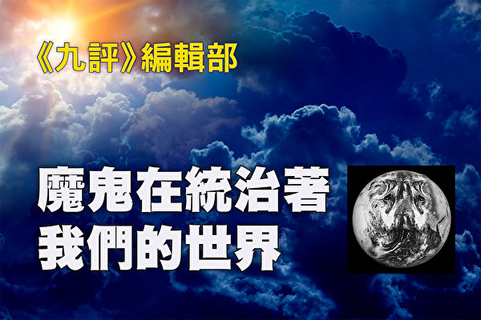
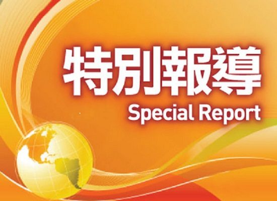
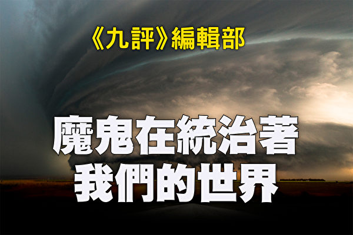
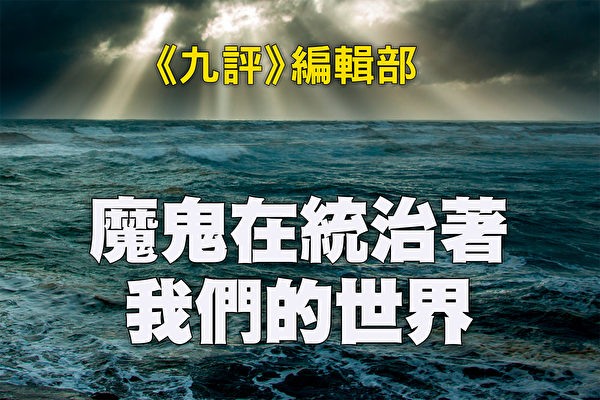
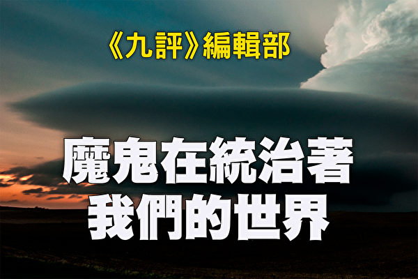

<a href=https://github.com/goodabc/GCC/blob/master/goal.md><h6 align="right">回首頁</h6></a>

<a name=top>
<a href=#1>公告 
<a href=#2>九评编辑部：魔鬼在统治着我们的世界(1)</a> 
<a href=#3>九评编辑部：魔鬼在统治着我们的世界(2)</a> 
<a href=#4>魔鬼在统治着我们的世界(3)：毁人36计</a> 
<a href=#5>魔鬼在统治着我们的世界(4)：欧洲发端</a> 
<a href=#6>魔鬼在统治着我们的世界(5)：东方杀戮</a> 
<a href=#7>魔鬼在统治着我们的世界(6)：输出革命</a> 
<a href=#8>魔鬼在统治着我们的世界(7)：渗透西方(上)</a> 
<a href=#9>魔鬼在统治着我们的世界(8)：渗透西方(下) </a> 
<a href=#10>魔鬼在统治着我们的世界(9)：信仰篇</a>  
<a href=#11>魔鬼在统治着我们的世界(10)：家庭篇(上)</a>  

<a name=1>
<h1 align="center"><b>公告：《九评》编辑部另一部新书即将发表</b></h1>

【大纪元2018年05月18日讯】公告

继《共产主义的终极目的》之后，《九评》编辑部即将推出新书《魔鬼在统治着我们的世界——共产党的幽灵并没有随着东欧共产党的解体而消失》，并授权大纪元网站首先发表。原定出版的《共产主义的终极目的（世界篇）》将取消。特此公告。

《九评》编辑部

2018年5月17日

<a href=#top><h6 align="right">回上方</h6></a>

<a name=2>
<h1 align="center"><b>九评编辑部：魔鬼在统治着我们的世界 (1)</b></h1>
<h2 align="center"><b>共产党的幽灵并没有随着东欧共产党的解体而消失</b></h3>

《九评》编辑部：魔鬼在统治着我们的世界。（大纪元制图）

【大纪元2018年05月18日讯】<b>魔鬼在统治着我们的世界</b>

前言

东欧共产主义阵营虽已瓦解，但共产主义邪灵并未随之而消亡。相反，这个魔鬼已经在统治我们的世界了。人类绝不能乐观！

共产主义并非一种思潮、学说，或者在人类寻找出路时一个失败了的尝试。它是魔鬼，亦称共产邪灵，由恨和宇宙低层空间各种败坏物质构成。它原本是一条蛇，到了表层空间的体现形式则是一条红龙。它与仇视正神的撒旦为伍，同时利用各种低灵和魔祸乱人间。这个邪灵的终极目的就是要毁灭人类，在神归来挽救众生的最后关头，让人不信神，让人的道德败坏到背弃神和传统，听不懂神的教诲而导致最终被淘汰。

共产邪灵诡计多端、千变万化，有时会以尸山血海的暴力来恐吓不肯追随它的人；有时打着“科学”、“进步”的口号和勾画出美好的蓝图欺骗人追随它；有时以故作高深的学问让人以为它是人类未来的发展方向；有时则以“民主”、“平等”、“社会公正”等口号渗入到教育、媒体、艺术、法律等诸多领域中以潜移默化地将人吸引到它的旗下；有时冠以“社会主义”、“进步主义”、“自由派”、“新马克思主义”、各种左翼党派等令人迷惑的名称；有时打着“和平反战”、 “环保主义”、“全球化”、“政治正确”等貌似正义的旗帜；有时支持“先锋艺术”、“性解放”、毒品合法化、同性恋等放纵人的欲望还让人误以为是一种社会时尚──暴力或激进并不是唯一的表现形式，它有时也伪装出心怀大众福祉的嘴脸，但它的根本特征是不择手段地摧毁传统的一切，包括信仰、宗教、道德、文化、家庭、艺术、教育、法律等，让人在道德沦丧中堕入万劫不复的深渊。

这个邪灵和它的各种变种，不但没有随着东欧共产党的解体而消失，反而正在全世界大行其道。不止中国、古巴等国家仍公开宣称自己是共产党政权，就连被视为自由世界龙头的美国也在共产邪灵的进攻下近乎全面沦陷，更遑论早已社会主义化的欧洲和共产党势力笼罩的非洲和拉丁美洲。这就是人类所面临的触目惊心的现实──共产邪灵毁灭人类的阴谋几乎得逞了。

人类趋利避害的本能会让人想要逃避苦难，或想出人头地，或建立一番轰轰烈烈的事业，或只是为了享受生活等等。这些想法本无可厚非，但人类一旦远离了神，这些念头都会成为共产邪灵的把柄，被它激励和放大，从而让人落入它的掌控。而共产邪灵反神逆天的狂妄，也造成了被操控者的狂妄──图谋通过权力、金钱、知识来扮演上帝，主宰他人的命运和历史的进程，并进而形成一种社会潮流。

人是神造的，人性中善恶俱在。人如果弃恶扬善，就可以归向神；反之则倒向魔，这一点全凭人的选择。

我们发现，许多本性尚在的善良人，都是在不知不觉中成为共产邪灵的代理人或成为被共产邪灵操纵的、列宁所形容的“有用的白痴”。虽然社会整体上已经在共产邪灵的诱惑下堕落到毁灭的边缘，但真正心甘情愿地把灵魂抵押给魔鬼、有意败坏人类的人毕竟极少极少。对大多数人来说，人性中的善良还是给了人摆脱邪灵的机会──这就是我们撰写这本书的目的，将这个复杂而艰深的问题尽量用浅白的语言和道理阐述出来，让人看清共产邪灵的各种伎俩，更重要的是将神给人确立的道德、文化、艺术等传统呈现出来，让人在神和邪灵之间做出选择。

人的善念一出，神就会帮助人跳出魔鬼的控制，但认清魔鬼的过程却需要读者深思明辨。我们将从一个全新的高度、广阔的视角，重新审视几百年来的历史潮流及演变，辨析魔鬼是如何以各种面具、各种手段占领及操控了我们的世界的。我们的目的不只是为了写历史，我们更关注如何能不再让魔鬼统治我们的世界。这有赖于人自身的觉醒、主动抛弃邪恶和走回神给人规定的传统之路及生活方式。

神一定会战胜魔鬼，而我们选择站在哪一边却决定着我们生命永远的归宿。

<a href=#top><h6 align="right">回上方</h6></a>

<a name=3>
<h1 align="center"><b>九评编辑部：魔鬼在统治着我们的世界(2)</b></h1>
<h2 align="center"><b>共产党的幽灵并没有随着东欧共产党的解体而消失</b></h3>

《九评》编辑部：魔鬼在统治着我们的世界。（大纪元制图）

【大纪元2018年05月20日讯】<b>绪论：魔鬼在统治着我们的世界</b>

<b>目 录</b>

1. 共产主义是魔鬼，其目的是毁灭人类
2. 魔鬼毁灭人类的主要方式
3. 共产主义思想是魔鬼的意识形态
4. 作为一种超自然力量的魔鬼的特点
5. 魔鬼的多个面目
6. 社会主义是共产主义的初级阶段
7. 对共产主义的向往是一种“罗曼蒂克”的幻想
8. 魔鬼造成文化的毁灭和道德的崩溃
9. 回归神，恢复传统，走出魔鬼的安排

******

苏联的解体和东欧共产主义政权的垮台，标志着持续了近半个世纪的东西方两大阵营间冷战的结束，很多世人为此感到乐观，以为共产主义的威胁已经成为过去。

而实际情况是，原教旨的和改头换面的共产主义思想仍然在全球肆虐，这既包括仍然固守着共产主义“意识形态话语权”的中国、朝鲜、古巴、越南，也有共产主义因素仍然嚣张的前苏联东欧国家；既有打着民主或共和旗号实行社会主义的诸多非洲和南美国家，也有被共产主义因素严重侵蚀而不自知的欧洲和北美民主国家。

共产主义造成的战争、饥荒、屠杀、暴政虽然触目惊心，但其危害却绝不限于此。越来越多的人认识到，与人类历史上的所有政治制度截然不同的是，共产主义与人性、人的价值和尊严为敌。在一个多世纪的实践中，它建立了包括苏联和中国在内的一系列庞大的极权国家，造成了上亿人的非正常死亡，奴役了几十亿人口，并曾经一度把世界带到核战争的边缘。更重要的是，它造成了大面积的家庭解体、社会混乱、道德崩溃和整个人类文明的沉沦。

共产主义的本质到底是什么？它的终极目的又是什么？共产主义为什么似乎处处与人类为敌？人类的出路在哪里？

<b>1. 共产主义是魔鬼，其目的是毁灭人类</b>

“一个幽灵，共产主义的幽灵，在欧洲游荡。” 《共产党宣言》以“幽灵”做开场白，绝非马克思一时的心血来潮。如本书前言所述，共产主义并非一种思潮、学说，或者在人类寻找出路时一个失败了的尝试。它是魔鬼，亦称共产邪灵，由恨和宇宙底层空间各种败坏物质构成。它原本是一条蛇，到了表层空间的体现形式则是一条红龙。共产邪灵与仇视正神的撒旦为伍，同时利用各种低灵和魔祸乱人间。这个邪灵的终极目的是毁灭全人类，在神归来挽救众生的最后关头，让人不信神，道德败坏到背弃神和传统，最终听不懂神的教诲而导致被淘汰。

冷战后，东欧和苏联的共产政权解体了，而共产主义并没有解体，共产主义的幽灵未死，它的毒素不仅继续危害前共产国家，而且早已通过各种形式渗透到了全球。魔鬼藉由掌控人的意识形态，渗透进人类社会的各行各业。共产邪灵所刻意灌输给人类的各种变异观念，不知不觉中已经在全球泛滥，迷失的人们甚至将其当成了自己的想法和愿望，导致人类的是非、善恶标准大幅度地倾斜、颠倒。魔鬼的阴谋几乎得逞！

当共产邪灵即将在狞笑中庆祝它的胜利时，绝大多数世人却认为它走向了失败。世人处于毁灭的边缘，却还蒙在鼓里。还有比这更危险的境地吗？

<b>2. 魔鬼毁灭人类的主要方式</b>

人是神造的，慈悲的神一直守护着他的子民。魔鬼深知，要想让神不再管他创造的人类，唯有切断人和神的联系。它为了毁灭人类，采用的最主要方式是破坏神传给人的文化，并败坏人的道德，把人变异到神难以挽救的程度。

人是神性和魔性同在、既可道德堕落又可道德提升的生命。信神的人都知道，一个有道德追求的人，他的正念正行会得到神的眷顾，神会加持他的正念，神也会帮助他的正行，神更会为他创造奇迹；同时，神会提高他的道德层次，使他成为更加高尚的人，直至回归天国。然而，一个道德低下的人，一个充满私欲、贪婪、愚昧、狂妄无知的人，他的恶念恶行不可能得到神的认可；相反，魔鬼会加强他的狂妄无知，加重的他的私欲、恶念，更会操纵利用他的恶行造业，贻害人间，使他道德持续下滑，直至堕落地狱。当人类社会的道德水准普遍下降，魔鬼就会推波助澜，以各种方式肆意操控利用人们的恶念恶行，以彻底毁灭人类。

18世纪以来，欧洲历史进入剧烈动荡时期，人类道德的整体滑坡给魔鬼造成了可乘之机。它有步骤地颠覆善恶是非标准，灌输无神论、唯物论、进化论、斗争哲学等邪说。它选定了信奉邪教的马克思作为其人间代理人，于1848年推出《共产党宣言》，扬言用暴力消灭私有制、阶级、国家、宗教和家庭。1871年的巴黎公社是共产主义第一次尝试夺取政权。

马克思主义的追随者声称，政权问题是马克思主义政治学的中心问题。我们如果了解了共产主义的终极目的，就会发现政权问题对共产主义来说既重要又不重要。说它重要，是因为掌握政权是大面积败坏人类的快捷方式，只有掌握了政权，共产党才能用暴力和强制推广其意识形态，在短时间内从根本上破坏一个民族的传统文化。说它不重要，是因为即使没有掌握政权，魔鬼依然可以用其它方式变异人的道德，达到其毁灭人类的终极目的。因此，在其实践中，暴力不是唯一的方法，政权不是唯一的手段。事实上，共产主义这个魔鬼采用了极为灵活多变的手法，利用人类的一切弱点，使用欺诈和愚弄的手段，通过扰乱人类思想、颠覆正统文化、破坏社会秩序、制造社会动乱、分化撕裂社会等方式，全方位占领了世界。

<b>3. 共产主义思想是魔鬼的意识形态</b>

神给人类社会奠定了基于普世价值的丰富文化，铺垫了人回归天国之路，魔鬼的共产主义和神奠定的传统文化是根本对立、水火不容的。

共产邪灵以无神论、唯物论为核心，集合了德国的哲学、法国的社会革命、英国的政治经济学等元素，以一种世俗宗教取代了神和正教在社会及文化中的位置。共产主义把整个世界变成了它的教堂，把人的社会生活的各个层面都纳入了它的控制范围。魔鬼占据了人们的思想，让人们反神、排神，背离传统；魔鬼在背后操控着人类一步步地走向毁灭。

魔鬼选定马克思等人间代理人，在人间反对和破坏神给人类社会奠定的法则，宣扬阶级斗争，废除旧的社会制度。在东方它发动暴力革命，建立政教合一的极权国家；在西方通过高税收、高福利进行财富再分配，搞渐进式的非暴力共产主义；在全世界将共产主义意识形态渗透进各个国家的政体，通过摧毁一切社会秩序的世界革命而达到消灭国家的目的，最后建立一个世界性统治机构取代所有国家和政府，让魔鬼掌控世界权力。这便是共产主义许诺的建立一个没有阶级、国家和政府，并且进行集体生产的社会，最终使人类社会达到“各尽所能，按需分配”的所谓“人间天堂”。

共产主义以实现其世界大同、“人间天堂”的理念为纲领，推动无神论指导下的“社会进化”；用唯物论摧毁人的精神追求、信仰和宗教，让共产主义意识形态渗透到社会的每一个领域、每一个角落，包括政治、经济、教育、哲学、历史、文学、艺术、社会科学、自然科学甚至宗教等等。如同意识形态中的癌细胞，共产主义不断增殖，并排除一切其它意识形态，其中包括对神的信仰，进而毁灭国家主权、民族意识，最后消灭人类的道德和文化传统，让人类走向毁灭。

马克思在《共产党宣言》中扬言：“共产主义革命就是同传统的所有制关系实行最彻底的决裂；毫不奇怪，它在自己的发展进程中要同传统的观念实行最彻底的决裂。”这句话相当准确地概括了共产主义近二百年来的实践。

道德来源于神，神规定道德标准永恒不变。道德标准从来不该是人来定的，也不会随着人的权势而变。而共产主义则要对任何一种道德“宣判死刑”，让共产主义的信徒来重新定义道德。在否定道德的同时，共产主义用各种负面因素驱逐人类传统中的正面因素，进而让负面因素占领整个世界。

传统的法律源于道德并维护道德，共产主义让道德和法律分离，通过制定恶法、恶意曲解传统的宪法和法律来摧毁道德。

神叫人行善，共产主义鼓吹阶级斗争，提倡暴力和杀戮。

神给人奠定了家庭作为基本的社会单元，共产主义认为家庭是私有制的表现形式，扬言要消灭家庭。

神让人有获得财富的自由和生活的权利，而共产主义要消灭私有财产、剥夺地产、提高税收、垄断信贷和资本，彻底掌控人的经济生活。

神奠定人类社会的道德、政府、法律、社会和文化形态，而共产主义则要“用暴力推翻全部现存的社会制度”。

神传给人正统艺术，是为了将神和天国世界的景象通过这种独特的方式传递给人，让人回忆起天国的美好，升起敬神的信心，提升人的道德与修为。共产主义则让人崇尚现代变异艺术，窒息人的神性，放纵魔性，操纵整个艺术界传播扩散低、丑、怪、恶、颓废的负面信息。

神让人谦卑、敬天敬神，共产主义专门给人灌输魔性和狂傲，让人走向对神的悖逆、不服从。它放大人性中的恶，用所谓的“自由”让人们随心所欲，失去道德的约束并消除人的负罪感；以“平等”为口号煽动人的妒嫉心，并用各种手段刺激人的虚荣，让人们被眼前的名利诱惑而跟从魔鬼。

二战后，有形的共产主义阵营进一步扩大，共产党社会和自由社会在世间对峙，开始了数十年的冷战。共产主义学说成了共产党国家的世俗宗教，成为课本上不可挑战的“真理”。在其它国家，改头换面的共产主义也产生了极大的影响。

<b>4. 作为一种超自然力量的魔鬼的特点</b>

魔鬼是一种超自然力量，理解共产邪灵的属性是理解魔鬼制造的世间乱象的钥匙。

共产邪灵由恨构成，它从人的恨当中汲取能量。

共产邪灵与撒旦为伍祸乱人间，不必试图分清它们的所作所为。
魔鬼在东西方同时布局，在各行各业同时布局，其力量时而分开，时而合一；声东击西、借力打力；不拘一格。

魔鬼是超限战的始作俑者：宗教、家庭、政治、经济、金融、军事、教育、学术、艺术、媒体、娱乐、大众文化、社会生活、国际关系，全都变成魔鬼毁灭人类的战场。

魔鬼的黑色能量瞬间就从一个领域蔓延到另外一个领域，从一个团体转移到另外一个团体，从一个运动扩展到另外一个运动。比如，上世纪70年代西方反越战运动退潮后，魔鬼操控反叛青年转而推动女权运动、环保运动、同性恋合法化运动，另外一部分则进入西方社会体制内，试图从内部颠覆西方文明。

魔鬼能够操纵有不好思想的人做它的人间代理人，以伪善欺骗善良而单纯的好人做它的代理人或辩护士。

魔鬼代理人遍布社会顶层、社会上层、社会中层、社会下层、社会底层，因此魔鬼的行动有时表现为自下而上的革命，有时表现为自上而下的阴谋，有时表现为由中间层发起的改良。

魔鬼能够变形、分体。它能够调动另外空间的低灵为它服务。色情、毒瘾都是魔，都成为邪灵利用的工具。这些低灵烂鬼从人的负面情绪──仇恨、恐惧、绝望、狂妄、悖逆、妒嫉、淫邪、愤怒、发狂、怠惰等──当中吸取能量。

魔鬼隐秘而狡猾，它利用人的各种贪欲、邪念、魔性、阴暗与负面的东西。人符合了它的想法，它就会控制人。很多时候人以为在按照自己的想法做事，其实却是邪恶在背后操控。

<b>5. 魔鬼的多个面目</b>

正如魔鬼有多个名字，共产主义也以不同的面目示人。魔鬼惯用相互对立的表现形式迷惑世人：或为强制极权，或鼓吹民主；或为计划经济，或为市场经济；或是全面的言论管制，或是极端的言论自由；在一些国家反对同性恋，在另外一些国家推动同性恋合法化；有时大肆破坏环境，有时鼓噪环境保护，不一而足。它可以主张暴力革命，也可以信奉和平演变。它可以表现为一种政治经济制度，也可以表现为艺术文化思潮。它可以表现为纯粹的理想主义，也可以表现为冷血的阴谋权术。共产极权国家只是魔鬼的一种表现形态，绝非其唯一的表现形态；马列主义、毛泽东思想只是其歪理邪说的一部分，绝非其邪说的全部。

自从18世纪的空想社会主义以来，世人至少目睹了科学社会主义、费边社会主义、工团社会主义、基督教社会主义、民主社会主义、人道的社会主义、生态社会主义、福利国家、马列主义、毛主义等等诸多流派。这些流派可以简单地分为两大类：暴力共产主义和非暴力的共产主义。渗透和蚕食是非暴力共产主义的主要手段。

魔鬼最具有欺骗性的招数之一，是在貌似对立的东西方两大阵营里同时布局。当魔鬼轰轰烈烈侵略东方的时候，同时也改头换面潜入了西方。英国的费边社、德国的社会民主党、法国的第二国际、美国的社会主义党和其它为数众多的社会主义团体，把毁灭的种子撒播到了西欧和北美国家。冷战过程中，苏联和中国的大屠杀、集中营、大饥荒和大清洗，使一些西方人庆幸自己仍然拥有优裕的生活和自由的环境。某些社会主义者从人道主义出发，甚至公开谴责苏联的暴行，更让很多人放松了警惕。

共产主义魔鬼在西方使用了十分复杂多样的面具，打着各种不同的旗号，让人防不胜防。自由主义、进步主义、法兰克福学派、新马克思主义、批判理论、反文化运动、和平反战运动、性解放运动、同性恋合法化运动、女权主义、环保主义、社会公正、政治正确、经济上的凯恩斯主义、各种前卫艺术流派、多元文化运动等等，这些流派或运动，或来源于共产主义，或被共产主义所利用，来实现其邪恶目的。

<b>6. 社会主义是共产主义的初级阶段</b>

在西方社会里，很多人把社会主义与共产主义分割开来，给社会主义大行其道提供了土壤和空间。其实按照马克思列宁主义的理论，社会主义就是共产主义的初级阶段。

1875年，马克思在《哥达纲领批判》中，明确地提出了共产主义第一阶段和高级阶段的设想。恩格斯晚年，迫于国际形势的变化，提出利用选票获取政权的“民主社会主义”，被“第二国际”社会民主党的领袖和理论家采纳，成为今天世界上很多资本主义国家的左翼政党。列宁对社会主义、共产主义作出了明确界定。他认为，社会主义是共产主义第一阶段或初级阶段，共产主义是在社会主义的基础上发展起来的。

可见，社会主义本来就是马克思主义的一部分，是国际共运的一部分。社会主义的公有制和计划经济是共产主义的前期准备。当今西方流行的各种社会主义或左翼学派，表面上好像与共产主义无关，其实，就是非暴力共产主义的具体体现。相对于暴力革命，西方的选票就是非暴力的革命手段；相对于公有制，西方的高税收就是变相的公有制；相对于计划经济，西方的社会保障和社会福利制度就是蚕食资本主义的变相体制。事实上，西方国家的许多左翼政党把实行社会保障和社会福利制度看作是实现社会主义的一个极其重要的方面。

在人们谴责共产主义的罪恶时，不应该只看到暴力和屠杀，更应该有能力识别社会主义制度本身带来的危害。非暴力的共产主义，也正在以各种社会主义的名义招摇撞骗，蛊惑人心。认识共产主义，就不得不首先认清共产主义的初级阶段，因为共产主义不是一蹴而就的，如同一个生命，它也有从小长大的过程，也是从初级阶段发展起来的。

现在欧美的某些社会主义或福利国家的“共同富裕”是以牺牲个人自由为代价的。这些国家的人民尚能够维持一定的政治自由，是因为其社会主义发展程度不高的缘故。但社会主义不是一个静止的概念。社会主义国家以结果平等为最重要的目标，势必不断剥夺人的自由。社会主义必然会向共产主义过渡，也即个人自由会被不断地剥夺。

如果一个自由国家一夜之间变成极权国家，宣传与现实之间的巨大反差会使大部分民众的心理无法适应，很多人会奋起反抗，至少是消极抵抗。这就造成了极权国家统治成本极高，当权者必须大规模杀戮以消除阻力。苏联和中国都在和平时期对本国民众进行了大规模杀戮，这是重要原因之一。

与极权国家不同，自由社会的社会主义以立法的方式，“温水煮青蛙”式地、一部分一部分地剥夺民众的自由。建立社会主义制度的过程持续几十年、几代人的时间，让人逐渐地麻木、遗忘、适应，因此更具有欺骗性。就其本质与目的而言，这种渐进式的社会主义和暴力的社会主义并无实质的不同。

社会主义以立法的方式保证民众的“平等权利”，实质是让人在道德上向下拉齐，剥夺人向善的自由。在正常条件下，民众的宗教信仰、道德水准、文化素养、教育程度、聪明才智、吃苦耐劳、认真负责、勇于进取、创新创业等各个方面都千差万别，要保证平等，不可能把低水平的瞬间拔高，只可能人为地抑制水平较高的人群。尤其是在道德方面，社会主义在西方国家以“反歧视”、“反仇恨”、“价值中立”、“政治正确”为借口，取消道德判断，无异于取消了道德本身。所以我们才看到各种反神、渎神的言行、性变态行为、魔性艺术、色情产业、赌博、毒品被法律保护、“合法化”、“常态化”了。这就构成了对信神的、道德高尚群体的反向歧视，最终是要把这些群体边缘化、逐渐消灭掉。

<b>7. 对共产主义的向往是一种“罗曼蒂克”的幻想</b>

至今仍然有不少西方人对共产主义抱着“罗曼蒂克”的幻想，是因为他们没有真正在共产党国家生活过、吃过苦头，对共产主义的现实缺乏了解。

冷战时期，很多西方的知识分子、艺术家、新闻记者、政客、青年学生到苏联、中国或者古巴参观、访问、旅游。他们看到的情况和这些国家民众的真实生活之间有着天壤之别。共产党国家把欺骗性的对外宣传做到极致。参观者看到的是特意给他们布置的样板村、样板工厂、样板学校、样板医院、样板幼儿园、样板监狱等，所有接待者都是事先安排好的共产党员或者“政治上可靠的”人，很多参观都经过彩排。迎接参观者的是鲜花、美酒、歌舞、宴会、天真烂漫的男女青年、笑容可掬的官员，他们看到的是热火朝天的劳动场面、平等自由的交谈、求知若渴的学生、海誓山盟的婚礼。他们看不到的是走过场的审判、草率的判决、公审大会、武斗、批斗、绑架、强制洗脑、关禁闭、古拉格的劳改营、集体屠杀；没收土地、房屋和财产；饥荒、公共服务严重匮乏；没有隐私权、普通公民被窃听、盯梢；人人互相监视、告密；政权交接时的残酷斗争、特权阶级穷奢极侈、老百姓受苦遭罪。

参观者把他们看到的假象当成共产党国家的常态，通过写书、写文章、演讲的方式传播到社会上，至今仍然主导著西方人对共产党国家的想像。少部分人看出了一些破绽，但却掉进了另外一个陷阱：他们以共产主义“同路人”自居，觉得“家丑不可外扬”，“共产党国家的杀戮、饥馑和压迫是探索过程中的必然现象”，“虽然道路是曲折的，前途却是光明的”，说出真相就会给“社会主义事业”抹黑，他们因此缺乏必要的诚实和勇气讲出真相，相反却选择了可耻的沉默。

共产主义宣称，将建立一个人人自由、人人平等、没有压迫、没有剥削、物质产品极大丰富、各尽所能按需分配、每个人都能够自由发展的十全十美的人间天堂。这样的社会只在幻想中存在，是魔鬼欺骗人的诱饵。权力永远只掌握在少数人手中。真正的共产主义制度是少数人使用国家机器压迫、奴役、剥削大众的极权国家。因为时机未到，现在某些以社会主义体制自诩的国家还戴着温情脉脉的面纱。只要条件成熟，“图穷匕首见”，天真地憧憬著美好未来的社会主义者们悔之晚矣。

<b>8. 魔鬼造成文化的毁灭和道德的崩溃</b>

魔鬼在各个国家、各个领域都安插了自己的代理人，带领无知而轻信它的世人在毁灭的路上大踏步行进。

共产主义教人反神、排神，它一方面从宗教外部攻击宗教，一方面操纵败坏了的宗教痞子到宗教内部变异宗教。宗教被政治化、商业化、娱乐化，为数众多的神职人员道德败坏，胡乱解释宗教经典，用歪理邪说造成信众的思想混乱，甚至奸淫信众，包括年幼的信徒。这些乱象造成了真诚的宗教信徒的困惑和绝望。仅仅一个多世纪以前，虔诚地信神是好人的代名词。时至今日，信神、信仰宗教竟然成为愚昧、迷信的标签，甚至是几个私人朋友在一起，也不敢提起自己的宗教信仰，怕被人嘲笑。

共产主义以消灭家庭为重要目标，它以男女平等的名义破坏家庭结构、宣扬共产共妻。20世纪以来，它又掀起当代女权运动，鼓吹性解放，混淆性别角色，攻击所谓“父权制”，削弱父亲在家庭中的地位和作用，改变婚姻定义，鼓吹同性恋合法化，鼓吹离婚权、堕胎权，用福利政策鼓励单亲家庭。这一切造成了家庭的解体和与之伴生的贫困及犯罪。这是过去几十年中最令人触目惊心的社会变化之一。

政治上，除了共产党国家继续实行专制以外，自由社会的政党政治也出现全面危机。共产主义利用民主国家制度和法律上的漏洞，努力操控一个或者几个主要政党。为了在党争中胜出，政治家们竞相使用不道德的手段，向选民许诺无法兑现的好处。共产党和受共产主义操控的政党渗透政治的结果是，各个国家的政治光谱普遍向左偏移，纷纷采纳强征税、高福利、大政府、干预主义的政策，并用法律把这些做法固定下来。政府行为对社会有很强的塑造作用。伴随着政府左倾，整个社会都被左派意识形态渗透，再用教育给青少年洗脑，下一代人就只能选出更加左倾的领导人。

本该传承人类智慧和文明精华的教育殿堂也遭到了骇人听闻的颠覆。从上世纪初叶，共产邪灵就安排了人类教育的系统破坏。在文化传统深厚的中国，为了切断中国人和传统文化的联系，早在共产党成立之前，共产主义就操纵了“新文化运动”，对传统思想道德、语言文学进行恶毒的攻击。“白话文运动”、“简化汉字运动”切断了中国人和传统文化的联系。中共建政之后，迅速完成了教育的国有化，把共产党文化作为教科书的基本内容，把几代中国人培养成了好勇斗狠的狼崽子。

在西方，邪灵打着科学、进步、民主的旗号，发起“进步主义教育运动”，通过控制哲学、心理学、教育学研究，一步步控制教育学院，对教师和教育管理者进行洗脑。在中小学教育方面，把正统理念、传统道德逐渐逐出教材和课堂，同时降低教学难度，使很多学生得不到足够的读写算术能力以及常识和判断力。学生被以各种方法灌输了大量的无神论、进化论、唯物论和斗争哲学。上世纪60年代反文化运动以来，“政治正确”成为新的思想警察，强制教师灌输各种变异思想。年轻人从学校毕业，没有道德，不懂文化，缺乏常识和责任感，只能随波逐流，加速社会的整体下滑。

社会上毒品泛滥，犯罪猖獗，媒体上充斥着性和暴力，艺术以丑为美，各种邪教和巫术横行，青少年沉迷于追星、电脑游戏、社交媒体，精神萎靡不振。恐怖主义以针对无辜民众的无理性暴力，突破了一切传统政治规则的底线，更让人惶惶不安，有朝不保夕之虑。

<b>9. 回归神，恢复传统，走出魔鬼的安排</b>

人类文明是神传给人的。中国文明曾经出现过汉唐盛世，西方文明在文艺复兴中期达到顶峰。如果人能保持神传给人的文明，当神再来的时候，人能够接续与神的联系，听懂神传给人的法。如果人破坏了这个文化传统，道德堕落，当神再来的时候，人会因为罪业太大与思维变异而听不懂神的教诲，这对于人类来说就是最危险的。

这是一个绝望和希望并存的时代。不信神的人在感官享乐中得过且过，信神的人在困惑不安中等待着神的归来。

共产主义祸乱人间，意欲最终毁灭全人类，其安排细致而具体。它们的图谋是如此的“成功”，其中绝大部分已经完成或接近完成。魔鬼正在统治我们的世界！

人类古老的智慧告诉我们：一正压百邪；佛性一出，震动十方世界。魔鬼看似强大，在神的面前却不堪一击。假如人能保持真诚、善良、慈悲、宽容、忍让的本性，就一定会得到神的护佑，魔鬼就会无能为力。

创世主慈悲无限，给了所有生命走出劫难的机会。如果人类能恢复传统，提升道德，听懂创世主的慈悲呼唤和解救人类的天法，就能冲破魔鬼的毁灭性安排，走上得救之路，走向未来。

（未完待续）
  
  <a href=#top><h6 align="right">回上方</h6></a>

<a name=4>
<h1 align="center"><b>魔鬼在统治着我们的世界(3)：毁人36计</b></h1>
<h3 align="center"><b>共产党的幽灵并没有随着东欧共产党的解体而消失</b></h3>

《九评》编辑部：魔鬼在统治着我们的世界。（大纪元制图）

  
  【大纪元2018年05月21日讯】<b>第一章 共产主义魔鬼毁灭人类大势鸟瞰——魔鬼毁人之三十六计</b>

目录

1. 变乱人类思想 
【第一计】诡称无神 
【第二计】妄言唯物 
【第三计】邪说进化 
【第四计】迷信科学 
【第五计】斗争哲学 
【第六计】众声喧哗 
【第七计】变乱语言 
2. 颠覆正统文化 
【第八计】腐蚀教育 
【第九计】魔变艺术 
【第十计】控制媒体 
【第十一计】推黄赌毒 
【第十二计】变异各业 
3. 破坏社会秩序 
【第十三计】侵蚀教会 
【第十四计】解体家庭 
【第十五计】东方极权 
【第十六计】西方渗透 
【第十七计】邪变法律 
【第十八计】操控货币 
【第十九计】超级政府 
4. 操纵社会运动，制造社会动荡 
【第二十计】发动战争 
【第二十一计】煽动革命 
【第二十二计】经济危机 
【第二十三计】离土断根 
【第二十四计】绑架运动 
【第二十五计】恐怖主义 
5. 有拉有打，分而治之 
【第二十六计】杀戮异己 
【第二十七计】拉拢精英 
【第二十八计】愚化大众 
【第二十九计】制造暴民 
【第三十计】加速淘汰 
【第三十一计】肢解社会 
6. 掩盖和防范 
【第三十二计】瞒天过海 
【第三十三计】声东击西 
【第三十四计】妖化论敌 
【第三十五计】转移视线 
【第三十六计】把握多数 

*****

为了在末劫时毁灭人类，魔鬼做了一系列细致的安排。要想看清魔鬼毁灭人类的大趋势、大图像、大脉络，就必须跳出人世间纷繁复杂的表象，从超越人类社会的高度，审视几百年来的人类历史。同时，“魔鬼往往存在于细节当中”。在具有宏观视野的同时，我们也不能忽略，魔鬼在很多具体事件、群体、部门、过程中，以其惯有的狡猾，安排了很多诱人落入陷阱的阴谋诡计。

<b>1. 变乱人类思想</b>
  
魔鬼要毁灭人，首先要做到的就是颠倒人的善恶、好坏、是非观念。它要把坏的说成好的，恶的说成善的。它要把歪理邪说伪装成“科学公理”，把强盗逻辑诡辩为“社会公正”，把思想箝制宣称为“政治正确”，把容忍罪恶美化为“价值中立”。

【第一计】诡称无神

人是神造的，如果人能保持对神的正信，神会一直保护着人。故而欲毁灭人，必先离间神人关系。于是魔鬼派遣其人间代理人散布无神论，一步一步变乱人的思想。十九世纪初叶，德国哲学家费尔巴哈声称“上帝不过是人的内在本性的投射”。共产主义的《国际歌》宣称“从来就没有什么救世主”。人的伦理道德、文化形式、社会结构、理性思维等等皆来源于神。在不断迁流变化的历史长河中，对神的信仰就像是一根坚固的缆绳，没有它，人类社会这艘小船就会随波飘荡，不知驶向何方。诡称无神之后，狂妄的人被诱导著扮演神，试图左右他人和社会的命运。正如英国思想家埃德蒙‧柏克所言：“凡人假扮上帝，就会如魔鬼般行事。”狂热的共产主义者往往是这些试图假扮上帝之人。诡称无神，是魔鬼一切骗术的第一步，也是其一切罪恶的基础。

【第二计】妄言唯物

马克思主义哲学以“物质第一性、精神第二性”为根本原理，殊不知精神物质是一性的。无神论出现时适逢工业革命带来的生产力大发展，加重了人对物质和技术的崇拜和依赖。本着实证科学的理念，人们开始否定神言、神迹，系统地排斥对神的信仰。魔鬼散布唯物论不是要进行哲学探讨，而是以唯物论为武器，颠覆人的精神信仰。唯物论是无神论的必然推论，也是此后一系列形形色色思想流派的总根源。

【第三计】邪说进化

达尔文的进化论原是没有根据的假说，其立论之鲁莽灭裂、推理之粗糙荒谬有目共睹。魔鬼要切断人与神的联系，把神造的人贬损成动物，并进一步使人丧失自尊，推广进化论邪说。到二十世纪以后，进化论一步步占领学术和教育领域，把神创论排斥出学校教育，形成垄断局面；另一方面，把达尔文主义推演成“社会达尔文主义”，宣扬“物竞天择、适者生存”的邪说，加剧了国家之间的恶性竞争，把国际社会变成丛林世界。

【第四计】迷信科学

宣扬实证科学、唯科学主义、科学至上学说，用“科学理性”取代人的理性，让人“眼见为实”，凡是看得见摸得着的才相信，看不见摸不着的就不相信，以此加强无神论。现有科学体系不能解释的现象一概归为迷信或干脆视而不见，用科学的大棒打击信仰和道德，把科学变成一种排他性的宗教，垄断教育和学术。

【第五计】斗争哲学

德国古典哲学家黑格尔的辩证法学说，究其实质，无非是逻辑思维的一般规律，在中国先秦思想里早有精要的阐明。马克思主义片面吸收了黑格尔的辩证法学说，并无限夸大矛盾双方的对立和斗争。共产主义的目的不是统一矛盾或解决矛盾，而是“使世界的矛盾，尽量扩大，使人类的斗争，永无止境”（蒋介石语）。在实践中，共产邪灵在人群当中煽动仇恨，制造和扩大矛盾，最后在混乱中趁机发动革命或者政变掌权。这种模式已经重复了无数次。

【第六计】众声喧哗

在无神论、唯物论基础上创造、传播大量哲学流派、思潮，比如马克思主义、马基雅维利主义、社会主义、虚无主义、无政府主义、功利主义、唯美主义、弗洛伊德主义、现代主义、存在主义、后现代主义、解构主义等，一方面制造意识形态的对立，另一方面让哲学家和学者陷入大量繁琐无聊、貌似高深的理论问题之中，对真正重大的问题无暇顾及。学者群体集中了人类社会的才智之士，但过去一百多年中，他们中的很多人成为魔鬼推广其意识形态的工具，或只能用扭曲变异的思维解读这个世界。

【第七计】变乱语言

就像乔治‧奥威尔《一九八四》里大洋国的“新话”一样，魔鬼也操纵其人间的代理人制造出大量的新语词，或者对原有的语词进行重新定义。在魔鬼的词典里，自由变成了不受任何道德、法律和传统约束的极端自由；“在上帝面前人人平等”、“在法律面前人人平等”、“机会均等”等变成了片面的结果平等，也就是绝对平均主义；“仁者爱人”或者“爱邻如己”之博爱变成了没有原则的所谓“宽容”；理性变成了狭隘的实证科学的工具理性；“正义”变成了追求结果平等的“社会公正”。语言是思想的工具，魔鬼抢占了定义语词的制高点，就等于掌握了人思想的范围和走向，人们被限制、诱导，只能得出魔鬼允许他们得出的结论。

<b>2. 颠覆正统文化</b>
  
人类的正统文化来源于神的系统传授，除了能够维持人类社会的正常运行以外，神传的文化更重要的作用在于，在末劫来临时，使人类能够听懂神传的法，从而能够得救，免于淘汰。神传授的文化自然具有对魔鬼意识形态和阴谋诡计的防范和抵制作用，因此魔鬼必然用各种方式引诱人、逼迫人破坏传统文化。推出诸多吸引不同团体和个人奋斗的“远大目标”，代替传统的人生观和价值观，让人去终身奋斗，甚至为其不惜生命。

【第八计】腐蚀教育

教育的作用在人类社会举足轻重。几千年来，传统教育传承人类优秀文化，引导人向善，成为道德高尚并掌握一定技能的好人和公民。从十九世纪起，欧美各国开始建立义务教育制度和公立教育系统，要求学生进入公立学校学习，挤压教会学校、私立学校的生存空间。进入二十世纪后，公立学校越来越多地向学生灌输反传统的理念，信仰和道德被排斥，进化论成为必修内容，各个学科的教科书慢慢被无神论、唯物论、阶级斗争学说渗透。魔鬼控制教科书的编写，把不符合魔鬼意识形态的内容，包括传统文化和伟大经典，摒弃在外。聪明而有思想的学生被引导到魔鬼的意识形态上去，或者是让他们的聪明才智消耗到无关紧要的问题当中，使其无暇顾及关系人生与社会的重要问题。延长学生在校时间，尽早地把儿童从父母身边带走，把学生和家庭影响隔离，以便其从小就接受魔鬼意识形态的灌输。以“独立思考”为名，引导学生远离传统，培养学生对老师、家长的敌意，鼓励学生反传统、反权威。逐渐降低教学难度，使学生的读写算术能力越来越差；教给他们各种变异观念和以“政治正确”名义篡改的历史，使很多学生丧失思考复杂深刻问题的能力，使其沉溺于肤浅低俗刺激性的娱乐，既没有思考问题的习惯，也没有思考问题的能力。

在魔鬼掌权的国家，从幼儿园一直到博士班，在一个几乎全封闭的环境里对学生大剂量、长时间、高强度地灌输魔鬼的意识形态。即使学生毕业以后接触到真实的社会，也只能以扭曲的思维方式得出变异的结论。

【第九计】魔变艺术

人类的正统艺术来源于神，最早出现在神殿、教堂和庙宇中，是神与人沟通的重要方式，也是维持人的道德水平的重要文化形式。正统艺术表现真和善、美好和光明。变异文学艺术是魔鬼破坏传统文化败坏人类道德的重要一环。魔鬼以“表现现实”为借口，在艺术领域引入印象主义，在文学领域引入现实主义、自然主义；又以“创新”、“批判现实”等为借口，引入表现主义、抽象主义等形形色色的现代主义、后现代主义。对崇高的嗤之荒谬，纯洁的标上无聊；下流的变成有趣，无耻的赏以成功。垃圾被摆上艺术的殿堂，大噪之音和靡靡之音被吹捧为艺术的新潮流，阴暗的绘画表现的直接就是鬼的世界，充满魔性的摇滚乐、行为艺术早就突破了人的道德底线。很多青少年更是把外形丑恶、行为堕落的明星当成偶像，狂热地追捧。

【第十计】控制媒体

为了蒙蔽人，魔鬼千方百计地控制人的信息来源，其中最重要的就是大众媒体。在掌握了政权的国家，垄断一切媒体；所有的媒体都是“党的喉舌”，起著替共产党宣传辩护的作用。在尚未掌握政权的国家，鼓吹极端的言论自由，让谬误和造谣、低俗和琐碎淹没一切严肃的探讨和交流。利用经济手段控制主要媒体，以它们为杠杆，操纵舆论走向。大部分民众忙于生计，无法从浩如烟海的信息中找出真正重要的内容，只有少数人有足够的智慧和勇气看出魔鬼的阴谋，但其呼声被淹没在众声喧哗之中，难以左右大局。

【第十一计】推黄赌毒
鼓吹堕落的生活方式，鼓吹性乱、同性恋等变异性行为；推广赌博、吸毒等，让人上瘾；让青少年对电子产品、尤其是带有暴力、色情、灵异内容的电脑游戏上瘾。一旦形成强烈的瘾好，此人就会被魔鬼操纵而无法自拔。

【第十二计】变异各业

人类社会的传统行业是神有意安排传给人的。如果人能守护传统行业不失，在一定程度上就能够保留对神的记忆并保持与神的联系。魔鬼不能容忍人保留与神的纽带，誓要用各种方式消灭传统的行业。它让万魔出洞，把无数光鲜亮丽的时尚乱象改头换面抛向各行各业，变异、败坏各行各业中的传统精神和规范，迅速淘汰传统行业，让传统手艺后继无人。让各行各业竞相抛弃传统，陷入所谓“创新”的怪圈。让魔给追求名利之人以变异的“灵感”、败坏的“创意”，让世界变得光怪陆离，引导人们追随潮流，放大欲望，沉迷享乐。这种乱本身就是成功——因为如果人不能遵循神给人安排的生活方式，没有时间去思考人生的真正意义，就等于在把人引向魔鬼设定的毁灭之途。

<b>3. 破坏社会秩序</b>
  
就其人间的表现形式而言，共产党具有流氓帮派和邪教的两面性，邪教是其意识形态，流氓帮派是其组织形式。共产党为了占领世界，必须选择一些人间的代理人。在东方，其代理人是列宁、斯大林、毛泽东、江泽民等党魁及其追随者；在西方，其组织形式和代理人就非常复杂。众所周知，占领世界最快捷的方式是选择最有影响力的组织和个人，所以魔鬼一定会选择最有权力者实施其阴谋。而权力主要有三种形式：政权（军权是政权的延伸）、金权、话语权。政权包括政府和政党，金权包括财团和工商企业，话语权包括宗教界、学术界、教育界、新闻媒体和文艺娱乐。三种权力形式都是魔鬼急欲染指、控制的领域。

【第十三计】侵蚀教会

变异宗教，用社会宗教代替启示宗教；派代理人进入教会内部改变教义甚至经书，炮制“解放神学”，把马克思主义和阶级斗争引入宗教；败坏神职人员道德，让人对神的救度感到彻底幻灭。

【第十四计】解体家庭

神给人创造了稳定的社会结构，其中最重要的社会结构包括家庭、国家和教会。家庭是神传给人的基本的社会单元，是守护信仰的堡垒、实践道德的基本环境、社会稳定的基石、传承文化的重要机构。魔鬼用女权主义、反对父权制、性解放运动、同性恋合法化运动、鼓励同居、通奸、离婚、堕胎等方式颠覆破坏传统家庭，混淆男女性别角色。这是魔鬼通过败坏人的道德来毁灭人的重要步骤。

【第十五计】东方极权

魔鬼利用第一次世界大战俄国被削弱的机会，煽动革命，首先逼迫沙皇退位，然后发动十月政变，夺取了政权。此后，苏俄建成了世界上第一个社会主义国家，并且建立共产国际（史称第三国际）向世界各国输出革命。美国共产党和中国共产党分别于1919年、1921年成立，都是听命于其苏俄主子的共产党支部。苏共支持中共依靠暴力和谎言，也依靠二战之后中国社会的特殊形势，夺取了中国的政权。苏共和中共分别在和平年代针对自己本国人民，以极其残忍的手段屠杀了几千万人。中共在“无产阶级专政条件下继续革命”，发动了“史无前例”的文化大革命，向一切人类文明成果宣战，破坏了五千年的传统文明。八十年代后，中共为了解决生存危机，实行“改革开放”政策，但政治领域丝毫没有放松，又相继进行了镇压“六四”学生运动和迫害法轮功精神信仰的运动，一直维持至今。

【第十六计】西方渗透

中华传统皇朝、西方传统的王权、美国三权分立的共和制度是神在不同时期根据人类社会的具体情况给人奠定的政体形式。魔鬼暂时无法通过革命的方式在西方国家掌权，于是采用“渗透”的方式，慢慢侵蚀西方国家的肌体，逐渐掌控在意识形态上的领导权。时至今日，除了不讲暴力革命以外，西方国家实行的基本属于变形的共产主义制度。

【第十七计】邪变法律

神的诫命是法律的来源，道德是法律的不变基础。在重新定义了“道德”、“自由”等概念之后，魔鬼又进一步操控法律的制订权和解释权。在东方共产国家魔鬼制订恶法，并随意解释法律；在西方民主国家，以渗透的方式任意解释法律，以修改法律的方式重新界定人的行为，取消道德规定的善恶，用法律规定善恶；用法律来保护恶（如杀人、通奸、同性恋）、打击善。

【第十八计】操控货币

废除金本位，通过控制货币发行量制造周期性的经济危机。改变传统的“量入为出”的理财观念，让政府和个人都陷入“高消费”、“超前消费”的习惯不能自拔。鼓励各个国家借债，籍此削弱这些国家的主权。鼓励百姓借钱消费，这样他们必须依赖银行、政府，成为终生的债务奴隶。

【第十九计】超级政府

利用经济全球化趋势，建立世界政府，迫使各民族国家让渡自己的主权。魔鬼用“软”和“硬”两手，即一方面用“国际联盟”、“联合国”、“地区一体化”、“世界政府”等“美好愿景”为诱饵，同时对各国政府和政客威逼利诱，以武力、战争和动荡来使人类失去安全感，逐渐把世界纳入超级极权政府的计划，以对全人类进行最严厉的人口管制、行政管制、思想管制。

<b>4. 操纵社会运动，制造社会动荡</b>
  
为了彻底颠覆传统人类社会，魔鬼制造了大规模的人口流动、社会运动和社会动荡，其过程令人惊心动魄，历时至少几百年。

【第二十计】发动战争

战争是魔鬼实现其目的的利器。它能打破原有国际秩序，摧毁传统的堡垒，加速传播魔鬼的意识形态。许多战争的背后都有魔鬼操纵。如利用第一次世界大战消灭欧洲几大帝国，削弱沙皇俄国，为布尔什维克革命准备条件。利用第二次世界大战，为中共攫取政权准备条件，同时帮助苏联武力入侵东欧国家，建立社会主义阵营。二战也造成前殖民地国家统治失序，苏联和中共趁机扶植各国共产党，发动所谓“民族解放运动”，把亚非拉的很多国家置于其卵翼之下。

【第二十一计】煽动革命

掌握政权是魔鬼毁灭人类的快捷方式，只要有可能，魔鬼总是以掌握政权为第一选择。马克思在总结巴黎公社的“经验教训”时指出，工人阶级必须打破原有的国家机器，代之以自己的国家机器。政权问题一直是马克思主义政治学说的核心问题。煽动革命可以分为几个步骤：第一步，煽动仇恨，分化人群；第二步，用谎言欺骗大众，建立“革命的统一战线”；第三步，各个击破反抗力量；第四步，用暴力制造恐怖气氛和混乱局面；第五步，发动政变夺取政权；第六步，镇压“反动派”，用革命的恐怖建立并维持新秩序。共产国家妄图发动“世界革命”，成立共产国际，向全世界输出革命，扶植各国左翼势力，在各国制造乱局。

【第二十二计】经济危机

制造、利用经济危机，伺机发动革命，或者以救世主的面目提出社会主义的解决方案。民主国家的政客“病急乱投医”，只好一次次和魔鬼签订出卖灵魂的契约，一步步把国家引入大政府、高税收的社会主义泥潭。美国新马克思主义者说：“真正的行动藏身在敌人的反应之中”，从一个侧面反映了魔鬼的策略。三十年代的经济大萧条，是欧美国家走上大政府、干预主义的关键，2008年的金融危机也为政府的继续左倾准备了条件。

【第二十三计】离土断根

移民现象自古存在，是人类社会的正常现象。但近代以来，出现了某些大规模的移民潮，包括国际间的和一国之内的移民潮，这是邪灵刻意操纵的结果。让人们远离自己的祖国和故乡，可以达到多重目的：淡化民族意识、模糊国境线，削弱国家主权，也即削弱了各国维护其文化传统和社会秩序的能力；使大面积人群失去文化的根，更容易被现代潮流裹挟；借机挑起宗教和民族间的仇恨和矛盾；把立足未稳的新移民变成左派政党的投票机器；使大面积的人群不适应新环境，为生计而疲于奔命，无暇顾及精神道德层面的事情，也没有能力深度参与国家和社会的治理，从而方便了魔鬼的代理人窃取权力，左右社会走向。

【第二十四计】绑架运动

共产邪灵利用社会上原有的一些现象和趋势，煽风点火，使事态升级，把某些正常的社会诉求扩大成声势浩大的运动，从而达到其搅乱社会、打击政敌、抢夺话语权和道德制高点、最终趁机夺权的目的。西方的和平反战运动、环保主义运动等均属此列。

【第二十五计】恐怖主义

共产主义革命以恐怖主义起家，共产国家实行国家的恐怖主义。前苏联、中共资助扶持国际恐怖主义，作为对抗西方自由世界的一支别动队。以斗争哲学发展出的列宁主义为当代恐怖主义提供了理论温床。魔鬼以各种方式分化人群，挑起仇恨，使个人怨恨扩展为对更大群体的仇恨，滋长各类恐怖主义行为。恐怖主义非理性的滥杀无辜，增强人的荒谬感、无助感，把社会变成一个无处可逃的所在。无处不在的暴力更容易使人变得反社会、抑郁焦虑、愤世嫉俗，这就破坏了原有的社会肌体，使社会碎片化，达到了魔鬼对人“分而治之”的目的。

5. 有拉有打，分而治之
为了毁灭人类，魔鬼对不同的人采用了不同的态度，或杀戮，或收买，或控制，或愚弄，或把其变成杀人工具、发动革命和叛乱的暴民。

【第二十六计】杀戮异己

人的慧根不同，有人离神近、悟性好，不会轻易上魔鬼的当。尤其是像中国这样有悠久历史的国家，魔鬼的骗术不易奏效。因此中共发动一系列政治运动，杀戮了数以千万计的传统文化精英，迅速造成文化的断层。不管是在中国还是在西方，对于能够认清魔鬼阴谋的智者和勇士，魔鬼不惜以各种方式消灭其肉体，包括政治运动、宗教迫害、罗织罪名肆意构陷，直至暗杀。

【第二十七计】拉拢精英

拉拢各国、各行各业的精英，使其为自己服务。为了让精英为自己服务，魔鬼有针对性地施以利益，并以听命于自己的程度来决定给予其大小不等的权力。对求权求名的各类精英，予之以名、权；对贪婪之士，诱之以利；对狂妄之徒，进一步助其自我膨胀；对无知者，充分利用其无知；对忠诚者，转移其忠诚的对象；对痴迷者，加重其痴迷程度；对才智之士，用科学、唯物的幌子和话语权去引诱；对有远大抱负和良好愿望者，充分利用其善良和抱负。让他们觉得自己是总统、总理、学者、智囊、决策者、当权者、精英、领导人、财阀银行巨头、教授、专家、诺贝尔奖得主……让他们有组织，有等级，有出人头地的身份，有万众瞩目的权势，有取之不尽的财富。因势利导，不拘一格，对症下药，百试不爽。在魔鬼眼里，那些上当受骗者统统是“无知的代理人”、“有用的傻瓜”。

【第二十八计】愚化大众

控制大众的信息通道，用错误的历史观（如马克思的阶级史观）篡改历史，愚化教育，控制媒体。灵活运用表面的安抚和肤浅的娱乐；让大众只关心切身利益、低俗娱乐、情色迷乱、体育比赛、花边新闻。同时吹捧大众，迎合选民，使其丧失警觉和判断力。在共产极权国家，绝不许民众染指政治；在民主国家，把关心公共事务的民众的注意力吸引到琐碎细小、无足轻重的政策问题上（比如变性人的权利），这是中国兵法中有名的“明修栈道，暗渡陈仓”之法。制造社会热点，炒作轰动事件，甚至不惜发动恐怖攻击和局部战争来掩盖魔鬼的真实企图。用现代意识俘获大众，用社会的大多数淹没那些尚具有传统观念的人。利用哲学家讨论各民族文化的阴暗面，以偏概全，培养民众对传统的反感。挑动年轻一代反权威，滥用“批判性思维”、“创造性思维”，从根源上障碍，甚至杜绝他们吸收传统文化中的知识和智慧。

【第二十九计】制造暴民

在共产国家，把传统文化精英杀戮殆尽之后，魔鬼力图把杀不掉的人变成杀人不眨眼的“狼崽子”，寻找合适的时机让他们把革命和暴乱输出到其它国家和地区。中共在中国大陆攫取政权后，用了一代人的时间，“成功”培育出一代“狼崽子”，他们在文革初期打砸抢烧，无恶不作，十几岁的花季少女打死老师亦毫无悔意。现在活跃在中国各社交媒体上的“五毛党”，动不动喊打喊杀，什么“宁愿大陆不长草，也要收回钓鱼岛”，“宁愿中国遍地坟，也要杀光日本人”，他们也是中共培养的预备杀手。在西方，共产党直接吸取法国革命和巴黎公社的“经验”，每次革命和暴乱都以一群毫无顾忌、也毫无廉耻、怜悯之心的暴徒为先锋。

【第三十计】加速淘汰

加速代际更替，越来越快地淘汰老一辈人。让老年人远离决定社会走向的权力中心，用这种方式加速人类远离传统。不断下调选举权的年龄下限，在政治上和各行各业中增加年轻人的权重，把有传统观念的人、清醒的人边缘化，直至淘汰出局。在文学艺术和流行文化中，吹捧年轻人的趣味和价值观，鼓动人追逐时尚、符合潮流，否则就要被淘汰。加速科学技术的更新换代，加快生活节奏，使老年人无法适应；加速移民、城市改造等，改变原有城乡面貌，让老年人产生疏离感；给中青年一代制造更大的生活压力，使其没有精力陪伴照顾父母，增加老年人的孤独无助感。

【第三十一计】肢解社会

传统的人类社会，人们守望相助，发生矛盾时，有宗教、道德、法律、民俗等作为协调人际关系的工具，社会结构具有极大的稳定性。魔鬼无法在短期内使这样的有机社会分化瓦解、走向崩溃，因此必须把社会分成很小的单元，最好是每个人各自为战，彼此不相往来，这样就方便了魔鬼见缝插针、各个击破。魔鬼千方百计地用不同标准把社会分成互相对立的团体，再煽动各团体之间的仇恨和斗争，比如阶级、性别、种族、民族、教派等都可作为划分依据；煽动有产者和无产者、统治阶级和被统治阶级、进步分子和“落后分子”、自由派和保守派等互相对立。另一方面，政府权力不断扩大；原子化的、孤立的个人根本无法和掌握了一切资源的极权政府相抗衡。显而易见，社会的碎片化和极权政府的权力集中化是同一个过程的两面。

<b>6. 掩盖和防范</b>

就像犯罪分子在作案现场要抹去自己的指纹一样，魔鬼也要千方百计地掩藏自己。其骗术登峰造极。

【第三十二计】瞒天过海

小的骗局往往发生在暗处，而魔鬼的天大骗局却发生在明处，甚至表现得“合情、合理、合法”。普通人无法理解、也无法想像如此邪恶、如此巨大的阴谋，所以即使有人揭露魔鬼阴谋的局部，也很难被人理解和接受。此外，魔鬼还故意以不同方式释放出计划的局部，引起人的猜疑和恐惧，增加混乱的因素。

【第三十三计】声东击西

冷战时期，世界分为你死我活的两大军事政治集团，但谁能想到，在似乎截然对立的两种社会制度之下，同一个魔变过程正在以不同的方式发生著。西方改头换面的共产主义者、社会主义者、费边主义者、自由主义者、进步主义者甚至公开表示不认同苏联或者中国模式，但他们所为之努力奋斗的社会形式其实并无不同。易以言之，魔鬼在东方和西方、共产主义阵营和自由世界虚虚实实、声东击西，起著互为奥援、彼此掩护的作用。

【第三十四计】妖化论敌

把揭露魔鬼的人妖魔化，称他们为“阴谋论者”、“极端主义者”、“极右翼”、“另类右翼”、“种族主义者”、“性别歧视者”、“排外主义者”、“战争贩子”、“煽动仇恨者”、“纳粹分子”、“法西斯分子”等等，将之打入社会和学术边缘，成为另类，让人对他们嗤之以鼻，惧而远之，使他们的言论没有市场、他们的存在不具影响力。我们不是要给这些词代表的人或者现象“平反”，我们只是要指出，使用这些贬义、恶意的标签是魔鬼的一个惯用伎俩。

【第三十五计】转移视线

魔鬼把它们的计划安在某个民族，或者某个群体或个人身上，让人们去仇恨、猜忌、调查这个民族、群体或个人而忽略了魔鬼本身。

【第三十六计】把握多数

即使用尽以上所有诡计，仍会有人不断发现魔鬼的秘密，这是些非常有智慧的人。但那时魔鬼已经掌握了绝大多数人，这是它们掩盖自己的社会基础。少数发现魔鬼秘密的人就像处身旷野，他们的呐喊不会得到任何呼应而归于湮灭。

魔鬼毁人的手段层出不穷，千变万化，列举三十六计，也只是取其成数而已。上述手段虽然已经十分骇人听闻，却远非魔鬼邪恶的全部。人永远只能低估魔鬼的恶，却无法高估魔鬼的恶。限于体例与篇幅，这里只能概括地说明这些魔鬼常用的策略，具体例证和剖析将在后续章节中逐渐展开。

（未完待续）

<a href=#top><h6 align="right">回上方</h6></a>

<a name=5>
<h1 align="center"><b>魔鬼在统治着我们的世界(4)：欧洲发端</b></h1>
<h2 align="center"><b>共产党的幽灵并没有随着东欧共产党的解体而消失</b></h3>

《九评》编辑部：魔鬼在统治着我们的世界。（大纪元制图）

【大纪元2018年05月22日讯】<b>第二章 欧洲发端</b>

<b>目  录</b>

引言

1. 马克思信仰的是反神的邪教
2. 马克思主义出现的历史背景
3. 法国大革命与共产主义
4. 巴黎公社是共产主义在世间起家的开始
5. 共产主义向世界扩散

<b>引言</b>

许多正教中都留下了预言，许多也都已应验。而且这并不是一个宗教独有的现象，其它还有像法国诺查丹玛斯留下的《诸世纪》，以及秘鲁、韩国等的传世预言。而在中国，在汉、唐、宋、明代都有系统的预言，其准确性让人惊讶。[1]

预言现象说明了一个很深刻的问题，也就是历史并非是一个自然发展的过程，反而像是一个事先写好的剧本，其发展方向和重大事件都是久远年代前就已经安排好的。在历史的最后时刻（这一时刻也可能是新一个历史大周期的开始），则是世界上所有的宗教都在等待的事件──救世主会来到人间。

在电影编剧中有一个基本的常识，那就是“一切为了高潮”。为了达到震撼人心的效果，编剧要设计许多人物和安排许多事件以促成这个高潮的到来。[2]如果站在这个角度上看，历史这个剧本的高潮就是救世主大显神迹之前的最后正邪大战，而许多事件都是为此而做的安排。也就是说，为了最后的高潮，魔鬼在世间做了细密的安排以毁灭人类，而另一方面全能的创世主也慈悲安排了在最后关头唤醒迷失的人们、让人摆脱魔鬼的得救之路。这一切造成了人世间的复杂局面。

世界上许多正教都预言了最后创世主回到人间，也有很多宗教预言在此时将有非常可怕的事情出现，万魔出世，世间乱象丛生，人的道德也非常败坏。这就是今天这个世界的现实。

人的这种败坏并非一朝一夕所致，重要原因之一是无神论的盛行，并用欺骗性的理论来蒙蔽人们的头脑。这种欺骗在马克思之前已经开始出现，而马克思是集各种欺骗之大成者，并形成了一个貌似包罗万象的理论。列宁则在马克思的理论基础上建立了一个极权暴政。简而言之，马克思就是为了最后干扰人使人不能认识创世主的魔鬼。他并不是一个无神论者，他所宗奉的是邪教，他的理论是魔鬼的代言。

<b>1. 马克思信仰的是反神的邪教</b>

马克思一生中出版过大量书籍，广为人知的两部为1848年发表的《共产党宣言》和1867年至1894年出版的《资本论》，是共产主义运动的理论基础。而鲜为人知的是，西方的马克思研究者发现，马克思经过了一个魔变过程，使得他成为魔鬼的代言人。

马克思年少时曾在作文里热情洋溢地赞美上帝，但是后来神秘的事情发生了，一个完全不同的马克思出现了。

马克思在《绝望者的魔咒》（Invocation of One in Despair）中道出了一些端倪。

“在诅咒和命运的刑具中，一个灵攫取了我的所有；整个世界已被抛诸脑后，我剩下的只有恨仇。我将在上苍建起我的王座，寒冷与恐惧是其顶端，迷信的战栗是其基座，而其主人，就是那最黑暗的极度痛苦。”[3]

马克思在给他父亲的信中写道：“一个时代已然落幕，我的众圣之圣四分五裂，新的灵必须来进驻。”“一种真正的不安占据了我，我无法让这躁动的鬼魂平静下来，直到我和疼爱我的你在一起。”

在马克思的诗《苍白少女》中，他写道：“因此，我已失去天堂，我确知此事。我这曾经信仰上帝的灵魂，现已注定要下地狱。”

马克思的亲人清楚地感觉到马克思的魔变。1837年3月2日，马克思的父亲写信告诉他：“我曾期盼有朝一日你会大名鼎鼎、获得世俗的成功，但现在我可以明确告诉你，它们并不能使我快乐。只有不让魔鬼转化你的心，我才能快乐。”

而马克思的儿子Edgar，在1854年3月21日写给马克思的信中，开头就是惊人的一句“我亲爱的魔鬼”。

马克思的女儿写了一本书，说在她小时候，马克思给她和她的姐妹们讲了许多故事。她特别喜欢的故事与一个叫Hans Röckle的人有关。这个故事被连续讲了几个月，似乎永无完结。Hans Röckle是一名巫师，他有一间玩偶商店，并有巨额负债。他是巫师，但他经常缺钱，因此，无论他是否情愿，他必须将那些可爱的玩偶一个接一个地卖给魔鬼。

马克思卖给魔鬼的不是玩偶，而是自己的灵魂，从而换取自己想要的成功。在《演奏者》一诗中，马克思有段奇异的自白：“地狱之气升起并充满我的头脑，直到我发疯、我的心完全变化。看见这把剑了吗？黑暗之王把它卖给了我，它为我抽打时间，并给我印记，我的死亡之舞跳得更加大胆了。”[4]

罗伯特‧佩恩（Robert Payne）在其《马克思》一书中评论道：“我们可以猜想，那些永不完结的故事，就是马克思的自传。他用魔鬼的眼光来看世界，他也具备了魔鬼的特性，有时他似乎意识到他在行使魔鬼的职责。”[5]

马克思的灵魂走向邪恶、反对神的同时，他走向了与正教相反的邪教信仰。沃格林如此写道，“马克思知道他是一个创造世界的神灵。他不想成为受造物。他不想从受造物的生存视野来看这个世界……他想从对立统一（coincidentia oppositorum）的角度，即从神的立场来看世界。”[6]

在《人之傲》（Human Pride）一诗中，马克思表达了要摆脱神、要和神平起平坐的意愿。“带着轻蔑，我向世界挑战，在世界的脸上，到处投掷我的臂铠，这侏儒般的庞然大物倒下、抽泣、倾没，但它的倒塌仍不能熄灭我的喜悦。那时我将如神一般，穿越已成废墟的王国，凯旋而行。我说的每一个字都是火与业，我感觉与造物主平起平坐。”

持邪教信仰的马克思从反叛的视角写道：“我一直想对造物主复仇。”“神的想法是一个变态文明的蓝图，一定要消灭它。”

马克思死后不久，他的前女佣海伦（Helen Demuth）说：“他（马克思）是一个敬畏‘神’的人。当他病重时，他独自在房间里，头上缠着带子，面对着一排点燃的蜡烛祈祷。”分析指出，马克思的祈祷仪式不是犹太教的（也不是基督教的），真实的马克思不是无神论者。

在人类历史上，出现过一些伟大的人物，在度化众生的同时，也奠基了几大文明。如耶稣奠定了基督教文明；中国的历史上有老子，奠基了中华文明的重要支柱──道家思想；释迦牟尼创立了佛教。这些伟大人物，尽管人们在研究他们的思想来自哪里，但耶稣几乎没有上过学；释迦牟尼和老子即使读过很多书，但他们的智慧却是修炼开悟而来，并非人间的知识。

与上述那些文明初创时应运而生的觉者相比，在文明走向最后正邪大战的时候，也必有应劫而生的魔鬼代言人。马克思的知识虽然借鉴了一些前人的理论，但其最终来源却是直接来自邪灵。他在《关于黑格尔》一诗中狂妄地写道：“因为我通过冥想发现了最深奥和最崇高的真理，所以我如同上帝一般伟大，我以黑暗为衣裳，就像‘祂’那样。”

马克思在邪灵的安排下来到人间创立共产邪教，以败坏人的道德为途径，最终达到让人背离神并最终被永远销毁到地狱中的目的。

<b>2. 马克思主义出现的历史背景</b>

邪灵为了马克思主义的传播，在世间做了种种理论准备，包括创造出某种社会形式以适应共产邪教的传播。在这两方面我们也稍作梳理分析。

许多学者认为马克思的理论深受黑格尔和费尔巴哈（Ludwig Feuerbach）的影响。费尔巴哈就否定神的存在，认为宗教“不过是对于知觉的无限性的认识；或者说，在对无限的认识中，有意识的主体以其自身本能的无限性作为认识的对象”[7]。如果我们把费尔巴哈的理论做更通俗的阐述，他的意思是上帝不过是人造出来的，是人通过想像把自己的能力放大之后的结果。

费尔巴哈的理论可以让我们对共产主义的出现和泛滥有一种更新的理解。也就是随着科学的发展、机器的发明、物质的丰富、医学的进步和给人提供的各种享受及娱乐能力的提升，人依靠上述物质基础也能追求到幸福。如果人仍然不满，还有一项阻碍就是社会形态的限制，因此人通过发展科技和改造社会，就会在人间建立“天堂”而不再需要神，这也正是共产邪教引导人败坏或相信其邪教理论的重要手段之一。

费尔巴哈并不是最早否定基督教的人，例如弗里德里希‧斯特劳斯（Friedrich Strauss）就在他1835年出版的《耶稣传》（Life of Jesus）里质疑《圣经》的真实性和耶稣的神性。这样追溯上去，我们甚至可以追溯到17、18世纪的启蒙运动甚至古希腊时期。但这并不是本书的目的。

尽管马克思的《共产党宣言》比达尔文的《物种起源》早出版了十一年，但达尔文的进化论“假说”却给马克思提供了一个貌似“科学”的依据。如果一切物种都是自然发生的，是“物竞天择、适者生存”的结果，而人又是最高级的生命，那麽这里自然排除了神的位置（进化论中有很多不能自圆其说的矛盾，甚至漏洞百出，此处限于篇幅略去具体分析）。1860年12月，马克思给恩格斯的信中说，“虽然《物种起源》这本书用英文写得很粗略，但是它为我们的观点提供了自然史的基础。”[8]这本书“可以用来当作历史上的阶级斗争的自然科学根据”。[9]

自然科学领域的进化论和哲学领域的唯物论为马克思的理论提供了两大迷惑人的工具。

除了理论准备之外，马克思时代的社会也经历著深刻的变化。马克思出生于第一次工业革命时期。1769年，瓦特改良了蒸汽机，欧洲从家庭手工业向机器大工业转变。农业的发展释放出很多剩余劳动力，可以参与到工业生产中来；自由贸易的发展，让产品可以行销各地；金融革命则为工业革命注入了资本，这使得社会结构发生了深刻的变化。工业化必然带动城市的兴起和人员、知识、观点的流动。在城市中，人们的关系不像农村那麽密切，即使一个不受欢迎的人，也可以在某个城市安家立业，甚至著书立说。马克思，也就在被德国驱逐后，辗转法国和比利时，来到伦敦并居住在贫民窟中。

马克思晚年的时候，已经发生了第二次工业革命，电力、内燃机、化学等相继出现。随后电报和电话的发明，让通信也变得快捷方便。每次社会变动的时候，由于人类缺乏经验，因此会产生贫富分化、经济危机等问题，这为马克思指责社会形态充满罪恶、必须彻底砸碎的言论提供了传播的土壤。而同时，这些新的科技又增强了人们改造自然的能力和放大了人的傲慢。

这里需要再次强调的是，与其说这些社会变动和理论准备导致了马克思主义的出现和传播，毋宁说是魔鬼为了马克思主义的出现和传播而提前创造了那些条件。毋庸赘言，魔鬼也利用某些既成的社会现象，达成自己的邪恶目的。

<b>3. 法国大革命与共产主义</b>

1789年爆发的法国大革命，其影响极为深远。它不仅推翻了传统的君主制，颠覆了传统的社会秩序，更开始了一场暴民的狂欢。正如恩格斯所说：“革命无疑是天下最权威的东西。革命就是一部分人用枪杆、刺刀、大炮，即用非常权威的手段强迫另一部分人接受自己的意志。获得胜利的政党如果不愿意失去自己努力争得的成果，就必须凭借它的武器对反动派造成的恐惧，来维持自己的统治。”[10]

法国大革命后掌权的雅各宾派深谙此道，其领袖罗伯斯庇尔实行恐怖统治，不仅将法国国王路易十六送上了断头台，而且杀死了多达7万人，其中大部分都是完全无辜的。后人在罗伯斯庇尔的墓志铭上写道：“过往的行人，不要为我悲伤。如果我活着，你们一个也别想活。”

雅各宾派实行的三方面恐怖政策都与后来的共产党非常相似，包括政治恐怖、经济恐怖和宗教恐怖。

其政治恐怖的做法，一如列宁和斯大林时期的肃反。革命者改组革命法庭、在巴黎和各地设立断头台、由革命委员会决定嫌疑犯身份、中央特派员在各地方和军队中拥有一切大权、无套裤汉（即无产阶级）在政治生活中地位十分显赫、各革命团体对敌斗争的加强等等，是政治恐怖的主要内容。作为其代表的是1794年6月10日的牧月法令。根据该法令，取消了预审制和辩护人，惩罚办法一律定为死刑，在审判中如缺乏物证，可以按“意识上的根据”和内心观念去进行推断和判决。牧月法令的实施使恐怖严重扩大化了。据统计，在整个恐怖时期，大约有30万到50万人被当做嫌疑犯关入监狱。[11]

其经济政策的做法，类似于列宁的战时共产主义政策。例如1793年7月26日通过的严禁囤积居奇的法令规定：“凡是囤积商品或日用必需品、损坏商品质量、将其隐藏起来而不予出售者……均以刑事罪论处。凡违反该项法令者，除没收其商品外，并处以死刑。”[12]

其宗教政策，则以摧毁天主教为特征。法国原本是天主教会最大的支持者。但雅克‧埃贝尔、皮埃尔‧肖梅特和他们的支持者创立了一种无神论信仰，称为“理性崇拜”（即所谓“启蒙时代”所高扬的“理性”），其目标在于消灭天主教。[13]1793年10月5日国民公会废除了基督教历，实行共和历。11月10日，巴黎圣母院被改为“理性庙”，由一个演员扮演“理性女神”供大家膜拜。一个新的基于无神论的“理性教”迅速在巴黎铺开，一周之内巴黎除了三座教堂外的所有教堂都被关闭。宗教恐怖运动很快遍及全国，一批教士被逮捕，有些被处死。[14]

法国大革命不仅在做法上为后来的巴黎公社和列宁建立的苏维埃政权提供了借鉴，在思想上和马克思主义的形成也有内在的联系。

亲身经历了法国大革命的空想社会主义者巴贝夫（Francois Noёl Babeyf）已经具体地提出了“消灭私有制”。马克思称许他为第一个“真正能动的共产主义政党”的奠基人。法国在19世纪受社会主义思潮的影响很深，在巴贝夫思想的影响下，秘密社团“流亡者同盟”（League of Outlaws）很快在巴黎兴起。德国裁缝威廉‧魏特林（Wilhelm Weitling）在1835年抵达巴黎后加入该社团，在其领导下，“流亡者同盟”于1836年更名为“正义者同盟”（League of the Just）。

在1847年6月的一次大会上，“正义者同盟”与马克思和恩格斯一年前建立的“共产主义者同盟委员会”（Communist Correspondence Committee）合并，组成了由两人领头的“共产主义者同盟”（Communist League）。1848年2月，马克思和恩格斯发表了国际共运的基本文献《共产党宣言》。

从法国大革命开始，欧洲就陷入了极度的动荡，各地所谓的“革命”此起彼伏，从拿破仑掌权到被推翻，之后西班牙、希腊、葡萄牙、意大利各地、德国、比利时、波兰等都被卷入这场大潮。到1848年时，革命和战争遍布欧洲。这种动荡成为共产主义思想迅速传播的媒介。

1864年马克思等建立了国际工人联合组织，史称第一国际（First International），马克思是实际上的领袖。马克思通过共产主义成为了工人运动的精神领导者。《共产党宣言》大行其道。

在第一国际中，马克思是第一领导人，他一方面试图创建一个由纪律严格的革命者组成的核心，以煽动工人采取暴力行动；另一方面，他也要在这个新的组织中清洗掉那些和他意见不一致的人。比如巴枯宁，他是第一个对革命感兴趣的俄国人，并狂热地宣传马克思主义，但由于他的领导力吸引了第一国际的许多成员，马克思于是指控巴枯宁为沙皇间谍，并将他从第一国际中开除。[15]

第一国际领导的最大的共产主义运动，当属其法国支部领导的1871年巴黎公社运动。

<b>4. 巴黎公社是共产主义在世间起家的开始</b>

巴黎公社的背景是法国在普法战争中失败后，尽管法国皇帝拿破仑三世宣布投降，但普鲁士人还是围困了巴黎。普鲁士人很快就撤走了，但战败的羞辱和长期以来积累的法国工人对政府的不满却爆发了出来。新成立的法兰西第三共和国临时首脑梯也尔撤到了凡尔赛，由此在巴黎形成了一个权力真空。

1871年，巴黎公社由社会底层的暴民和流氓领导的武装叛乱开始，其领导成员包括社会主义者、共产主义者、无政府主义者和形形色色的激进分子。有着马克思主义思想理论作为支撑，有着第一国际法国支部的直接参与，他们运用了无产者进行社会革命，毁坏了人类文明传统，要改变社会的政治经济制度。他们发起了一场大规模的杀戮和破坏。毁掉了巴黎及城中的大量文物、古迹和艺术品，对法国文化造成了重大破坏。一个工人曾发问：“那些我根本没钱买票进去的古迹、歌剧院、咖啡音乐厅对我有什么好处呢？”[16]

当时的见证人表示，“巴黎公社是残忍、无情的，是1789年血腥革命的遗产。世界上看过最多的罪恶，是血腥和暴力的革命，参与的人是亡命徒、土匪、无神论者、疯子，他们被酒和血灌得大醉。”[17]

法国大革命开始，法国内部已经形成了传统和反传统的对立。巴黎公社的名誉主席说：“有两个原则把法国一分为二，一个是正统的原则，另一个是人民主权的原则。人民主权的原则团结著所有争取未来的人民群众，他们受尽剥削的折磨，所以要求打倒这些压得他们喘不过气来的框框。”[18]

他们的信念部分来自于空想社会主义者圣西门（Henri de Saint-Simon）的仇恨，“国家少了一个劳动人民就会贫穷；而国家少了一个游手好闲的人则会富裕；死掉一个富人是一件好事。”当时的氛围是“无产者像盗贼一样准备夺取财产”。

马克思在《法兰西内战》中表示，“帝国的直接对立物就是公社……即要求建立一个不但取代阶级统治的君主制形式，而且取代阶级统治本身的共和国。公社正是这个共和国的毫不含糊的形式。”“公社是想要消灭那种将多数人的劳动变为少数人的财富的阶级所有制。……如果这不是共产主义，‘可能的’共产主义又是什么呢？”[19]

巴黎公社具有共产主义的典型特征，纪念法国英雄拿破仑的旺多姆圆柱被摧毁；公社没收教会财产，屠杀神职人员，禁止在学校中教授宗教内容，给神像穿上现代的衣服，叼上烟斗（这与后来实施共产独裁的国家以武力贯彻国家无神论，给宗教和传统信仰带来空前浩劫，何其相似）；在当时的右翼人士看来，公社就是收集再分配富人财富搞共产的代名词。女权主义也大行其道，女人甚至教唆男人放火破坏艺术品。中国人张德彝如此描述当时的情景：“叛勇不惟男子犷悍，即妇女亦从而助虐。所到之处，望风披靡。居则高楼大厦，食则美味珍馐，快乐眼前，不知有死。其势将败，则焚烧楼阁一空，奇珍半成灰烬。现擒女兵数百，迅明供认，一切放火拒捕，多出若辈之谋。”[20]

由此看来，巴黎公社覆亡前夕的疯狂举动不足为奇，1871年5月23日，公社当局在最后一道防线被攻破之前，下令焚毁卢森堡宫（法国参议院所在地）、杜伊勒里宫、卢浮宫、巴黎歌剧院、巴黎市政厅、内政部、司法部、王宫（Palais Royal）以及香榭丽舍大街两旁的豪华饭店和高级公寓楼，“宁愿见其消亡，也不留给敌人”。晚上7时，社员携带焦油、沥青和松节油，多处纵火，曾经金碧辉煌的法国王宫杜伊勒里宫（波旁王朝和第二帝国的正宫）化为焦土。纵火者还打算把邻近的卢浮宫也烧了，幸而梯也尔部队及时赶到，扑灭了火情。[21]

在巴黎公社之后，马克思迅速地根据这个事件来重新审查自己的理论，对《共产党宣言》作的唯一“修改”，说工人阶级应当打碎、摧毁“现成的国家机器”，而不只是简单地夺取这个机器。

<b>5. 共产主义向世界扩散</b>

共产主义由此变得更有破坏性，影响范围也更广大。1889年，是马克思死后六年、第一国际解散十三年、法兰西大革命一百周年，在这一年“工人国际会”复活，马克思主义者们开始重新聚集，史称“第二国际”。在共产主义指导下，打着“人类的解放”“废除阶级”等旗号，19世纪末的与马克思的名字相连的欧洲工人运动迅速成长。列宁评价说，“马克思和恩格斯对工人阶级的功绩，可以这样简单地来表达：他们教会了工人阶级自我认识和自我意识，用科学代替了幻想。”

魔鬼靠谎言和灌输把共产主义输入人的意识形态，越来越多的人们接受了共产主义思想，到1914年，世界已有近30个社会党，各国建立大批工会组织和合作社组织。到第一次世界大战前夕，工会会员达1000万人以上，合作社社员达700万人以上。“在这些欧洲国家中，几乎所有的社会思想，不论是否同社会主义运动和工人运动存在政治上的联系，都明显受到了马克思的影响。”[22]

与此同时，共产主义开始通过欧洲向俄国和东方扩散，1886~1890年间，俄国的列宁开始接触卡尔‧马克思的著作《资本论》，之后开始将《共产党宣言》翻译成俄语。经过被监禁、放逐之后，列宁旅居西欧，适逢第一次世界大战。

世界范围内的战争成了推广共产主义的便利工具：当尼古拉沙皇在1917年二月革命中最终被推翻时，列宁被困在瑞士，半年后，列宁在十月政变中获得了权力。

第一次世界大战为共产主义在世界上建立了一个基地。俄国，这个横跨欧亚大陆、拥有古老传统及大量人口和资源的当时世界上土地面积最大的国家，成为了一个共产主义国家。

这时，共产主义依然在全球成长，苏联和东亚邻近，共产主义意识形态借着地利传入东亚，中国本土出现了共产党。

第一次世界大战催生了共产党在俄国篡夺政权；第二次世界大战造成了共产势力如洪水猛兽般地在欧亚大陆扩张。

苏共通过对世界局势的操控，用军事和外交手段，推行共产主义在全球的扩张。斯大林表示，“这次战争和以往的战争不同，谁解放领土，谁就把自己的社会制度推行到他们军队所到之处。”[23]

“不久刚被盟国的胜利所照亮的大地，已经罩上了阴影。没有人知道，苏俄和它的共产主义国际组织打算在最近的将来干些什么，以及他们扩张和传教倾向的止境在哪里。”[24]

在冷战期间，共产国家遍布四大洲，自由世界和共产阵营激烈对峙。整个世界却好比一个太极图，一半是冷的共产主义，一半是热的共产主义：自由世界的国家表面上不是共产国家，却在实践著共产主义或者社会主义（即共产主义的初级阶段）。#
<>
[1] 《伟大的时代──预言中的今天》，正见网，https://www.zhengjian.org/node/14087。

[2] Robert McKee, Story: Style, Structure, Substance, and the Principles of Screenwriting (New York: Harper-Collins Publishers, 1997).

[3] Richard Wurmbrand, Marx & Satan (Westchester, Illinois: Crossway Books,1986).

[4] Karl Marx, “Book of Verse Scenes from Oulanem”,  Early Works of Karl Marx. (Marxists Internet Archive).

[5] Robert Payne, Marx. (New York: Simon and Schuster, 1968).

[6] Eric Voegelin, The Collected Works of Eric Voegelin, Vol. 5, Modernity without Restraint (Baton Rouge: Louisiana State University Press, 1989).

[7] 费尔巴哈著，荣震华译：《基督教的本质》（北京：商务印书馆，1984）。

[8] 《马克思恩格斯文集》，第9卷（北京：人民出版社，2009）。

[9] 《马克思恩格斯文集》，第10卷（北京：人民出版社，2009）。

[10] 〈论权威〉，《马克思恩格斯全集》第18卷。中文马克思主义文库。

[11] The New Cambridge Modern History, Vol.IX (Cambridge: Cambridge University Press,1965), 280-281.

[12] Miguel A. Faria, Jr.,“The Economic Terror of the French Revolution”,  Hacienda Publishing, http://www.haciendapub.com/articles/economic-terror-french-revolution.

[13] Gregory Fremont-Barnes, Encyclopedia of the Age of Political Revolutions and New Ideologies, 1760-1815 (Greenwood, 2007).

[14] William Henley Jervis, The Gallican Church and the Revolution, 239-241.

[15] W. Cleon Skousen, The Naked Communist (Salt Lake City: Izzard Ink Publishing, 1958, 2014).

[16] John M. Merriman, Massacre: The Life and Death of the Paris Commune (New York: Basic Books, 2014).

[17] John M. Merriman, Massacre: The Life and Death of the Paris Commune (New York: Basic Books, 2014).

[18] [法] 奥古斯特‧布朗基：《布朗基文选》（北京：商务印书馆，1979）。

[19] Karl Marx, The Civil War in France (Marxists Internet Archive).

[20] 张德彝：《三述奇》 （上海：上海古籍出版社， 1995）。

[21] John M. Merriman, Massacre: The Life and Death of the Paris Commune Massacre (New York: Basic Books, 2014).

[22] Eric Hobsbawm,How to Change the World: Reflections on Marx and Marxism (New Haven & London: Yale University Press, 2011).

[23] [南斯拉夫]米‧杰拉斯：《同斯大林的谈话》（吉林：吉林人民出版社，1983）。

[24] Winston Churchill, “Sinews of Peace” (Speech at Westminster College, 
<a href=#top><h6 align="right">回上方</h6></a>  

<a name=6>

<h1 align="center"><b>魔鬼在统治着我们的世界(5)：东方杀戮</b></h1>
<h2 align="center"><b>共产党的幽灵并没有随着东欧共产党的解体而消失</b></h3>

《九评》编辑部：魔鬼在统治着我们的世界。（大纪元制图）

【大纪元2018年05月23日讯】<b>第三章 东方杀戮</b>

<b>目录</b>

引言

1. 暴力夺权──不光彩的起家 
1）苏共上位 
2）中共篡权 
2. 受苦的还是工人、农民 
1）苏俄杀工人、杀农民 
2）中共亦步亦趋 
3. 共产党干的事没有一件是有人性的，全是变异的、不光彩的 
1）苏共暴行 
（1）劳改营杀人，希特勒取经 
（2）制造饥荒杀人 
（3）大清洗杀自己人 
2）中共暴行 
（1）中共制造饥荒杀人 
（2）文革暴力杀人，毁坏传统文化 
（3）登峰造极，迫害法轮功 
4. 共产红祸，输出暴力 

<b>引言</b>

从在苏俄夺取政权开始，共产暴政的存在至今已有百年。美国国会记录显示共产主义残杀了至少一亿人，[1]《共产主义黑皮书》详实记叙其杀人历史及事实。[2]从苏联及东欧共产集团解体后解密的档案、中共党史研究室公开的历次运动死伤人数记录、国际法庭公审前柬埔寨共产党魁的杀人罪行，到当下的朝鲜金氏极权暴政，人们对共产暴政嗜杀的本性有着相当程度的认识。

曾有很多学者比较共产党极权与纳粹极权政体的不同。这些比较固然有很多真知灼见，但有一点却通常为学者所忽略。纳粹屠杀犹太人只是以屠杀本身为目的，但共产党杀人的本身却不是根本目的，而是手段。信神者相信，人的肉身死亡并不是真正的死亡，灵魂还是会进入天国或轮回转生。而共产党以屠杀的方式，在人们心中植入恐惧，强迫人们接受它的邪说，最终让人类的灵魂在道德的败坏中走向地狱。它不仅要毁掉人的肉体，更要毁灭人的灵魂。

共产党杀人还有另外一个特征，就是强化内部成员的凶残，筛选最邪恶者来进行掌控。许多人不能理解的是，共产党为什么要不断在内搞清洗。很多人只是在某件事上持有不同意见，既没有反党，也没有反对党的领袖，但却遭到残酷无情的清洗，乃至株连九族。这其中的一个原因是，共产党由于与神和人为敌，罪恶弥天，因此时时感受到生存的危机。为此，共产党需要找到最没有是非善恶观念的人来做它的中坚力量。屠杀的过程就是在筛选最心狠手辣的邪恶分子，这样共产邪灵才能放心地将权力交到其手上，以保证这个暴政的延续。譬如，在1989年的六四屠杀中，所有不忍心下手的党员都被清洗，由此选出了一个最邪恶的江泽民，成为了中共的继任领袖。江泽民后来又选择了在镇压法轮功的过程中最凶残的罗干和周永康相继进入最高领导层，其原因也是如此。

这种杀人有时候还需要全民的参与，如“文革”，让全民手上都沾了血，与党共同犯罪后就容易成为这个罪恶体制的维护者。至今那些打砸抢的红卫兵中，还有很多人高喊著“青春无悔”，就是这种心态的写照。

除此之外，共产邪教通过屠杀来消灭被制造出来的敌人，并让旁观者在恐惧和战栗中放弃对共产党的一切质疑。

理解了上述原因，我们不难解释一个现象：在人类历史中，无论是战争还是暴君，都是先有了敌人才去杀人。而共产党却是反其道而行之，为了杀而去找敌人，没有敌人也要制造出敌人来杀。

对于中国这样一个历史悠久、传统文化深厚的国家，持久和大规模的杀戮是不可或缺的手段。因为传统的中国人信神、敬佛，五千年积累的文化底蕴、思想内涵和民族精神不可能容纳仇视神佛和崇尚暴力的共产主义，因此共产邪说必须靠暴力来移植和维系。在此之前，则是在苏联进行预演。

<b>1. 暴力夺权──不光彩的起家</b>

共产主义是个邪灵，所以其起家就必然是不光彩的。从马克思的“一个幽灵”在欧洲游荡，到巴黎公社的地痞、流氓毁掉拥有人世间最辉煌艺术的巴黎城；从苏联共产党阴谋加暴力夺权，到中共暴力加诡计篡位，皆是如此。

<b>1）苏共上位</b>

1917年2月，当时俄国产业工人因食物短缺和工厂环境恶化而发动罢工。其后，动乱蔓延至俄罗斯其他地区，沙皇尼古拉二世退位。俄国临时政府建立。列宁听闻动乱后想立即从瑞士赶回俄罗斯，但当时第一次世界大战交战正酣，中间经过的都是敌对国。2007年底，德国《明镜周刊》证实了一个长达九十年的猜测。[3]当时的德国皇帝威廉二世与俄罗斯是交战国，他认识到列宁能够给俄罗斯带来的灾难性结果，于是允许列宁取道德国到达瑞典，再经芬兰回到俄罗斯。不仅如此德皇给了列宁大量的金钱和武器支持，仅到1917年年底之前，德国外交部就给了列宁2600万马克。丘吉尔在评价德国人把流亡在外的列宁送回俄罗斯时说：“他们把所有武器中最恐怖的那种用在了俄罗斯。他们把列宁像鼠疫杆菌那样装在一辆密封卡车里运了回去。”[4]列宁利用俄罗斯的这一动乱在1917年11月7日（儒略历10月25日）发动政变（即十月政变），推翻了俄国临时政府，建立首个共产政权。

但在其后的俄国立宪会议选举中（1918年1月5日），俄国社会革命党以明显的选票优势击败执政党，即以列宁为首的布尔什维克党。在4440万以上的选民投票后，布尔什维克得票率只有24%，社会革命党得票率有40%，布尔什维克最终败选。

面对这一结果，列宁撕毁承诺，宣布立宪会议是“人民的敌人”，与此同时，早已准备充分的列宁布尔什维克党在立宪会议召开当天宣布在彼得格勒戒严，并调集军队进入首都，后以强制手段解散了立宪会议，导致1月5日的选举最终失效。苏俄十月政变是20世纪国际共产暴力运动的始因，它触发了共产主义暴力运动在全球范围的扩张，给全世界人民带来了无尽的灾难，自此杀戮不断。

<b>2）中共篡权</b>

1917年，苏俄刚刚建立，便利用中国是共产第三国际成员国的机会“输出革命”，派遣维京斯基到中国建立共产主义小组，再通过鲍罗廷让国民党接受“联俄容共”政策，以让中共渗透国民党促进其实力的迅速增强。国民党政府军与侵华日军八年艰苦对决中，中共趁机壮大自己的势力，从几乎被消灭的3万红军重新坐大成为拥有正规军132万、民兵260万的军事集团。随着日本战败，中共一边和国民党假装和谈，一边武力扩张，怂恿美、苏放弃国民党转而支持共产党，打败了国民党政府军，于1949年暴力篡权，建立了世界上最邪恶的共产极权国家。

此时的共产阵营不可一世，有世界占地面积最大和人口最多的苏、中两大国，几乎“红”遍欧亚大陆，占据了全球人口及地球版图的三分之一，非洲、南美和东南亚许多国家也倒向苏共或中共。二战中无数世人浴血奋战的结果，却养虎为患，让共产极权坐大，实出世人所料。

<b>2. 受苦的还是工人、农民</b>

从共产鼻祖马克思到共产极权国家都在口头上大讲依靠工人农民、无产阶级，代表着工人农民的利益等等，但其实际行动证明了最后吃苦的还是工人、农民。

<b>1）苏俄杀工人、杀农民</b>
  
1918年，随着立宪会议被列宁非法解散，工人最先站起来反抗，成为第一个在暴力机器前流血的阶层。当时彼得格勒和莫斯科发生了抗议解散立宪会议的工人游行示威，参加者多达数万人。布尔什维克军人向和平的游行队伍开枪射击，彼得格勒和莫斯科的街道上洒满了工人的鲜血。俄国最大的行业工会“全俄铁总”宣布政治罢工，以抗议立宪会议被驱散，许多工会纷纷支持。但罢工很快被苏共用武力残暴镇压。全俄铁总和其它非布尔什维克控制的工会被取缔，从此俄国工会逐渐被苏共控制而官方化。1919年春，在俄国很多城市也多次发生工人罢工。饥饿的工人要求获得与红军士兵相同的粮食定量，废除共产党人的特权，实行言论自由和自由选举。结果，所有罢工都被契卡以逮捕和枪决的残酷方式镇压下去。

1918年夏天，俄国因内战而断粮。为解决粮食供应问题，列宁在1918年6月间把斯大林派到伏尔加流域的察里津，因为那里是俄国的传统粮仓。列宁命令斯大林在察里津搞集体大屠杀。斯大林到那儿后立即开始大规模处决农民。斯大林给列宁的电报中说：“放心好了，我们的手不会颤抖。”不久后，大批粮食便被押运至莫斯科。

苏共的暴政激起了更多的农民反抗。1918年8月，奔萨地区的农民起来武装反抗，起义迅速蔓延到周边地区。苏共派出军队血腥镇压了起义。列宁当时给奔萨地区发送的电报如下：“1. 吊死（确保人民都能充分看到绞刑的执行）至少100个已知的地主、富人和吸血鬼。2.  公布他们的名字。3. 抢走他们的全部谷物。4. 根据昨天的电报指定人质。此事应办得让周围几百公里的人民都能看见、颤抖、知道、喊叫。”[5]

坦波夫省十月政变前是俄国最富饶的省份之一。为了强行将粮食收缴上来，苏俄政府组织了很多“征粮队”进入坦波夫省。为了抵抗强行征粮，5万多农民组成了自卫军，同“武装征粮队”展开了武装冲突。

为镇压坦波夫农民的反抗，1921年6月苏俄政府“反匪徒委员会”建议图哈切夫斯基可以动用毒气攻击“匪徒”。图哈切夫斯基用毒气与大火使得坦波夫地区的大片土地成了无人区。在镇压坦波夫州农民起义中，估计有约10万农民起义者和他们的家属被囚禁或被流放，有15,000人被杀死。

苏俄血腥杀戮的预演为之后中共迫害中国工人、农民做了充分的铺垫。

<b>2）中共亦步亦趋</b>

中国有着经过五千年奠基的、博大精深的文化，敬天信神的传统已经融入到一代代中国人的骨子里。共产邪灵只靠欺骗、变异、渗透等手段想改变这五千年的传统谈何容易？为此共产邪灵有计划地用暴力残杀传承中华传统文化的社会精英阶层，摧毁传统文化中世人赖以生存的精神支柱及物质载体，割断神人联系；同时建立邪恶的“党文化”以代替传统文化，并用其培养、训练没被杀掉的世人，特别是年轻人，把他们变成忘恩负义的“狼崽子”，变成共产邪灵继续毁灭人类的工具。

中共刚刚篡夺政权后，马上开始制造敌人，把屠刀首先挥向精英阶层，开始在农村屠杀地主、乡绅，在城市中杀资本家，也在制造恐怖的同时洗劫社会财富。

中共进行的所谓“土地改革”，许诺把土地分给农民，先给农民一点甜头，挑动他们和共产党一起杀地主、杀富农，支持共产党新政权。可是完成了对地主、乡绅的屠杀后，却立刻通过“合作化”收回了分给农民的土地。结果广大的农民还是没有自己的土地，继续受苦。

中共在1950年3月发出了《严厉镇压反革命分子的指示》，史称“镇反”运动，集中杀害乡村中的地主、富农阶层。中共公布，到1952年底消灭的“反革命分子”是240余万人，实则遇害的最少在500万人以上，占当时人口的近百分之一。

杀完了农村的地主、富农，中共接下来又用“三反五反”运动来屠杀城市中有资产的人士。仅上海从1952年1月25日至4月1日，据不完全统计，因运动而自杀者就达876人，其中有很多资本家是全家数口人一起自杀。

消灭地主、资本家阶层之后，中共并没有停止，而是紧接着整治农民、小商人、手工业者，把他们的财富抢为中共所有，其结果是广大工人、农民照样贫穷。

3. 共产党干的事没有一件是有人性的，全是变异的、不光彩的

<b>1）苏共暴行</b>

<b>（1）劳改营杀人，希特勒取经</b>

1918年9月5日，列宁下令在索洛维茨基群岛组建了第一个特别劳改集中营。这是为了关押、折磨和屠杀反对十月政变、与苏维埃政权为敌的政治犯和异见人士。此后，苏共在各地修建了更多的集中营。这些集中营即是斯大林时代臭名昭著的“古拉格集中营”的前身。“古拉格”是俄文“劳改营管理总局”的简称。斯大林时代，伴随着接连不断的清洗和恐怖政治的不断加剧，“古拉格集中营”在苏联各地越建越多。1953年斯大林死去前，古拉格的发展达到了顶峰，全苏联共有170所，遍布各个地区和角落，就像是绵延不绝的“群岛”。

在《古拉格群岛》一书中，作者索尔仁尼琴一共列举了31种刑讯方法，从心理上的折磨到肉体上的摧残无所不包、无所不用其极。由于秘密警察往往数刑并用，在生理上耗尽犯人的体力，在精神上彻底摧垮其侥幸心理，其结果是需要什么口供，就能得到什么口供。[6]

被投入劳改集中营的人们食不果腹衣不蔽体，在冰天雪地中每天要进行十二到十六小时的高强度体力劳动。大批大批的劳改者死于非命。许多人全家都被送进古拉格，有的丈夫服刑、妻子流放，即便是80岁高龄的老人也不放过。受害者上至党和国家高级领导人、军队高级将领，下至普通百姓、宗教人士、工程师、技术员、医生、学生、教授、工人、农民，囊括了所有的阶层。

很多世人都以为集中营是德国纳粹的产物，其实苏俄的劳改营不只是其它共产国家劳改营的样板，希特勒当年也派出盖世太保去苏联参观、学习建造劳改营的经验。

据保守统计，在1930年至1940年间，有50多万名劳改犯死亡。1960年，古拉格系统被关闭。2013年，俄罗斯官方媒体网站显示，有超过1500万人因获刑被关进古拉格改造营；在那里，共有超过150万人于释放前死亡。

<b>（2）制造饥荒杀人</b>

饥荒也被共产政权用来杀人。1932至1933年间在乌克兰发生的大饥荒是苏共对乌克兰的种族清洗和灭绝。事件背景是，苏共在乌克兰推行农业集体化的政策遇到了当地农民的抵抗。于是，苏共把大部分擅长耕作的农民划为“富农”，并将他们全家流放至西伯利亚和中亚地区。这导致乌克兰农业生产迅速下降，1932年的粮食产量暴跌。

在1932年到1933年的冬天，乌克兰的粮食供应被苏联政府中断。乌克兰周边圈起了一道警戒线，任何人无法逃离。起初，乌克兰人依靠家中贮存的蔬菜和土豆充饥。可是，苏俄政府动用了征粮队，把各家各户仅存的蔬菜土豆全部抢走。很快，大批农民陆续饿死，许多地方出现了吃人肉的惨剧，还有村民在冬季把已经埋葬的猫、狗、家畜和人的尸体重新挖出来食用。农民被禁止进入城市搜寻或购买食物，很多人饿死在铁轨上和铁路旁。

大饥荒过后，乌克兰有上百万的儿童失去父母，成为孤儿。无家可归的孩子，只好去各个城市乞讨谋生。斯大林政府认为，庞大的儿童乞丐损害了苏联的光辉形象，于是签署命令，对12岁以上的儿童“予以枪决”。据不同的统计数字，有250万至480万人死于大饥荒。在当时的乌克兰首都哈尔克夫市的大街上随处可见饿死者的尸体。

<b>（3）大清洗杀自己人</b>

共产邪灵毁灭全人类的目的中也包括毁灭它们自己人。所以共产党对自己人从未有过半点仁慈之心。在斯大林时代，恐怖杀戮行动愈演愈烈。从1928年开始，斯大林导演了一场持续十年的血腥的政治镇压。其中所谓的“大清洗”是斯大林杀戮共党自己人的运动。据历史学家研究，在大清洗运动中，出席苏共十七大的1,966名代表，有1,108人因反革命罪被逮捕。十七大选出的中央委员和候补中央委员共139人，其中80%的委员被逮捕，并且全都被处死。列宁在世时的最后一届7名政治局委员中，除列宁早年死去外，斯大林将其他5人（加米涅夫、托洛茨基、季诺维也夫、李可夫、托姆斯基）都置于死地。1919~1935年先后选出31名政治局委员，其中有20人遇害。贝利亚曾说过这样一句话：“给我带来一个人，我就能给你找出他的罪证。”

这次清洗没有漏过任何一个社会阶层──对宗教界、科技界、教育界、学术界、文艺界知识分子的镇压甚至比对军政界的镇压更早一些，而且，事实上为斯大林的恐怖政策付出代价更大的是普通的苏联人民。

那么斯大林搞的大清洗总共到底抓捕了多少人、杀了多少人、关押了多少人、流放了多少人？至今没有准确的记载和答案。1991年6月，苏联解体前夕，苏联国家安全委员会主席克留奇科夫公布了一个数字：1920年到1953年，苏联约有420万人遭到镇压，其中200多万人是在“大清洗”中遭到镇压的。曾在苏联和叶利钦时代主持过平反工作的雅科夫列夫在2000年接受记者采访时则说，斯大林镇压的牺牲者涉及2000万人，也许还要多。[7]

<b>2）中共暴行</b>

从1949年中共篡政到1966年的十几年中，通过“镇反”、“三反五反”、“反右”、“大跃进”及其所造成的大饥荒，使几千万中华子民死于非命。随着血腥的党内斗争的需要，随着新一批接受无神论、党文化教育的“狼崽子”的长成，为摧毁几千年奠基的中华传统文化，共产邪灵开始了更疯狂的杀戮和破坏。

<b>（1）中共制造饥荒杀人</b>

在1959到1962年之间，中国发生了一场空前的大饥荒。中共一直蒙蔽世人谎称是自然灾害所致。其实，1958年中共大搞人民公社、大跃进，不只吃光了库存的粮食，搞得土地没有收成，还硬逼各级从省市到城乡虚报粮产量，并按照虚报的数量超额征收。结果导致农民把口粮、种子粮、饲料粮都上缴后仍然无法达到虚报的数量。中共各级组织逼粮团对快要饿死的农民吊打、刑讯、斗争以拿到农民们自己保命的最后一粒粮食。同时中共也学着苏共的做法断绝农民入城或其它求食的生路，致使无数整家甚至整村的人被饿死。人吃人的现象屡有发生，路旁饿死者的尸体随处可见，惨不忍睹。当农民为了活命而去夺粮食时，又被残忍地镇压杀害。上缴来的粮食被用来大规模购买苏联的武器、用来出口换黄金、用来还债，但中共却罔顾本国人民死活。在短短三年中，这场灭绝人性的以饥荒杀人的大屠杀，使数以千万计的中华子民丧失了生命。

<b>（2）文革暴力杀人，毁坏传统文化</b>

1966年5月16日，《中国共产党中央委员会通知》（《五‧一六通知》）发出，中共发动了文化大革命。8月，以高干子弟为骨干的北京市部分中学红卫兵在北京市进行大规模抄家、殴打、屠杀活动，1966年8月下旬在北京市各城区造成上千人死亡，酿成了所谓“红八月”。

仅举北京市大兴县的屠杀事件为例。自1966年8月27日至9月1日，大兴县的13个人民公社共48个生产大队，先后杀害了325人，其中最大的80岁，最小的仅38天，有22户家庭被杀绝。杀人方式有的是用棍棒殴打，有的是用铡刀铡，有的是用绳子勒死。婴幼儿则一条腿被踩住，另一条腿被劈开，从而被撕成两半。

共产邪灵让人们实施暴力、杀戮世人时，还要告诉人们杀人是应该的，人应有的善良之心必须放弃，而建立了“对敌人要像严冬一样残酷无情”的党文化理念。此类例子，不胜枚举。中共每一件恶行都有意地为建立它们用以毁坏传统文化、败坏人们道德的党文化添砖加瓦。在党文化的毒害下，很多人变成了共产邪灵的打手、杀人工具。

世人大都只是看到共产极权国家是如何的残忍、嗜杀成性，而无法理解作为人怎会如此丧失人性、惨无人道。其实这正是源于共产邪灵是由“恨”及低层败坏物质等组成的，同时利用烂鬼、低灵行恶，其非人性的表现就是其根本魔性所决定的。

整个文革时期，死于非命的人难以统计，多数研究估计超过二百万，甚至更多。

美国研究世界上大屠杀的权威、鲁密尔教授（R. J. Rummel）在著作《一百年血淋淋的中国》中说，文革中丧生者的数目大约为773万人。

山东大学副教授董宝训与山东党史副主任丁龙嘉合著的《沉冤昭雪──平反冤假错案》一书1997年由安徽人民出版社出版。书中引用时任中共中央副主席的叶剑英在1978年12月13日中央工作会议闭幕式上的讲话：“中央经过两年零七个月的全面调查，文化大革命死了2,000万人，受政治迫害人数超过1亿人，占全国人口的九分之一，浪费了8,000亿人民币。”

据《邓小平文选》记载，1980年8月21至23日，邓小平在人民大会堂，两次接受意大利记者法拉奇采访。法拉奇问邓小平：“文化大革命究竟死了多少人？”邓小平回答说：“文化大革命真正死了多少人，那可是天文数字，永远都无法估算的数字。”邓小平于是举了一个经典冤案：云南省委书记赵健民被康生当面指定为叛徒、国民党特务，康生命令公安部长谢富治把赵健民当场抓起来，投入大牢。仅赵健民一案就共牵连了138万多人，打死了17,000多人，6万多人被打残。仅昆明地区就打死了1493人，打残了9661人。

<b>（3）登峰造极，迫害法轮功</b>

几十年中共的暴力杀戮、强力洗脑、党文化的灌输和教育，不信神的人们道德标准早已远远低于神给人规定的最低水准，甚至信神的人不知道如何才是对神真正的信，而将中共败坏后的宗教作为信神的形式。长此下去，世界上各个民族所预言的毁灭整个人类的大灾难必将降临。

为提升世人道德，救度世人，1992年春，李洪志先生在中国传出了以信仰“真、善、忍”为本的法轮功，又称法轮大法。大法至简至易，从祛病健身开始，仅短短几年，经口耳相传，全球就有上亿人入道得法，带动了整体社会的信仰重建和道德升华。随着大法洪传，更多世人走进修炼，势必让人类走回正道，让江山重归清明。

共产邪灵的终极目的是通过毁灭文化、败坏世人道德来阻断人得到创世主的救度，自然将法轮功视为第一大敌。

1999年7月，中共邪党前党魁江泽民迫不及待地发动了对法轮大法及其修炼者的全面迫害。它集古今中外一切邪恶迫害手段之大成。江泽民下令对法轮功要“名誉上搞臭，经济上截断，肉体上消灭”。

它们用谎言、欺骗加暴力迫使所有中国人认同并追随它们迫害法轮大法，反对“真、善、忍”，认同“假、恶、斗”，让人们道德败坏，背叛神佛，走向法轮大法及“真、善、忍”的对立面。很多中国人在邪党多年高压、洗脑、杀戮中噤若寒蝉，变得麻木不仁，对迫害视而不见，甚至违心地参与迫害而不知自己已被捆绑着走上毁灭之路。

共产邪灵还有效地利用经济手段捆绑自由世界国家，使他们无法制止中共对法轮大法及其信徒们丧心病狂的暴力杀戮和迫害，听之任之，遂使得迫害者越加猖狂，肆无忌惮。

共产邪灵集古今中外邪恶迫害手段之大成，更超出这一切手段之外，将法轮功学员作为活人器官库，以每个器官数万到十几万美元不等的价格，随时杀死这些学员并贩售他们的器官牟利。2006年7月7日，加拿大人权律师大卫‧麦塔斯与加拿大前资深国会议员大卫‧乔高首次发布《血淋淋的器官摘取：关于指控中共摘取法轮功学员器官的调查报告》（Bloody Harvest, The killing of Falun Gong for Their Organs）。该报告以18种证据证明，中共活体摘取法轮功学员器官的犯罪是真实存在的，并称之为“这个星球上前所未有的邪恶”。经国际调查员通力合作，2016年6月《“血腥的活摘器官”及“大屠杀”更新调查报告》发表。该报告以680页的篇幅、近2400条参考资料，揭示了中共活摘器官犯罪的真实性质和骇人听闻的规模。

2016年6月13日，美国国会众议院以“呼声表决”（voice vote）的方式一致通过了343号决议案，要求中共立即停止针对法轮功学员等良心犯的“强摘器官”行为。

活摘器官的巨大经济利益不仅能维持迫害，还吸引全世界的人为了活命到中国进行器官移植，用钱买法轮大法修炼者的器官，其实也在帮助中共杀人害命。这也是邪恶所要的，即进一步达到毁灭人的目的。

中共从篡政后从未放松对所有宗教信仰的迫害。对此问题本书将在第六章进一步展开论述。

<b>4. 共产红祸，输出暴力</b>

在《共产主义黑皮书：罪行、恐怖、镇压》的绪论《共产主义的罪行》中，作者初步统计了共产政权在全球的罪恶行径及导致的死亡人数，他估计共产政权导致的总死亡人数约为9,400万。其中苏联2,000万人、中国6,500万人、越南100万人、朝鲜200万人、柬埔寨200万人、东欧的共产政权100万人、拉丁美洲15万人（主要是古巴）、埃塞俄比亚170万人、阿富汗150万人，另有10,000人是因“国际共产主义组织发起的运动和在野的共产党”而死亡。[8]

根据不同学者的统计，柬埔寨在赤柬1975到1979年的这段统治期间，在中共的直接干预控制下，赤柬暴政害死的人数大约在140万到220万之间，而当时的柬埔寨总人口也不过700多万人。柬埔寨在所有共产极权国家中表现最为极端，近1/3的人口死于非命。

朝鲜从1948到1987年间，强制劳动、处决和集中营劳改，造成超过100万人死亡。估计240,000到420,000人死于上个世纪90年代的饥荒，1993年到2008年朝鲜有600,000到850,000人非正常死亡。金正恩上台后，更是明目张胆地大肆残杀，包括其高层政府首脑和亲人，还不惜以核战争威胁世界。

从苏俄建立第一个共产政权至今，短短一百年间，共产邪灵在共产政权国度里竟杀戮了比两次世界大战死亡人数总和还多的人。共产主义的历史就是一部杀人史，每一页都染著世人的血迹，都记载着共产邪灵百年来一路暴力嗜杀的恶行。

[1] “Remembering The Victims Of Communism,” https://www.congress.gov/congressional-record/2017/11/13/extensions-of-remarks-section/article/E1557-2

[2] Stéphane Courtois, ed., The Black Book of Communism: Crimes, Terror, Repression，trans. Jonathan Murphy (Cambridge: Harvard University Press, 1999), 4.

[3] “Revolutionaer Seiner Majestät” (德皇陛下的革命), http://www.spiegel.de/spiegel/print/d-54230885.html.

[4] Winston S. Churchill, The World Crisis, Volume 5.

[5] Robert Service, Lenin: A Biography (London: Macmillan, 2000), 365.

[6] Aleksandr Solzhenitsyn, The Gulag Archipelago: 1918-1956.

[7] 中国社科院译《雅科夫列夫访谈录（1992—2005）》。

[8] Stéphane Courtois, ed., The Black Book of Communism: Crimes, Terror, Repression，trans. Jonathan Murphy (Cambridge: Harvard University Press, 1999), 4.
<a href=#top><h6 align="right">回上方</h6></a>

<a name=7>
<h1 align="center"><b>魔鬼在统治着我们的世界(6)：输出革命</b></h1>

《九评》编辑部：魔鬼在统治着我们的世界。（大纪元制图）

【大纪元2018年05月24日讯】<b>第四章 输出革命</b>

<b>目  录</b>

1. 向亚洲输出革命 
1）朝鲜战争 
2）越南战争 
3）红色高棉 
4）其它亚洲国家 
2. 向非洲与拉丁美洲输出革命 
1）在拉丁美洲输出革命 
2）在非洲输出革命 
3. 向东欧输出革命 
1）阿尔巴尼亚 
2）苏联对东欧革命的镇压 
4. 冷战终结 
1）“红场”依然猩红 
2）红祸依旧泛滥 

*****

共产邪教在全球的传播依赖的是暴力和谎言。当一个大国在向小国输出这种邪教意识形态的时候，暴力是最快捷有效的方法。自由社会如果不能够认清共产主义的邪教特征，就会对其凭借暴力或谎言（如所谓的“大外宣计划”、“孔子学院”等形式）输出邪恶意识形态掉以轻心。本章所关注的就是共产邪教在亚洲、非洲、南美和东欧的扩张和渗透。共产主义对西欧和北美的渗透手法更加复杂，将在下一章专门论述。

<b>1. 向亚洲输出革命</b>

中国共产党之所以能够夺取政权，实际上就是苏联“输出革命”的结果。1919年，苏联成立了“第三国际”，企图向全世界输出革命，让整个国际社会完全赤化。该计划很快付诸实施，1920年4月，共产国际代表维经斯基（Grigori Voitinsky）来到中国，5月在上海建立联络处，准备组建“中国共产党”。在其后的三十多年中，直到中共建政之初，都只是苏共的附庸。毛泽东那时每个月拿苏俄160到170银元的经费当工资，[1]而当时上海一个普通工人的月薪也不过20元左右。

中共的夺权过程还跟共产党对美国的渗透有关，这是杜鲁门放弃对蒋介石支持的原因之一，将中国拱手让给了苏联支持的中共。杜鲁门还做出了在二战后撤出亚洲的决定。1948年，美国即从韩国撤军，1950年1月5日，杜鲁门发表声明，表示美国在亚洲奉行不介入政策，对蒋介石的台湾不提供军事援助，如果台湾与中共发生战争，美国将置身事外。一周后，美国国务卿艾奇逊（Dean Gooderham Acheson）重申了这一政策，声称如果在朝鲜半岛发生战争，美国将置身事外。[2]虽然美国后来因为朝鲜入侵韩国导致联合国出兵，而在很大程度上改变了美国的亚洲政策，但是美国在此之前的对亚洲不介入政策，的确为共产党在亚洲的扩张创造了条件。

中共“输出革命”可谓不计血本。除了训练各国游击队、提供武器、派出作战人员颠覆各国合法政府之外，还提供大量金钱支持。在文革疯狂时期的1973年，中共“对外援助”达到了创纪录的占国家财政支出的7%。据中共外交部的解密档案记载：“1960年，除了运往几内亚的1万吨大米，还有15,000吨小麦运往阿尔巴尼亚。从1950年到1964年底，我国对外援助金额达人民币108亿元。这些援助金额中，又以1960年～1964年我国最困难[注：即“大饥荒”期间]的时候用得最多。”[3]其中1958年到1962年的导致数千万人饿死的大饥荒期间，“对外援助”款额竟达23亿6000万元。[4]这些钱如果用于购买粮食，足以救活所有的被饿死的3000万百姓。因此，这些冤魂不仅是在为中共“大跃进”付出代价，也是中共“输出革命”毁灭世界的牺牲品。

<b>1）朝鲜战争</b>

共产邪灵为毁灭全人类而力图占领世界，因此它也会利用人对权位名利的欲望，诱惑人向世界推广它的邪教意识形态。斯大林、毛泽东、金日成、胡志明等，都是在这种野心的指使下行事的。

毛泽东在1949年拜见斯大林时，以比丧权辱国的《二十一条》更屈辱的条件，准备牺牲百万军人和上千万劳工的生命为代价帮助斯大林在欧洲建立霸权，以此换取苏联支持他控制朝鲜。[5]1950年6月25日，朝鲜发动了预谋已久的侵略韩国的战争，三天内攻陷了汉城（首尔），一个半月后几乎占领了整个朝鲜半岛。

早在战争爆发前的1950年3月，毛泽东就在东北布置重兵，随时准备入朝参战。整个战争过程我们略过不提，由于杜鲁门的绥靖，导致战争久拖不决。中共以“志愿军”的名义参战，还有一个险恶用心，就是把国民党在内战时投降的百万士兵送到前线当炮灰。[6]到战争结束时，中方伤亡也达百万之多。

朝鲜战争的结果是南北分裂，而朝鲜在苏共和中共争夺控制权的时候两边通吃。例如1966年，金日成访华，得知北京在修建地铁时，就要求中共在平壤也无偿建一条。毛泽东立即决定优先且无偿为朝鲜建地铁，将北京在建的地铁停工，将一切设备和人员，包括铁道兵两个师、数万人及大批技术人员送到平壤。朝鲜不出一分钱、一个人，还要求中共要考虑战备防空，结果平壤地铁成了世界上最深的地铁系统，最深处达地下150米，平均深度90米。之后，金日成又翻脸不认账，说是朝鲜人自己设计、施工并完成了这项工程。同时，金日成还越过中共，有事直接向苏联汇报，或要钱要物，并清洗了所有中共在朝鲜战争时留下的企图建立亲北京政府的人士，杀的杀、关的关。中共赔了夫人又折兵。[7]

等到苏共垮台之后，中共对朝鲜的援助也大不如前。朝鲜从上世纪90年代开始就饿殍遍野。2007年，韩国非政府组织“朝鲜逃北者联合会”说，在金氏家族执政的六十年间，至少有350万人因为饥饿和与之相关的疾病死亡。[8]这也是共产邪恶政权在输出革命中欠下的血债。

<b>2）越南战争</b>

越南战争之前，1954年中共支持越共战胜法国，而有《日内瓦协定》及南北越南对峙。其后，法国撤出越南，北越对南越的入侵和美国的介入遂使越南战争升级为二战以后最大的局部战争。美军直接参战时间从1964年持续到1973年。

早在1952年，毛泽东就向越共派出顾问团，其军事顾问团团长就是中共上将韦国清。中共派出的土改顾问团，将越南数以万计的地主、富农关押和处决，引发了北越的饥荒和农民暴动。中共和越共联手镇压这些暴动，并发动了和中共“延安整风”类似的“整训”和“整军”运动。毛泽东为了成为亚洲共产党的领袖，不顾国内饿死几千万人的大饥荒，大规模援助越南。[9]1962年，刘少奇在“七千人大会”上终止了毛泽东的疯狂政策，准备恢复经济，让毛泽东退居二线。而毛泽东不甘心失去权力，于是悍然加入越战，而没有军权的刘少奇面对开动的战争机器，只能放弃恢复经济的部署。

1963年，毛泽东相继派出罗瑞卿和林彪访问越南，刘少奇向胡志明承诺中共将独家承担越战费用，并表示“打起仗来你们可以把中国当成你们的后方”。[10]在中共的全力煽动和支持下，1964年7月，越共在北部湾以鱼雷袭击了美国军舰，制造了“北部湾事件”，引发了美国正式参战。随后，为了和苏共争夺对越南的控制，中共出钱、出物资、出人。[11]根据陈宪辉在《革命的真相‧二十世纪中国纪事》中的数据，“毛的援越带给越南深重灾难，造成越南500万平民死亡，遍地废墟、地雷区和崩溃的经济。……中共向越共提供的无偿援助中包括：足够装备陆海空军200多万人的武器弹药和其它军用品；100多个生产企业和修配厂；3亿多米布匹；3万多辆汽车；数百公里铁路；500多万吨粮食；200多万吨汽油；3000公里以上的油管以及几亿美元的现金外汇。物资金钱援越之外，中共秘密派出30多万解放军换上北越的军装轮番进入参加了对南越军、美军作战，为了保密将无数阵亡的中国士兵就地埋在了越南。”

到1978年，中共对越南的总援助达到200亿美元，[12]而中国1965年的GDP不过才704亿人民币（按当时官方汇率大约折合286亿美元）。[13]

1973年，美国在自己国内共产党分子煽动的“反战运动”下妥协，从越南撤军。1975年4月30日，北越占领西贡，南越灭亡。越共在中共的指导下，开始了类似中共夺权后的“镇反”运动，南越大约两百多万人冒死逃亡，[14]成为冷战时期亚洲最大的难民潮。1976年，整个越南落入共产主义的魔掌。

<b>3）红色高棉</b>

越战中越共要求中共大规模援助越南，但这后来也成为中越交恶的导火索之一。中共为了输出革命，以巨额援助为代价要求越南不停地和美国打下去，[15]而越南并不希望长期维持这场战争，从1969年开始就加入了美国为首的四方会谈。这个会谈将中共摒除在外。而到了70年代，林彪事件以后，毛泽东急需在国内树立威望，加上中苏在珍宝岛开战后关系更加恶化，毛又联美制苏，邀请尼克松访华。此时美国也面对国内反对越战的声浪，不愿继续打下去，越南和美国签订了和平协定，越南与中共渐行渐远，向苏联靠近。

毛对越南极为不满，决定利用柬埔寨制约越南。[16]越南和柬埔寨的关系更加不和，最终两国开战。

中共对柬共的扶持从1955年就开始了，让柬共领导人到中国接受培训。杀人魔王波尔布特的柬共最高领导人位置就是1965年由毛泽东任命的。毛向柬共提供金钱和军火。仅在1970年，中国就援助波尔布特3万人的武器装备。[17]等到美国撤出印度支那（越南、柬埔寨和老挝），当地政府根本无力抵抗中共支持的共产党，因此老挝和柬埔寨的政权在1975年都落入共产党手中。

老挝落入越南手中。而柬埔寨则由中共控制，建立红色高棉。为了执行中共要教训越南的政策，红色高棉多次入侵1975年被北越统一的越南南部，屠杀柬越边境居民，试图攻占越南手上的湄公河三角洲。越南此时和中共关系不睦而和苏联交好，在苏联的支持下，越南在1978年12月开始进攻柬埔寨。[18]

红色高棉的波尔布特当权后实行极端恐怖统治，宣布废除货币，下令强制所有城镇居民都到郊区参加集体劳动，并屠杀了所有的知识分子。三年多时间，暴政造成的死亡人数达到全国人口的四分之一以上，但受到中共领导人张春桥和邓颖超的大力吹捧。等到越南与柬埔寨开战后，不堪忍受的百姓纷纷支持越南军队。仅仅一个月，红色高棉全线崩溃，丢失了首都金边，红色高棉政府只好逃亡山区打游击，到1997年波尔布特被捕，后在公审中被判处终身监禁。

越南对柬埔寨的战争激怒了邓小平，加上其它因素，于是邓小平打着“自卫反击战”的名义在1979年发动了中越战争。

<b>4）其它亚洲国家</b>

中共输出革命，给各国华人带来了一个惨痛的恶果，就是排华事件，至少几十万华人被屠杀，在当地经商和受教育的权利受到限制。

比较典型的例子就是印尼。上世纪50到60年代，中共向印尼提供了大量经济援助和军事装备，扶植印尼共产党。印尼共产党当时是印尼第一大党，有300万共产党员，加上一些附属组织，高达2,200万人。他们遍布印尼党政军各个部门，苏加诺总统身边也不乏共产党人。[19]毛当时正在谴责苏联变成了“修正主义”，极力鼓动印共走武装夺权的道路。印共领导人艾地是毛泽东的崇拜者，于是准备发动政变。1965年9月30日，右翼军人苏哈托粉碎了这次政变，最后与中国断交，并处决了大批共产党员。这次清洗还跟周恩来有关，周恩来曾在一次共产国家的国际会议上，向苏联和各国共产党代表保证说：“东南亚有这么多华侨，中国政府有能力通过这些华侨输出共产主义，使东南亚一夜之间改尽颜色。”印尼的大规模排华由此展开。[20]

缅甸排华也与此类似。1967年，文革刚刚爆发不久，中国在缅甸的大使馆和新华社分社在华侨中大力宣传文革，鼓励华侨学生带着毛泽东的像章和《毛主席语录》上学，并和缅甸当局对峙。军政府吴奈温将军下令禁止佩戴毛像和学习毛的著作，并关闭华侨学校。1967年6月26日，首都仰光发生暴力排华事件，几十名华人被殴打致死，几百人被打伤。1967年7月，中国官媒号召：“坚决支持缅甸人民在缅共领导下进行武装斗争，大造奈温政府的反。”随后，中共向缅甸共产党派出了军事顾问团以及200多现役军人加入缅共军队，又让在中国居住了十七年的大批缅共成员回缅甸开展武装斗争。之后，大批中国红卫兵和中国庇护的缅共武装从云南攻入缅甸，击溃政府军，占领了掸邦的果敢（Kokang）地区，大约有一千多云南知青死在异国他乡的战场上。[21]

文革前后，中共在亚洲地区“输出革命”多以鼓吹暴力为主，并提供人员培训、军火和军费。但中共放弃“输出革命”后，各国共产党基本上风流云散，再也形不成气候。马来西亚共产党是一个典型的例子。

1961年，马来西亚共产党决定放弃武装斗争，准备以合法政党身份参政。邓小平将马共领导人陈平等人召到北京，要求马共坚持武装斗争，因为彼时中共认为以越南战场为中心的东南亚“革命高潮”即将到来。这样马共的武装斗争又延长了二十年。[22]中共向马共提供资金，让他们从泰国黑道购买军火，并于1969年1月在湖南省益阳市建立“马来亚革命之声广播电台”，用马来语、泰语、英语和一些方言进行广播。[23]文革后，新加坡总理李光耀与邓小平会谈时，要求邓撤除在中国的马共电台和对印尼广播的电台。那时中共国际上四面树敌，十分孤立，加上邓小平刚刚复出也需要国际社会支持，于是邓小平接受了建议，召见马共领袖陈平，限期撤除“马来亚革命之声”电台。[24]

除了上述国家之外，中共还向菲律宾、尼泊尔、印度、斯里兰卡、日本等地输出革命，有的是提供军事训练，有的则是在舆论上的吹捧和支持。一些当年共产党建立的组织后来成为国际公认的恐怖组织，例如日本的“赤军”，该组织臭名昭著的口号是“反帝爱国、革命就是屠杀与破坏”，制造了包括劫机和屠杀乘客等一系列恐怖事件。

<b>2. 向非洲与拉丁美洲输出革命</b>

中共在文革时经常引用的一句马克思的口号是：“无产阶级只有解放全人类，才能最后解放自己”，鼓吹世界革命，而前苏联在上世纪60年代的时候力量处于收缩期，不得不提出“三和一少”的主张，也就是与西方资本主义国家和平共处、和平过渡、和平竞赛；少支持第三世界的民族主义革命。这被中共称为“修正主义”。中共在60年代初，王稼祥也持类似主张，被毛泽东批评为“对帝修反要和气，对世界革命运动援助要少”。因此，毛泽东除了在亚洲输出革命外，还和苏联竞争非洲和拉丁美洲。

林彪在1965年8月发表的《人民战争胜利万岁》的长篇文章中，宣称世界革命的高潮即将到来。按照毛泽东“农村包围城市”的理论，文章将北美和西欧比作城市，而将亚、非、拉比作农村。以此推论，向亚非拉输出革命就成了中共当时的重要工作。

<b>1）在拉丁美洲输出革命</b>
  
特拉华大学程映红教授在《向世界输出革命──文革在亚非拉的影响初探》一文中提到：

在拉丁美洲，毛派共产党人60年代中期在巴西、秘鲁、玻利维亚、哥伦比亚、智利、委内瑞拉、厄瓜多尔等国都建立了组织，主要成员来自青年和学生。在中国支持下，1967年拉美毛派共产党建立了两个游击队，一个是哥伦比亚人民解放军，其中有一个模仿“红色娘子军”的女兵单位，叫作玛利亚娘子军连；另一个是玻利维亚的毛派游击队。委内瑞拉的一些共产党人也在同一时期展开了一些武装暴力斗争。此外，秘鲁共产党的左派头目古兹曼于1967、1968年左右在北京受训，除了学习使用炸药和使用武器，更重要的是领会毛泽东思想，特别是精神变物质、有了正确的路线没有人可以有人、没有枪可以有枪等等典型的文革政治话语。

古兹曼是秘鲁共产党（亦称“光辉道路”）的领导人，该组织被美、加、欧盟和秘鲁政府认定为恐怖组织。

墨西哥和中共建交于1972年，中共任命的第一任墨西哥大使是熊向晖。而熊是中共内战时长期潜伏在胡宗南身边的特务，以他为大使，搜集情报（包括美国情报）和干涉墨西哥政府的用意十分明显。就在熊向晖上任前一周，墨西哥宣布逮捕了一批“在中国受过训练的游击队”。这又是中共输出革命的证据。[25]

古巴是拉美第一个和中共建交的国家。为了拉拢古巴，同时和苏联争夺国际共运的领导权，中共在1960年11月国内已经饿殍遍野的时候，给了到访的切‧格瓦拉6,000万美元的“贷款”，周恩来还告诉格瓦拉，这钱“可以经过谈判不还”。等到卡斯特罗在中苏关系破裂后倒向苏联，中共则通过驻哈瓦那大使馆向古巴干部和平民大量邮寄小册子，煽动颠覆卡斯特罗政权。[26]

<b>2）在非洲输出革命</b>

程映红教授在《向世界输出革命》一文中也概述了中共如何影响非洲国家的独立以及独立后走何种道路：

据西方媒体报导，在60年代中期以前，一些从阿尔及利亚、安哥拉、莫桑比克、几内亚、喀麦隆和刚果来的非洲革命青年在哈尔滨、南京和其它中国城市接受训练。一个叫作“罗得西亚津巴布韦民族联盟”的组织的成员介绍他在上海接受为期一年训练的情况。除了军训，主要是政治学习，如何发动乡村群众和展开以人民战争为目的的游击战。一个阿曼游击队员介绍了他1968年在中国接受训练的情况。他经过组织安排先到巴基斯坦，然后乘坐巴基斯坦航空公司的飞机到达上海，再转到北京。在参观了中国的一些样板学校和公社之后，他被送进训练营接受军事训练和思想教育。……在课程表上，毛泽东著作的课程是最重要的，受训人员必须背诵很多毛语录，有关纪律和如何对待乡村群众的内容听上去和“三大纪律八项注意”很类似。这些非洲人也实地观察了文革中的中国。例如，当他们参观一所学校时，教师提出“对黑帮分子怎么办？”的问题，学生们异口同声地说“杀杀杀”。……在最后结束训练时，每个受训的安曼人都得到一本阿拉伯语的毛泽东著作。

对坦桑尼亚和赞比亚的援助是中共60年代在非洲的最大项目。当时中共从上海纺织工业局派出大量专家，援建坦桑尼亚友谊纺织厂。派出的负责人给援建项目注入了浓厚的意识形态色彩。该负责人一到坦桑尼亚就组织造反队伍、在工地上挂五星红旗、竖毛像和毛语录，放中共的文革音乐和毛的语录歌，把工地弄成文革在海外的样板。他还组织了毛泽东思想宣传队，在坦桑尼亚工人中广泛活动，散布造反有理的观点。[27]

中共的输出革命引起了坦桑尼亚的不满。后毛泽东决定援建连接坦桑尼亚和赞比亚的坦赞铁路，将东非和中南非洲贯通起来。这条铁路穿越高山、峡谷、湍急的河流和茂密的原始森林，沿线许多地区荒无人烟，野兽成群，有的路基、桥梁和隧道的地基土质为淤泥、流沙，因此施工极为困难，光桥梁就修了320座，隧道22条。中国派出5万劳工，付出了66条生命，耗费近百亿人民币，从1970到1976年耗时六年竣工。但由于坦赞两国经营不善、管理层的大肆贪污，该铁路已经破产。按照可比价格计算，这条铁路的造价，至少相当于现在的几千亿到上万亿人民币。

<b>3. 向东欧输出革命</b>

<b>1）阿尔巴尼亚</b>

中共除了向拉美和非洲输出革命外，在欧洲还倾力拉拢共产国家阿尔巴尼亚。早在赫鲁晓夫做秘密报告之后，阿尔巴尼亚在意识形态上支持中共，让毛泽东喜出望外，从此开始了不计血本的对阿尔巴尼亚的“援助”。新华社记者王洪起回忆说：“自1954年至1978年，中国向阿共提供援款75笔，协议金额为100多亿人民币。”当时阿尔巴尼亚的人口只有200多万，相当于每人从中国获得了4,000多元人民币的“援助”，而当时中国自己的人均收入一年也不过200元人民币。这中间还经过了三年“大饥荒”和文革时期的经济崩溃。

在大饥荒期间，中国用当时极为宝贵的外汇，进口了一些粮食。1962年，阿驻中国大使雷兹‧马利列到中国要求粮食援助，刘少奇一声令下，让刚刚从加拿大购买小麦的中国轮船立即改变航向，调头驶向阿国的港口卸下了全部小麦。[28]

阿尔巴尼亚对中共的援助视为理所当然，而且肆意浪费。从中国运去的大量钢材、机械设备、精密仪器等被随意堆放在露天地里，常年风吹雨打。而且毫不在乎地说：“没关系，坏了、没有了，中国再给嘛。 ”中国帮助阿尔巴尼亚建立了纺织厂，但阿国没有棉花，中国只好用外汇买进口棉花给他们。有一次阿副总理查尔查尼向当时的中共驻阿尔巴尼亚大使耿飙提出更换化肥厂的主要设备并提出不要中国的机器，而要用意大利的，中国只好用外汇从意大利买来机器安装上。

这种所谓援助，只是助长了对方的懒惰和贪婪。1974年10月，阿国要求中国提供50亿元人民币的贷款，中国当时处于文革后期，经济近乎崩溃，权衡再三还是决定给10亿。阿国大不满意，在国内掀起声讨中国的运动，说什么“绝不会在外来经济压力下低头！”并拒绝提供中国需要的原油和沥青。

<b>2）苏联对东欧革命的镇压</b>

东欧地区的社会主义制度可以说完全是由苏联输入的。二战结束以后，根据雅尔塔会议划分的势力范围，东欧被交给了苏联。

1956年，赫鲁晓夫的秘密报告之后，首先起来反抗的就是波兰。在经过工人抗议、镇压和政府道歉后，波兰选出了对苏联持强硬态度的哥穆尔卡，并顶住了赫鲁晓夫的干涉。

接下来的就是著名的匈牙利事件，发生在1956年的10月。一群学生举行集会，推倒了斯大林的雕像，随后集会吸引了大批民众参加，并和警察发生冲突。交火中，至少上百人被打死。苏联认为可以和新的反对派合作，于是任命卡达尔为党中央第一书记，纳吉为部长会议主席（即总理）。纳吉上台后，宣布退出华沙条约组织（即类似北约的军事集团，以苏联为领导），并进一步推动“自由化”。苏联不能容忍匈牙利这种变化，于是将坦克开到布达佩斯街头，纳吉被逮捕和处决。[29]

继“匈牙利事件”之后就是1968年捷克的“布拉格之春”。从赫鲁晓夫秘密报告之后，捷克的管制逐步放松，到1967年春天，相对独立的民间社会在捷克已经成形，其中代表人物就是后来当选为捷克总统的哈维尔。在这个社会氛围下，1968年1月5日，改革派杜布切克接任捷共第一书记，提出加强改革和“有人性的社会主义”的口号。随后杜布切克大规模地平反斯大林时代的冤假错案，释放异见分子，放松新闻管制，鼓励学术自由，允许公民自由出国，放松对宗教的监控等，在党内也实行有限度的民主。

苏联认为这些改革不仅背叛了社会主义原则，还会让其它国家效仿。于是在1968年3月到8月，苏共领导人勃列日涅夫等与杜布切克举行了五次高峰会谈，企图压服他放弃民主改革。杜布切克拒不同意，于是在1968年8月，苏联的6300辆坦克就开进了捷克！历时八个月的“布拉格之春”被坦克碾碎了。[30]

从匈牙利事件和布拉格之春，我们可以看到，东欧的社会主义制度实际上是苏联强行移植和用暴力维护的。当苏联放弃这种暴力的时候，东欧的社会主义阵营也就在极短时间内迅速解体了。

最典型的案例就是柏林墙的倒塌。1989年10月6日，东德各城市正在举行声势浩大的示威游行，并和警察发生冲突。此时，戈尔巴乔夫正在东柏林访问，他对东德统一社会党总书记昂纳克说“只有抓紧时机进行改革才有出路”。 随后，东德取消了前往匈牙利、捷克斯洛伐克和波兰的旅行限制。这使大批人可以通过捷克投奔西德，柏林墙已经无法隔断民众的逃亡潮。11月9日，东德被迫放弃了边界管制，数以万计的东德人翻越柏林墙到达西柏林，并捣毁了柏林墙。这座矗立了数十年的铁幕的象征就此消失。[31]

柏林墙倒塌的1989年，是一个动荡的年份。这一年波兰、罗马尼亚、保加利亚、捷克和东德都实现了自由化，在名义上抛弃了社会主义，这也是苏联放弃干涉它们的结果。1991年，苏联解体，冷战结束。

中共在过去的几十年中，曾经援助的国家达到110个，意识形态输出是中共决策的重要考虑因素。而苏联对中东、南亚、非洲、拉丁美洲的干涉也不只是我们上述列举的那一点。因此本章内容只是举例说明，“暴力移植”是共产邪灵在国际上扩充共产主义的重要手段。它占有的地区和控制的人口越多，毁灭起人类来才越得心应手。

<b>4. 冷战终结</b>

冷战的结束让许多人都松了一个口气，认为社会主义、共产主义或者持类似主张的暴政终于完结，但这只是魔鬼的一个伎俩而已。美苏的对抗转移了人们对中共的注意，为中共实施更邪恶和隐蔽的共产主义政策赢得了时间。1989年六四屠杀之后，邪恶的江泽民成为中共最高领导人。凭借中共已经锻炼成熟的镇压机器和谎言宣传，继续有系统地毁坏传统文化、建立党文化，以沦丧道德为方法培训出反传统、反道德的“狼崽子”，为其以后大规模迫害法轮功并最后毁灭人类做好充分准备。

在前共产阵营的国家中虽然共党倒台，但是全世界范围内对共产主义的清算、对其所犯罪行的审判从没有进行过。俄国也从来没有清除苏共的影响及废除特务机构克格勃，过去的克格勃首脑却掌管着现在的俄罗斯。共产主义的理念、思想依然存在，很多被共产邪灵训练成熟的共产分子还在，并渗透到西方以至全球。

对共产主义有着深刻认识的老一代西方反共斗士们随着岁月流逝离开了人世，新一代人认为共产主义已经成为历史，对共产主义的邪恶、杀戮、欺骗伎俩既没有认识，也没有愿望去认识！因此原有的共产主义者仍按照激进的或渐进的共产主义理论行事，做着各种破坏本国意识形态、社会体制，乃至暴力颠覆这些国家政权的活动。

<b>1） “红场”依然猩红</b>

在其它原共产主义阵营国家纷纷要求独立的大潮冲击下，前苏联内政不稳，外交孤立，经济崩溃，民心思变。时任俄罗斯总统的叶利钦下令宣布苏共为非法组织，并限制其在俄罗斯境内的活动。民众喊出心中积蓄已久的去共、反共的时代强音，最终在1991年12月26日由原最高苏维埃通过决议宣布苏联停止存在，立国六十九年的苏联从此正式解体。

但深深浸透到俄罗斯人头脑里的共产意识，怎会轻易退出？虽然叶利钦在俄罗斯刚刚成立时，也掀起了一股“去苏联化”运动，当时列宁像被推倒，焚烧了一些苏联书籍，一些曾经在苏联政府工作过的员工被解雇，很多与苏联有关的物品都被砸、被烧。但共产邪灵这个本质的东西却没有触及。当年在二战结束后，全球在去纳粹化方面做得十分彻底。从对纳粹战犯公审、判刑，到对纳粹思想彻底清扫，让世人们看到、听到纳粹两字都感到耻辱。时至今日对漏网的纳粹分子仍不放过，直至将其绳之以法。

但是很遗憾，在共产势力仍很猖獗的俄罗斯，去共不及时、不彻底，势必养虎为患。很快共产势力便组织反扑。1993年10月，数万莫斯科市民在莫斯科的广场集会游行，挥舞苏联国旗，呼唤列宁、斯大林的名字，游行的队伍越来越大。1991年莫斯科人走上街头要求独立和民主，但这次却是共产势力要求恢复苏联体制，其中还有一些军队、警察参与，使得局势更加对抗。在关键时刻安全部门和军队的将领支持了叶利钦，叶利钦派出精锐坦克部队平息了这一危机。但是共产势力仍在并组建了俄罗斯共产党，成为当时俄罗斯第一大党，直到普京的执政党俄罗斯党（United Russia）成为第一大党。

时至最近几年，一些社会调查显示（如莫斯科RBK电视台2015~2016年所做的一系列调查），很多问卷回答者（约60%）依然认为“苏联应该重生”。2017年5月，在俄罗斯有很多人纪念苏俄夺权一百周年。苏联时期成立的苏联共青团（Komsomol）在莫斯科红场集会，在列宁遗体前，举行青年人入团宣誓。俄罗斯共产党主席根纳季‧久加诺夫（Gennady Zyuganov）在集会上还号称最近时期有6万新人加入俄罗斯共产党，共产党继续生存并发展。

仅就莫斯科而言，尚有近80个列宁的纪念碑存在，红场的列宁遗体仍在吸引者各式游客和信仰追随者，红场依然猩红，共产邪灵在俄罗斯依然存在，克格勃也从来没有被彻底揭露和被世人唾弃，持有共产主义理念的大有人在！

<b>2）红祸依旧泛滥</b>

根据现有数据统计，现在世界上由共产党执政的国家有4个：中国、越南、古巴、老挝。朝鲜表面上放弃了马列共产主义，但实际上仍是共产极权国家。冷战前共有27个过去共产党执政的共产党国家。现在共产党仍可参政的国家有13个，现有共产党注册的国家约120个。共产党政权在过去近百年已经消亡的约有120个国家。

到20世纪80年代，拉美各国各类共产主义政党，包括共产党和自称信奉马克思主义的政党有50多个，党员总数约100万（其中古巴共产党约占一半）。80年代上半期，美苏在亚非拉热点地区展开激烈争夺。随着东欧及苏联解体，共产势力逐渐减弱。以暴力为主，如秘鲁共产党（“光明之路”），强力推行共产制度及暴力行动的国家越来越少，大部分国家都改头换面以社会主义变种形式出现。他们将原来的共产政党称号变成诸如民主社会党、人民社会党等等。中美洲十几个共产政党改名去掉共产党，但继续推行共产主义、社会主义理念，形式上却更有欺骗性。

拉美33个独立国家，除古巴是共产党执政外，共产党多是“合法”政党。委内瑞拉、智利、乌拉圭等国的共产党与执政党结成各种形式的联盟并加入了政府，是参政党，其它多数国家共产党的政治身份是在野党。

虽然在西方及其它地区一些国家中，共产邪灵并没有采取东方杀戮的暴力手段，但它们以各种变异的手段，潜移默化的渗透已然达到了它们毁坏人类道德、毁坏神传给人的文化、推行共产主义、社会主义理念制度等所设的目标。共产邪灵事实上已经侵吞、占领了全世界。共产邪灵达到其最后毁灭全人类这一终极目的也只是一步之遥。

[1] 张戎、乔‧哈利戴：《毛泽东：鲜为人知的故事》（香港：开放出版社，2006）。

[2] Harry S Truman, “Statement On Formosa,” January 5, 1950, https://china.usc.edu/harry-s-truman-%E2%80%9Cstatement-formosa%E2%80%9D-january-5-1950; US Enters the Korean Conflict, https://www.archives.gov/education/lessons/korean-conflict.

[3]钱亚平：〈60年来中国的对外援助：最多时占国家财政支出7%〉，《人民日报》网站。

[4] 对外援助支出摘自历年国家决算报告。

[5] 陈宪辉：《革命的真相‧二十世纪中国纪事》，第38章，https://china20.weebly.com/。

[6] 同上。

[7] 陈宪辉：《革命的真相‧二十世纪中国纪事》，第52章。

[8]〈解密时刻：逃离朝鲜 亡命中国〉，美国之音，https://www.voachinese.com/a/hm-escaping-north-korea-20121007/1522169.html。

[9] 陈宪辉：《革命的真相‧二十世纪中国纪事》，第49章。

[10]何立波：〈援越工作中的刘少奇〉，《人民日报》网站党史频道，http://dangshi.people.com.cn/GB/85038/8740381.html。

[11] 同上。

[12]舒云：〈建国初期，我国实施过多少超出国力的对外援助？〉，人民网党史频道， http://dangshi.people.com.cn/GB/85039/9398916.html。

[13] http://blog.sina.com.cn/s/blog_622141230102wm6t.html

[14] 陈宪辉：《革命的真相 • 二十世纪中国纪事》，第49章。

[15] 同上。

[16] 同上。

[17] 王贤根：《援越抗美实录》（济南：济南出版社）。

[18] 陈宪辉：《革命的真相‧二十世纪中国纪事》，第56章。

[19]宋征：〈1965印尼‘9.30’政变始末〉，《纵览中国》，http://www.chinainperspective.com/ArtShow.aspx?AID=183410。

[20]宋征：〈1965印尼‘9.30’政变始末〉《纵览中国》，http://www.chinainperspective.com/ArtShow.aspx?AID=183410。

[21]〈说古论今：缅甸的中国冲击波〉，美国之音，https://www.voachinese.com/a/article-2012024-burma-china-factors-iv-140343173/812128.html。

[22]程映红：〈向世界输出革命——文革在亚非拉的影响初探〉，《当代中国研究》，2006年第3期，http://www.modernchinastudies.org/cn/issues/past-issues/93-mcs-2006-issue-3/972-2012-01-05-15-35-10.html。

[23]陈益南：〈设在中国的马共电台〉，《炎黄春秋》，2015年第8期。

[24]程映红：《向世界输出革命——文革在亚非拉的影响初探》。

[25]寒山：〈今是昨非：熊向晖和中共在拉美输出革命的历史〉，自由亚洲电台，https://www.rfa.org/cantonese/features/history/china_cccp-20051117.html。

[26]陈宪辉：《革命的真相‧二十世纪中国纪事》，第52章。

[27]程映红：《向世界输出革命——文革在亚非拉的影响初探》。

[28]王洪起：〈中国对阿尔巴尼亚的援助〉，《炎黄春秋》。

[29]陈奎德：《近代宪政的演化》，第六十章，（华盛顿特区：观察编辑部，2007）。

[30]陈奎德：《近代宪政的演化》，第六十七章。

[31]陈奎德：《近代宪政的演化》，第七十八章。
<a href=#top><h6 align="right">回上方</h6></a>

<a name=8>
<h1 align="center"><b>魔鬼在统治着我们的世界(7)：渗透西方(上)</b></h1>

《九评》编辑部：魔鬼在统治着我们的世界。（大纪元制图）

【大纪元2018年05月25日讯】<b>第五章 渗透西方（上）</b>

<b>目录</b>

引言 
1. 暴力共产主义和非暴力共产主义 
2. 共产国际、谍报战、“谣言”战 
3. 从罗斯福新政到进步主义 
4. 西方的文化大革命 
5. 和平反战运动与民权运动 

*****

<b>引言</b>

2016年美国大选是几十年来最富戏剧性的一次选举。虽然58%的投票率并不算高，但选战过程却一波三折，很不寻常。随着共和党候选人胜选，喧嚣的选战暂时落下帷幕，但另一场战争随即开始了。除了媒体上铺天盖地的对新当选总统的攻击，很多城市都爆发了针对选举结果的抗议游行。游行者打出“不是我的总统”等标语口号，称新选总统为“种族主义者”、“性别歧视者”、“排外主义者”、“纳粹党人”，要求重新清点选票，甚至威胁启动弹劾程序。

虽然抗议者一再声称他们的游行示威出于自发，调查记者还是发现了关键的证据，揭示出其示威活动是有人在背后策划的。据指证，组织抗议的是左派的“职业革命家”，这些团体和朝鲜、伊朗、委内瑞拉、古巴等社会主义国家或者极权国家有千丝万缕的联系，其中最主要的两个团体──“工人世界党”（Workers World Party）和“自由之路社会主义组织”（Freedom Road Socialist Organization）分别是斯大林主义和毛（泽东）主义的共产主义组织。根据这一系列调查的结果，新西兰政论家翠弗‧劳敦（Trevor Loudon）制作了纪录片《陷于重围：2017美国内战》（America under Siege: Civil War 2017）。[1]

劳敦并非危言耸听，也不是出于冲动说上面一番话的。他从上世纪80年代开始研究共产主义问题，发现共产主义把美国作为渗透和颠覆的主要目标。[2]由于形形色色的共产主义者掌握了美国的教育、媒体，渗透进政界和企业界，过去几十年美国社会在意识形态上不断向左，即共产极权方向迁移。就在世人为自由世界击败共产阵营欢呼的时候，共产主义却悄然控制了西方主要国家的政治、经济、文化、教育、媒体，加紧准备着最后的致命一击。

美国作为自由世界的灯塔，肩负着“世界警察”的天赋使命。在两次世界大战中，美国的参与最后扭转了战争的局面；在长达近半个世纪的冷战当中，美国抵制住了另一个超级大国的核武威胁，最终不负众望，成功瓦解了苏联和东欧社会主义阵营。二百多年前，富于远见的美国建国之父们，在研究了西方主要的信仰体系和哲学理念、经过审慎的思考和讨论之后，撰写了不朽的政治学经典──《独立宣言》和美国宪法。这两个基础性文件，把天赋人权作为不证自明的真理，确立了宗教自由和言论自由原则，并且奠定了分权制衡的共和制度。这两个文件和众多睿智的政治家、虔敬信神的美国人民一道，保证了美国社会的和平、稳定和繁荣达两百年之久。

共产邪灵当然不会安心于整个西半球超出其掌控之外，它要在东西方同时布局。为了毁灭人类，邪灵操纵其在人间的代表，先是勾画了一个大同社会的美好愿景，然后选择不同的人间代理，以不同的方式散布歪理邪说，极其狡诈地实施毁灭人类的计划。如果说在苏联、中国等国家，共产邪灵采用的是夺权、杀戮等方式，破坏传统文化、败坏人的道德，最后达到毁灭人类的目的，那么在西方所谓的“自由世界”，共产邪灵采用的则是渗透的方式，用千变万化的欺骗手法，变异其宗教、文化，控制其政治、经济、社会组织，最终也达到败坏人、毁灭人的目的。

由于在西方国家共产党暂时没有取得政权，共产邪灵的代理人不得不戴上各种各样的面具，渗透进各种各样的组织和机构当中。在推进共产主义的过程中，至少有四股力量以不同方式发挥了作用。

第一，苏联的颠覆和渗透。苏俄成立之初，即成立共产国际（史称第三国际），作为向全世界输出革命的工具。上世纪80年代中共改革开放以后，与西方开始了更多的政治经济和文化交往，也开始用不同方式对西方进行渗透。

第二，各国共产党听命于苏联共产党和第三国际，积极筹划颠覆活动。

第三，西方很多国家的政府在经济危机和社会动荡时期，病急乱投医，采纳了各种变形的社会主义政策，使西方社会中过去几十年中呈现不断向左转的态势。

第四，各个国家都有共产党的同路人、同情者，大量被共产党利用的“有用的傻瓜”，成为共产邪灵得心应手的工具。他们和共产党一起，成为西方国家内部的“第五纵队”，客观上起到了破坏传统文化、败坏社会道德、支援共产政权、颠覆本国合法政府的作用。

本章将从不同角度勾画出共产主义渗透西方的过程和手法。由于图景纷繁复杂，这里难免挂一漏万。但掌握了基本的线索，相信读者能够举一反三，认清戴着各种假面具的共产邪灵的魔爪。由于篇幅所限，我们主要使用了美国的例子，但读者应该清楚，魔鬼的诡计绝不仅仅局限在美国一国，在其它国家其手法也是高度相似的。本章也将概述共产主义对欧洲的影响。

<b>1. 暴力共产主义和非暴力共产主义</b>
  
很多人心目中的共产党都是和暴力分不开的，这一点事出有因。共产党从不讳言暴力。事实上，在《共产党宣言》中，马克思和恩格斯就叫嚣：“共产党人不屑于隐瞒自己的观点和意图。他们公开宣布：他们的目的只有用暴力推翻全部现存的社会制度才能达到。”[2]《宣言》出笼之后一百多年的时间，尤其是因为俄国和中国的共产革命都以暴力为主要手段，客观上使世人忽视了共产主义的另一种表现形式，即非暴力的共产主义。

暴力革命派的马克思主义以列宁为代表。列宁从两个方面“发展”了马克思主义。按照马克思的设想，共产主义革命首先在发达的资本主义国家爆发，但列宁认为，在落后的俄国一样可以建成社会主义。列宁的另外一个“贡献”是其“建党”学说。列宁认为，工人阶级不能自发地产生阶级意识和革命要求，必须从外部把革命的要求灌输给工人阶级。因此就要组织一个由职业革命家组成的、有严格纪律的政党，这个政党就是“无产阶级先锋队”──共产党。列宁“党建学说”的实质是把黑帮组织和恐怖主义嫁接到马克思的政治经济学说之上，设计出一个依靠暴力和欺诈实现共产主义骗局的路径。

就在马克思死去的第二年（1884年），英国诞生了一个以渐进方式实现社会主义的团体“费边社”。费边社的名字来源于以“逃避、拖延”战术著称的古罗马将军费边‧马克西姆，费边社的标志是一只披着羊皮的狼。在《费边短评》的第一期刊头上，登载了这样一句社铭：“要像费边与汉尼拔作战那样，尽管许多人指责他拖延时日，他还是极其耐心地在等待时机；一旦时机来到，就得像费边那样，全力出击，否则就白等了一场，徒劳无功。”[3]

费边社宣扬“和平长入”社会主义，因此发明了“到处钻洞”的“渗透”策略。费边社不仅不限制自己成员的活动，而且鼓励他们去做内阁大臣、高级行政官员、大工业家、大学校长、主教等重要人物的随从，或直接加入其它同意接受他们的团体，以便通过这些途径，把其思想灌输给关键的决策人物。费边社主席西德尼‧韦伯（Sidney Webb）写道：“我们坚定不移地相信我们所谓的‘渗透政策’──那就是说，把社会主义思想与社会主义计划，不仅要注入到完全信奉社会主义的人们的思想里，同时也要注入到与我们见解不同的人们的思想里──我们不遗余力地不仅在自由党人或激进主义者中进行这种宣传，也在保守党人中进行这种宣传；不仅在工会运动者和合作主义者中进行宣传，也在雇主们及金融家们中进行宣传。只要有机会，我们就把符合于我们的方向的观念和计划向他们进攻。”[4]

费边社成员中有很多青年知识分子，他们四处演讲，出版书籍、杂志、小册子，在社会上影响很大。20世纪之后，费边社成员开始参加政党活动。费边社四巨头之一的韦伯成了刚刚成立的工党的全国执行委员会中的费边派代表。他为工党起草党章、拟定党纲草案，指导各项政策，努力使费边社会主义成为该党的指导思想。费边社在美国影响也很大，有不止一个费边主义团体，费边思想在著名大学的文科院系中影响也很大。[5]

不管是列宁式的暴力共产主义还是费边社的非暴力共产主义，背后都是共产邪灵在操控，其终极目的没有任何差别，因此列宁式的暴力共产主义并不排斥非暴力手段。在《共产主义运动的“左派”幼稚病》一书中，列宁严厉批评了西欧共产党拒绝与“反动”的工会合作，或者拒绝加入资产阶级国家议会的举动。列宁写道：“政治家的艺术（以及共产党人对自己任务的正确理解）就在于正确判断在什么条件下、在什么时机无产阶级先锋队可以成功地取得政权，可以在取得政权过程中和取得政权以后得到工人阶级和非无产阶级劳动群众十分广大阶层的充分支持，以及在取得政权以后，能够通过教育、训练和争取愈来愈多的劳动群众来支持、巩固和扩大自己的统治。”[6]他一再强调，共产党必须隐瞒自己的真实意图，为了夺取政权，可以做出任何许诺和妥协。换句话说，为了目的可以不择手段。在俄国布尔什维克党和中国共产党夺权过程中，他们的确是把暴力和欺骗的两手发挥得淋漓尽致。

较少引起人注意的是，那些非暴力共产主义流派其实也不排斥暴力。英国费边社代表人物之一、剧作家萧伯纳曾经写道：“我已经清楚地阐明：没有收入的平均就没有社会主义，在社会主义制度下，贫穷是被禁止的。不管你愿意不愿意，你都会被强制地喂饱、穿暖、居住、接受教育、安排工作。如果发现你的操行和勤奋够不上这样的待遇，你可能会被温柔地杀死。”[7]善于伪装的费边社选择了善于辞令的萧伯纳，把非暴力社会主义的真实目的包装得温情脉脉，只是在最后才露出凶残的面目。在西方国家共产主义运动高涨时期，共产党分子和其各种前台组织、被煽动蛊惑的青年，为了压制不同言论，造成一种人人自危的恐怖气氛，不惜采用暴力手段，打、砸、抢、烧、暗杀、爆炸，其行为模式和共产党如出一辙。

<b>2. 共产国际、谍报战、“谣言”战</b>

共产主义认为，国家是阶级压迫的工具，是阶级社会的产物。共产主义社会消灭了阶级，自然也就不再需要国家。因此，“工人阶级没有祖国”，在《共产党宣言》的最后，马克思和恩格斯呼吁：“全世界无产者，联合起来！”列宁领导的布尔什维克党在俄国建成世界上第一个社会主义国家之后，迅速成立“共产国际”，其使命就是输出革命，在世界范围内发动社会主义革命，推翻各个国家的合法政权，建立全世界的无产阶级专政。1921年成立的中国共产党就隶属于第三国际的远东支部。

事实上，不仅仅是中国共产党，世界上大多数国家的共产党全都听命于共产国际，接受其资助和培训。苏联共产党也以其庞大帝国为后盾，在世界各国招募激进分子，把他们培养成“职业革命家”，在各自的国家进行颠覆活动。

1919年成立的美国共产党就是这样一个听命于共产国际和苏共的共产党组织。在近一百年的历史当中，虽然美国共产党从来没有变成一个拥有众多党员的大党，但在美国仍然发挥了相当大的影响力。他们采用灵活多变的手法，与美国社会的激进团体和激进分子勾结，渗透进工人运动、学生运动、教会，甚至美国政府。美国反共运动先驱弗莱德‧施瓦茨（Fred Schwartz）博士一针见血地指出：“尝试从共产党的人数来判断其影响力，就像通过比较孔洞面积与完好面积来确定船体是否安全。一个漏洞就足以使整条船沉没。共产主义理论就是有纪律的少数人控制和指挥其他人的理论。一个处于敏感位置的人可以控制和操纵数千人。”[8]

二战期间的美国政府内部有很多苏联间谍早已不是秘密。但由于1954年约瑟夫‧麦卡锡（Joseph McCarthy）参议员的反共努力被打压，左派媒体、政界、学术界合力掩盖，相关证据一直没有进入大众的视野。上世纪90年代中，美国政府公布了40年代二战结束之前美国情报部门破解的绝密电码维诺娜文件（Venona Files）。密电码显示，在美国政府内部至少有三百多名为苏联工作的间谍，至于他们手下还有多少人则不得而知。有些间谍在罗斯福政府中身居高位，能够接触绝密的敏感信息；有些则可以利用职权影响美国的政策走向。这些人包括向苏联输送原子弹技术和其它军事技术秘密、后来被送上电椅的罗森堡夫妇（Julius and Ethel Rosenberg）、财政部副部长哈利‧德克斯特‧怀特（Harry Dexter White）和国务院官员艾尔杰‧希斯（Alger Hiss）等。

由于维诺娜文件只揭示了冰山一角，到底有多少美国政府的机密文件被泄露给苏联尚不得而知。但更为重要的是，某些苏联间谍身居高位，有机会对美国政府的重要决策发挥重大影响力。在二战结束前举足轻重的雅尔塔会议上，罗斯福总统的顾问希斯在战后领土处理、战俘交换、联合国宪章的起草等重大决策过程中都起到了关键作用。而怀特作为财政部长摩根索最信任的助手之一，参与制订了很多关键政策，也是“布雷顿森林体系”的主要设计者之一、国际货币基金和世界银行的创建人之一。正是这个怀特在1941年促成国民党任命中共地下党员冀朝鼎为财政部高级官员，后者“帮助”国民政府设计的“金圆券”改革造成政府信用尽失。历史学家相信，由于苏联间谍和亲共分子的影响，美国在40年代后期的国共内战当中，中断对国民党的军事援助，是造成国民党失去中国大陆的重要原因之一。[9]

埃文斯（M. Stanton Evans）等学者强调，“影响政策”才是苏联间谍发挥的最重要的作用。[10] 一度加入美共和苏联谍报网，但后来反正并指证其他间谍的惠特克‧钱伯斯（Whittaker Chambers）写道：“敌对国家的代理人所占据的位置使他们不但能够窃取文件，而且有能力影响本国的外交政策，使其有利于国家的头号敌人。这不仅体现在一些特殊的时刻……而且体现在数量极其庞大的日常决定之中。”[11]

1970年投奔自由的前苏联克格勃成员尤里‧贝泽门诺夫（Yuri Bezmenov，化名托马斯‧舒曼）在著作和演讲中披露了苏联秘密颠覆西方的手段。贝泽门诺夫指出，很多西方人受詹姆士‧邦德（James Bond）一类的间谍电影影响，认为苏联颠覆的手段也是通过间谍窃取情报、炸毁桥梁等，但事实远非如此。克格勃所有人力物力当中只有10%到15%用于传统的谍报战，大量的人力物力用在了意识形态的渗透和颠覆上。贝氏详细解析了颠覆战略的过程、领域和手段。一般来说，颠覆分四个阶段：第一个阶段，造成敌对国家的文化颓废、士气低落（demoralization）；第二个阶段，造成该国的社会动荡；第三个阶段，制造危机，而危机将造成三种可能的局面：内战、革命或者外敌入侵，这时共产党将开始第四个阶段，即趁机夺权，进而“稳定局面”（normalization），建成一党制独裁国家。

按照贝氏的说法，共产党渗透的目标主要有三大领域：思想领域，包括宗教、教育、媒体、文化等；权力机构，包括政府、法院、警察、军队、外交机构等；社会生活，包括家庭、医疗健康、种族、劳资关系等。贝氏以“平等”观念为例，解释了共产党如何通过文化渗透，一步步造成社会动荡，从而制造革命时机的。谍报人员通过各种方式宣传“绝对平均主义”，让人们对自己的政治经济境遇不满，不满加剧后，影响生产力，进而影响劳资关系，造成罢工潮、经济衰退等，于是社会不稳，越来越多的人激进化，展开权力斗争，全面危机爆发后，革命或者外国入侵的机会就成熟了。[12]

1978年出逃西方的前罗马尼亚最高安全官员波切巴（Ion Mihai Pacepa）更加全面地揭露了前苏联东欧共产党国家对西方发动大规模心理战、“谣言”战（disinformation）的策略。波切巴强调，谣言战的目的是改变民众看问题的参照系，心理被改造之后，一个人即使面对真相也无法理解、无法接受，成为“有用的傻瓜”。[13]

贝泽门诺夫说，意识形态颠覆的第一个阶段一般要用15到20年，也就是一代人接受教育的时间。第二个阶段2到5年，第三个阶段只要3到6个月。1984年他发表演讲的时候说，第一个阶段已经完成，其效果之好远远超出了苏联当局的想像。

根据很多前苏联间谍、情报官员的自述和对冷战后解密档案的研究，前苏联的渗透是西方20世纪60年代反文化运动背后重要的推动力量。

参议员约瑟夫‧麦卡锡1950年开始揭露共产党对美国政府和社会的渗透，但1954年被参议院投票谴责，美国政府内部清理共产主义的努力半途而废，是美国加速走上下坡路的关键。[14]

共产主义意识形态渗透、麦卡锡主义等一系列问题并没有随着苏联解体和冷战终结而失去现实意义。麦卡锡多年来被左派政客和媒体妖魔化，“麦卡锡主义”成为“政治迫害”的代名词，显示出左派已经牢牢地掌握了意识形态领导权。

一位美国保守派政治评论家在回顾了麦卡锡等反共英雄在美国被压制、被丑化的历史后说：“左派的反美是其整个世界观的有机组成部分。自由主义者为通奸者、色情业者、鼓吹堕胎权者、罪犯和共产主义者争取权利。他们本能地支持无政府状态，反对文明。自由主义者的立场不可避免的就是背叛。”[15]

<b>3. 从罗斯福新政到进步主义</b>
  
1929年10月24日黑色星期四，纽约股票市场发生崩盘。危机从金融财政扩散到整个经济体，主要西方国家无一幸免，失业率达到25%以上。全世界的失业人口超过3千万人，主要工业国除苏联外，工业生产平均下降27%。[16]

1933年初，罗斯福就职的一百天内，围绕着“解困、复苏、改革”的主题，接连出台了很多项法案，增加政府对经济的直接或间接干预。国会制定了《紧急银行法》、《农业调节法》、《国家产业复兴法》、《社会安全法》等法案。第二次世界大战爆发后，新政基本结束，但罗斯福新政时期产生的一些制度或机构至今仍发挥着影响。

罗斯福颁发的总统令数量超过他之后20世纪所有总统颁发的总统令数量的总和。但一直到30年代末，美国的失业率都没有降到两位数以下。自罗斯福新政之后，美国政府走上了高税收、大政府、干预主义的道路。保守派思想家丹尼什‧德苏萨（Dinesh D’Souza）在新作《大谎》中指出：“《国家复苏法》（National Recovery Act, NRA）是罗斯福重要政策之一，也是新政的中心。这个法案基本上给美国的自由市场制度敲响了丧钟。”[17]历史学家吉姆‧鲍威尔曾以充分的史料证明罗斯福新政的效果是如何事与愿违的：新政受到了共产主义的影响；社会保障法使失业率增高；高税收破坏了健康的企业经营模式；劳工法造成失业等等。诺贝尔经济学奖得主弥尔顿‧弗里德曼称赞这本著作说：“鲍威尔确凿无疑地证明了新政影响了经济从萧条中复苏，延长并加重了失业，为更具侵略性也更昂贵的政府准备了条件。”[18]

1963年肯尼迪总统遇刺后上台的林登‧约翰逊总统发起了“向贫困宣战”和“伟大社会”运动。在极短时间内，约翰逊就发布了一系列总统令，出台一系列法律，建立新的政府机构，扩大福利计划，提高税收，急剧扩大了政府的职权。有趣的是，约翰逊总统的施政措施和1966年出版的《美国共产党新纲领》（A New Program of the Communist Party USA）几乎如出一辙。美共书记霍尔（Gus Hall）如此解释这个纲领：“共产党对‘伟大社会’的态度可以用一个老话概括──‘睡在同一张床上的人可以有不同的梦想’。我们共产党人支持‘伟大社会’的每一项举措，因为我们的梦想是社会主义。”霍尔所谓“同一张床”指的是“伟大社会”政策。[19]虽然同样支持“伟大社会”的举措，约翰逊政府的初衷是在民主制度下改良，而美共是为了把美国一步步引入社会主义。

“伟大社会”和“向贫困宣战”这两项运动最严重的后果有三：加重了公民对福利的依赖、越来越多青壮年拒绝工作、福利政策加速了家庭的解体。由于福利政策照顾单亲家庭，实际后果是鼓励了离婚和婚前、婚外生子。据统计，1940年非婚生子的比例在所有新生儿中为3.8%，这个数字到1965年时是7.7%。“伟大社会”改革之后的25年（1990年），这个数字骤升至28%，2012年升至40%。[20]家庭的解体带来一系列的社会后果，比如政府财政的巨大负担、犯罪率飙升、家庭教育的式微、一家几代人无法摆脱贫困、不劳而获的思想变得根深蒂固从而形成自愿失业大军等等。

苏格兰历史学家亚历山大‧弗雷泽‧泰特勒爵士（Sir Alexander Fraser Tytler）说过：“民主制无法成为一种行之久远的政治制度。总有一天，公众会发现他们可以通过投票选出让自己从国库中得到实惠的候选人，那时民主制就终结了。大多数选民会永远投票给许诺从公共财政里给予他们最多好处的候选人，这就造成了民主制因为松弛的财政政策而崩溃，最终被专制所取代。”[21]“由俭入奢易，由奢入俭难。”民众形成对福利的依赖之后，政府要想减少福利数量和种类，可以说比登天还难。“福利国家”成为西方国家政治上的痼疾，使众多政治家和学者一筹莫展。

上世纪70年代之后，极左派放弃了令美国民众警惕的革命话语，代之以更具有中性色彩的“自由主义”和“进步主义”。在共产党国家生活过的读者对后者一定不陌生，“进步”一直被共产党当作“共产主义”的隐语使用，比如“进步运动”指的是“共产主义运动”，“进步知识分子”指的是“亲共分子”或者干脆就是地下党员。“自由主义”也好，“进步主义”也罢，其实质并无不同，其内涵都是高税收、高福利、大政府、反宗教、反道德、反传统、“社会公正”、政治正确、高扬女权、同性恋和性变态者的权利等等，都是社会主义、共产主义的代名词而已。

我们无意指责哪一个政要或者个人，在纷繁复杂的历史变局中，要想做出正确的分析和判断，的确很难。在一页页历史翻开之后，我们可以清晰地看到，20世纪初以来，共产邪灵在东西方同时下手，东方发生暴力革命的同时，西方国家政府和全社会都受到共产主义影响，逐渐左转。就美国而言，第一次世界大战，尤其是经济危机之后，政府采纳了越来越多的社会主义政策。“福利国家”培养了人民的惰性和对政府的依赖，与此同时，无神论、唯物论迅速侵蚀美国社会的道德机体，远离了神、远离传统道德的民众，在花样百出的共产主义骗术面前，渐渐失去了抵御能力。

<b>4. 西方的文化大革命</b>

20世纪60年代是现代史的分水岭。一场史无前例的反文化运动从东方到西方席卷全球。与中共主导发起的中国文化大革命不同，西方各国的反文化运动表面上是一个多中心或者说无中心的运动。从60年代到70年代的十多年间，参加这场大规模运动的人（多半是青年人）似乎出于不同的动机，有着不同的诉求。其中有人反对美国的越南战争，有人争取有色人种的民权，有人反对父权、争取女权，有人争取同性恋者权利。其间混杂着反对传统文化、反对权威，追求个性解放和享乐主义，推动使用毒品、摇滚乐等等，令人眼花缭乱。

“西方文化大革命”的目标是毁掉正统的基督教文明和西方的传统文化。这个看似杂乱无章的全球文化现象，根本上来源于共产主义。马克思、马尔库塞、毛泽东（所谓“3M”）是造反青年崇拜的偶像。马尔库塞是“法兰克福学派”的重要成员。

法兰克福学派是一个以德国法兰克福大学社会研究所为核心的马克思主义流派。1923年，该研究所成立之初就曾经考虑过“马克思主义研究所”的名字，为了遮人耳目，遂命名为中性的“社会研究所”。法兰克福学派创始人之一、匈牙利马克思主义者格奥尔格‧卢卡奇有一句“名言”：“谁能把我们从西方文明中拯救出来？”（Who can save us from Western Civilization?）马尔库塞对这一句话做了如下发挥：“西方针对每一个它所接触的文明和文化都犯下了种族灭绝的罪行。美国和西方文明是世界上最大的种族主义、性别歧视、排外主义、反犹主义、法西斯主义和自恋的集合地。美国社会是压迫人的、邪恶的，不值得为其效忠。”显而易见，法兰克福学派以西方的传统文化为其主要敌人，意欲通过毁灭文化最终夺取意识形态领导权和政治领导权。

1935年法兰克福学派迁到美国，挂靠在纽约的哥伦比亚大学之下。法兰克福学派和美国本土的左派知识分子一道，传播马克思主义及其变体，腐蚀了其后几代美国青少年。

马尔库塞的理论吸收了马克思主义和弗洛伊德的泛性论思想，主张解放文明对性的压抑，是性解放潮流的主要推手之一。马尔库塞认为，要想获得自由和解放，必须废除资本主义社会对人的本能的过度压抑，为此，必须反对一切传统的宗教和道德、秩序和权威，把社会变成一个可以无度享乐且不需工作的乌托邦。马尔库塞的代表作品《爱欲与文明》在法兰克福学派的庞大著作群中占据着重要的地位，原因有二。第一，在这本书里，马尔库塞完成了对马克思和弗洛伊德思想的结合，把马克思的政治经济批判变成了新马克思主义的文化心理批判；第二，这本书成为法兰克福学派与青年读者之间的桥梁，把反抗哲学直接转化为上世纪60年代的反抗运动。[22]

马尔库塞说：“（反文化运动）可以称之为一场文化革命，因为抗议针对的是整个文化体制，包括现存社会的道德……有一点确凿无疑：传统的革命观念和革命策略已经终结。这些概念太过老套……我们必须用分散的方式使这个体系分崩离析。”[23]

能够读懂法兰克福学派晦涩艰深理论的造反青年寥寥无几，但马尔库塞的思想主旨却简单明了：反传统、反权威、反道德，性、毒品、摇滚乐应有尽有，“要做爱，不要战争”。只要对一切权威和规范说“不”，就算参加了“高尚的革命事业”，这种自我感觉良好的革命多么廉价和简便易行！难怪当时的年轻人对此趋之若鹜。

必须强调指出的是，虽然很多造反青年出于自发，但最激进、处于运动最前列的很多学生领袖是受国际共产主义培训操控的，其中包括在古巴受训的“争取民主社会学生组织”（SDS）学生领袖；学生抗议活动是共产主义团体直接组织推动的结果。从“争取社会民主学生组织”分化出去的极左翼团体“气象员”（Weathermen）1969年发表的声明宣称：“亚洲、非洲和拉丁美洲革命人民与以美国为首的帝国主义之间的矛盾是当前世界的主要矛盾。这个矛盾的发展推动了全世界人民反对美帝国主义和它的走狗的斗争。”这是中国共产党二号人物林彪的《人民战争胜利万岁！》中的话。[24]

正如文化大革命对中国文化和社会造成了不可逆的破坏，反文化运动对西方社会文化的颠覆同样令人触目惊心。第一，它使很多边缘文化、底层文化、变异文化成为主流文化。性解放、毒品、摇滚乐迅速侵蚀青少年的道德观，把他们培养成反神、反传统、反社会的潜在腐蚀力量。第二，创造了街头革命的先例，培养了广泛的反社会、反美国的思维方式，为后来的街头革命开了先例。第三，60年代的年轻人街头革命受挫之后，进入大学、研究所，完成博士硕士学业，然后进入美国社会的主流，教育界、媒体、政界、工商界，把马克思主义的世界观和价值观带到体制内，发动了一场席卷美国社会的非暴力革命。

上世纪80年代以后，美国社会的主要的媒体、高校、好莱坞大多成为左派的大本营。里根总统在位时，在政界稍微扭转了向左转的势头，但90年代以后，政策再度左转，到近年达于顶峰。

<b>5. 和平反战运动与民权运动</b>
  
奥威尔的小说《一九八四》中的大洋国有一个重要的部门──和平部，这个部门的职责是发动战争。看似谐谑的命名其实大有深意──在实力不如人时，最好的策略是宣称爱好和平；在意欲发动战争时，最好的掩盖也是高举橄榄枝。不仅苏联和其它共产国家把这套策略运用得十分娴熟，国际共产主义直到今天仍然不时祭出这面旗帜，作为渗透西方、麻痹和打击自由世界人民的主要工具之一。

世界和平理事会（World Peace Council）成立于1948年，首任主席约里奥‧居里是法国物理学家、法共党员。当时二战刚刚结束，只有美国成功研制出了原子弹，苏联大力推广“世界和平”作为缓解战争压力的韬晦之计。世界和平理事会由苏联共产党下属的苏维埃和平委员会直接管控，在世界范围内，吹嘘苏联是爱好和平的国家，称美国是世界上的头号战争贩子、和平的大敌。苏联扶植了数量众多的组织团体，如世界工会联合会、世界青年联合会、国际妇女联合会、国际新闻记者协会、世界民主青年同盟、世界科学工作者协会等，与世界和平理事会相呼应，“世界和平”成了共产主义针对自由世界的舆论战的前沿阵地之一。世界和平理事会其实是共产国际的外围组织。

1961年苏共总书记赫鲁晓夫在报告中说：“每天都应该有更多人被卷入要求和平的斗争当中……和平的旗帜使我们把群众团结在我们周围。高举这面旗帜，我们会取得更大的胜利。”美共书记霍尔立刻响应：“有必要扩大要求和平的斗争，使它升级，涉及更多人，使它成为每个社区、每个人民团体、每个工会、每个教会、每个家庭、每条街道、每个群众集会地的热点问题……”[25]

冷战时期和平反战运动出现过三次高潮。第一次出现在20世纪50年代初；第二次反战运动高潮出现在60、70年代越战期间。根据投奔自由的前苏联格鲁乌（GRU，苏联总参谋部情报总局的简称）最高阶官员斯坦尼斯拉夫‧路涅夫的证词，越南战争中，苏联在西方国家的反战宣传上投入的金钱是对北越的军事和经济支援的两倍。他说：“格鲁乌和克格勃资助了几乎所有美国和其它国家的反战运动和反战团体。”[26]

在反越战运动中曾经很活跃的前马克思主义者罗纳德‧拉多什（Ronald Radosh）承认，反战运动的“真实意图从来就不是结束战争，而是利用反战情绪在美国国内制造一个新的革命的社会主义运动”。[27]

第三次反战运动高潮出现在80年代初美国在西欧部署中程核武器时。欧洲的和平、反核武运动虽然要求苏联和美国同时限制核武器，但苏联从来没有信守过任何国际条约。美国参议院司法委员会1955年进行的一项研究发现，在成立后的38年当中，苏联与全世界各个国家签订了近千项双边或多边条约，而它几乎违背了所有条约中的承诺。研究报告的作者表示，人类文明史上的大国如此缺乏诚信，苏联恐怕属于首例。[28]因此反核武运动针对的其实只是美国。

翠弗‧劳敦指出，20世纪80年代新西兰的反核武器运动就是苏联通过培训特工，里应外合实现的，结果是新西兰退出澳大利亚-新西兰-美国军事同盟（ANZUS），把人口只有不到四百万的新西兰直接暴露在共产主义的威胁之下。[29]

9.11事件之后美国又爆发了大规模的反战游行和抗议。积极推动这些抗议的同样是与共产主义组织密切相关的组织。[30]

在很多历史书上得到正面评价的美国民权运动背后也有共产主义的幢幢鬼影。美国思想家G. 爱德华‧格里芬在比较了中国、古巴、阿尔及利亚的共产主义革命以后，发现美国的民权运动具有与以上革命相同的模式。第一个阶段，把民众分成敌对的不同的人群；第二个阶段，建立统一战线，制造一种运动受到普遍支持的假象；第三个阶段，打击反对派；第四个阶段，煽动暴力；第五个阶段，“上演”一场革命，实际是发动政变，伺机夺权。[31]

从20世纪20年代末开始，共产主义的美国工人党（The Workers’ Communist Party）就发现了黑人革命的巨大潜力。他们号召，在黑人聚居的南方成立苏维埃黑人共和国。[32]1934年出版的一本共产主义宣传手册《苏维埃美国的黑人》主张把南方黑人的种族革命和无产阶级革命结合起来。[33]

美国60年代的民权运动受到了苏共和中共的支持。一度参加美共并到莫斯科接受培训的黑人伦纳德‧佩特森（Leonard Patterson）退出美共后，举证黑人的暴动、骚乱受到了苏共的大力支持，他本人就曾和美共总书记霍尔一起到莫斯科接受培训。[34]

美国黑人民权运动高涨也是在中共“输出革命”的大背景下发生的。1957年以后，中共的外交思想渐趋激进，1965年的时候公然打出“世界革命”的旗号，号召“广大农村”（亚非拉）包围“世界城市”（西欧、北美）的道路。黑人民权运动中最具暴力色彩的组织，如“革命行动运动”（Revolutionary Action Movement）、毛主义的黑豹党（Black Panther Party），都受到中共支持或直接影响。“革命行动运动”主张暴力革命，被主流社会看成是危险的极端主义组织，1969年后解体。黑豹党从形式到内容全是学习中共，提出的口号是“枪杆子里出政权”、“所有权力归人民”，《毛主席语录》是必读书。像中共一样，黑豹党主张暴力革命。其领导人克利弗在1968年预测说：“大屠杀即将到来。黑人解放的暴力阶段来临了，它将广泛传播。在射击与鲜血中，美国将被染红。死尸将散堆在大街上……”其他人也鼓吹暴力、游击战甚至恐怖主义。在很多黑人集会上，参加者挥舞著“红宝书”（《毛主席语录》），会议现场是一片红的海洋，和同时期的中国“交相辉映”。[35]

民权运动的很多诉求被主流社会所接受，但激进的黑人革命组织并没有消失，近年来在“黑人的命也是命”运动中重新浮现。[36]

全世界人都希望和平，和平主义的思想和实践滥觞于几千年以前的古代，20世纪以来也有一些富于远见和爱心的人物为了消除国家间的误解和敌意而奔走操劳。由于历史原因，在美国等西方国家存在种族歧视的现象，民众为消除种族歧视所做的教育、宣传甚至抗争都是可以理解的。共产邪灵利用社会上存在的思想动向和矛盾摩擦，挑拨离间，煽动仇恨、制造暴力，欺骗和裹挟了很多最初并无恶意的民众。

（点阅《九评》编辑部新书《魔鬼在统治着我们的世界》）

[1] “An Interview with Trevor Loudon,” Capital Research Center, https://capitalresearch.org/article/an-interview-with-trevor-loudon/. 工人世界党成立于1959年，致力于“在美国和世界范围内发起社会主义革命”，近年参与了很多捣毁各地历史雕像的极端抗议活动。参见： “Who are the Workers World Party, the group who helped organize the Durham Confederate statue toppling,” http://abc11.com/politics/who-are-the-workers-world-party-and-why-durham/2314577/.

[2] 马克思、恩格斯：《共产党宣言》（中文马克思主义文库）。

[3] 徐觉哉：《社会主义流派史》（上海：上海人民出版社，2007），页217。

[4] 徐觉哉：《社会主义流派史》（上海：上海人民出版社，2007），页217。

[5] 关于费边社会主义在美国的影响，参见Rose L. Martin, Fabian Freeway: High Road to Socialism in the U.S.A., 1884-1966 (Boston: Western Islands Publishers, 1966), Part II “The United States” ; Zygmund Dobbs, Keynes at Harvard: Economic Deception as a Political Credo. (Veritas Foundation, 1960), Chapter III, “American Fabianism.”

[6] 列宁：《共产主义运动的“左派”幼稚病》（中文马克思主义文库）。

[7] George Bernard Shaw, The Intelligent Woman’s Guide to Socialism and Capitalism (Garden City, New York: Garden City Publishing, 1928), 470.

[8] 引自 “The Truth about the American Civil Liberties Union,” Congressional Record: Proceedings and Debates of the 87the Congress, 1st session, https://sites.google.com/site/heavenlybanner/aclu.

[9] John Earl Haynes and Harvey Klehr, Venona: Decoding Soviet Espionage in America (New Haven: Yale University Press, 1999), 138-145.

[10] M. Stanton Evans and Herbert Romerstein, Stalin’s Secret Agents: The Subversion of Roosevelt’s Government (New York: Threshold Editions, 2012), “Introduction.”

[11] 同上。

[12]  Thomas Schuman, Love Letter to America (Los Angeles: W.I.N. Almanac Panorama, 1984), 21-46.

[13] Ion Mihai Pacepa and Ronald J. Rychlak, Disinformation: Former Spy Chief Reveals Secret Strategies for Undermining Freedom, Attacking Religion, and Promoting Terrorism (Washington D.C.: WND Books, 2013), Chapter 6.

[14] 关于麦卡锡主义，参见 M. Stanton Evans, Blacklisted by History: The Untold Story of Senator Joe McCarthy and His Fight against America’s Enemies (New York: Crown Forum, 2007).

[15] Ann Coulter, Treason: Liberal Treachery from the Cold War to the War on Terrorism (New York: Crown Forum, 2003), 292.

[16] 王曾才：《世界现代史》（台北：三民书局，1994），页324-329。

[17] Dinesh D’Souza, The Big Lie: Exposing the Nazi Roots of the American Left (Chicago: Regnery Publishing 2017), Chapter 7.

[18] Jim Powell, FDR’s Follies: How Roosevelt and His New Deal Prolonged the Great Depression (New York: Crown Forum, 2003), back cover.

[19] G. Edward Griffin, More Deadly than War, https://www.youtube.com/watch?v=gOa1foc5IXI.

[20] Nicholas Eberstadt, “The Great Society at 50” (American Enterprise Institute), http://www.aei.org/publication/the-great-society-at-50/. 探讨美国高福利政策的后果，还可以参考同一作者的A Nation of Takers: America’s Entitlement Epidemic (Templeton Press, 2012).

[21] 关于这一段话的作者有不同说法，一说作者是法国思想家托克维尔。我们引用这句话是因其意思可取。

[22] William L. Lind, Chapter VI “Further Readings on the Frankfurt School,” in William L. Lind, ed., Political Correctness: A Short History of an Ideology (Free Congress Foundation, 2004), 5-6.

[23] Raymond V. Raehn, Chapter II “The Historical Roots of ‘Political Correctness’,” in William L. Lind, ed., Political Correctness: A Short History of an Ideology (Free Congress Foundation, 2004), 10.

[24] 沈汉、黄凤祝编著：《反叛的一代──20世纪60年代西方学生运动》（兰州：甘肃人民出版社，2002），页136。

[25] Jeffrey G. Barlow, “Moscow and the Peace Movement,” The Backgrounder (The Heritage Foundation, 1982), 5.

[26] Stanislav Lunev, Through the Eyes of the Enemy: The Autobiography of Stanislav Lunev (Washington DC: Regnery Publishing, 1998), 170.

[27] 引自 Robert Chandler, Shadow World: Resurgent Russia, the Global New Left, and Radical Islam (Washington, DC: Regnery Publishing, 2008), 389.

[28] Anthony C. Sutton, The Best Enemy You Can Buy (Dauphin Publications, 2014),  “Conclusions.”

[29] Trevor Loudon, The Enemies Within: Communists, Socialists, and Progressives in the U.S. Congress (Las Vegas: Pacific Freedom Foundation, 2013), 5-14.

[30] “AIM Report: Communists Run Anti-War Movement,” Accuracy in Media (February 19, 2003), https://www.aim.org/aim-report/aim-report-communists-run-anti-war-movement/.

[31] G. Edward Griffin, Anarchy U.S. A.: In the Name of Civil Rights (DVD). John Birch Society.

[32] John Pepper (Joseph Pogani), American Negro Problems (New York: Workers Library Publishers, 1928), https://www.marxistsfr.org/history/usa/parties/cpusa/1928/nomonth/0000-pepper-negroproblems.pdf.

[33] James W. Ford and James Allen, The Negroes in a Soviet America (New York: Workers Library Publishers, 1934), 24-30.

[34] Leonard Patterson, “I Trained in Moscow For Black Revolution,” https://www.youtube.com/watch?v=GuXQjk4zhZs.

[35] 于展：〈美国民权运动中的中国因素〉，爱思想网，http://www.aisixiang.com/data/95027.html.

[36] Thurston Powers, “How Black Lives Matter Is Bringing Back Traditional Marxism,” The Federalist, http://thefederalist.com/2016/09/28/black-lives-matter-bringing-back-traditional-marxism/.
<a href=#top><h6 align="right">回上方</h6></a>

<a name=9>
<h1 align="center"><b>魔鬼在统治着我们的世界(8)：渗透西方(下)</b></h1>

《九评》编辑部：魔鬼在统治着我们的世界。（大纪元制图）

【大纪元2018年05月26日讯】<b>第五章 渗透西方（下）</b>

<b>目 录</b>

6. 崇拜撒旦的新马克思主义者 
7. 左派发起体制内长征 
8. 政治正确──魔鬼的思想警察 
9. 社会主义遍及欧洲 
10. 我们为什么会上魔鬼的当 

*****

<b>6. 崇拜撒旦的新马克思主义者</b>

20世纪60年代西方青年的街头革命进行得如火如荼的时候，有一个人对他们的幼稚、真诚和理想主义不屑一顾。他说：“如果长头发对交流造成障碍，那就把长头发剪掉。”这个人就是索尔‧阿林斯基（Saul Alinsky）。他通过着书立说、培训学生、亲身实践，成为最近几十年来影响最大、最坏的变种共产主义者。

除了崇拜列宁、卡斯特罗等共产主义独裁者之外，阿林斯基对魔鬼撒旦也赞美有加。在他流传最广的著作《激进分子的守则》（1971）一书的题词里，阿林斯基向路西弗（Luficer，即撒旦）表示敬意。去世前不久接受《花花公子》杂志采访时，阿林斯基表示，如果死后有知，他会毫无保留地选择去地狱，并且开始组织那里的无产者，“因为它们是我的同类”。[1]

之所以称他为“变种共产主义者”，是因为与上世纪30年代的“老左派”（政治左派）和60年代的“新左派”（文化左派）不同，阿林斯基拒绝正面说明其政治理想。他含糊其辞地表示，世界上存在着有产者（the have）、少产者（the have-a-little-want-mores）、无产者（the have-nots）。他号召无产者对有产者造反，用任何手段抢夺财富和权力，实现一个绝对“公平”的社会。他强调可以不择手段地夺取权力，同时摧毁现存的社会制度。有学者称他为“后共产主义左派（post-Communist left）的列宁”和“军师”。[2]

在发表于1971年的《激进分子的守则》（Rules for Radicals）一书中，阿林斯基系统阐述了“社区组织”（community organizing）的理论和方法。这些守则包括：“速战速决；对敌人保持强大压力；威胁比打击更可怕；讽刺是最强大的武器，分化敌人、孤立目标，对其进行人身攻击”等。[3]规则的实质，就是为了目标、为了攫取权力可以不择手段。

这些看似干巴巴的“社区组织规则”，在实际运用当中就会露出狰狞的面目。1972年越战仍在进行，当时任美国驻联合国大使的前总统布什（George H. W. Bush）去杜兰大学（Tulane University）演讲。反战学生向阿林斯基寻求建议。阿林斯基回复说，公开抗议缺乏新意、效果平平，而且可能造成抗议者被开除，不如穿上3K党的装束，每次布什为越战辩护的时候，都起立喝采，挥舞写有“3K党支持布什”标语的牌子。学生依计行事，果然造出了很大的声势。[4]

被阿林斯基及其追随者津津乐道的还有他策划的另外两次抗议活动。1964年，为了胁迫芝加哥市当局接受其条件，阿林斯基策划了一个阴损的抗议计划。芝加哥的奥黑尔国际机场是世界上最繁忙的机场之一。阿林斯基设想，如果在机场外面抗议，即使组织几千人也无法引起多少注意。但是如果派人长时间占据机场内的厕所，将会造成极大的混乱，芝加哥市当局将成为国际丑闻的主角。阿林斯基派人进行了实地考察，发现实施其计划，大概需要2500人。在实施之前，他故意把消息透露给芝加哥市当局，当局只好乖乖地请他们前去谈判。[5]

为了胁迫纽约州罗切斯特市当局增加雇用黑人的比例，阿林斯基又设想了一个同样阴损的招数。罗切斯特爱乐乐团的演出是当地重要的文化盛事，市政府也非常珍视这一传统。如果能够打乱乐团的演出，让罗切斯特市成为全国人的笑柄，那会逼迫市政府接受他们提出的条件。阿林斯基策划的行动是这样的：雇一百个黑人，给每个人买一张音乐会票，演出之前，为他们提供一顿免费晚餐，只有一种食物，就是烤豆子。吃了豆子，这些雇来的观众肯定会不断放屁，这就把一个高雅的文化活动毁了。消息传出，市政当局不得不被迫接受条件。[6]

阅读阿林斯基的书，给人一种阴险冷酷的印象，让人不寒而栗。他倡导的所谓“社区组织”是一种渐进式的、改头换面的革命。其“革命理论和实践”有这样几个特点。[7]

第一，新老左派至少在修辞上还有一层“理想主义”色彩，阿林斯基剥除了任何“理想主义”的外衣，把革命变成赤裸裸的权力争夺。他在进行“社区组织”培训的时候，会例行问学员：“你们为何进行‘社区组织’？”有人会说是为了帮助他人。这时阿林斯基会朝他们吼道：“你们是为了权力而组织！”他的培训手册这样写道：“我们不因不要权力而富有美德，却会因不要权力而变成懦夫。”“有权是好的，无权是恶的。”其追随者的培训手册上竟然说：“把你们教会和团体里想要做好事的人清除出去。”

第二，20世纪60年代的反叛青年高调地反政府、反社会，对此阿林斯基不以为然。他强调只要有可能，就应该进入体制之内，甚至表现出一种合作的姿态，伺机等待或制造颠覆的机会。

第三，阿林斯基的最终目标是毁灭和颠覆，而不是给任何人群带来好处，因此在实施其计划时，必须隐藏真实目的，用局部的或者阶段性的、貌似合理或无害的目标动员大面积人群行动起来。当人们适应了这种变动的时候，再让他们为了更激进的目标而行动就相对容易了。阿林斯基说：“在任何革命性变革发生之前，群众对变革本身的态度都必须是被动的、肯定的、不对立的。”“记住：一旦让群众就一个没有争议的问题──比如污染──组织起来，被组织起来的群众就开始行动了。从‘污染’到‘政治污染’再到‘五角大楼的污染’只是自然的一小步。”一个深受阿林斯基影响的“争取民主社会学生组织”头目一语道破了激进抗议行动的实质：“问题的意义不在于问题本身，问题永远是革命。”60年代后的激进左派深受阿林斯基影响，他们“创造性地”把一切社会问题引向对当局和体制的不满，任何社会议题在他们手里都变成了推进革命的垫脚石。

第四，阿林斯基把政治变成一场没有任何道德底线的游击战争和全面战争。在说明其“社区组织”策略的时候，阿林斯基告诉其追随者，要让抗议行动作用于敌人的眼、耳、鼻子。如果一个组织人数足够多，就到光天化日下举行声势浩大的游行，让敌人看见；如果人数不够多，就躲在暗处大肆鼓噪，使敌人听到，感到震慑和惊疑；如果人数太少，连呐喊鼓噪都做不到，就把那块地方变得臭不可闻。

第五，在其政治行动中，阿林斯基强调利用人性最邪恶的部分，包括好逸恶劳、贪得无厌、妒嫉、仇恨等等。有时他领导的行动会为参加者争取到一些蝇头小利，但这只会使其更加见利忘义、鲜廉寡耻。为了颠覆自由国家的政治制度和社会秩序，阿林斯基不惜沦丧人的道德；一旦掌权，他也绝不会顾惜从前“同志”的生命和福祉，这是一个简单的推论。

几十年后美国政界两个知名人物深受阿林斯基的影响，把颠覆美国、文明和传统价值观的静悄悄的革命带进了体制内。与此同时，阿林斯基倡导的无底线的、游击战和超限战式的抗议，在上世纪70年代之后的美国大行其道，1999年在西雅图反对世界贸易组织（WTO）的vomit-in（抗议者吃一种催吐药，然后集体在广场或会议中心呕吐）、“占领华尔街”、“安提法”（Antifa）运动等等，都是显例。

<b>7. 左派发起体制内长征</b>

首先提出“体制内长征”的是意大利共产党党魁葛兰西（Antonio Gramsci）。葛兰西发现，有信仰的人不会轻易被煽动发动革命推翻合法政府，因此要想制造革命，就要制造一大批不信神、反传统、不讲道德的流氓痞子。因此，无产阶级革命必须从颠覆宗教、道德和文明入手。20世纪60年代的街头革命失败以后，很多造反派进入学院，取得学位后成为学者、教授、官员、记者等，进入社会主流，发起了“体制内的长征”，用渗透的方式侵蚀到维系社会道德的重要机构之内，包括教会、政府、教育机构、立法和司法机关、艺术团体、新闻媒体以及不同的民间团体。60年代以后的美国，就像一个重度感染的病人，已经无法具体指明，到底病灶在什么地方。各种马克思主义的变种深入美国社会机体，而且具有了自我生长繁殖的能力。

在众多“革命理论”和“革命策略”里面，哥伦比亚大学的两个社会学家提出的“克劳德-毕汶”（Cloward-Piven）策略独树一帜，可操作性强，被“成功”试用。

克劳德-毕汶策略的核心是用福利拖垮政府。按照美国政府的政策，有资格领取福利救济的人口数远远大于实际领取救济金者的数量。只要把这些人找出来，鼓励或者组织他们去领取救济金，很快就可以花光政府资金，造成政府入不敷出。具体实施这个策略的是一个黑人活动家创立的“全国福利权组织”（National Welfare Rights Organization，NWRO）。据统计，从1965年到1974年，领取福利的单亲家庭数量从430万激增至1080万，翻了一番还多。1970年，纽约市年度预算的28%用于各项福利支出，平均每两个人工作，就有一个人领取福利。1960年到1970年，纽约市领取福利的人数从20万增长到110万。1975年，纽约市几乎破产了。[8]

克劳德-毕汶策略是一种制造危机的策略，也可以看作是阿林斯基理论的一种应用。阿林斯基的规则之一就是“以其人之道还治其人之身（让敌人按照他们自己的规则行事）”（Make the enemy live up to its own book of rules）。[9]

从列宁领导的布尔什维克政变开始，共产党就擅长阴谋诡计，凭借极少的人数，制造出声势很大的“革命”或者“危机”。以美国政治为例。现在美国有的左翼政党纲领的激进程度，超出很多人的理解范围。为什么这些号称“民意代表”、“民选官员”的人，似乎只代表极端小众（比如跨性人）的呼声，反而弃国计民生的重要议题而不顾？其实，答案很简单。他们并不是在代表真正的民意。列宁曾经说过，工会是“共产党和群众之间的传送带”。共产主义分子发现，只要控制住工会，就控制了一大批选票；只要控制了选票，就可以让“民选官员”、“民意代表”言听计从。因此，共产主义分子取得工会的控制权，进而控制大批议员和“民选官员”，把其颠覆性的政治纲领变成了左翼政党的政治纲领。斯考森在《赤裸裸的共产党人》一书中揭示，共产党的45个目标之一是“俘获美国的一个或者两个政党”，[10]就是通过这样非常复杂的运作实现的。普通工人为了维护基本权益，不得已加入工会，成为工会的棋子，这和向黑社会交保护费是一个道理。

对共产党绑架民主国家的政策的机制，翠弗‧劳敦的分析非常中肯。劳敦把这个过程分成三个阶段：第一个阶段，政策的制订。冷战当中，苏联及其盟国制订了针对各个民主国家的政策，目的是对这些国家进行渗透、瓦解、和平演变。第二个阶段，灌输和培训（indoctrination）。冷战时期，每年有数千来自世界各地的共产主义者在苏联和东欧社会主义国家接受培训，培训的重点是如何利用本国的劳工运动、和平运动、教会和民间团体，影响本国的左翼政党。第三个阶段，实施。[11]冷战结束之后，西方国家本土的社会主义和共产主义团体发挥了更大的主导作用。

上世纪70、80年代以后，大量受共产主义思想影响的美国人进入社会主流，他们或者从政，或者从事教育、学术研究，或者进入媒体，或者进入数以百计的民间团体，他们用几代人积累的“经验”改造美国，美国几乎全面沦陷。

民主国家的制度本来就是给有一定道德尺度的人设计的，对于处心积虑想干坏事的人来说，这个制度有很多“漏洞”，如果要颠覆自由社会制度，有很多条道路可供选择。中国有句俗话：“不怕贼偷，就怕贼惦记着。”共产主义分子和被他们欺骗的无知的代理人处心积虑地颠覆自由社会的制度，经过几十年的筹划和运作，美国和西方国家的政府和社会都已经被蚕食得千疮百孔，共产主义思想、因素已经深度侵蚀进了美国的肌体。

<b>8. 政治正确──魔鬼的思想警察</b>

共产党国家对人民的思想言论实行最严厉的管制，这一点已经众所周知。但是从上世纪80年代以来，在西方国家出现了另外一种形态的言论思想管制，这个打着“政治正确”旗号的思想警察，堂而皇之地横行于教育、媒体和社会各界，成为箝制人的思想和言论的工具。尽管很多人已经感到它的邪恶的控制力，但尚不了解其意识形态根源。

“政治正确”一词和“进步”、“团结”（solidarity）等词语一样都是共产党的党话，其最表层的含义是指不要使用对少数族裔、妇女、残疾人和一些特殊人群带有歧视色彩的语言，比如要称呼“黑人”为“非洲裔美国人”，称呼印第安人为“美洲本土人”，称呼非法移民为“没有身份证件的工人”等等。“政治正确”更深一层的含义是，把人群按照“受压迫”程度分成等级，“受压迫”最深重的要受到最高程度的尊重和礼遇。这种不问个人品行和才能、只问人群归属的“唯成分论”被称为“身份政治” （identity politics），现在在美国和西方大行其道。按照这种逻辑，黑人女性同性恋者，同时占有了被压迫种族、被压迫性别和被压迫性取向三重身份，因此在“政治正确”的排行榜上居于前列，而性取向正常的白人男子反而成为逆向歧视的对象。这和共产党国家把人按照财产分成阶级、“红五类”、“黑五类”，消灭打压地主资本家，把知识分子说成“臭老九”，歌颂“贫贱者最聪明、高贵者最愚蠢”如出一辙。

某些群体的政治、经济、文化地位不高，有非常复杂的历史原因，包括社会原因和其自身的原因，绝非一句“被压迫”就可以简单概括。“政治正确”人为地给思想划定界限，“顺我者昌，逆我者亡”，武断地给人扣上“种族主义者”、“性别歧视者”、“同性恋恐惧者”、“伊斯兰恐惧者”的帽子，使本应该有自由研讨之风的大学成为禁锢思想的场所，使全社会噤若寒蝉，无法严肃讨论重要的政治、经济、文化课题。某些团体以“政治正确”为名，进一步挤压传统宗教的空间。更有甚者，很多国家就所谓“仇恨言论”立法，或者扩大原有的“仇恨言论”概念，用法律形式把对言论自由的限制固定下来，逼迫学校、媒体、互联网公司和个人就范。这是向共产党国家对言论严厉管制迈出的一大步。

2016年总统大选后，美国社会进一步撕裂，除了在各大城市爆发的游行以外，侵犯言论自由的现象频频出现。2017年9月，一位保守派作家应邀到加州大学伯克利校区演讲，安提法（Antifa）组织扬言要挑起暴力冲突。伯克利警方严阵以待，出动三架警用直升机，当晚的安全保卫支出就超过60万美元。[12]记者问一位前来抗议的年轻学生，“你怎么理解第一修正案？”（美国宪法第一修正案保护言论自由），这位学生脱口而出，“第一修正案早就过时了！”具有讽刺意味的是，1964年学生运动开始的一个标志性事件就是加州大学伯克利校区的“争取言论自由运动”。如今时过境迁，左派抢占了话语权，就开始剥夺其他人的正当的声音。

2017年3月，美国政治学家查尔斯‧莫瑞（Charles Murray）应邀到弗蒙特州的明德学院（Middlebury College）演讲时遭暴力袭击，陪同他的一位本校教授被打伤。2018年3月，宾州大学法学院终身教授维克斯（Amy Wax）因发表了所谓不符合“政治正确”的言论而被停职。[13]还有某些打着法律幌子的团体以反对“仇恨言论”的名义，给很多正常的社会组织贴上“仇恨组织”的标签。此外还发生了多起保守派学者、作家等出席的活动被威胁停办的事例。[14]

左派对言论自由的干扰绝不是民众之间的正常论争，而是共产邪灵在利用具有坏思想的人并煽动不明真相的人扼杀正义的、至少是正常的声音。政治正确的实质是用变异的政治标准取代正的道德标准；它是魔鬼的思想警察。

<b>9. 社会主义遍及欧洲</b>

“社会党国际”（Socialist International）组织起源于1889年恩格斯创立的第二国际。当第二国际成立之时，全球以马克思主义为基础的政党超过100个，而作为执政党角色坚持社会主义的国家也有66个。如今的“社会党国际”名称始于第二次世界大战之后的1951年，由世界各国的社会民主党，包括社会民主主义政党、工党、民主社会主义政党组成。

欧洲遍地都是第二国际留下的社会主义政党，很多还是所处国家的执政党。最初的社会主义阵营中有主张暴力革命的列宁和主张渐进式改革的考茨基、伯恩斯坦等人。在“社会党国际”中，社会民主主义与民主社会主义基本上同义，都主张或标榜社会主义是取代资本主义的新制度。目前“社会党国际”有各类成员和组织约160个，是当今世界上最大的国际性政党组织。

活动于欧洲议会的欧洲社会党也是“社会党国际”的联盟组织之一，其成员是欧盟及周边国家的社会民主主义政党。它也是欧洲议会内的一个政党团体，于1992年成立，其成员分布在绝大多数欧洲机构内，包括欧洲议会、欧洲委员会、欧盟理事会、欧洲理事会和欧盟地区委员会。目前拥有来自25个欧盟国家和挪威的32个政党成员、8个准会员和5个观察员，共45个政党，可见其活动范围之广。欧洲社会党自己宣称的主要任务是：加强欧盟内部和整个欧洲的社会主义和社会民主运动，同时发展各国成员政党、成员政党议会党团、欧洲社会党党团和欧洲社会党本身的紧密合作关系。简单来说就是大力推行社会主义。

瑞典执政党“瑞典社会民主工党”公开宣称是以马克思主义为其理论指导。在其执政的数十年中，主张平等与福利的“社会主义”理念。其党史展览室里至今高悬著马克思、恩格斯的画像。

英国工党的指导思想直接来源于“费边社会主义”。如前文所述，费边社会主义不过是马克思主义的一个变种，强调以渐进的方式实现社会主义至共产主义的转折，同样是鼓吹高税收、高福利等社会主义理念。英国工党最近几十年来屡次成为英国执政党，也一直在推行着费边社会主义的那一套。

英国共产党也一直积极参与、影响英国政局，并有自己的党报《晨星》。英共建立于1920年，在英共鼎盛时期也曾经有共产党议员通过竞选进入英国下议院。最近的英国大选一开始，英共突然宣布，支持目前以某左翼政治家为首的英国工党竞选。

一位工党重要人物四十余年如一日地“主张国有化，主张社会主义”。2015年9月，他以得票近60%的压倒性优势当选工党党魁。他长期高调参与同性恋、双性恋、跨性者等社团权益的活动。当被BBC记者问到对卡尔‧马克思的看法时，他说：“他（马克思）是个很有意思的人物；他博览广读，有很多值得我们学习的东西。”他赞扬马克思是“伟大的经济思想家”。

法国的社会党是社会民主主义政党，也是法国最大的中左翼政党，还是社会党国际、欧洲社会党成员。该党自称是社会主义政党，该党总统候选人在2012年被选为法国总统。法国2017年的新选总统在接受媒体采访时也坦承自己是毛主义者，张口闭口毛泽东、邓小平语录，革命、长征、文化革命等词随手拈来。

意大利的老牌共产主义者葛兰西不光在1921年建立了意大利共产党，还担任该党总书记。意共直到上世纪90年代一直十分活跃，很长时间保持着第二大党的位置。1991年改名为意大利左翼民主党。

欧洲的另一个大国德国也不例外。德国是马克思和恩格斯的故乡，20世纪影响很大的新马克思主义流派“法兰克福学派”亦发源于德国。

其它欧洲国家，如西班牙、葡萄牙等也都有十分活跃的共产主义政党，影响力都不可忽视。整个欧洲，不只东欧国家是共产主义占主导地位，北欧、南欧、西欧各个非共产政权国家其实也都是在有意或无意中推行着共产主义的理念或制度。欧洲沦陷并非危言耸听。

<b>10. 我们为什么会上魔鬼的当</b>

美国社会学家保罗‧霍兰德尔（Paul Hollander）在《政治朝圣者》（Political Pilgrims, 1981）这本书里，讲述了众多到斯大林时代的苏联、毛泽东时代的中国和卡斯特罗时代的古巴的政治朝圣者。这些青年知识分子成批地涌进上述几个国家。虽然在这些国家的某些不为人知的地方，正发生著骇人听闻的暴行，这些朝圣者们归来之后，仍然热情地撰文著书赞美社会主义制度。[15]

共产主义思想是魔鬼的意识形态，而且随着时间的流逝，世人越来越清楚地看到，共产主义所到之处全都伴随着暴力、谎言、战争、饥荒和暴政。问题是：为什么还有那么多人心甘情愿地帮助这个魔鬼散布谎言，甚至成为它的驯服工具呢？

就美国而言，不同时代的人被共产主义吸引有不同的动机。最早的美共党员很多是移民，他们经济地位低下，难以融入当地社会，受自己母国（大多是俄国、东欧国家）影响加入共产党。20世纪30年代经济大萧条之后马克思主义在西方的影响大幅度上升，西方思想界急剧左转。很多知识分子到苏联参观，回来著书立说，宣传社会主义思想，其中包括某些有影响力的思想家、作家、艺术家、记者等等。“婴儿潮”一代人在60年代进入大学，他们在战后优裕的环境中长大，社会关怀被共产主义意识形态误导到反战、女权等运动上。比他们更年轻的一代人在学校里接受的已经是高度左倾的教学内容，因为他们的老师就是“获得终身教职的激进派（tenured radicals）”，共产主义的“体制内长征”开花结果，开始了在体制内的长盛不衰、自我繁殖。

任联邦调查局局长长达37年的J. 埃德加‧胡佛（J. Edgar Hoover）在揭露共产主义的专著《欺诈大师》（Masters of Deceit）一书中，归纳了五类共产主义分子：公开的共产党员、地下共产党员、共产党的同路人、共产党的同情者、上当受骗者。[16]其实，除了极少数极端邪恶顽固的共产主义分子，绝大部分的共产党员又何尝不是上当受骗者？

美国记者约翰‧里德《震撼世界的十天》和埃德加‧斯诺的《红星照耀中国》（又名《西行漫记》），对于在世界范围内传播共产主义思想，起了很大的作用。里德是被埋葬在克里姆林革命公墓的三个美国人之一，本身就是共产主义活动家。他对十月政变的记叙，并非对事件的客观报导，而是精心策划的政治宣传。斯诺是共产主义的同路人，他在1936年提交给中国共产党人的采访提纲起码包含了十多个方面的问题，涉及外交、抵御外敌入侵、对不平等条约和外国投资的看法，以及反法西斯等。后来毛泽东与斯诺在陕北窑洞的谈话就始于对提纲的回答，“这是中共中央集体智慧的结晶，进而向世界呈现了一个与时俱进、公开透明、开诚布公的中共形象。”年轻、轻信的斯诺被老谋深算的中共当成一个工具使用，把精心编织的谎言传播到全世界。

别泽门诺夫回忆了自己作为克格勃特工期间，是如何接待来访的国外“友人”的。他们的行程都是苏联情报部门安排的，参观访问的教堂、学校、医院、幼儿园、工厂等等，都是事先安排好的，所有的人都是共产党员或者是“政治上”靠得住的人，而且事先经过培训，确保按照统一口径说话。他举过一个例子，上世纪60年代美国的一家主要杂志《看》，派记者到苏联采访，拿回去的所有材料，包括图片和文字，都是苏联的情报机构为其准备的。记者不加甄别地在美国发表，帮助苏联欺骗误导美国民众。别泽门诺夫说，很多记者、演员、体育明星到苏联参观访问，受到蒙蔽和欺骗，这是有情可原的。最不可饶恕的是很多西方的政客，为了个人的身名利益，罔顾事实，配合苏共编织并传播谎言，是彻头彻尾的道德堕落。[17]

弗莱德‧施瓦茨博士在《本性难移的共产主义者》一书中，分析了为什么往往是一些家境优裕的年轻人倾心共产主义。他列举了四个理由：第一，对资本主义制度感到失望；第二，唯物主义哲学；第三，知识的傲慢；第四，未得到满足的宗教需要。“知识的傲慢”是指那些十八九岁、二十来岁的年轻人，对真实的历史一知半解，在反权威心理的驱使下，反感一切关于传统、权威、民族文化的“说教”，最容易成为共产主义宣传的受害者。“未得到满足的宗教需要”是指，每个人都有一种宗教冲动，想要为了一个超越于个人之上的更大的目标而努力。但是学校灌输的无神论和进化论使其无法从传统宗教中得到满足，共产主义的那一套漂亮的“解放全人类”的说辞乘虚而入，恰好起到了替代性宗教的作用。[18]

知识分子容易受到激进意识形态的欺骗，这个现象引起了很多学者的注意。法国社会学家雷蒙‧阿隆的《知识分子的鸦片》一书深刻地指出，20世纪的知识分子一方面严厉批评传统政治制度，另一方面对共产党国家的暴政和杀戮高度容忍、视而不见。他认为，这些左派知识分子虚伪、独断专行，并富有非理性的狂热，他们把左派意识形态抬高到世俗宗教的高度。英国历史学家保罗‧约翰逊（Paul Johnson）在其名著《知识分子》（Intellectuals）一书中，分析了从卢梭以降十几位知识分子的生平和激进的政治观点（包括共产主义）之间的关系。约翰逊发现的一个致命的弱点是傲慢的自我中心主义。[19]美国知名经济学家托马斯‧索维尔（Thomas Sowell）在《知识分子与社会》（Intellectuals and Society）一书中也以大量事例，指出知识分子的理智的狂妄。

这几位学者的分析各有见地，但我们想指出知识分子容易受骗还有更重要的原因。共产主义思想是魔鬼的意识形态，它不属于任何人类社会的传统文化，由于其有违人的本性，也不可能由人自发推演出来，只能从外部灌输。在无神论、唯物论的影响下，现代社会的学术界和教育界普遍背离了对神的信仰，一味迷信科学和人的所谓“理性”，轻易地成为魔鬼意识形态的俘虏。

从上世纪60年代开始，共产主义开始大规模入侵美国教育，加上左派媒体的狂轰滥炸、教育的白痴化及很多年轻人沉迷于电视、电脑、网络、社交媒体、电脑游戏，在这些因素交相作用下，年轻一代很多人变成了知识贫乏、视野狭窄、缺乏责任感和承受能力的“雪花人”（snowflakes）。经过几代人的灌输，被彻底洗脑的人，即使见到、听到真相，也会用扭曲变异的思想进行分析。换句话说，共产党谎言形成了一层起隔离作用的薄膜，让这些人与真相绝缘。

魔鬼为了欺骗世人，全方位地利用愚昧、无知、自私、贪婪、轻信这些人性的弱点，同时也利用了人的理想主义和对美好生活的浪漫幻想，这是最可悲的。其实，共产党国家并不像那些对共产主义抱有幻想的人想的那样罗曼蒂克，如果他们到共产党国家真实地生活一段时间，而不是走马观花式地参观旅游，他们自己就会发现这一点。

共产主义魔鬼对西方的渗透呈现出极为复杂多样的面貌。只有从具体现象上超脱出来，站在一个更高的立足点，才能看清魔鬼的真实面目和真实目的。

魔鬼能够得逞，其根本原因是人远离了对神的信仰，放松了道德的约束。只有回归对神的信仰，净化心灵，升华道德，才能摆脱魔鬼的控制。如果整个社会都能够回归传统，魔鬼将再也没有容身之地。#

[1] “Playboy Interview with Saul Alinsky,” New English Review.

[2] David Horowitz, Barack Obama’s Rules for Revolution: The Alinsky Model (Sherman Oaks, CA: David Horowitz Freedom Center, 2009), 6, 16.

[3] Saul Alinsky, Rules for Radicals: A Practical Primer for Realistic Radicals (New York: Vintage Books, 1971), “Tactics.”

[4] David Horowitz, Barack Obama’s Rules for Revolution: The Alinsky Model (Sherman Oaks, CA: David Horowitz Freedom Center, 2009), 42-43.

[5] “Playboy Interview with Saul Alinsky,” New English Review,  http://www.newenglishreview.org/DL_Adams/Playboy_Interview_with_Saul_Alinsky/.

[6] 同上。

[7] 以下分析参考了David Horowitz, Barack Obama’s Rules for Revolution: The Alinsky Model (Sherman Oaks, CA: David Horowitz Freedom Center, 2009)。

[8] David Horowitz and Richard Poe, The Shadow Party  (Nashville, Tennessee: Nelson Current, 2006), Chapter 6 “Strategy for Regime Change.”

[9] Saul Alinsky, Rules for Radicals: A Practical Primer for Realistic Radicals (New York: Vintage Books, 1971), “Tactics.”

[10] W. Cleon Skousen, The Naked Communist (Salt Lake City: Izzard Ink Publishing, 1958, 2014), Chapter 12.

[11] Trevor Loudon, The Enemies Within: Communists, Socialists, and Progressives in the U.S. Congress (Las Vegas: Pacific Freedom Foundation, 2013), 1-5.

[12] “Antifa protests mean high security costs for Berkeley Free Speech Week, but who’s paying the bill?” Fox News, September 15th, 2017,  http://www.foxnews.com/us/2017/09/15/antifa-protests-mean-high-security-costs-for-berkeley-free-speech-week-but-whos-paying-bill.html.

[13] “Penn Law professor loses teaching duties for saying black students ‘rarely’ earn top marks,” New York Daily News, March 15, 2018, http://www.nydailynews.com/news/national/law-professor-upenn-loses-teaching-duties-article-1.3876057.

[14] “Campus Chaos: Daily Shout-Downs for a Week,” National Review, October 12, 2017, https://www.nationalreview.com/corner/campus-chaos-daily-shout-downs-week-free-speech-charles-murray/.

[15] Paul Hollander, Political Pilgrims (New York: Oxford University Press, 1981).

[16] J. Edgar Hoover, Masters of Deceit (New York: Henry Holt and Company, 1958), 81-96.

[17] Tomas Schuman (Yuri Bezmenov), No “Novoste” Is Good News (Los Angeles: Almanac, 1985), 65-75.

[18] Fred Schwartz and David Noebel, You Can Still Trust the Communists…to Be Communists (Socialists and Progressives too) (Manitou Springs, CO: Christian Anti-Communism Crusade, 2010), 44-52.

[19] 例如，约翰逊指出，法国共产主义者、存在主义哲学家萨特是一个“登峰造极的利己主义者”。参见：Paul Johnson, Intellectuals (New York: HarperCollins, 1989), 225.
<a href=#top><h6 align="right">回上方</h6></a>

<a name=10>
<h1 align="center"><b>魔鬼在统治着我们的世界(9)：信仰篇</b></h1>

《九评》编辑部：魔鬼在统治着我们的世界。（大纪元制图）

【大纪元2018年05月28日讯】<b>第六章 信仰篇：魔鬼让人反神、排神</b>

<b>目录</b>

引言 
1. 东方──暴力反神、排神 
1）苏俄暴力毁灭正教 
2）中共破坏传统文化，剿灭宗教，割断神人联系 
（1）中共破坏中华传统文化 
（2）毁掉传统文化承传基石 
（3）迫害宗教 
2. 西方──渗透、限制宗教 
1）渗透宗教 
2）限制宗教 
3. 共产邪灵编造的变异神学 
4. 宗教乱象 

*****

<b>引言</b>

世界上几乎所有民族都有其远古的神话、传说，告诉世人当初该民族的神是如何按照自己的形象造就了该民族的人，并为人奠基道德和文化，也给信神的人留下一条回归天国的路。在东方及西方，有女娲造人、耶和华造人等记载和传说。神也清楚地告诫人们，人必须遵守神的诫命，否则神会惩罚人。当人类出现大面积的道德败坏时，神也会出手毁掉人，以保持宇宙的纯洁。全世界诸多民族都有关于大洪水毁灭文明的传说，有的十分详实。

为了维系人的道德，有时会有觉者或先知下世，重新归正人心，以避免人走入毁灭，同时带领人的文明走向成熟。如西方的摩西、耶稣，东方的老子、印度的释迦牟尼，古希腊的苏格拉底都是如此。人类的历史与文化让人们了解什么是佛、道、神；什么是信仰、修炼及其不同法门；什么是正、什么是邪；怎样辨真伪、识善恶，最终等待末劫时创世主重来世间时能得救，重返天国。

人一旦割断了和造这个民族的神的联系，道德就会迅速败坏。一些民族就这样消失了，比如传说中的亚特兰蒂斯文明就在一夜之间葬身海底。

在东方，特别是在中国，信仰借助传统文化而根植在人们心中。因此纯用谎言难以欺骗中国人接受其无神论，共产邪灵为了拔掉这五千年的信仰和文化之根，大规模地使用暴力杀戮承载传统文化的社会精英，再用谎言欺骗一代代的年轻人。在西方和世界其它地区，宗教信仰是维系神人联系的主要方式，也是保持道德水准的重要基石。共产邪灵虽没能在这些国度里建立共产暴政，但靠欺骗、变异、渗透的伎俩仍然达到了它们毁灭正教、败坏世人的目的。

<b>1. 东方──暴力反神、排神</b>

<b>1）苏俄暴力毁灭正教</b>

《共产党宣言》扬言要消灭家庭、教会和国家。可见，消灭、颠覆宗教是共产党的重要目标之一。

从信神开始到与撒旦为伍，马克思本人深知神、魔的存在，也很清楚赤裸裸的魔鬼教义很难被人，特别是有宗教信仰的人接受。所以，他从一开始就宣扬无神论，宣称“宗教是人民的精神鸦片”、“共产主义是径直从无神论开始的”等等。人并不需要相信和膜拜魔鬼，但只要人不再信神，魔鬼自然就能侵蚀并占据人的心灵，并最终将人拖入地狱。这就是共产邪党高唱“从来就没有什么救世主，也不靠神仙皇帝”的原因。

马克思是在理论上诋毁宗教、正神，当列宁1917年攫取政权后，就有条件利用国家机器大打出手，用暴力、高压打击正教、正信，迫使世人离开神。

1919年，列宁以禁止宣传旧思想之名，对宗教开始进行大规模的围剿。1922年，列宁要求通过一项“关于坚决、毫不留情、无条件、不停顿和在最短时间内完成剥夺贵重物品，尤其是最富有的修道院和教堂、寺院中的贵重物品的决议”，声言“要趁此机会杀掉一批反动僧侣界和反动资产阶级的代表人物，越多越好。现在正是应该教训这群人的时候，使他们在几十年内连任何反抗都不敢想”。[1]一时间大量教会财产被劫掠、教堂和修道院被关闭，大批神职人员被逮捕，数千名东正教神职人员被处死。

列宁死后，斯大林继承衣钵，于上个世纪30年代开始了极其残酷的大清洗，除了共产党员之外，知识分子和宗教界人士亦在被清洗之列。斯大林曾向全国宣布要实施“无神论五年计划”，在完成这个计划之时，最后一座教堂将被关闭、最后一位神父将被消灭，苏联大地将变成“共产主义无神论的沃土”，再也找不到一丝宗教痕迹。

据保守估计，在大清洗运动中，被迫害致死的神父多达42,000余人。到1939年，整个苏联只有一百多座东正教教堂对外开放，而在苏俄夺取政权前则有40,400多座。全苏联境内东正教教堂和修道院被关闭了98%。天主教同东正教一样遭到灭顶之灾。这一时期，更多的文化精英、知识分子被判刑，或被送往古拉格集中营，或被枪杀。

二战期间，斯大林为了利用教会财力、人力抵抗德国的进攻，又假惺惺地停止了对东正教和天主教的迫害，并重新恢复了这些宗教。其背后有更卑鄙的目的，即严格控制被恢复的东正教及天主教，把它们作为破坏正教的工具。

前苏联的阿列克谢二世（Alexy II）1961年升任为东正教的主教，1964年成为大主教；1990年苏联解体前夕成为莫斯科大牧首。在苏联解体后公布的克格勃解密档案中，他为克格勃工作的秘密经历得以披露。其后，他也承认对苏联政府做出过妥协。他公开对这些妥协表示忏悔。“为了保护一个事物，就有必要放弃另一些。又有哪些不仅身负自己，还有其他千万人的命运的人或者组织，在苏联统治的那些岁月中，没有被迫做相似的事呢？然而，不仅对上帝，对于那些以往在教会的默许下，被迫妥协，被消声，无力反抗，或者被迫表示忠诚，而造成痛苦的，我请求他们的原谅、理解与祈祷。”[2]宗教已经成为共产邪灵控制下的洗脑、骗人工具。

苏共并没有把魔变宗教限制在本国境内，它有计划地将其魔爪伸向世界。

<b>2）中共破坏传统文化，剿灭宗教，割断神人联系</b>

<b>（1）中共破坏中华传统文化</b>

中国虽然不像其它国家那样有单一的全民宗教，但中国人一样有对神佛的坚定信仰。中国有一个独特的现象，与长期存在宗教冲突的其它地区不同，在中国，儒教、佛教、道教乃至西方宗教都能够和平共处。这些信仰铺垫了底蕴极其深厚的中华传统文化。

在造成人类毁灭的那场大洪水中，中国保留了完整的文明。此后中华民族继续发展，保留了连续不断的五千年信史记载，创造出万邦来朝的辉煌盛世，被尊为“天朝上国”，其文化深刻地影响了整个东亚，形成了大中华文化圈。而丝绸之路的开辟和四大发明的西传则推进了世界文明，影响了欧洲乃至世界格局。

这辉煌的文化与信仰经过五千年溶入了中国人的血脉，也成了共产邪灵处心积虑破坏的目标。但靠简单的欺骗、引诱想让神州子民放弃几千年传统文化及信仰，接受西来共产主义的理念，根本不可能。因此中共在不间断的政治运动中，邪招使尽，以暴力残杀开始，破坏宗教之精髓，迫害知识分子，再从器物层面（如建筑庙宇、文物古迹、字画古玩等）摧毁中华传统文化，割断神人联系，达到其毁灭传统文化，进而毁灭人的目的。

在毁坏传统文化的同时，共产邪党还有计划地、系统地建立了邪恶的“党文化”，并用其培养、训练没杀掉的世人，把他们变成破坏传统文化的工具，有的则跟从共产邪灵直接参与杀戮。

中共深谙怎样利用世间一切经济利益、政治洗脑等手段让世人就范，听从其摆布。一次一次的运动、镇压、杀戮，使它们对这些手段越用越娴熟，也为其在人间最后的正邪大战中做最后一搏做好充分准备。

<b>（2）毁掉传统文化承传基石</b>

中国乡村中的地主、绅士阶层及城市中的商贾、士大夫阶层，他们是传统文化的精英，负有承传文化的使命。中共利用1949年篡政初期的“土改”、“镇反”、“三反”、“五反”等一系列运动在农村屠杀地主、乡绅，在城市中杀资本家，在制造恐怖的同时洗劫社会财富，并毁掉承传传统文化的精英阶层。

同时，中共对高等院校中的知识分子通过所谓“院系调整”进行“思想改造”运动，并通过唯物主义、无神论和进化论教育，对学生系统地洗脑，灌输对传统文化的仇视。又通过上世纪50年代的“反右”运动，将不听话的知识分子全部发配劳改，打入社会最底层，让这些过去掌握话语权、主导社会舆论的“士大夫”成为被鄙视和嘲弄的对象。

随着文化精英的消亡，中共截断了中华传统文化一代又一代延绵不绝的传承。此后的年轻一代也无从得到来自家庭、学校、社会、邻里潜移默化的教育和熏陶，变成了没有传统文化的一代。

“反右”运动之后，无论在家庭、学校里，还是在社会上，都已经听不到独立的声音。但中共对此并不满意，毕竟年岁稍大的人还保留着对传统文化的记忆，文物古迹等传统文化的载体也随处可见，传统的价值仍通过各种艺术形式传播。

1966年中共发动了更大规模的破坏传统文化的运动，即“文化大革命”。中共利用建政后洗过脑的学生，利用他们青春期骚动而叛逆的心理在文化大革命中以“破四旧”（破除旧思想、旧文化、旧风俗、旧习惯）为名，让中华文化陷入从物质到精神的全面浩劫。

文革开始后，“破四旧”的邪火烧遍中华大地。寺院、道观、佛像和名胜古迹、字画、古玩被毁坏殆尽。这些中华文化之精华经过了数千年的承传积淀，一旦毁掉即无法还原。

文革之前，北京尚有五百余座古庙、寺院；中国几千个城镇，每个城镇都有城墙、庙宇、寺院，文化古迹处处皆是，挖地一尺，就能看到近代古迹，两尺、三尺、二十尺，历代古迹，数不胜数。但在文化大革命“破四旧”之后，所有这些几乎全部被毁。

“破四旧”不止是毁坏了信徒们祷告、修炼的场所，或古代天人合一的建筑，更把人们心中的正信、天人合一的传统正念一起毁掉了。世人可能对此不以为然，觉得与我无关，但无论你认为是否有关，当人们因此而割断了和神的联系，那就会失去神的呵护，走向危险的深渊，只是脚步快慢和时间迟早的问题。

除此之外，为了切断人和神、祖先的联系，共产党还带头咒骂中华民族的祖先，诋毁、摒弃中华传统文化。世界各国普遍地对他们的伟大祖先和君主十分崇敬，珍视他们的传统。同样道理，中国的圣哲先贤留下了辉煌的文化，是中国与世界的宝贵财富，理应受到后世的景仰。但在中共及其无耻文人看来，中国古代的帝王将相、才子佳人“没有一个好东西”。如此侮辱自己民族的祖先，在世界历史上都是绝无仅有的。中国人被共产邪党带领着反神、灭祖，毁灭文化，走在一条极其危险的不归路上。

<b>（3）迫害宗教</b>
  
宗教信仰是中华传统文化的重要组成部分，世人所熟知的道、佛、儒三教在几千年中国历史中交相辉映，经久不衰。很多其它西方教派也都有缘在中国演绎一番。

中共1949年暴力夺取政权后，同苏俄一样，一手在思想领域宣传无神论，攻击有神论；一手利用高压暴力手段，在历次运动中，拉拢打击、迫害、取缔宗教，杀害宗教人士，到最近血腥残酷迫害法轮功，对正教及信徒的迫害愈演愈烈。

1949年篡政后，中共就着手展开了大规模的宗教迫害和对“会道门”的取缔。中共焚毁了大量《圣经》和其它很多宗教派别的经书，还要求“基督教、天主教、道教、佛教等组织及帮派成员要到政府登记并悔过自新；如不按期登记，一经查明，一定予以严惩”。1951年，中共还明文颁布：对继续会道门活动者处以死刑或无期徒刑。佛教的大批和尚被赶出庙门返家还俗劳动生产；天主教徒、外国神父多数进了监狱，并受严刑拷打；中国神父坐监，大批教徒被判死刑或劳动改造；基督教牧师和信徒也遭受了和天主教徒们同样的迫害。

1949年后留在大陆的五千多名中国天主教主教、神父或被关或被杀，最后只剩数百人，而那些在华的外国籍神父部分被杀，其余全部被赶出了中国。有1万1千多名天主教徒被杀，大量教徒被任意拘捕或被勒索性罚款。据不完全统计，中共建政的最初几年中，有近300万各种教众及宗教帮会成员被抓被杀。

和苏俄共产党一样，中共为了加强所谓对宗教的领导，成立了相应的管理各教派的机构，如中国道教协会、中国佛教协会等。针对天主教，中共还成立了由其任命并管理的“中国天主教爱国会”。所有的宗教协会都要按党的意志对教徒进行控制和思想改造，同时利用它们做中共邪灵直接做不了的事情，即从正教内部扰乱、败坏正教。

中共对藏传佛教也不放过。中共于1950年派兵占领了西藏，开始强力迫害藏传佛教。十四世达赖喇嘛1959年逃出西藏流亡印度，被中共认作“叛乱”。1962年5月，十世班禅向中共国务院递交了《关于西藏总的情况和具体情况以及西藏为主的藏族各地区的甘苦和今后希望要求的报告》。其中列举大量事实，讲述了中共对藏族文化，尤其是佛教信仰的破坏：“（中共）掀起了一个消灭佛像、佛经、佛塔等的滔天浪潮，把无数佛像、佛经、佛塔烧毁，抛入水中，扔到地上，拆毁和熔化，对寺庙、佛堂、玛尼墙、佛塔姿意进行了疯象闯入般破坏……盗走了许多佛像饰品和佛塔体内的宝贵物品……公然无忌地侮辱宗教，把《大藏经》用于沤肥的原料，专门把许多佛画和经书用于制鞋原料等，毫无任何道理。”

1966年文革爆发后，大批喇嘛被强制还俗，大批珍贵经书被焚毁。截至1976年，西藏境内原有的2700座寺院仅剩下8座，其中一千三百多年前大唐时期所建的、西藏最重要的大昭寺在文革中也被洗劫一空。

中华古国，道家修炼源远流长。二千五百多年前老子留下的五千言《道德经》，是道家修炼的经典。《道德经》不光在东方国度里广为流传，很多西方国家也将其翻译成本国文字。但文革中老子被批为虚伪，《道德经》则被称为“封建迷信”。

儒家的核心思想是“仁、义、礼、智、信”，孔子给后世留下了做人的道德规范。文革中，北京造反派率领红卫兵到曲阜，大肆破坏、烧毁古书，砸毁包括孔子墓碑在内的历代石碑近千座。1974年中共又再次开展“批林批孔”运动，儒家入世为人的传统思想、道德准则，在人们心中变得一钱不值。

更惨绝人寰的是1999年7月，前中共党魁江泽民发动了对法轮大法及信仰“真、善、忍”的法轮大法修炼者的迫害，甚至邪恶至极地活摘大法修炼者的器官，犯下这个星球上前所未有的罪恶。

中国几千年的传统文化、道德观念、修炼信仰在短短的几十年中，被中共几乎毁坏殆尽。随之而来的是，世人不信神、背离神，精神空虚、道德败坏，世风日下。

<b>2. 西方──渗透、限制宗教</b>
  
共产邪灵对世界上其它非共产极权国家宗教信仰的破坏也有其系统的安排。共产邪灵通过苏共、中共以宗教交流为名，用金钱和特务渗透这些国家的宗教机构，变异正教信仰，或直接打击、颠覆传统正教，甚至直接把社会主义、共产主义理念引入宗教，让民众信奉被共产主义变异后的邪教。

<b>1）渗透宗教</b>

纪录片《蚕食美国》（Agenda—Grinding Down America）制片人柯提斯‧鲍尔斯揭露说，他发现了一份1953年国会的证词，作证的曼宁‧詹森是一个顶级的共产党人。詹森说：“共产党发现要想毁灭宗教，一条捷径是对教会进行渗透。如果人力有限，必须把共产党特工集中在神学院里。在这些学校有可能用很少的人影响未来的教士。策略是把人们的关注中心从精神引向物质。”

共产邪灵确实是如此实施的。如一些改头换面的马克思主义者为了渗透美国的基督教会，从八九十年前就开始进入美国的神学院，教育出一代又一代变异了的神甫、牧师，让他们潜移默化地影响美国宗教界。

保加利亚历史学家门契儿‧麦托蒂弗（Momchil Metodiev）在大量研究了冷战时期保加利亚共产党的历史资料后，揭示了东欧共产主义阵营的情报系统和共产党宗教委员会密切合作，影响和渗透国际宗教组织的事实。[3]

在世界范围内被苏联东欧共产阵营大规模渗透的宗教组织当属世界基督教会联合会，又称普世教会协会、世界基督教协会或世界基督教协进会（World Council of Churches，缩写为WCC），简称普世教协。这是一个创立于1948年的基督教跨教派合一组织，其会员包括了基督教各种主流派系的教会。该组织的宗旨为促进普世教会合一运动。普世教会协会将其自身描述为一个具有348个全球性、地区、地区分支、民族性和地方性教会的团体，寻求统一、共同见证以及为基督教服务。作为普世教协成员的基督教派系总共拥有大约5亿9千万信徒，覆盖了大约150个国家，是一个世界宗教界举足轻重的国际组织。

但它却是世界上第一个在冷战时期接受社会主义国家──包括苏联及其附属国──为会员的国际教会组织，并接受它们的经费支持。

共产主义对普世教协渗透的重要“成果”包括1975年把前苏联东正教列宁格勒大都会主教尼克定姆（Nikodim）推上普世教协主席的位置 ，另一位来自保加利亚的东欧共产主义代理人撒贝夫（Sabev）则自1979年至1993年长期担任普世教协的副总书记。历史学家麦托蒂弗指出，在20世纪70年代前苏联东正教列宁格勒大都会主教尼克定姆（Nikodim）在克格勃的指示下领导了渗透行动，而保加利亚的斯塔拉‧乍格拉（Stara Zagora）大都会主教盘克拉提（Pankratii）则在保加利亚配合这一行动。[4]

剑桥大学历史学家克里斯托夫‧安德鲁（Christopher Andrew）根据克格勃解密的1969年的档案指出，在冷战时期，普世教协中来自苏联东正教会的一些重要代表暗中为克格勃工作，他们对普世教协的政策及运作施加影响。根据克格勃1989年解密的档案，经过克格勃在东正教安排进入普世教协的高级代表成功地让普世教协采纳苏共社会主义的渗透计划，其中有8条放在了普世教协公共声明中，3条被用在普世教协的通讯中。[5] 苏共通过东正教对普世教协的渗透可见一斑。前面所说的为苏联政府工作的阿列克谢二世也曾代表苏联东正教直接参与普世教协的运作。

如果我们了解这些东欧共产主义渗透、操纵教会的事实，也就不难理解为何普世教协1980年1月不顾成员抗议，坚持向津巴布韦爱国阵线（Patriotic Front of Zimbabwe）拨款，而后者是以杀害传教士、击落民航客机而臭名昭著的共产主义游击队。

此外，普世教协也被中共渗透并影响。中国基督教协会是被中共控制利用的宗教工具。它作为共产中国唯一的代表正式加入普世教协。在金钱、利益的诱惑下，普世教协对中共百依百顺，一再阿谀奉承中共。普世教协的总干事还在2018年初正式访问了中国并会晤数个中共官方基督教组织，包括中国基督教协会、三自爱国运动委员会和国家宗教事务管理局。在中国，非官方基督教团体（地下教会）人数远远多于官方团体的人数，但普世教协代表团为避免令中共不快而没有安排与非官方基督教团体的会晤。

<b>2）限制宗教</b>
  
共产邪灵对西方的渗透是全方位的。各种变种共产主义诋毁神的思想行为也都在冲击著宗教，如“政教分离”、“政治正确”等，都被用来限制和破坏正教。

美国的立国之本在于信神。美国历届总统宣誓就职时，都会手按《圣经》宣誓就职，并请“上帝保佑美国”。而如今，当人们批评国家、政府及世人背离神的行为、思想、举止、政策，对堕胎和同性恋等不被神所允许的行为进行抵制时，那些共产主义者、美国共产党人或左派激进人士等就用“政教分离”来限制并反击他们，即用“宗教不能过问政治”来限制神的旨意、训诫及其对人的约束。

几千年来，神一直和信神的世人们保持着联系。为数众多的正教信仰者们对维系社会道德起到了相当大的正面作用。但是现在人们只能在宗教教堂内谈论神的旨意，在教堂之外就不能批评、抵制那些败坏神所制定的为人准则的一切行动，使宗教几乎完全失去了维系道德的功能，使美国社会道德迅速下滑。

近年来特别流行的“政治正确”被用到极致，致使美国人在这个信奉基督教为主要宗教的国家里不敢说“Merry Christmas（圣诞快乐）”，因为有人会说其政治上不正确，会伤害信仰其它宗教的人们。当人们在公开场合谈论自己对正神的信仰或对上帝祷告等，就会被制止，因为这会“歧视信其它宗教的人们”。事实上，所有宗教信仰都可以用自己的方式表达对神的敬仰，并不存在谁歧视谁的问题。

在学校里，事关正教信仰和传统价值的课程不能教，神创论不能说，理由是科学不能证实。而同样不能被科学证实的无神论、进化论却能堂而皇之地在学校里被传授。反神、排神、骂神、诋毁神都没有问题，还要受到保护，美其名曰“要保护言论自由”。

邪灵在文化、教育、艺术、法律等很多领域里的限制、渗透和变异宗教，是一个相当复杂也相当系统化的问题，我们将在后续章节中详细讨论。

<b>3. 共产邪灵编造的变异神学</b>

上个世纪，随着整个世界宗教界受共产主义思潮的冲击与影响，加之那些打入正教的变异神职人员潜移默化地魔变正教，肆意解释、歪曲正教觉者所传的正法及正教经典，各种变异的神学理论风行一时。特别是60年代活跃的、浸透著马克思主义思想的“革命神学”、“希望神学”、“政治神学”等很多变异神学理论把宗教界搅得非常混乱。

很多拉丁美洲的神甫们在上世纪中接受了欧洲神学院的教育，受这些被共产主义思潮变异的新神学理论影响很深。“解放神学”在20世纪60~80年代的拉丁美洲十分活跃，其主要代表人物为秘鲁神甫古铁雷斯（Custavo Gutierrez）。该神学理论就直接将阶级斗争及马克思的共产主义思想引进宗教修炼中来，把神对人类的慈悲解释为穷人应该得到解放，所以要求宗教信徒们应该参加阶级斗争，让穷人得到平等地位，借耶和华让摩西引领犹太人走出埃及作为他们认为的基督教应该解放穷人的理论根据。

这个强调阶级斗争、建立社会主义的新兴神学得到了古巴共产党党魁菲德尔‧卡斯特罗（Fidel Castro）的大肆吹捧。传统天主教会虽然抵制这些所谓新兴神学的泛滥，但2013年上任的罗马教宗却特意邀请解放神学代表人物古铁雷斯，于2015年5月12日以主宾的身份出席了梵蒂冈的一场新闻发布会，表示了新教宗对解放神学的默许和支持。

“解放神学”传遍了南美，其后也传遍了全世界。世界各地出现了很多近似解放神学的新兴神学，诸如黑人神学、妇女神学、上帝之死神学、自由主义神学，甚至是倡导同性恋的同志神学等。这些变异的神学极大地扰乱了世界各地天主教、基督教等正教信仰。

上世纪70年代在美国臭名昭著的人民圣殿教（The Peoples Temple of the Disciples of Christ，简称 Peoples Temple），其教主自称列宁转世，是马克思主义信仰者，并将马列主义、毛泽东思想的原教旨奉为人民圣殿教教义。他声言在美国传教，目的就是实现他的共产主义理想。他杀害调查对该教派指控的美国众议员里奥‧瑞恩后，自知罪责难逃，遂残忍地强迫跟随他的信徒集体自杀。他还杀害那些不愿随他自杀的教众，最后共有九百多人自杀或被杀。抹黑正教、干扰世人对宗教的正信，该教给世人带来了极坏的影响。

<b>4. 宗教乱象</b>

1958年出版的《赤裸裸的共产党人》一书中列举了45个共产主义摧毁美国的目标。令人触目惊心的是，其中绝大部分都已经成为事实。其中第27条是这样写的：“渗透教会。用‘社会的’宗教替代‘天启宗教’，诋毁《圣经》”。[6]环顾当今宗教界，特别是三大原始宗教：基督教、天主教、犹太教（合称天启宗教）被共产邪灵魔变、限制，很大程度上已经失去原宗教的功能。由各种变种的共产主义理念所建立或魔变的新教派更是直接传播共产主义思想。宗教是维持西方社会正常运作的重要基石，却已经被共产邪灵破坏得不成样子了。

当今世界各种宗教的教会里，很多披着宗教外衣的主教、神父们一边传播著变异的神学思想，一边腐化堕落、奸淫信徒，丑闻不断。很多信徒们把去教堂仅仅当作一种文明举动，或者把其当作娱乐场所，到那里进行娱乐及社交活动，并不实修。宗教从内部被败坏了。其结果是使得世人对宗教，对佛、道、神失去正信，转而放弃信仰。如果人不信神，神也就无法再管人，最后将导致人类被毁灭的结局。

2017年6月29日，澳洲维多利亚警察局召开了简短的记者会，表示“因为被多名原告控诉”，澳洲枢机主教佩尔（George Pell）将面临多项与性犯罪有关的指控。佩尔在1996年成为墨尔本大主教，并在2003年成为枢机主教。2014年7月，佩尔受教宗方济各（Pope Francis）指派，负责监督梵蒂冈内所有的金融交易，在梵蒂冈具有极大权力，是梵蒂冈的第三号人物。

2002年，美国《波士顿环球报》（The Boston Globe）一个名为“聚焦”的栏目组于该年1月6日到12月14日，对神父亵童事件进行了一系列报导，揭露了天主教神父在美国犯下的性侵儿童的罪行。经过调查，他们发现，在过去几十年中，波士顿竟然有将近250名神父曾做过猥亵儿童的事情。教会为了防止事情曝光，将神职人员进行大洗牌，从这个教区换到那个教区，这些神职人员又在新教区继续猥亵儿童的恶行，使更多人成为受害者。

类似事件很快蔓延到全美国。随后，更蔓延到了其它天主教国家，如爱尔兰、澳大利亚等地。其它教派也开始公开指责天主教会的堕落。

最终在全球舆论压力下，天主教宗保罗二世（Saint John Paul II）被迫在梵蒂冈召开美国红衣大主教大会，承认性侵儿童是犯罪，并决定改革教会管理体制，而且将把性侵儿童的神父从教会中驱逐出去。最后，相关犯人均被判刑入狱，教会在虐童事件上缴纳的罚款高达20多亿美元。

宗教中借宗教名义敛财更是司空见惯。如中国的各种教会通过信众对佛、道、神的信仰，大肆敛财、贪污、将宗教商业化；开光收钱，上香收钱，“头炷香”竟高达10万元。教堂、寺院盖得越来越多、越来越辉煌，可是对神的正信却越来越少，真正实修以达到神的要求的信徒也越来越少。很多寺院、教堂变成了邪灵烂鬼聚集的地方。中国很多寺庙变成商业旅游点，和尚拿工资上班，方丈当上了首席执行官（CEO）。

在最近所谓学习中共十九大会议报告的风潮中，中国佛教协会副会长在参加一次“十九大精神培训班”时声言，“十九大报告就是当代的佛经，我已经手抄了三遍”，并认为“中国共产党就是现世佛菩萨，十九大报告就是中国当代的佛经，闪耀着共产党信仰的光芒”。还有人号召佛教徒可以“像他一样，效法抄经的方式，以恭敬心手抄十九大报告，抄一遍有一遍的体悟和收获”等等。海南南海佛学院发表该报导后，引来很大争议，最后只好删除该报导，但网路上此篇报导广为流传。这件事折射出当今政治和尚如此之多，佛教协会根本不是修炼团体，只是中共的统战工具而已。

上千年来，天主教各地区主教都是梵蒂冈教廷直接任命或认可的。先前梵蒂冈认可的三十多名中国地区主教均不被中共所承认。同样梵蒂冈和中国广大教众（特别是“地下教众”）也不承认中共任命的“共产党”主教。但在中共不断的威逼利诱下，最近梵蒂冈新教宗竟不可思议地和中共做起交易，以承认中共任命的主教为交换条件，并让先前教廷任命的主教让位给中共任命的主教，以换来中共承认梵蒂冈任命主教的发言权。

教会是信仰团体，目的是让信众修炼回升，重返天国。当和反神的邪灵在人间做起交易，允许主教按照共产邪灵安排、任命，掌管中国上千万天主教信众信仰之事，上帝将如何看待？上千万的中国天主教信众的未来将会怎样？

共产邪灵处心积虑地系统安排了在有着深厚的东方传统文化的国度里，依靠暴力手段强行毁灭传统文化，剿灭正教，杀戮世人肉身的同时更败坏世人的道德，割断人与神的联系而彻底毁掉世人；在西方及世界其它地区则实施欺骗、渗透伎俩魔变正教，迷乱世人及教众，让世人放弃正信远离神，而最后毁掉世人。无论其手法、形式有何不同，都是为了同一个终极目的──毁灭整个人类。#

[1] 〈致维‧米‧莫洛托夫〉，《列宁全集》第五十二卷，第372条（中文马克思主义文库），页346。

[2] “Patriarch Alexy II: – I Take upon Myself Responsibility for All that Happened,” an interview of Patriarch Alexy II，Izvestia, No. 137，June 10, 1991, English translation from Nathaniel Davis, A Long Walk to Church: A Contemporary History of Russian Orthodoxy (Oxford: Westview Press, 1995), 89.

[3] Momchil Metodiev, Between Faith and Compromise: The Bulgarian Orthodox Church and the Communist State (1944-1989) (Sofia: Institute for Studies of the Recent Past/Ciela, 2010).

[4] 同上。

[5] Christopher Andrew, “KGB Foreign Intelligence from Brezhnev to the Coup,” In Wesley K. Wark (ed), Espionage: Past, Present, Future? (London: Routledge, 1994), 52.

[6] W. Cleon Skousen, The Naked Communist (Salt Lake City: Izzard Ink Publishing, 1958, 2014), Chapter 12.

<a href=#top><h6 align="right">回上方</h6></a>

<a name=11>
<h1 align="center"><b>魔鬼在统治着我们的世界(10)：家庭篇(上)</b></h1>
<h3 align="center"><b>共产党的幽灵并没有随着东欧共产党的解体而消失</b></h3>

《九评》编辑部：魔鬼在统治着我们的世界。（大纪元制图）

【大纪元2018年05月29日讯】<b>第七章 家庭篇：魔鬼在毁掉我们的家庭（上）</b>

<b>目录</b>

引言
1. 神给人留下的传统家庭
2. 共产主义以消灭家庭为目标
3. 共产主义的淫乱基因
4. 共产政权下的共产共妻实践
1）前苏联的共产共妻
2）延安的性开放
5. 共产主义如何摧毁西方家庭
1）鼓吹性解放
2）鼓吹女权，唾弃传统家庭

*****

<b>引言</b>

自从20世纪60年代开始，现代女权、性解放、同性恋权利等各类反传统运动在西方甚嚣尘上，首先受到冲击的是传统家庭。美国1969年加州离婚法开启单方离婚绿灯，各州竞相效仿，离婚—结婚比率自60年代至80年代增长超过一倍；50年代大约11%的诞生于婚姻家庭的孩子目睹自己的父母离婚，到了70年代这个比率窜升至50%。[1]根据美国疾病控制中心（CDC）的数据，2016年美国新生婴儿中超过40%属于非婚生孩子。而六十年前的1956年，这个数字不到5%。在东西方传统社会里，贞洁的两性关系被视为美德，如今变成被嘲弄的可笑观念。伴随女权运动而来的“同性婚姻权利”运动更寻求法律上重新定义家庭和婚姻。更有甚者，现任美国联邦公平就业机会委员会（Equal Employment Opportunity Commission）委员的一名法学教授曾在2006年发起签署一项宣言，名为“超越同性婚姻：看待我们家庭关系的战略新视角”，鼓吹人们按自己的任何欲望组成任何形式的新家庭（包括多夫/妻“婚姻”家庭，两对同性恋组成一个家庭等等），并宣称传统婚姻家庭不应该比其它任何形式的“家庭”享有更多法权。[2]在公立学校里，几千年来被传统社会视为可耻的婚前性行为、同性恋不但被灌输为正常的，甚至有的学校干脆把任何形式的以传统理念教育孩子视为大逆不道，以便孩子性倾向能够“自由”发展（即毫无阻碍地发展成为同性恋、双性恋或者跨性人等）。如2012年罗德岛学区宣布禁止公立学校举行父-女、母-子舞会，宣称“公立学校无权给孩子灌输诸如女孩喜欢跳舞、男孩喜欢棒球之类的观念”。[3]

传统家庭被逐步摧毁的趋势是显而易见的，共产主义所宣扬的“消灭家庭”将先于“消灭阶级”成为现实。

在西方社会里，摧毁家庭的因素有许多方面，不但有女权、性解放、同性恋运动的变异观念冲击，还伴有左派自由主义、进步主义等打着“自由”、“公平”、“权利”、“解放”的旗帜变异法律制度、经济政策，以各种显性、隐性的形式推波助澜，诱导人们抛弃和变异传统的婚姻家庭观念。而所有这一切所谓现代思潮、运动，从19世纪初发端，就带着共产主义因素的深深烙印。共产邪灵善于不断变化和欺骗，这使人们一次又一次被其表面动听的口号迷惑，最终却在其挖好的泥沼中越陷越深。我们今天所看到的传统家庭被摧毁、人心被变异的局面，实际上是共产邪灵近两百年来精心策划、逐步实施的结果。

这个局面造成的直接后果是，家庭作为社会稳定的基本单元被破坏，由神的教诲而确立的传统道德被摧毁，通过家庭承传、培养熏陶下一代传统信仰、价值理念的功能丧失，使年轻一代人没有传统理念约束，由共产邪灵直接来掌控其灵魂。

<b>1. 神给人留下的传统家庭</b>

在东西方的传统文化中，婚姻乃是由神设立，为“天作之合”，不可毁弃；男人和女人都是神按照自己的形象造的，在神的面前都是平等的众生，但同时神也让男女生理上有所差别，并为男女双方规定了各自的角色。在西方传统中，女人是男人“骨中的骨，肉中的肉”，男人要像爱护自己的身体一样爱护妻子，甚至不惜“舍己”维护妻子；而女人则应当配合与帮助丈夫，使“二人成为一体”。男人负责在外“汗流满面才得糊口”，以支持家庭，女人“生产儿女必多受苦楚”，都源于人的不同原罪。类似的，在东方传统文化中，男人为阳像天，当自强不息，有承载风雨、呵护家庭的责任；女人为阴像地，以厚德载物，当柔顺体贴，有相夫教子的义务。男女各居其位，才能阴阳和合，子女才会健康成长。

传统的家庭发挥着承传信仰、道德、维护社会稳定的功能。家庭是信仰的摇篮、价值承传的纽带。孩子的人生第一个老师就是父母。孩子如果从父母的言传身教中学到无私、谦卑、感恩、坚韧等等传统美德，必将会使其受益终生。

传统的婚姻生活也促进男人和女人自身品行健康成长，它要求丈夫和妻子以一个全新的态度对待自己的情感和欲望，体贴包容对方。这一点和变异的同居生活有本质上的区别。人的情感总有阴晴变化，两人高兴了在一起，不高兴了就分手，这种关系和一般的朋友关系没有区别，并不需要婚姻来约束。马克思则鼓吹情感上“无任何约束的性爱”[4]，当然就是要解体传统婚姻，消灭家庭。

<b>2. 共产主义以消灭家庭为目标</b>

共产主义认为家庭是私有制存在的形式。消灭私有制，必然要消灭家庭。原教旨共产主义把经济因素作为主导家庭关系的关键，当代的马克思-弗洛伊德主义再把人的性欲视为理解家庭问题的钥匙，二者相同之处都是把人的基本伦理道德抛在了一边，崇尚物质、欲望，实际是把人变为兽，从而通过变异人的理念来摧毁家庭。

共产主义有一个很迷惑人的学说，就是要“解放全人类”，这不仅仅是经济意义上的解放，也包括“解放”人类自身。解放的对立面是压迫。那么在人类自身的“解放”中压迫来自哪里呢？共产主义给出的回答是，压迫来自自己的观念，这个观念是由社会传统道德强加的：传统的“父权”家庭观念压迫女性；传统的性道德压迫人性。共产主义“解放自己”的理论被后世的女权主义、同性恋权利运动继承发展，导致反对传统婚姻家庭、性解放和同性恋等等反传统的观念大行其道，成为魔鬼消灭家庭的重要工具。共产主义要推翻一切传统的道德观念，这一点在《共产党宣言》中有明确的表述。

<b>3. 共产主义的淫乱基因</b>

共产邪灵处心积虑破坏传统家庭。早在19世纪初，魔鬼选择了空想社会主义代表人物播撒其思想种子。共产主义思想开拓者罗伯特‧欧文（Robert Owen）于1824年在美国印第安纳州建立了“新和谐”（New Harmony）乌托邦公社（两年后以失败告终）。公社成立之日，他宣称公社把人类从“三位一体的巨大恶魔”中解救出来，对“巨大的恶魔”一词他解释说，“我是指私有财产，以及以私产为基础、荒谬的宗教和婚姻。”[5]

欧文死后，另一位有影响力的乌托邦共产主义者是法国人查尔斯‧傅立叶（Charles Fourier）。他的思想深深影响了后来的马克思和马克思主义者。他死后，其门徒将其思想带入1848年革命和巴黎公社，随后又扩散到美国。傅立叶首次编造了“女权”（法文“féminisme”）一词。在他的理想共产社会（称作“法朗吉” Phalanx）中，传统家庭被嗤之以鼻，群交狂欢派对被高度赞颂为充分解放了人类的内在激情（passion），并宣称公平社会应该对“性弱势者”（如年老、长相丑陋者）给予照顾，以保障人人享有性满足的“权利”。他认为，任何形式的性满足，包括性虐狂，甚至家庭成员乱伦乃至兽交，只要不是强迫的，都应该允许。因此他堪称当代同性恋运动（LGBTQ）新兴分支“酷儿理论”（Queer Theory）的先驱。受欧文，特别是傅立叶影响，19世纪在美国先后出现数十个共产主义乌托邦公社，但大都昙花一现，以失败告终。其中最持久的是以傅立叶理论为基础建立的昂内达（Oneida）公社，维持了32年。该公社鄙视传统一夫一妻婚姻，鼓吹群婚滥交。社员通过每周重新分配而“公平”得到和其任何心仪之人“性爱”的机会。最终创办者约翰‧汉普瑞‧诺伊斯（John Humphrey Noyes）因惧怕教会的法律诉讼而秘密逃亡，公社被迫放弃公妻制。诺伊斯后来著书立说成为“圣经共产主义”（Bible Communism）的鼻祖。

共产主义的淫乱基因是其理论发展的必然。从一开始共产主义魔鬼就诱惑人背弃神的教诲，否认神，否认原罪。依照这种逻辑，本来是人类道德堕落造成的社会问题，其罪恶根源被归结为私有制。共产主义让人相信，消灭了私有财产，人就不会为此纷争，但即使财产公有之后，人还可能为配偶而产生纷争，因此空想社会主义者公然以“公妻制”为解决方案。

这些共产主义播种者创办的共产“乐园”，或者直接挑战传统家庭，或者鼓吹“公妻制”，以至于各社区、教会、政府都认为这对社会道德伦理构成了挑战，从而一致采取行动压制。共产主义“共产共妻”的狼藉声名不胫而走。

失败的乌托邦公社给了马克思、恩格斯一个教训：公开鼓吹淫乱的公妻制的时机还不成熟。虽然《共产党宣言》中“消灭家庭”的目标并没有改变，他们采用了隐晦的方式陈述其毁灭家庭的理论。

马克思死后，恩格斯完成了马克思关于家庭的论述《家庭、私有制和国家的起源》，进一步阐述马克思主义的婚姻观。书中指出，“历史上一夫一妻制的出现，并不是个人性爱的结果，而是为了保存和继承私有财产产生的。这是一夫一妻制产生的最主要目的。”恩格斯称这种“一夫一妻制”是基于财产的“古典”模式。他认为财产公有化之后一种“崭新”的纯粹基于爱情的“婚姻”模式将会出现。没有财产的束缚，基于纯爱慕之心的婚姻，听起来多么的高尚！

但是，马克思、恩格斯的辩解在共产主义的实践者那里显得苍白无力。感情是靠不住的。今天爱这个，明天爱那个，这不就等于是在鼓励性乱吗？前苏联和中共政权建立之后的乱性（见下一节），正是马克思主义实践的结果。

夫妻之间的情感不会永远一帆风顺，而传统婚姻的誓言“至死不再分离”既是对神的誓约，其本身也表明了双方在婚姻之始就准备着未来的情感可能会遇到困境，以及双方共同应对这种困境的决心。维系婚姻的不仅仅是情感，更是责任，对另一方、对孩子、家庭的体贴照顾，把夫妻双方变成了有道德责任感的成熟男人和女人。

马恩在《家庭、私有制和国家的起源》中鼓吹，在共产社会中，财产公有，家务劳动职业化，生了孩子也不用担心，因为照看和教育孩子由国家负责，“这样，完全不必担忧任何‘后果’──而这一切正是今天最主要的经济和道德压力，妨碍了姑娘把自己彻底献给所爱的男子。这难道不足以带来无任何约束的性交，以及随之而来社会更宽容对待女人贞洁的荣耀和失贞的耻辱吗？”

马恩所鼓吹的，尽管常常用“自由”、“解放”、“爱”等词汇掩盖其真实含义，实际是放弃人的道德责任，使人的行为完全受欲望主宰。但无论是傅立叶还是马克思时代，多数民众还没有彻底背离神的教诲，对于共产主义的淫乱思想尚有相当的戒备，即便马克思本人也想像不到20世纪以后的人类是如何以各种借口接受其淫乱思想和实施其消灭家庭的目标的。

红魔安排人撒下了淫乱变异的种子，也系统安排了引诱人类屈从欲望而背离神的教诲，逐步堕落，最终让其实现“消灭家庭”、变异人心之目标，使人落入红魔掌控。

<b>4. 共产政权下的共产共妻实践</b>

如前所述，淫乱是共产主义的内在基因。共产主义的奠基人马克思奸污女仆，并产下孩子让恩格斯抚养；恩格斯与两姐妹同居；苏联共产党党魁列宁与伊内莎有十年的婚外情，此外还与一名法国女人有染，他还嫖妓并染上梅毒。另一个党魁斯大林同样是淫乱无比，霸占他人妻子。

苏共夺权成功之后，马上开始了大规模的共产共妻实践，当时的苏联堪称西方“性解放”的先导。1990年第10期俄国《祖国》杂志，曾对俄共初期的共妻现象进行全面揭露，称在性革命中的典型表现，是领袖们的私生活，如托洛茨基、布哈林、安东诺夫、克朗黛等人，他们的私生活，像狗的交配一样随便。

<b>1）前苏联的共产共妻</b>

早在1904年，列宁写道：“淫荡，能使精神的能量获得释放，不是为了伪装的家庭价值，而是为了社会主义取得胜利，要扔出这个血块。”[6]

在俄国社会民主工党的三次党代会议上，列夫‧托洛茨基提出，布尔什维克一旦夺权胜利后，就要制定新的两性关系原则。共产主义理论要求摧毁家庭，过渡到性需求的自由时期，并提出教育孩子的责任要全部交给国家。

1911年，托洛茨基给列宁写信称：“毫无疑问，性压迫是奴役人的主要手段。只要有压迫，就不可能有真正的自由。家庭，就像是资产阶级结构的组成，使它完全失去了自由。”列宁回复说：“不仅仅是家庭。所有关于两性关系的禁忌都必须废除……我们可以向女权学习，甚至有关同性恋的禁令都必须废除。”[7]

布尔什维克夺权后，于1917年12月19日公布的《列宁条令》中，包括“废除婚姻”、“取消惩罚同性恋”等内容。[8]

当时苏联有一个非常狂热的口号：“打倒廉耻！”布尔什维克为了尽快地打造出社会主义的“新人类”，就通过街头裸体漫游来变异人的思想。他们四处游荡，狂热地、歇斯底里地大喊：“打倒廉耻！”“廉耻，是苏维埃人民过去的资产阶级。”[9]

1918年12月19日，在彼得格勒为庆祝“废除婚姻”法令纪念日，女同性恋团体举行庆祝活动。托洛茨基在他的回忆录中证实了此事。他说，女同性恋游行庆祝的消息令列宁非常高兴。列宁还鼓励更多人裸体走出来：“继续努力吧，同志们！”[10]

1923年，苏联小说《三代人的爱》使“杯水主义”一词不胫而走。小说作者是社会福利人民委员（即部长）阿历克山德拉‧柯伦泰（A.коллонтай）。柯伦泰是一个从传统家庭中杀到布尔什维克阵营里寻找“妇女解放”的斗士。小说宣扬的“杯水主义”，实质上就是性放纵的代名词：在共产主义社会里，满足性欲的需要就如喝一杯水那样简单和平常。“杯水主义”在工人，特别是青年学生中间得到传播。

当时的苏联非婚性爱大量出现，青年的性放纵已然公开，没有性经验的大学生只占总人数的12%。莫斯科劳动大学格里曼教授的研究曾指明，当时性的接触带有长期的性质者，在男学生中占15.7%，在女学生中，占44.8%。反之，带有短期的关系及混交关系者，在男子中要占84.3%，在女子中，要占55.2%。[11]

不仅如此，社会上还出现了大规模的离婚运动。资料显示，1924年到1927年间的离婚率从5%激增到20%，其中，结婚不到一年就离婚的占到33%。莫斯科还出现了裸体游行、数名男女同居的家庭，社会强奸案件时有发生。[12]

前苏联性解放期间还出现“瑞典家庭”现象，是指很多人不分男女同居而住，通常由10~12名志愿者组成“家庭”。虽叫“瑞典家庭”，但是和瑞典人没有任何关系，纯粹的俄式。这一现象大开乱交和性乱之门，造成伦理崩塌、家庭分裂、同性恋、性病、强奸等事件激增。[13]

随着社会主义公社的发展，“瑞典家庭”也在全苏遍地开花。这一现象称为妇女“国有化”或“社会主义化”。以1918年3月叶卡捷琳堡的“社会主义女性”为例。布尔什维克夺取这座城市后，就在《苏维埃消息报》上颁布一项法令。该法令规定，16岁至25岁的年轻女子都必须“社会化”，由内务部委员布朗斯坦（Бронштейн）倡议推行，并下达命令。于是指挥官卡拉谢夫执行任务，当即就“社会化”了10名年轻女子。[14]

不过，布尔什维克很快在上世纪20年代末收紧了性政策，列宁在与妇女活动家蔡特金的谈话中痛斥“杯水主义”，给它扣上了“反马克思主义”、“反社会”的帽子。原因是性解放带来大批副产品──新生儿，他们无人看管抚养，家庭解体最终会导致社会瓦解。

<b>2）延安的性开放</b>

中共诞生之初，情况与苏联类似。当然，这都是同一棵毒树上结出的不同毒果而已。早期领导人陈独秀就以私生活放荡著称，郑超麟、陈碧兰的回忆录中，瞿秋白、蔡和森、张太雷、向警予、彭述之等人情史迷乱，性态度堪比前苏联杯水主义盛行时期。

不只是上层知识分子型领袖，早期开辟的中央苏区和鄂豫皖苏区建政之初，普通人生活也充分体现“性自由”。由于提倡妇女平等、结婚离婚绝对自由，出现了大量“因满足性欲而妨害革命工作”的情况。苏区青年还往往以“拜干娘”接近群众为名谈恋爱，年轻女性拥有六七名性伴侣的不在少数。据《鄂豫皖苏区革命历史文件汇集》，红安、黄麻、黄陂、光山等地方党内负责人“约有四分之三的多数，总与数十、数百女人发生性的关系”。[15]

1931年春末，张国焘主政鄂豫皖苏区后，即发现梅毒流行甚广，不得不报告中央索求“诊梅毒疥疮的医生”。多年后，其回忆录中对当时苏区“调戏妇女的事”、“对妇女乱来”和某些高级将领的“姘头”仍记忆犹新。

1937年李克农担任中共八路军驻京办主任，负责领取军饷、医药、物资等。一次，国民政府主管部门审核八路军的医药清单时，发现其中治疗花柳病的药品数量相当大。经办人员就问李克农：“难道贵军中得这种病的人很多吗？”李克农一时语塞，只好编谎搪塞说是给当地百姓治病。[16]

中共20世纪30年代的性自由同样危及了政权，不但有和苏俄相同的社会瓦解问题，还使已婚的红军战士军心动摇，担心参军后妻子出轨、改嫁，影响部队战斗力。而且，这种高度的性自由也坐实了其“共产共妻”的恶名。为此，苏区才不得不颁布了保护军婚、限制离婚次数等政策。

<b>5. 共产主义如何摧毁西方家庭</b>

邪灵的各种变异思潮自19世纪开始，在西方经过上百年蜕变、演进之后，终于在20世纪60年代首先在美国大规模登场。

20世纪60年代，在新马克思主义和各种激进意识形态的影响和鼓励下，邪灵操纵的各种社会文化运动在美国先后登场，如嬉皮士反正统文化运动、新左派激进运动、女权运动以及性革命思潮等。这些思潮、运动如汹涌的潮水，激烈地冲击、腐蚀美国的政治体制、传统价值体系和社会肌体，并随即波及欧洲。西方的社会观念、家庭观念、性观念与文化价值理念，都发生了巨大的变异。与此同时，同性恋“权利”运动也不断高涨。这些都导致西方传统家庭价值观念不断削弱和传统家庭模式日渐式微。同时，社会的动荡也引发了一系列严重的社会问题，如色情文化泛滥、吸毒现象蔓延、性道德崩溃、青少年犯罪率上升、社会福利群体扩大等。

<b>1）鼓吹性解放</b>

20世纪60年代发端于美国的性解放（性革命）及其随后在全世界的迅速扩散，对人类传统道德观念，尤其是传统家庭观念、性道德带来了毁灭性的打击。

为了让性解放在西方社会肆虐，邪灵经过了充分准备，尤其通过“性爱自由”运动（Free love，也称性激进主义）为其铺垫，逐步侵蚀瓦解传统理念。从19世纪兴起的“性爱自由”鄙视传统家庭道德观念，主张任何形式的性活动都应当不受干预，个人的性活动，包括婚姻、堕胎、淫乱行为不应受政府、法律制约。

傅立叶的追随者、基督教社会主义者诺伊斯首次提出“性爱自由”概念。

“性爱自由”在近代的主要推手几乎都是社会主义者或深受社会主义思想影响者，如：英国“性爱自由”先锋是社会主义哲学家卡朋特（Edward Carpenter），他也是同性恋权利运动的早期倡导人；该运动最知名的倡导者、英国哲学家伯特兰‧罗素（Bertrand Russell）是公开的社会主义者，也曾是费边社成员，他声称道德不应限制人类本能的快乐，鼓吹婚前和婚外性行为；法国“性爱自由”最主要的先行者阿尔曼（Émile Armand）早期是无政府共产主义者，后来发展了傅立叶的乌托邦共产主义，开创了法国个人无政府主义（属广义社会主义范畴），鼓吹滥交、同性恋、双性恋；无政府主义（属广义社会主义范畴）者弗来明（Chummy Fleming）是澳大利亚的“性爱自由”开拓者等等。

“性爱自由”运动在美国结出的一个重要果实，是1953年起家的色情杂志《花花公子》。杂志采用铜版纸，给人一种“艺术”的错觉，再加上造价不菲的彩色印刷，传统观念中被视为下三滥的粗俗色情题材一下子跃入主流社会，成了“高档”休闲杂志。半个多世纪以来它把“性自由”的毒素扩散给全球普通民众，肆意侵袭著传统性道德观念。

到20世纪中叶，随着嬉皮士文化的流行和“性爱自由”观念被普遍接受，性革命（也称性解放）正式登场。“性革命”是共产主义精神分析鼻祖、德国共产党员赖希（Wilhelm Reich）首次提出的。他将马克思主义和弗洛伊德精神分析结合起来，认为前者将人从“经济压迫”下解放，而后者将人从“性压抑”下解放。另一位“性解放”理论的奠基人是法兰克福学派的马尔库塞。他的口号“要做爱，不要战争”，在60年代的西方反文化运动中使性解放观念深入人心。此后，随着动物学家金赛（Alfred Kinsey）发表《人类男性性行为报告》和《人类女性性行为报告》以及口服避孕药的普遍使用，性解放观念在60年代红遍西方。值得一提的是，现代学者发现金赛在所谓的人类性行为报告中，采用了夸大、过分简化等等手法扭曲统计数据，使很多人误以为婚外性行为、同性性行为等等都是普遍存在的社会现象，对性解放、同性恋运动起到了推波助澜的作用。[17]

一时间“性解放”成为现代社会的时髦道德价值观。在青少年圈子里，放纵的性生活被视为正常，十几岁的女孩若敢于承认自己是处女，会受到同伴的耻笑。资料表明，1954年至1963年之间达到15岁的美国人（也即60年代的青年）中，82%的人在30岁之前有过婚前性经验。[18]到2010年代，结婚前仍为处女的新娘仅为5%；18%的新娘婚前有过10个以上的性伴侣。[19]“性”成为大众文化的流行主题，以性描写招徕读者的“文学作品”充斥市场，“儿童不宜”的X级影片受宠于各大影院。

<b>2）鼓吹女权，唾弃传统家庭</b>

<b>（１）女权运动背后的共产主义推手</b>

女权运动是共产邪灵利用来破坏家庭的另一驾轻就熟的工具。早期女权运动（也称第一波女权运动）18世纪发端于欧洲，主张妇女应当在教育、就业和政治方面享有与男子同等的待遇。19世纪中叶，女权运动的中心从欧洲转向美国。

第一波女权运动发生时，传统家庭观念的社会基础依旧强盛，这时的女权运动并不主张直接挑战传统家庭。当时影响力显著的女权主义者，如18世纪英国的玛莉‧乌丝东奎芙特（Mary Wollstonecraft）、19世纪美国的玛格丽特‧芙乐（Margaret Fuller）、19世纪英国的约翰‧斯图亚特‧密尔（John Stuart Mill），都主张一般女性婚后应以家庭为主，女性的潜能主要是在家庭领域里发展，女人充实自己是为了家庭（如教育子女、管理家政等）；而那些特别优秀的特殊女性，应该不受任何阻碍，自由发挥她们的才能，甚至和男性一较长短。

20世纪20年代后，随着妇女选举权获得各国法律承认，第一波女权运动渐趋平静。此后随着大萧条的冲击和二战的影响，女权运动基本偃旗息鼓。

与此同时，共产邪灵也早早埋下了摧毁传统婚姻家庭和性道德观念的种子。早期的空想社会主义者在19世纪就为现代激进女权运动奠定了方向。被称作女权主义之父的傅立叶宣称婚姻把妇女变成了私有财产，欧文把婚姻诅咒为“邪恶”，这些空想社会主义者的思想被一批女权主义者继承并发展，如19世纪女权主义者莱特（Frances Wright）继承了傅立叶的思想，主张实现女性的性观念自由。英国女权活动家惠勒（Anna Wheeler）继承了欧文的思想，激烈谴责婚姻把女人变成了奴隶等等。同时，社会主义女权活动者也是19世纪女权运动的重要组成部分，当时法国最有影响的女权刊物，如法国第一份女权主义日报《妇女之声》（La Voix des femmes）、《自由妇女》（La Femme libre ，后更名为《妇女论坛》）、《妇女政治》（La Politique des femmes）、《妇女评论》（La Politique des femmes）等，其创办者或是圣西门乌托邦主义者（Saint-Simonian），或是傅立叶的追随者。由于当时女权主义和社会主义的紧密联系，遭到当局严厉审查。

我们看到，当第一波女权运动如火如荼地进行着的同时，红魔也同时安排了各种激进思潮冲击传统家庭、婚姻观念，为随后到来的更加激进的女权运动作了铺垫。

第二波女权运动始于上世纪60年代末的美国，随后波及到西欧及北欧，并迅速扩展到整个西方世界。60年代末期的美国社会正处于一个动荡不定的时期，伴随着民权运动、反越战运动，各种激进的社会思潮纷纷抬头。女权主义趁机以更激进变异的面目出现并风行世界。

奠定这一波女权运动第一块基石的是1963年出版的《女性的奥秘》，以及该书作者贝蒂‧弗里丹（Betty Friedan）发起成立的全国妇女组织（NOW，the National Organization for Women）。该书作者从一个郊区中产阶级家庭妇女的角度，激烈批评女性的传统家庭角色，认为传统的快乐、满足、幸福的家庭主妇形象是所谓“父权社会”塑造的迷思。她认为中产阶级的郊区家庭是“美国妇女舒适的集中营”，受过教育的现代妇女应该跳出满足于相夫教子的成就感，在家庭之外实现真正的自我价值。[20]

数年后更激进的女权主义者主宰了全国妇女组织，继承并发展了弗里丹的女权思想。她们认为女性自古以来都是被父权文化所压迫的。她们将“家庭”归结为女性受到压迫的根源所在，并主张彻底变革社会制度，彻底变革传统文化，在经济、教育、文化、家庭诸方面进行全方位的“斗争”，实现女性的“平等”。

把社会按照某种方式划分为受压迫者和压迫者，从而鼓吹“斗争”和“解放”、“平等”，这正是共产主义的核心要旨。传统马克思主义以经济地位划分人群，新女权主义则以性别划分人群。

事实上，《女性的奥秘》的作者贝蒂‧弗里丹并非如书中所暗示的，是一个厌倦家庭琐事的中产阶级郊区家庭妇女。史密斯学院（Smith College）的教授霍热维茨（Daniel Horowitz）于1999年写了传记《贝蒂‧弗里丹及其〈女性的奥秘〉的出笼》。他调查揭示弗里丹从大学时期到20世纪50年代，一直是个斯大林原教旨马克思主义者，为左翼工人运动报刊写作，霍热维茨并找到她当年写的这些文章。她甚至一度是一个年轻的共产主义者、核物理学家的情妇。[21]

美国学者凯特‧薇根特（Kate Weigand）在《红色女权主义》一书中指出，实际上女权主义在20世纪初到60年代的美国并没有沉寂。包括安东妮（Susan Anthony）、弗来克斯娜（Eleanor Flexner）、勒娜（Gerda Lerner）、米拉姆（Eve Merriam）等等一大批有共产主义背景的红色女权主义作者，在这一时期为随后到来的第二波女权运动进行了多方面的理论铺垫。安东妮早在1946年就运用马克思的分析方法，以白人压迫黑人作类比，指出男性同样压迫着女性。只是由于受麦卡锡反共影响，共产主义臭名昭著，她们从此闭口不谈自己的红色背景。[22]

在欧洲，法国作家西蒙‧德‧波伏娃（Simone de Beauvoir）以代表作《第二性》引领第二波女权风潮。波伏娃早期是一位社会主义者，1941年她与共产主义者、哲学家保罗‧萨特及其他作家一起创建了法国地下社会主义组织“社会主义与自由”（Socialisme et Liberté）。随着60年代其女权主义声名鹊起，她宣称不再相信社会主义，只承认自己是女权主义者。

她主张“女人不是生成的，而是形成的”，鼓吹虽然性（sex）是由人的生理特征决定的，而性别（gender）则是在人的社会性的影响下后天所形成的一个自我认知的心理概念；认为女孩顺从、乖巧、爱撒娇、富于母性的“女性气质”全都来自后天的“父权社会”精心设计的“神话”，为的是维持“父权社会”对女性的压迫。她主张女性冲破传统理念，实现不受约束的自我。这种思想实际为同性恋、双性恋、变性等等各类变异观念提供了温床。此后各类形形色色的女权思想层出不穷，基本都继承了女性不平等来自于传统“父权社会”的压迫。因此对女权主义者来说，传统家庭婚姻观念是实现女性平等的主要障碍。[23]

波伏娃认为婚姻让女人受制于丈夫，“同妓女一样令人恶心”。她同萨特保持终身情人关系而拒绝结婚，与此同时她也和其他男人保持“偶然的爱情”，同样的，萨特也拥有几位其他女人的“偶然的爱情”。她的婚姻观是当代激进女权主义者的主流态度。事实上，这种复杂混乱的性关系正是乌托邦共产主义先行者傅立叶19世纪所设想的公妻制。（未完待续）#

[1] W. Bradford Wilcox, “The Evolution of Divorce,” National Affairs, Number 35, Spring 2018. https://www.nationalaffairs.com/publications/detail/the-evolution-of-divorce.

[2] “Beyond Same-Sex Marriage: A New Strategic Vision for All Our Families and Relationships,” Studies in Gender and Sexuality, 9:2 (July 1, 2006): 161-171. DOI:10.1080/15240650801935198.

[3] Victoria Cavaliere, “Rhode Island school district bans father-daughter, mother-son events,”  http://www.nydailynews.com/news/national/rhode-island-school-district-bans-father-daughter-mother-son-events-article-1.1162289#nt=byline.

[4] [德]恩格斯著，谷风出版社编辑部译：《家庭，私有制和国家的起源》（台北：谷风出版社，1989年）。

[5] Robert Owen, “Oration Containing a Declaration of Mental Independence,” Public Hall, New Harmony, Indiana (July, 4, 1826), http://www.indiana.edu/~kdhist/H105-documents-web/week11/Owen1826.html.

[6] Александр Мельниченко,　Великая октябрьская сексуальная революция，http://ruskline.ru/opp/2017/avgust/21/velikaya_oktyabrskaya_seksualnaya_revolyuciya/.

[7] 同上。

[8] 同上。

[9] 同上。

[10] 同上。

[11]夏侯：〈共产主义的淫乱基因──性解放〉，大纪元新闻网，http://www.epochtimes.com/gb/17/4/9/n9018949.htm。

[12] 同上。

[13] Александр Мельниченко,　Великая октябрьская сексуальная революция，http://ruskline.ru/opp/2017/avgust/21/velikaya_oktyabrskaya_seksualnaya_revolyuciya/.

[14] 夏侯：〈共产主义的淫乱基因──性解放〉，大纪元新闻网，http://www.epochtimes.com/gb/17/4/9/n9018949.htm。

[15] 中央档案馆等：《鄂豫皖苏区革命历史文件汇集》（武汉：湖北人民出版社，1987）。

[16] 杨宁：〈八路军为何大量购买治花柳病的药品？〉，大纪元新闻网，http://www.epochtimes.com/gb/18/1/18/n10069025.htm。

[17] 揭露金赛报告学术造假的众多学者中，比较突出的是莱斯曼博士的研究（Judith A. Reisman, Ph.D., Edward W. Eichel, Kinsey, Sex and Fraud: The Indoctrination of a People (Lafayette, Louisiana: Lochinvar-Huntington House, 1990)。知名医学期刊《柳叶刀》评价其工作说：“朱蒂‧莱斯曼博士和她的同事摧毁了两个金赛报告的基础。”（ “Dr. Judith A. Reisman and her colleagues demolish the foundations of the two (Kinsey) reports.”）（“Really, Dr Kinsey?”, The Lancet, Vol. 337 (March 2, 1991): 547）

[18] Finer LB, “Trends in Premarital Sex in the United States, 1954–2003,” Public Health Reports 122(1) (2007): 73-78.

[19] Nicholas H. Wolfinger, “Counterintuitive Trends in the Link Between Premarital Sex and Marital Stability,” Institute for Family Studies, https://ifstudies.org/blog/counterintuitive-trends-in-the-link-between-premarital-sex-and-marital-stability.

[20] Betty Friedan, The Feminine Mystique (New York: W.W. Norton & Company, 1963).

[21] Daniel Horowitz, Betty Friedan and the Making of The Feminine Mystique: The American Left, the Cold War, and Modern Feminism (Amherst, Massachusetts: Univ. of Massachusetts Press, 2000).

[22] Kate Weigand, Red Feminism: American Communism and the Making of Women’s Liberation (Baltimore, Maryland: Johns Hopkins University Press, 2002).

[23] Simone de Beauvoir, The Second Sex, trans. Constance Borde, Sheila Malovany-Chevallier (New York: Vintage Books, 2011).

<a href=#top><h6 align="right">回上方</h6></a>
