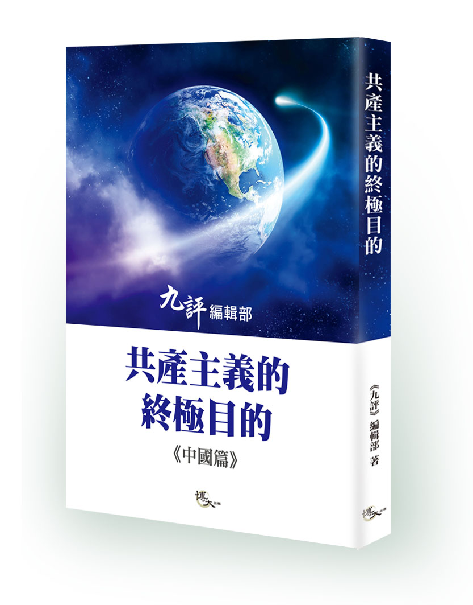

图为法轮功学员游行中的“九评”横幅。（戴兵／大纪元）

  
<h1><b>《共产主义的终极目的》是揭开创世真相的天书（上）</b></h1>

作者：李德君

【大纪元2018年02月05日讯】在《九评》发表13年之际，九评编辑部又发表了新书《共产主义的终极目的》（以下简称《终极目的》）。

《终极目的》，对于人类了解创世主创世的真相、重新认识共产主义的邪恶本质、认清共产党（尤其是江泽民集团）的丑陋嘴脸，进而走出邪恶、解体邪灵、回归传统，均具有意义。

本文分三部分：

一、《终极目的》擢穿了共产主义欺世骗人的真相

二、中共江泽民集团是共产邪灵在人间作恶的代表

三、揭开《终极目的》真相是拯救人类的需要

<b>一 、《终极目的》戳穿了共产主义欺世骗人的真相</b>

<b>（一）共产主义不是一个文化概念</b>
  
《终极目的》告诉我们：共产主义不是一种思潮，也不是一种败坏了的主义的偿试，更不是一个走向末路的学术团体。共产主义是魔鬼教义。

<b>（二）共产主义是一个邪灵</b>

共产主义是一个由恨及低层宇宙中的败坏物质构成的邪灵。共产主义的恨就是把它主义以外的一切（包括天地神人）都当作敌人，把宇宙中符合普世价值的文明物质都当作垃圾，把假恶暴斗当作宝。

<b>（三）共产主义的谎言</b>
  
为实现毁灭人类的目的，共产邪灵制造谎言，忽悠世人跟它走。说：只有跟着它走，才能实现人人平等、按需分配的共产主义社会制度。

跟着它走，就是要造上帝的反、造道德的反、造人类一切美好事物的反。共产主义运动的实践证明：凡跟着它走的无产者，除了被邪灵安排来作恶的魔头，老百姓没有几个人过上好日子。以中国共产党为例，今天中国大陆，搞共产主义的江泽民和被共产邪灵利用来作恶的江泽民集团成员，大都家族资产过亿；而被共产党忽悠，跟着它们走的13亿中国人中，除少数沾了邪党邪恶政策滋阴的光，按周孝正教授分析：至少有10亿人生活在联合国界定的最低生活保障线以下，换言之，跟着中国共产党走的绝大多数老百姓都是些穷光蛋。即便是这样，中共仍旧继续欺骗中国人民，要人民相信它们、再多给它们一些时间，只要跟它们走，一定能实现小康。

事实上，从邓小平到习近平，中共用共产主义歪理邪说制造谎言、欺骗了中国人民二十多年，它们自己早就实现了（共天下人产、共天下人妻的）共产主义，却要中国人民去奔那个遥遥无期的、且充其量只能达到世界发展中国家中下等生活水平的小康。

<b>（四）共产主义的终极目的</b>

1、“毁灭人类”

共产主义的终极目的就是“毁灭人类”。

人类历史上很多圣贤都曾经预言：宇宙走向坏灭的最后，将有创世的神下界传法、度人。

共产邪灵就是在宇宙走向坏灭的最后时刻，针对下世正法、救人的神，搞破坏来的。

从毁灭创世主为人类铺垫的人能闻知佛法的神传文化入手，共产邪灵毁了神为人类得法而留给人类的一切文化，切断了神与人的联系，让人类丧失了理智、醒觉的神性，失去了得法、得救、得度的机会。

2、用心险恶

这个邪灵要人类下地狱并不以杀人肉身为满足。邪灵知道：人的肉身死亡并不是生命的真正死亡，因为人有灵魂，元神可以转生，要让人彻底死亡，就是要人失去转生的机会，人得不到转生的机会，就会灵魂死亡，形神全灭。

为达到这个目的，邪灵就诱人作恶。邪灵知道：当一个生命的道德败坏到无可救、无可药的地步，那么，这个生命就不能轮回转世了，元神（灵魂）会在无尽的痛苦中彻底销毁。

共产邪灵就是从败坏人类的道德入手，让人跟着它与天斗、与地斗、与神斗、与人斗，让人在做坏事中走向毁灭，走向万劫不复。

今天的世界，今天的人类，特别是中国大陆，正处在被共产邪灵毁灭的这种境地。

3、操作系统奸诈

《终极目的》告诉我们：共产邪灵选定并用来作恶的魔体就是中国共产党。换言之，中国共产党是共产邪灵用来毁灭人类的作恶工具。

首先，为迷惑世人，邪灵打乱了世界共产党国家的格局。

《终极目的》第二章：红魔阴谋毁灭人类，揭示了共产邪灵操纵共产主义系统毁灭人类的七步走路线图。

即：第一步在欧洲发展；第二步在苏联试验；第三步在中国生根；第四步美苏对峙，中共关起门来剿灭传统文化；第五步苏联解体，中共上位；第六步经济暴发，道德崩溃；第七步中共用经济梱绑世界。

采取七步走的办法，共产邪灵让中共顺理成章的当上了邪灵需要的龙头老大、成了世界第二大经济体。

其次，为毁灭人类，共产邪灵制造了让中共赖以生存的世界环境。

1989年，随着柏林墙倒堒，苏联及东欧共产主义阵营土崩瓦解，一时间，全世界都认为：共产主义完蛋了。其实，不然。这表现在人世间的共产主义阵营的土崩瓦解，正是邪灵故意制造的假象。是一个诡计：恰恰是用来掩盖邪灵安排中共毁灭人类计划的开始。

《终极目的》说：共产邪灵用来毁灭人类的最大魔体既不是苏联，也不是东欧，而是中共。解体了共产主义阵营后，在让全世界都麻痹于共产主义溃不成军的认识里，邪灵开始让中共作恶，并为中共制造了用来掩盖作恶的迷世假象：

一方面，在意识形态领域里，将共产主义的斗争哲学、无神论思想改头换面，用“法治”、“科学”当幌子，用经济捆绑、打“孔子”包装，蚕食世界、毒害世人；另一方面，打中共经济体制改革成功牌，制造社会主义市场经济与世界经济接轨的假象。

我们知道：承载共产主义邪灵的魔体是中国共产党。当今世界，被邪灵安排与中共在政治体制上作伴的社会主义国家有朝鲜、古巴、越南。

而在经济体制上，真正似中共总书记江泽民一样带领党员干部一夜之间哄抢瓜分了公有制经济归他们一伙私有、党有的国家一个也没有。但貌似社会主义的却不少见。

为了给中共搞的所谓社会主义市场经济当“电灯泡”，邪灵刻意在非洲安排了诸多个打着民主或共和旗号，形式上搞资本主义，实质上搞社会主义的国家，更有被共产邪灵侵蚀而不自知的很多欧洲国家和北美民主国家。

这些国家，公开的身份都是民主而不是搞共产主义，但是被邪灵利用了。邪灵利用这些国家干什么呢？是在中共向世界作恶时，要他们当陪衬。为中共站台、发声、叫唤、捧场。

这些国家大都接受过中共所谓国际主义援助的资金贿赂；默许中共政权的存在；接受、甚至帮助传播中共贯输的共产主义意识；面对中共对13亿中国人民的谎言欺骗、对近一亿大法弟子的道德信仰迫害，装聋作哑。

说白了，邪灵这种安排，是为中共毁灭人类提供市场、平台。而接受邪灵这种安排的国家，其漠视普世价值的行为，也是道德坠落时期，人类走向坏灭的表现。

对共产邪灵毁灭人类道德、迫害创世主救世度人的漠视，也是人对神犯罪。

<b>二、中共江泽民集团是共产邪灵在人间作恶的代表</b>

《终极目的》告诉我们：创世主正法、救世、度人的主庭在中心之国，共产邪灵作恶的主地在中心之国。

<b>（一）为毁掉创世主正法的需要，共产邪灵对中心之国搞破坏作了精心的安排：</b>

一是，造就了一个与天斗、与地斗、与神斗、与人斗，无法无天的中国共产党；培养了一批架构中共的恶魔官员。

二是，毁掉了中华民族五千年的神传文化，“横扫一切牛鬼蛇神”，取而代之是假恶暴斗伟光正的党文化。

三是，形成了以江泽民为恶魔头子的一个反民族、反人类、反传统、反道德的政治流氓刑事犯罪集团。

<b>（二）江泽民上台，共产邪灵开始了实施毁灭创世主救人计划的计划</b>

对此，《终极目的》己作过深层揭露。这里，笔者仅就共产邪灵如何操纵江泽民和江泽民集团实施毁灭创世主救世计划的细节，从一个侧面，作一些剖析：

第一，为让江泽民和江泽民集团在毁灭创世主救世计划中肯向人民下死手，共产邪灵刻意将江泽民集团打造成一个哄抢瓜社会主义公有制经济的刑事犯罪团伙。通过物质引诱，让江泽民带领中共大小官员一起“疯”。即：一起抢了公有制经济、一起犯罪、一起造了国家、民族、人民的反，一起走上了与人民为敌的路。

不可否认：江泽民和江泽民集团哄抢瓜分社会主义公有制经济归党员干部私有的罪是源于他们的贪婪；但确实是共产邪灵的设计。共产邪灵的这个设计，就是要江泽民集团走上一条与人民为敌的死路，以便于邪灵操纵其迫害创世主救世正法。

事实上，邪灵的初级目的达到了。

在共产邪灵的设计中，抢了公有制的江泽民集团，除了与人民为敌，根本无路可走。

因为，尽管形式上江泽民是打着企业改制的幌子，推行邓小平允许一部分人先富的路线，但实质上，江泽民带领党员干部是抢，这个罪，谁也抹杀不了。

如1994年，江泽民带领儿子江绵恒以三百万的价格将市值一亿三千万的国有企业【上联投】以改制名义公然抢归自己家族私有；曾庆红用37亿不法所得吞了净值738亿、实际价超过一千一百亿的鲁能。

正是中共党魁们带头一抢，造成天下大乱，造成中共八大家族、131万官员及掌握企业经营管理权的党员干部厂长经理一起动手，将1949年以来，中国人民辛辛苦苦，拼死拼活创造的全部社会主义公有制经济瓜分遗尽。导致中共御封经济学家鼓吹的所谓市场经济根本就是一个谎言。

说白了，中国大陆经济（根本不是市场经济），是江泽民集团抢了公有制之后形成的强盗经济。

江泽民集团己经不是一个管理国家的政党概念，而是一个彻头彻尾的窃国大盗、地道的黑帮、与人民为敌的刑事抢劫犯罪集团。

第二，江泽民集团与中共邪党被共产邪灵捆绑在一起：相互利用作恶。

哄抢瓜分了公有制经济归党员干部私有的江泽民和江泽民集团知道：他们是一伙十恶不赦的罪犯。他们更知道：要维系犯罪所得不被人民反攻倒算，就只能继续打共产党的牌，坚持共产党领导、搞独裁、专制、暴政 ；而共产邪灵也知道：与人民离心离德，打着共产党旗号带领党员干部哄抢瓜分了公有制经济的江泽民集团己经离不开中共邪党这个承载它们的罪恶体：共产党在，江泽民集团在，江泽民集团的利益在；共产党亡，江泽民集团亡，江泽民集团瓜分私有了的国家经济将归于人民。

正是看准了这一点，江泽民集团与中共邪党才形成了唇亡齿寒的互相利用关系。江泽民集团和中共邪党才成了共产邪灵用来跟创世主作对、向世人作恶、毁人不倦的犯罪工具。（未完待续）

自2004年11月《九评共产党》发表以来，全球掀起了风起云涌的退党大潮。 

  
<h1><b>《共产主义的终极目的》是揭开创世真相的天书（下）</b></h1>

作者：李德君

【大纪元2018年02月05日讯】（接上篇）

第三，江泽民集团涂鸦了中国法治。

为自己一伙人挡罪、为共产邪灵抵毁创世主救人计划提供支撑，江泽民涂鸦中国法治。

中国人都知道：当江泽民集团将宪法固定归13亿人民享有权利的社会主义公有制经济抢归党员干部私有、党有之后，《宪法》名存实亡。这时的中共不法政权，连披在身上的、形式上的合法性伪装也不要了（没有了）。

为继续欺骗、愚弄人民，将哄抢瓜分公有制经济的犯罪“漂白”，江泽民和江泽民集团开始涂鸦中国法治，即立帮规当法用。

针对《宪法》被掏空了公有制经济的空白地儿，出台了《物权法》，将被江泽民集团抢到自己家去的社会主义公有制经济，放到《物权法》里，漂白成神圣不可侵犯的公民私有财产，然后，用《物权法》取代《宪法》，拿《物权法》当《宪法》，并且，以《物权法》作母法，在《物权法》基准上，修订出台了五百多部法律、法规，形成了一个专门用来保护江泽民集团犯罪所得的立法、执法体系。

这个体系，被时任中共总书记江泽民亲笔题词称之为“中国法治”，是江泽民集团的保护伞。

中共邪党所以能把哄抢瓜分公有制经济三十年来的刑事犯罪忽悠成经济体制改革的“新常态”，把参与犯罪的党员干部、厂长经理忽悠成改革开放的国家英模，把教人高尚道德、崇尚真善忍的法轮功、大法弟子污蔑成邪教，正是得益于江泽民涂鸦的这个中国法治。这也是共产邪灵用来操控江泽民集团对抗普世价值的魔法、魔咒。

一伙抢了国家财富、且霸占着国家政权为非作歹，“把坏人捧到九天之上，把好人踩在九地之下”的刑事犯罪分子，用自定义的强盗逻辑涂鸦法治，把它们的刑事犯罪所得用国家法律加以固定、保护，把主流社会最好的一群人当作坏人去打，然后，用暴力强迫被它们抢的吊蛋净光的13亿中国人民，听它们的话，守它们的规矩，照它们的强盗逻辑去做它们要做的事，甚至，威逼利诱老百姓中不明真相的人去帮它们迫害大法弟子，试问：这是法治吗？不，这连人治都不是，因为当权者不是人。

今天的中国大陆，根本不存在是依法治国，还是依宪治国问题。

共产邪灵知道：中共邪党搞的不是法治，其所以让中共忽悠法治，是为了迷惑世人。在魔鬼的逻辑里：能唱出天堂歌曲的，是魔鬼也是高尚的魔鬼。在共产邪灵看来，能讲法治的中共就是在搞法治。

其实，中共邪党江泽民集团是无法无天的恶魔。

第四，公开抵制普世价值，江泽民集团迫害法轮功。

世人皆知：法轮功是教人高尚道德的真善忍，是创世主的智慧，是普世价值、宇宙的法。但却遭到了中共江泽民集团残酷的迫害和血腥镇压。

一直以来，江泽民为什么要迫害法轮功始终是个热议话题。

其中，被公众擢窟窿最多的原因是：因为法轮功表现人类高尚道德冲了江泽民气管。早在1999年7.20之前，仅中国大陆一地，修练法轮功人数就逾7,000万，超过当时拥有6,000万党徒的中共，尤其在中共的6,000万党徒中，至少有1,500万也在修炼法轮功，令江泽民羡慕嫉妒恨。

不可否认，对共产邪灵而言，迫害崇尚人类正信的大法弟子、阻止创世主救世，镇压法轮功，正是它毁灭人类计划的重中之重。

其实，就中共本身而言，它迫害法轮功，除兑现邪灵要的、满足江泽民个人的羡慕嫉妒恨，还有另一层不可告人的目的：就是利用这场对人类正信的迫害搞敲山震虎，为哄抢瓜分公有制经济呜枪铺路。

用迫害人类正信的办法，吓唬下岗工人、失地农民，让他们在被砸了饭碗、被抢了属于他们的社会主义公有制国有、集体企业的江泽民集团面前，规矩、老实、听话。

事实上，江泽民集团迫害法轮功、虐杀大法弟子的这个目的实现了。

从八十年代中共打着企业改制的幌子哄抢公有制经济开始，到九九年7.20之前，全国各地几乎每天都有成千上万的下岗工人、失地农民因对“允许一部分人（党员干部厂、长经理）先富”政策不满而站起来向地方政府、司法机关、甚至中共中央说：“不！”

反观中共。当时，打着企业改制幌子哄抢瓜公有制，尽管表面上靠江泽民三个代表和伪立法支撑，把犯罪性质的企业改制搞得轰轰烈烈、冠冕堂皇，但窃国犯罪的实质、闷声发大财的嘴脸，被老百姓看透了。对应这种抢劫式瓜分公有制的经济犯罪，越来越多的人公开向中共抗争，要求中共依宪、依法保护公民权益。

可以说，在当时，如果中共解决不了由其哄抢瓜分公有制经济引发的潜在动乱危机，那么，中共政权很可能因此导致崩盘。这是个事实，不管今天的中共承认或者不承认这段历史，他都是事实。

那么，中共怎么解决这个问题的呢？

用泼脏水污蔑陷害，制造“围攻中南海事件”、“天安门自焚事件”，搞栽脏嫁祸，迫害法轮功、迫害大法弟子，为哄抢瓜分国家经济呜枪铺路。

正是这场对法轮功、对大法弟子的邪恶迫害，让江泽民集团哄抢瓜分公有制经济的阴谋得逞了。

事实上，当成千上万被砸了饭碗的下岗工人、失地农民瞪眼看着中共江泽民集团用“政治上搞臭、经济上截断、肉体上消灭”的法西斯手段无辜迫害了近一亿修炼真善忍的大法弟子时，他们被吓住了。

失去了饭碗，毕竟还有喘气、呼吸的自由，若跟打不还手、骂不还口，祟尚道德的法轮功学员遭迫害相比，他们庆幸。从此，亿万下岗工人、失地农民渐失向中共主张权利的勇气。

说到底，在共产邪灵操控中共江泽民集团的恶行面前，老百姓放弃了主张人权的正义。

当然，邪不胜正。中共对法轮功的迫害注定失败。因为，迫害正信的从来就没有成功过，况且，表现人类高尚道德的法轮功是宇宙的精神、特性，决不是中共可以打败的。

同样，被江泽民集团哄抢瓜分了的社会主义公有制经济，迟早会回到人民手中。

第五，为将国家、民族、人民，拖进罪恶深渊，让整个世界跟着共产邪灵一起完蛋，江泽民和江泽民集团搞“仇恨外交”、“贪腐淫乱治国”。

（1）仇恨外交

今天的中共，在国际上就是一根搅屎棍。它搞外交：一是维系独裁；二是向世界灌输共产主义意识形态、让世界跟着共产邪灵的脚步走。

为维系党独，它要的是政治利益。它不交朋友，就是利用国际形势变化、利用国与国之间的矛盾：煽阴风、点鬼火、闹乱子、趟混水，误导世界、制造有利于它存在的环境。

为欺骗世界舆论，中共先用党文化为国人洗脑，鼓噪“爱党等于爱国”，煽动民众盲目的爱国热情，让民众替它反美、反日；在国际上，就利用这种被煽动起来的爱国热情，拿13亿中国人民的感情说事：它想在国际社会上有地位，就忽悠国际社会说它代表的是13亿中国人民；当它的恶行劣迹遭到国际社会遣责时，它就指责遣责它的人，要么，伤害了、要么是严重伤害了13亿中国人民的感情。

搞仇恨外交，中共扯大旗作虎皮，拿13亿中国人民说事，裹着自己，吓唬住了国际社会。

中共的恶行，严重败坏了普世价值；整个世界，被共产主义的意识形态坠落。

（2）贪腐淫乱治国

抢了公有制归党员干部私有、涂鸦了中国法治、迫害了近一亿人的正信、毁了13亿中国人和神的联系，江泽民和江泽民集团知道：他们一伙犯罪分子，己经走到了与国家、民族、人民为敌，与神相对的立场，他们满身是罪，罪恶累累。

在这种条件下，要继续维系中共邪党政权、共产邪灵的罪恶，就只能搞贪腐淫乱治国。

搞贪腐，江泽民集团在哄抢瓜分了社会主义公有制经济基础上，继续放纵131万高官，利用抢归党有的国有大企业和国家资源，抢、占、贪；

搞淫乱治国，就是拖13亿中国人民下水，让13亿中国人跟着它们一起做坏事、一起犯罪、一起完。

搞贪腐淫乱治国，正是江泽民集团为毁掉13亿中国人民而精心设计的一个败坏人类道德的死局。

事实上，从江泽民带头搞淫乱开始，中华民族便被共产邪灵整体拖进了罪恶深渊。

今天的中国大陆，淫乱，已经不是江泽民个人、或中共政治局、或131万官员的专利；13亿中国人中的相当数量都被卷入其中；并且，江泽民集团从淫乱开始，诱导国人无恶不做；甚至，连中共当政之前，民风纯朴的乡村，如今七、八十岁的老头、老太太都被中共搞淫乱治国误导著以淫乱为乐、卖淫为生。

今天的中国人，被共产邪灵操纵、受党文化毒害，什么坏事都敢想、敢做。

可以说，如果不是创世主慈悲于世人，将创世真相《共产主义的终极目的》告诉了世人，被中共邪党、共产邪灵、江泽民集团毁了的人类己无药可救。

<b>三、《终极目的》揭开真相，是拯救人类的需要</b>

2004年，大纪元发表《九评共产党》，开启了中国人的“三退”大潮。至今已有二亿九千万人次退出党团队。

今天，《终极目的》的问世，将加速中国人驱除共产邪灵附体的自救之举。《终极目的》指出：“人，只要主动‘三退’，神就会将邪灵瞬间清除，这个生命将属于未来。”可见，三退，是破解共产主义终极目的的一方救世良药。

笔者相信：随着《终极目的》的广泛传播，“三退”将在世界范围内形成对共产主义邪恶的大扫除，人类将彻底解体中共邪党。

唤醒人心，净化社会，重建人类应有的文化、道德、信仰体系，找回人与神联系的心路，是人类归正的需要。

退出党团队，解体中国共产党，回归普世价值的真善忍，是创世主为人类指出的一条得救的正路。选择走正路，是人得救的希望所在。

愿《终极目的》能救度被共产邪灵、中共邪党、江泽民集团用党文化毒害了的13亿中国人民；愿《终极目的》能让整个世界觉悟、让迷中的世人猛醒。

责任编辑：高义

"

《共产主义的终极目的》新书封面。（博大出版社）

  
<h1><b>《共产主义的终极目的》新书开始发行</b></h1>

【大纪元2018年02月02日讯】（大纪元记者骆亚、特约记者常春采访报导）《共产主义的终极目的》自去年底在大纪元网开始首发连载，引发读者广泛关注，目前该书中国篇印刷完毕，面向社会发行。同时，读者期待该书的世界篇出书，希望尽早见到英文版。

在《九评共产党》发表13周年之际，2017年11月18日大纪元《九评》编辑部再推出《共产主义的终极目的》，在大纪元网上进行连载。其分为上下两部：上部《共产主义的终极目的（中国篇）》，下部《共产主义的终极目的（世界篇）》。

该内容在大纪元新闻网推出后，很多网友纷纷留言，期待新书早日出版。“是好书，大陆没办法购买，很大的遗憾，仅读书评即知大著内容一定精彩。”“又将是一部唤醒人类、拯救生命的伟大巨著。热切关注中。”“也期待中共邪教早日解体！”

博大出版社的社长洪月秀近日介绍，《共产主义的终极目的（中国篇）》新书已印刷完毕，并通过多种渠道发行，包括代理的经销商铺到书店去，同时网路书店也会铺开，再有海外直接订购；随后将陆续举办相关活动。

她表示，博大很荣幸出版《九评共产党》后，再获授权出版这本新书。“这是继《九评共产党》后，以独特角度探讨现代人在共产主义影响下所面临的问题，对看不透共产主义实质的人予以很大帮助。”

她认为这本书也会帮助人们去除对共产党的恐惧心理，一旦不恐惧中共，也就会很清楚知道应该怎么做。

《共产主义的终极目的》新书封面。（博大出版社）

原首都师范大学教育科学学院副教授李元华接受大纪元采访时表示：“《共产主义的终极目的》这本书，直接指出共产党不是通常的政党，共产主义不是一种学说、不是一种社会制度，共产主义本质就是‘邪灵’，也称为‘红魔’、‘撒旦’，有它自己邪恶目的所在。沿着这个思路去看的时候，再观察中国乃至世界的上的社会现象和问题时，你就知道为什么是这样的。”

他表示，过去没有把这些问题放在一根大的线上去考虑，只知道中国道德文化被败坏很危险，人与人之间的关系就像这本书里讲的，像狼一样。怎么会有这么坏的人无恶不作，并且这么坏的事情也有人敢去做，且成为一种普遍现象。

“看完这本书以后，你就明白，原来他的目的是用这种方式，通过破坏你的文化，让你没有道德底线，把你这个人彻底毁掉。”

他还表示，当今的中国人被共产党搞得很浮躁，它不让你去思考最本质的问题，让你专注于物质利益，让你的欲望不断膨胀去为所欲为，等于让你去偏离人的根基，非常危险。他呼吁每位中国人静下心来读一读这本书。

实际上共产的思想遗毒，它是改头换面在这个世界上，就像邪灵一样游荡著，它在迫害着人、败坏人的道德。

他强调：“如果不能从这一点上有突破认识，你会想不明白，好多中国出现的问题也不知道为什么，或者你只能看到所谓的共产党改头换面、伪善变异的东西。比如中共在国际上推孔子学院，如果你不能站在这个高度，等于把中共遗毒向世界传播、渗透，你还以为它在恢复中国文化，实际上是用恢复的名义去败坏中国文化。”

时事评论员高天韵表示，这本新书紧扣共产主义是一个邪灵，其目的是通过毁灭文化、败坏道德来毁灭全人类的这条主线，揭示出共产邪灵毁灭人类的路线图、计划书、流程表，甚至操作手册。

“对人类而言，这种揭示就是最根本的拯救。因为只有认清共产主义的邪灵本质和终极目的，才能意识到人类的最大危机何在、才能破解所有的谜题，从而遵循神的指引得以自救。无数个体的存亡、人类文明的存亡，全部系于此。”

1月22日，《共产主义的终极目的（中国篇）》新书消息在大纪元网上发出后，就有不少网友纷纷询问《共产主义的终极目的（世界篇）》何时出新书，翘首以待。还有网友留言说希望尽早出英文版：“极盼望《世界篇》。你们要是人手、时间等方面一时照应不过来，那就先出英文版吧。中文版迟早问世，不可阻挡。要先顾一下大局。支持你们！”

也有网友表示，读了文章之后觉得有责任传递这本书的内容：“我会在脸书上分享《共产主义的终极目的》的每一篇文章。让世人认识共产主义的终极邪恶：也就是杀死人的肉身以至于灵魂，让灵魂在无尽的痛苦中被彻底销毁。这是至关重要的事，也是所有读到此系列文章的人的重责大任。”#

责任编辑：高静

