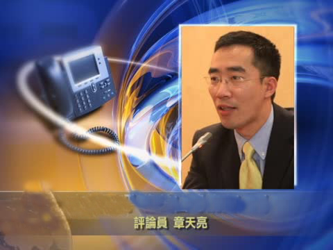
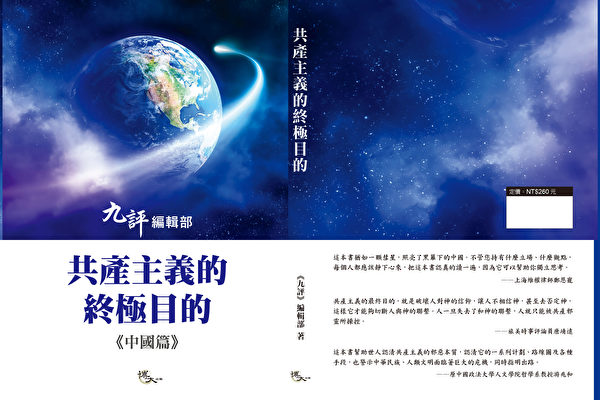
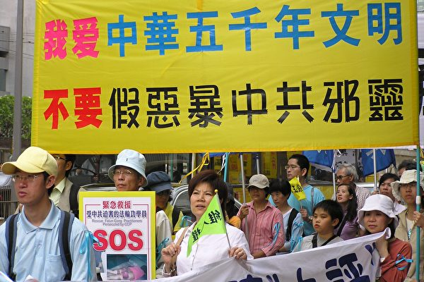

<a href=https://github.com/goodabc/GCC/blob/master/goal.md><h6 align="right">回首頁</h6></a>

<h1 align="center"><b>章天亮：共产主义的终极目的到底是什么？</b></h1>

时事评论员章天亮博士

【希望之声2017年12月11日】（本台记者方偉采访报导）近日，在《九评共产党》发表13周年之际，“九评”编辑部发表了《共产主义的终极目的》一书。“九评”编辑部为什么要发表这样一本书？这里面有什么更深层的原因吗？本台主持人方伟采访了历史文化学者、时事评论员章天亮博士。

“共产主义的终极目的”想表达什么？

 
方伟：章博士，“九评”编辑部的这本书叫做《共产主义的终极目的》，在您看来，这本书想表达的内容是什么？

章天亮：过去我们在谈到共产党邪恶的时候，我们都是讲一些比如它怎么杀人，它怎么破坏中国的传统文化，或者像西方的一些学者，他们也研究共产主义向西方社会的渗透。

但是这本书有一个非常不一样的地方，就像它的书名所说的那样，也就是说它揭示了一个共产主义的终极目的，而这个终极目的就是要毁灭人类。

从一个信神的人这个角度来看，我们知道一个人真正的生命，它不是指人体表面的肉身，就像过去我们说人都是有灵魂的，那么当一个人他的肉身死掉了之后，他的灵魂会去不同的地方，做了好事可以上天堂，做了坏事就会下地狱。

那么这个共产党存在的真正目的，它就不是以杀死人的肉体为目的，因为你把这个人的肉体杀死了，他的灵魂还会转生。而共产党的目的就是要败坏人，通过割裂人和传统的信仰，对神的信仰，通过割裂人和传统文化的关系，通过沦丧人的道德，使人在没有道德标准的情况下做很多很多的坏事。那么这样的人一旦死掉之后，他就不仅仅是一个肉身死亡的问题了，他的灵魂是要下地狱的。

那么这个共产主义的终极目的，也就是说它通过在整体上败坏人类社会的道德，最后就造成人类不符合人的道德标准，那么这样的人类社会就没有希望了。

在过去很多记录共产党的邪恶中，我们可能对它具体做的那些坏事，比如说像杀人、破坏环境、破坏文化方面接触的比较多一点，但是在它的终极目的，要毁灭全人类这个方面，我过去就没有看到这方面观点的系统阐述。

马克思是怎么弄出个“共产主义”的学说？
方伟：那您觉得这本书的阐述它做到了什么呢？

章天亮：我觉得提出这个观点的本身就很触目惊心，因为它说到了共产党的本质是一个邪教。它的背后是有一个邪灵存在的，就是一个邪恶的灵体，这一点对于不信神的人来说，他可能觉得这只是一种形容的说法。但是在信神的人看来，这就是一种非常实在的说法。

其实共产党的创始人，也就是共产主义邪说的创始人马克思，他本身就是信仰魔教——撒旦教的，在他十几岁的时候，也就是在少年时代，他就开始接触这个邪教，然后他还主动邀请那个邪恶的灵体进入他的身体。

现在西方有本书讲关于马克思怎么信这个撒旦教的，它就是《马克思的成魔之路》，这里面很系统的讲了马克思是怎样一步一步开始走入撒旦教的，包括他走入撒旦教之后所写的那些诗词等等，都是以毁灭人类为目的。

那么后来马克思创立了共产主义，表面上它说是无神论，但实际上马克思本人他却是信邪教的，那么这里边就是有一个阴谋了。

因为他如果说他是信魔的，我们都知道，你说有魔存在，那么也就有佛存在。但是他如果说根本没有神，也就是告诉人没有神的存在，那么当然也就没有魔的存在。

既然没有神，你就不用相信神讲的那些东西了，那么你的道德标准也就不再是神规定的标准，而是人自己规定的，那么人就会在欲望的控制下，去放纵自己的这种感官享受，去做一些坏事，那么人的道德标准就会越来越下滑。

这就是共产党非常邪恶的目的，马克思本人也并不讳言这一点，所以他在《共产党宣言》里面的第一句话，就提到说有一个幽灵在欧洲的上空游荡，他所说的幽灵，实际就是在《共产主义的终极目的》这本书里边所说的邪灵。

共产主义不是都已经失败了吗？
方伟：共产主义在过去的二、三十年似乎已经是式微，就是在中国现在也是只剩下了一个半社会主义半资本主义，就是一个“四不像”，那么为什么在这个时候，九评编辑部要出这么一系列的文章呢？

章天亮：当然我不是他们的发言人，我只是说一说我个人的看法。

共产主义最危险的地方，恰恰是你觉得它已经失败了，但是它还没有！过去的《孙子兵法》里面有一句话，叫做“知己知彼，百战不殆”，就是说你必须得了解你自己，还得要了解敌人。

当然现在有很多人已经不了解共产党是怎么回事，他之所以觉得共产主义已经失败，只是在表面上说，共产主义在组织形式上好像是失败了，但实际上共产党的那一套东西已经是渗透全球了。

举个很简单的例子，共产主义的终极目的是要毁灭人类，它在最开始的时候，刚刚出现的时候，大家还没有那么受它欺骗的时候，它想推行它的那套主张，就主要通过一些强制的方法，比如通过杀人、制造恐怖、毁灭文化等等。现在它这些东西已经做到了，做到了之后，它也就不需要再采用那种暴力的方法去杀害生命了。

就像我刚才讲的，因为你把人的肉身杀死了，他不是真正的死亡，他会转生回来再做人，而共产主义的目的是要把整个人类拖向地狱。那么在现在这个情况下，由于它在毁灭传统文化上已经做得相当成功，不光是中国的传统文化被毁掉了，其实很多西方的传统观念也都被毁掉了。

现在你到西方的很多大都市里面去看，包括西方的很多左派媒体、好莱坞，包括西方的教育机构，西方的很多左派的政党等等，它们所主张的那套东西都是马克思的那套东西，只不过是它不叫马克思主义而已，它叫社会主义，有的叫进步主义，有的就是叫左派。它们所采取的那种手段，比如说搞败坏，反对神，把神的诫命从公共场所移除等等，这些都是马克思当年想做的。

所以共产主义在不知不觉之中，在大多数人以为它已经失败的时候，它实际上早已覆盖全球了，所以这是人类所面临的一个很危险的情况。

在共产主义这种邪说的腐蚀之下，全面败坏人的道德，最后当你不再像一个人的的时候，神也就不承认你了。你不承认神，神也就没有办法再去接纳你。

过去人的修炼，一个信神的人，他首先会对神有一个虔诚的信仰，同时他的一举一动也完全是一个人的样子。那么神就承认你，你不光外表是神的形象，因为人是神仿造自己的形象造的，他就看人不光外表像一个神，他的言谈举止，他的道德标准也像一个神，那么等到百年之后你可能就去天国了。而共产党就是要把人的道德标准变成像地狱里边的生命一样，甚至于更坏，所以我觉得很多时候，我们看共产党，不能光看它表面上在发展经济或者在干什么。

有一个问题，我觉得很多人都没有注意到，就是财富的创造和对财富本身的享受，不光是神能给你，魔也可以给你的。我记得在《圣经》里面曾经讲过这样一件事，就是当年耶稣在旷野之中受到魔的试炼，当时魔就把天下万国的荣华指给耶稣看，它说你只要愿意拜我，我就把这万国的荣华都赐给你，然后就被耶稣拒绝了。

说的是什么意思呢？就是魔在诱惑人的时候，它也会给你财富，也会让你经济繁荣起来。所以就是说，现在有很多人觉得中国的经济发展是共产党的功劳，其实不见得是它的功劳，你还要看一看随着财富的发展，人的道德水准变得怎么样了，这个才是问题的关键。

什么人应该读这本书？

 
方伟：《共产主义的终极目的》一系列的文章，已经出到第12篇了，可谓是鸿篇巨制。在您看来，哪些人应该来读一读这本书呢？

章天亮：其实这本书不管是信神还是不信神的人，都可以读一读。但是我想信神的人读了之后可能会更有共鸣。因为人的心目中既有佛性也有魔性，信神的人是这样相信的。西方其实也是一样，就是人来到人世间，按照基督教的说法，就是带着原罪来的。原罪就是指人身上带着一些不好的思想，或者带着一些不好的东西。但是同时人又是神造的，所以他又有贴近神的一面。那么人在这个世间就有一个选择了，你到底是听从佛性那一面的召唤，还是听从魔性那一面的召唤？

共产党所做的事情就是去激发人的魔性，就是要让人远离神，但是人毕竟还是有佛性的那一面。所以这本书出来之后，就是把这个共产党的真相全部讲出来，那么如果一个人他心中还有是非善恶的标准，或者说对神还有一定的信仰，那么他在看这本书的时候，可能在很多方面都会引起共鸣。当然如果你不信神的话，只要有一个基本的道德标准，也可以看一看共产党干的一些坏事。

在中国的文化中，有一个概念叫做附体，就是一个人如果他整天求魔，那个魔就会上他的身体，从而控制这个人。共产党其实就是这样的一个魔教，那么当你举着拳头对着共产党发誓，对着党旗发誓的时候，说你要为它奋斗终身的时候，实际上你就是在招引它来控制你。

所以，当人读了《共产主义的终极目的》这本书，知道了共产党的邪恶，就会抛弃它了，那么这就是人在做一个选择。当这样的选择做出的时候，如果你做的是一个正的选择，那么神也会帮你，就会在你的身体中清除共产邪教对你的控制。

所以我想不管你是信神还是不信神，都可以来读一读这本书，当然我想信神的人可能对里面阐述的一些概念更加容易理解。

怎么看十九大以后的中国政局？
方伟：谈到共产主义这个话题，当然就离不开现在中国还在执政的共产党，那您觉得在中共的十九大这个会开完之后，对于中国的政局发展您怎么看呢？

章天亮：其实我觉得中国的未来还是掌握在中国的老百姓手里，而不是掌握在共产党的手里。我今天是站在一个信神的人角度上谈的，这个社会的发展还是有它的运行规律的。

共产党过去在中国造成了这么多的灾难，我们都知道中国人讲剥极而复，否极泰来，当这个黑暗和灾难达到一个极限的时候，那么正的因素也就会出现，同时也会增长。

 现在我们看到，在全球就出现这样一个抛弃共产党的大潮，不光是在中国有“三退”运动，就是很多人主动的退出中共的党、团、队组织。其实在西方，在欧洲也是如此。前两天我看到一个报道，就是波兰议会通过了一个决议，清算共产党。还有像乌克兰，像很多欧洲国家都在清算共产主义的意识形态。就包括美国总统川普。川普在今年9月联大发言的时候还提到过，他说像委内瑞拉还有一些其它国家，它们之所以现在这么糟糕，不是因为它们把共产主义这个意识形态给执行错了，不是说它们做的不好，而恰恰是因为它们忠实地执行了共产主义的理念，所以才变成了今天这个样子。

所以，无论从美国到欧洲，还是包括在中国，现在都在抛弃共产党，我想这就是一个旧的秩序正在过去，新的秩序正在建立的过程中。那么每一个人，如果在中国的每一个人都能够抛弃共产党，那这个共产党也就不存在了。

所以我觉得中国的未来不是由共产党来决定的，实际上是每一个中国人自己人心的选择，那么神也会根据人心的选择来给人以相应的福报或者是降下灾祸。我想这本书出来之后，就是希望更多的人能够远离邪教，靠近神。（全文完）

<h1 align="center"><b>《共产主义的终极目的》是揭开创世真相的天书（上）</b></h1>

图为法轮功学员游行中的“九评”横幅。（戴兵／大纪元）

  
作者：李德君

【大纪元2018年02月05日讯】在《九评》发表13年之际，九评编辑部又发表了新书《共产主义的终极目的》（以下简称《终极目的》）。

《终极目的》，对于人类了解创世主创世的真相、重新认识共产主义的邪恶本质、认清共产党（尤其是江泽民集团）的丑陋嘴脸，进而走出邪恶、解体邪灵、回归传统，均具有意义。

本文分三部分：

一、《终极目的》擢穿了共产主义欺世骗人的真相

二、中共江泽民集团是共产邪灵在人间作恶的代表

三、揭开《终极目的》真相是拯救人类的需要

<b>一 、《终极目的》戳穿了共产主义欺世骗人的真相</b>

<b>（一）共产主义不是一个文化概念</b>
  
《终极目的》告诉我们：共产主义不是一种思潮，也不是一种败坏了的主义的偿试，更不是一个走向末路的学术团体。共产主义是魔鬼教义。

<b>（二）共产主义是一个邪灵</b>

共产主义是一个由恨及低层宇宙中的败坏物质构成的邪灵。共产主义的恨就是把它主义以外的一切（包括天地神人）都当作敌人，把宇宙中符合普世价值的文明物质都当作垃圾，把假恶暴斗当作宝。

<b>（三）共产主义的谎言</b>
  
为实现毁灭人类的目的，共产邪灵制造谎言，忽悠世人跟它走。说：只有跟着它走，才能实现人人平等、按需分配的共产主义社会制度。

跟着它走，就是要造上帝的反、造道德的反、造人类一切美好事物的反。共产主义运动的实践证明：凡跟着它走的无产者，除了被邪灵安排来作恶的魔头，老百姓没有几个人过上好日子。以中国共产党为例，今天中国大陆，搞共产主义的江泽民和被共产邪灵利用来作恶的江泽民集团成员，大都家族资产过亿；而被共产党忽悠，跟着它们走的13亿中国人中，除少数沾了邪党邪恶政策滋阴的光，按周孝正教授分析：至少有10亿人生活在联合国界定的最低生活保障线以下，换言之，跟着中国共产党走的绝大多数老百姓都是些穷光蛋。即便是这样，中共仍旧继续欺骗中国人民，要人民相信它们、再多给它们一些时间，只要跟它们走，一定能实现小康。

事实上，从邓小平到习近平，中共用共产主义歪理邪说制造谎言、欺骗了中国人民二十多年，它们自己早就实现了（共天下人产、共天下人妻的）共产主义，却要中国人民去奔那个遥遥无期的、且充其量只能达到世界发展中国家中下等生活水平的小康。

<b>（四）共产主义的终极目的</b>

1、“毁灭人类”

共产主义的终极目的就是“毁灭人类”。

人类历史上很多圣贤都曾经预言：宇宙走向坏灭的最后，将有创世的神下界传法、度人。

共产邪灵就是在宇宙走向坏灭的最后时刻，针对下世正法、救人的神，搞破坏来的。

从毁灭创世主为人类铺垫的人能闻知佛法的神传文化入手，共产邪灵毁了神为人类得法而留给人类的一切文化，切断了神与人的联系，让人类丧失了理智、醒觉的神性，失去了得法、得救、得度的机会。

2、用心险恶

这个邪灵要人类下地狱并不以杀人肉身为满足。邪灵知道：人的肉身死亡并不是生命的真正死亡，因为人有灵魂，元神可以转生，要让人彻底死亡，就是要人失去转生的机会，人得不到转生的机会，就会灵魂死亡，形神全灭。

为达到这个目的，邪灵就诱人作恶。邪灵知道：当一个生命的道德败坏到无可救、无可药的地步，那么，这个生命就不能轮回转世了，元神（灵魂）会在无尽的痛苦中彻底销毁。

共产邪灵就是从败坏人类的道德入手，让人跟着它与天斗、与地斗、与神斗、与人斗，让人在做坏事中走向毁灭，走向万劫不复。

今天的世界，今天的人类，特别是中国大陆，正处在被共产邪灵毁灭的这种境地。

3、操作系统奸诈

《终极目的》告诉我们：共产邪灵选定并用来作恶的魔体就是中国共产党。换言之，中国共产党是共产邪灵用来毁灭人类的作恶工具。

首先，为迷惑世人，邪灵打乱了世界共产党国家的格局。

《终极目的》第二章：红魔阴谋毁灭人类，揭示了共产邪灵操纵共产主义系统毁灭人类的七步走路线图。

即：第一步在欧洲发展；第二步在苏联试验；第三步在中国生根；第四步美苏对峙，中共关起门来剿灭传统文化；第五步苏联解体，中共上位；第六步经济暴发，道德崩溃；第七步中共用经济梱绑世界。

采取七步走的办法，共产邪灵让中共顺理成章的当上了邪灵需要的龙头老大、成了世界第二大经济体。

其次，为毁灭人类，共产邪灵制造了让中共赖以生存的世界环境。

1989年，随着柏林墙倒堒，苏联及东欧共产主义阵营土崩瓦解，一时间，全世界都认为：共产主义完蛋了。其实，不然。这表现在人世间的共产主义阵营的土崩瓦解，正是邪灵故意制造的假象。是一个诡计：恰恰是用来掩盖邪灵安排中共毁灭人类计划的开始。

《终极目的》说：共产邪灵用来毁灭人类的最大魔体既不是苏联，也不是东欧，而是中共。解体了共产主义阵营后，在让全世界都麻痹于共产主义溃不成军的认识里，邪灵开始让中共作恶，并为中共制造了用来掩盖作恶的迷世假象：

一方面，在意识形态领域里，将共产主义的斗争哲学、无神论思想改头换面，用“法治”、“科学”当幌子，用经济捆绑、打“孔子”包装，蚕食世界、毒害世人；另一方面，打中共经济体制改革成功牌，制造社会主义市场经济与世界经济接轨的假象。

我们知道：承载共产主义邪灵的魔体是中国共产党。当今世界，被邪灵安排与中共在政治体制上作伴的社会主义国家有朝鲜、古巴、越南。

而在经济体制上，真正似中共总书记江泽民一样带领党员干部一夜之间哄抢瓜分了公有制经济归他们一伙私有、党有的国家一个也没有。但貌似社会主义的却不少见。

为了给中共搞的所谓社会主义市场经济当“电灯泡”，邪灵刻意在非洲安排了诸多个打着民主或共和旗号，形式上搞资本主义，实质上搞社会主义的国家，更有被共产邪灵侵蚀而不自知的很多欧洲国家和北美民主国家。

这些国家，公开的身份都是民主而不是搞共产主义，但是被邪灵利用了。邪灵利用这些国家干什么呢？是在中共向世界作恶时，要他们当陪衬。为中共站台、发声、叫唤、捧场。

这些国家大都接受过中共所谓国际主义援助的资金贿赂；默许中共政权的存在；接受、甚至帮助传播中共贯输的共产主义意识；面对中共对13亿中国人民的谎言欺骗、对近一亿大法弟子的道德信仰迫害，装聋作哑。

说白了，邪灵这种安排，是为中共毁灭人类提供市场、平台。而接受邪灵这种安排的国家，其漠视普世价值的行为，也是道德坠落时期，人类走向坏灭的表现。

对共产邪灵毁灭人类道德、迫害创世主救世度人的漠视，也是人对神犯罪。

<b>二、中共江泽民集团是共产邪灵在人间作恶的代表</b>

《终极目的》告诉我们：创世主正法、救世、度人的主庭在中心之国，共产邪灵作恶的主地在中心之国。

<b>（一）为毁掉创世主正法的需要，共产邪灵对中心之国搞破坏作了精心的安排：</b>

一是，造就了一个与天斗、与地斗、与神斗、与人斗，无法无天的中国共产党；培养了一批架构中共的恶魔官员。

二是，毁掉了中华民族五千年的神传文化，“横扫一切牛鬼蛇神”，取而代之是假恶暴斗伟光正的党文化。

三是，形成了以江泽民为恶魔头子的一个反民族、反人类、反传统、反道德的政治流氓刑事犯罪集团。

<b>（二）江泽民上台，共产邪灵开始了实施毁灭创世主救人计划的计划</b>

对此，《终极目的》己作过深层揭露。这里，笔者仅就共产邪灵如何操纵江泽民和江泽民集团实施毁灭创世主救世计划的细节，从一个侧面，作一些剖析：

第一，为让江泽民和江泽民集团在毁灭创世主救世计划中肯向人民下死手，共产邪灵刻意将江泽民集团打造成一个哄抢瓜社会主义公有制经济的刑事犯罪团伙。通过物质引诱，让江泽民带领中共大小官员一起“疯”。即：一起抢了公有制经济、一起犯罪、一起造了国家、民族、人民的反，一起走上了与人民为敌的路。

不可否认：江泽民和江泽民集团哄抢瓜分社会主义公有制经济归党员干部私有的罪是源于他们的贪婪；但确实是共产邪灵的设计。共产邪灵的这个设计，就是要江泽民集团走上一条与人民为敌的死路，以便于邪灵操纵其迫害创世主救世正法。

事实上，邪灵的初级目的达到了。

在共产邪灵的设计中，抢了公有制的江泽民集团，除了与人民为敌，根本无路可走。

因为，尽管形式上江泽民是打着企业改制的幌子，推行邓小平允许一部分人先富的路线，但实质上，江泽民带领党员干部是抢，这个罪，谁也抹杀不了。

如1994年，江泽民带领儿子江绵恒以三百万的价格将市值一亿三千万的国有企业【上联投】以改制名义公然抢归自己家族私有；曾庆红用37亿不法所得吞了净值738亿、实际价超过一千一百亿的鲁能。

正是中共党魁们带头一抢，造成天下大乱，造成中共八大家族、131万官员及掌握企业经营管理权的党员干部厂长经理一起动手，将1949年以来，中国人民辛辛苦苦，拼死拼活创造的全部社会主义公有制经济瓜分遗尽。导致中共御封经济学家鼓吹的所谓市场经济根本就是一个谎言。

说白了，中国大陆经济（根本不是市场经济），是江泽民集团抢了公有制之后形成的强盗经济。

江泽民集团己经不是一个管理国家的政党概念，而是一个彻头彻尾的窃国大盗、地道的黑帮、与人民为敌的刑事抢劫犯罪集团。

第二，江泽民集团与中共邪党被共产邪灵捆绑在一起：相互利用作恶。

哄抢瓜分了公有制经济归党员干部私有的江泽民和江泽民集团知道：他们是一伙十恶不赦的罪犯。他们更知道：要维系犯罪所得不被人民反攻倒算，就只能继续打共产党的牌，坚持共产党领导、搞独裁、专制、暴政 ；而共产邪灵也知道：与人民离心离德，打着共产党旗号带领党员干部哄抢瓜分了公有制经济的江泽民集团己经离不开中共邪党这个承载它们的罪恶体：共产党在，江泽民集团在，江泽民集团的利益在；共产党亡，江泽民集团亡，江泽民集团瓜分私有了的国家经济将归于人民。

正是看准了这一点，江泽民集团与中共邪党才形成了唇亡齿寒的互相利用关系。江泽民集团和中共邪党才成了共产邪灵用来跟创世主作对、向世人作恶、毁人不倦的犯罪工具。（未完待续）

<h1 align="center"><b>《共产主义的终极目的》是揭开创世真相的天书（下）</b></h1>

自2004年11月《九评共产党》发表以来，全球掀起了风起云涌的退党大潮。 

  
作者：李德君

【大纪元2018年02月05日讯】（接上篇）

第三，江泽民集团涂鸦了中国法治。

为自己一伙人挡罪、为共产邪灵抵毁创世主救人计划提供支撑，江泽民涂鸦中国法治。

中国人都知道：当江泽民集团将宪法固定归13亿人民享有权利的社会主义公有制经济抢归党员干部私有、党有之后，《宪法》名存实亡。这时的中共不法政权，连披在身上的、形式上的合法性伪装也不要了（没有了）。

为继续欺骗、愚弄人民，将哄抢瓜分公有制经济的犯罪“漂白”，江泽民和江泽民集团开始涂鸦中国法治，即立帮规当法用。

针对《宪法》被掏空了公有制经济的空白地儿，出台了《物权法》，将被江泽民集团抢到自己家去的社会主义公有制经济，放到《物权法》里，漂白成神圣不可侵犯的公民私有财产，然后，用《物权法》取代《宪法》，拿《物权法》当《宪法》，并且，以《物权法》作母法，在《物权法》基准上，修订出台了五百多部法律、法规，形成了一个专门用来保护江泽民集团犯罪所得的立法、执法体系。

这个体系，被时任中共总书记江泽民亲笔题词称之为“中国法治”，是江泽民集团的保护伞。

中共邪党所以能把哄抢瓜分公有制经济三十年来的刑事犯罪忽悠成经济体制改革的“新常态”，把参与犯罪的党员干部、厂长经理忽悠成改革开放的国家英模，把教人高尚道德、崇尚真善忍的法轮功、大法弟子污蔑成邪教，正是得益于江泽民涂鸦的这个中国法治。这也是共产邪灵用来操控江泽民集团对抗普世价值的魔法、魔咒。

一伙抢了国家财富、且霸占着国家政权为非作歹，“把坏人捧到九天之上，把好人踩在九地之下”的刑事犯罪分子，用自定义的强盗逻辑涂鸦法治，把它们的刑事犯罪所得用国家法律加以固定、保护，把主流社会最好的一群人当作坏人去打，然后，用暴力强迫被它们抢的吊蛋净光的13亿中国人民，听它们的话，守它们的规矩，照它们的强盗逻辑去做它们要做的事，甚至，威逼利诱老百姓中不明真相的人去帮它们迫害大法弟子，试问：这是法治吗？不，这连人治都不是，因为当权者不是人。

今天的中国大陆，根本不存在是依法治国，还是依宪治国问题。

共产邪灵知道：中共邪党搞的不是法治，其所以让中共忽悠法治，是为了迷惑世人。在魔鬼的逻辑里：能唱出天堂歌曲的，是魔鬼也是高尚的魔鬼。在共产邪灵看来，能讲法治的中共就是在搞法治。

其实，中共邪党江泽民集团是无法无天的恶魔。

第四，公开抵制普世价值，江泽民集团迫害法轮功。

世人皆知：法轮功是教人高尚道德的真善忍，是创世主的智慧，是普世价值、宇宙的法。但却遭到了中共江泽民集团残酷的迫害和血腥镇压。

一直以来，江泽民为什么要迫害法轮功始终是个热议话题。

其中，被公众擢窟窿最多的原因是：因为法轮功表现人类高尚道德冲了江泽民气管。早在1999年7.20之前，仅中国大陆一地，修练法轮功人数就逾7,000万，超过当时拥有6,000万党徒的中共，尤其在中共的6,000万党徒中，至少有1,500万也在修炼法轮功，令江泽民羡慕嫉妒恨。

不可否认，对共产邪灵而言，迫害崇尚人类正信的大法弟子、阻止创世主救世，镇压法轮功，正是它毁灭人类计划的重中之重。

其实，就中共本身而言，它迫害法轮功，除兑现邪灵要的、满足江泽民个人的羡慕嫉妒恨，还有另一层不可告人的目的：就是利用这场对人类正信的迫害搞敲山震虎，为哄抢瓜分公有制经济呜枪铺路。

用迫害人类正信的办法，吓唬下岗工人、失地农民，让他们在被砸了饭碗、被抢了属于他们的社会主义公有制国有、集体企业的江泽民集团面前，规矩、老实、听话。

事实上，江泽民集团迫害法轮功、虐杀大法弟子的这个目的实现了。

从八十年代中共打着企业改制的幌子哄抢公有制经济开始，到九九年7.20之前，全国各地几乎每天都有成千上万的下岗工人、失地农民因对“允许一部分人（党员干部厂、长经理）先富”政策不满而站起来向地方政府、司法机关、甚至中共中央说：“不！”

反观中共。当时，打着企业改制幌子哄抢瓜公有制，尽管表面上靠江泽民三个代表和伪立法支撑，把犯罪性质的企业改制搞得轰轰烈烈、冠冕堂皇，但窃国犯罪的实质、闷声发大财的嘴脸，被老百姓看透了。对应这种抢劫式瓜分公有制的经济犯罪，越来越多的人公开向中共抗争，要求中共依宪、依法保护公民权益。

可以说，在当时，如果中共解决不了由其哄抢瓜分公有制经济引发的潜在动乱危机，那么，中共政权很可能因此导致崩盘。这是个事实，不管今天的中共承认或者不承认这段历史，他都是事实。

那么，中共怎么解决这个问题的呢？

用泼脏水污蔑陷害，制造“围攻中南海事件”、“天安门自焚事件”，搞栽脏嫁祸，迫害法轮功、迫害大法弟子，为哄抢瓜分国家经济呜枪铺路。

正是这场对法轮功、对大法弟子的邪恶迫害，让江泽民集团哄抢瓜分公有制经济的阴谋得逞了。

事实上，当成千上万被砸了饭碗的下岗工人、失地农民瞪眼看着中共江泽民集团用“政治上搞臭、经济上截断、肉体上消灭”的法西斯手段无辜迫害了近一亿修炼真善忍的大法弟子时，他们被吓住了。

失去了饭碗，毕竟还有喘气、呼吸的自由，若跟打不还手、骂不还口，祟尚道德的法轮功学员遭迫害相比，他们庆幸。从此，亿万下岗工人、失地农民渐失向中共主张权利的勇气。

说到底，在共产邪灵操控中共江泽民集团的恶行面前，老百姓放弃了主张人权的正义。

当然，邪不胜正。中共对法轮功的迫害注定失败。因为，迫害正信的从来就没有成功过，况且，表现人类高尚道德的法轮功是宇宙的精神、特性，决不是中共可以打败的。

同样，被江泽民集团哄抢瓜分了的社会主义公有制经济，迟早会回到人民手中。

第五，为将国家、民族、人民，拖进罪恶深渊，让整个世界跟着共产邪灵一起完蛋，江泽民和江泽民集团搞“仇恨外交”、“贪腐淫乱治国”。

（1）仇恨外交

今天的中共，在国际上就是一根搅屎棍。它搞外交：一是维系独裁；二是向世界灌输共产主义意识形态、让世界跟着共产邪灵的脚步走。

为维系党独，它要的是政治利益。它不交朋友，就是利用国际形势变化、利用国与国之间的矛盾：煽阴风、点鬼火、闹乱子、趟混水，误导世界、制造有利于它存在的环境。

为欺骗世界舆论，中共先用党文化为国人洗脑，鼓噪“爱党等于爱国”，煽动民众盲目的爱国热情，让民众替它反美、反日；在国际上，就利用这种被煽动起来的爱国热情，拿13亿中国人民的感情说事：它想在国际社会上有地位，就忽悠国际社会说它代表的是13亿中国人民；当它的恶行劣迹遭到国际社会遣责时，它就指责遣责它的人，要么，伤害了、要么是严重伤害了13亿中国人民的感情。

搞仇恨外交，中共扯大旗作虎皮，拿13亿中国人民说事，裹着自己，吓唬住了国际社会。

中共的恶行，严重败坏了普世价值；整个世界，被共产主义的意识形态坠落。

（2）贪腐淫乱治国

抢了公有制归党员干部私有、涂鸦了中国法治、迫害了近一亿人的正信、毁了13亿中国人和神的联系，江泽民和江泽民集团知道：他们一伙犯罪分子，己经走到了与国家、民族、人民为敌，与神相对的立场，他们满身是罪，罪恶累累。

在这种条件下，要继续维系中共邪党政权、共产邪灵的罪恶，就只能搞贪腐淫乱治国。

搞贪腐，江泽民集团在哄抢瓜分了社会主义公有制经济基础上，继续放纵131万高官，利用抢归党有的国有大企业和国家资源，抢、占、贪；

搞淫乱治国，就是拖13亿中国人民下水，让13亿中国人跟着它们一起做坏事、一起犯罪、一起完。

搞贪腐淫乱治国，正是江泽民集团为毁掉13亿中国人民而精心设计的一个败坏人类道德的死局。

事实上，从江泽民带头搞淫乱开始，中华民族便被共产邪灵整体拖进了罪恶深渊。

今天的中国大陆，淫乱，已经不是江泽民个人、或中共政治局、或131万官员的专利；13亿中国人中的相当数量都被卷入其中；并且，江泽民集团从淫乱开始，诱导国人无恶不做；甚至，连中共当政之前，民风纯朴的乡村，如今七、八十岁的老头、老太太都被中共搞淫乱治国误导著以淫乱为乐、卖淫为生。

今天的中国人，被共产邪灵操纵、受党文化毒害，什么坏事都敢想、敢做。

可以说，如果不是创世主慈悲于世人，将创世真相《共产主义的终极目的》告诉了世人，被中共邪党、共产邪灵、江泽民集团毁了的人类己无药可救。

<b>三、《终极目的》揭开真相，是拯救人类的需要</b>

2004年，大纪元发表《九评共产党》，开启了中国人的“三退”大潮。至今已有二亿九千万人次退出党团队。

今天，《终极目的》的问世，将加速中国人驱除共产邪灵附体的自救之举。《终极目的》指出：“人，只要主动‘三退’，神就会将邪灵瞬间清除，这个生命将属于未来。”可见，三退，是破解共产主义终极目的的一方救世良药。

笔者相信：随着《终极目的》的广泛传播，“三退”将在世界范围内形成对共产主义邪恶的大扫除，人类将彻底解体中共邪党。

唤醒人心，净化社会，重建人类应有的文化、道德、信仰体系，找回人与神联系的心路，是人类归正的需要。

退出党团队，解体中国共产党，回归普世价值的真善忍，是创世主为人类指出的一条得救的正路。选择走正路，是人得救的希望所在。

愿《终极目的》能救度被共产邪灵、中共邪党、江泽民集团用党文化毒害了的13亿中国人民；愿《终极目的》能让整个世界觉悟、让迷中的世人猛醒。

责任编辑：高义

<h1 align="center"><b>《共产主义的终极目的》新书开始发行</b></h1>

《共产主义的终极目的》新书封面。（博大出版社）

  
【大纪元2018年02月02日讯】（大纪元记者骆亚、特约记者常春采访报导）《共产主义的终极目的》自去年底在大纪元网开始首发连载，引发读者广泛关注，目前该书中国篇印刷完毕，面向社会发行。同时，读者期待该书的世界篇出书，希望尽早见到英文版。

在《九评共产党》发表13周年之际，2017年11月18日大纪元《九评》编辑部再推出《共产主义的终极目的》，在大纪元网上进行连载。其分为上下两部：上部《共产主义的终极目的（中国篇）》，下部《共产主义的终极目的（世界篇）》。

该内容在大纪元新闻网推出后，很多网友纷纷留言，期待新书早日出版。“是好书，大陆没办法购买，很大的遗憾，仅读书评即知大著内容一定精彩。”“又将是一部唤醒人类、拯救生命的伟大巨著。热切关注中。”“也期待中共邪教早日解体！”

博大出版社的社长洪月秀近日介绍，《共产主义的终极目的（中国篇）》新书已印刷完毕，并通过多种渠道发行，包括代理的经销商铺到书店去，同时网路书店也会铺开，再有海外直接订购；随后将陆续举办相关活动。

她表示，博大很荣幸出版《九评共产党》后，再获授权出版这本新书。“这是继《九评共产党》后，以独特角度探讨现代人在共产主义影响下所面临的问题，对看不透共产主义实质的人予以很大帮助。”

她认为这本书也会帮助人们去除对共产党的恐惧心理，一旦不恐惧中共，也就会很清楚知道应该怎么做。

《共产主义的终极目的》新书封面。（博大出版社）

原首都师范大学教育科学学院副教授李元华接受大纪元采访时表示：“《共产主义的终极目的》这本书，直接指出共产党不是通常的政党，共产主义不是一种学说、不是一种社会制度，共产主义本质就是‘邪灵’，也称为‘红魔’、‘撒旦’，有它自己邪恶目的所在。沿着这个思路去看的时候，再观察中国乃至世界的上的社会现象和问题时，你就知道为什么是这样的。”

他表示，过去没有把这些问题放在一根大的线上去考虑，只知道中国道德文化被败坏很危险，人与人之间的关系就像这本书里讲的，像狼一样。怎么会有这么坏的人无恶不作，并且这么坏的事情也有人敢去做，且成为一种普遍现象。

“看完这本书以后，你就明白，原来他的目的是用这种方式，通过破坏你的文化，让你没有道德底线，把你这个人彻底毁掉。”

他还表示，当今的中国人被共产党搞得很浮躁，它不让你去思考最本质的问题，让你专注于物质利益，让你的欲望不断膨胀去为所欲为，等于让你去偏离人的根基，非常危险。他呼吁每位中国人静下心来读一读这本书。

实际上共产的思想遗毒，它是改头换面在这个世界上，就像邪灵一样游荡著，它在迫害着人、败坏人的道德。

他强调：“如果不能从这一点上有突破认识，你会想不明白，好多中国出现的问题也不知道为什么，或者你只能看到所谓的共产党改头换面、伪善变异的东西。比如中共在国际上推孔子学院，如果你不能站在这个高度，等于把中共遗毒向世界传播、渗透，你还以为它在恢复中国文化，实际上是用恢复的名义去败坏中国文化。”

时事评论员高天韵表示，这本新书紧扣共产主义是一个邪灵，其目的是通过毁灭文化、败坏道德来毁灭全人类的这条主线，揭示出共产邪灵毁灭人类的路线图、计划书、流程表，甚至操作手册。

“对人类而言，这种揭示就是最根本的拯救。因为只有认清共产主义的邪灵本质和终极目的，才能意识到人类的最大危机何在、才能破解所有的谜题，从而遵循神的指引得以自救。无数个体的存亡、人类文明的存亡，全部系于此。”

1月22日，《共产主义的终极目的（中国篇）》新书消息在大纪元网上发出后，就有不少网友纷纷询问《共产主义的终极目的（世界篇）》何时出新书，翘首以待。还有网友留言说希望尽早出英文版：“极盼望《世界篇》。你们要是人手、时间等方面一时照应不过来，那就先出英文版吧。中文版迟早问世，不可阻挡。要先顾一下大局。支持你们！”

也有网友表示，读了文章之后觉得有责任传递这本书的内容：“我会在脸书上分享《共产主义的终极目的》的每一篇文章。让世人认识共产主义的终极邪恶：也就是杀死人的肉身以至于灵魂，让灵魂在无尽的痛苦中被彻底销毁。这是至关重要的事，也是所有读到此系列文章的人的重责大任。”#

责任编辑：高静

<h1 align="center"><b>《共产主义终极目的》揭中共“用欲望杀人”</b></h1>

【大纪元2017年12月19日讯】（大纪元特约记者常青、周慧心采访报导）继《九评共产党》后，大纪元又刊载了《共产主义的终极目的》，揭示了共产主义的真正本源，以及其来在世间的目的。有学者认为，回顾历史，再看现实，一切正如书中所述，共产主义的终极目的正在有步骤地进行中，他感到非常紧迫。

“我觉得，《共产主义的终极目的》和《九评共产党》一样，振聋发聩，醍醐灌顶，对世人认清共产主义和共产党的目的、本质具有重大意义。”原中国政法大学人文学院哲学系教授游兆和对大纪元记者表示，“这本书帮助世人认清共产主义的邪恶本质，认清它的一系列计划、路线图及各种手段，也警示中华民族、人类文明面临着巨大的危机，同时指明出路。”

<b>学者：“中共利用欲望毁灭人类”</b>
  
游兆和表示，他看完《共产主义的终极目的》后，了解到中共杀人的手段，除了使用暴力之外，还有欲望。“暴力杀人”，就是践踏人权，突破法律底线，造成无数人生命、财产的巨大损失，这种手段人们并不陌生。但另一种手段更有欺骗性、危害性，那就是 “欲望杀人”。

“中共用无神论、唯物论欺骗、诱惑，使人放纵欲望，丧失人性，突破道德底线，由此切断人与神、民族与神传文化的血脉联系，使人败坏到不可救药的地步，进而被毁灭。”他说。

游兆和认为，“欲望”是一把杀人不见血的“软刀子”，中共带头搞“权钱色”一系列丑恶交易，鼓励人放纵自己的所有欲望，今日中国已经完全变成了一个物欲横流的社会，乱象丛生。

正如《共产主义的终极目的》中所描述的：“中共刻意制造的‘一夜暴富’的欲望，‘娱乐至死’的氛围，‘过把瘾就死’的心态，使浮躁恶毒、冷漠自私成为社会的主导气氛。”书中第一次揭示了共产主义的终极目的是毁掉人类，不是肉体上的销毁，而是灵魂的消亡。

游兆和表示，他感到非常紧迫。他认为共产主义这个邪灵正在按照它的计划，一步步地将人类带向毁灭的深渊。

他说：“除了中国，中共还在全世界大搞金钱交易、利益输出、政治渗透，推销所谓‘中国道路’。这表明，共产邪灵毁灭人类的目的正在逐步实现，这是人类文明面对的一种现实危机！”

<b>人类自我救赎之路</b>
  
那么，中国人还有没有出路？有没有摆脱共产邪灵自我救赎之路？游兆和表示，《共产主义的终极目的》为世人提供、指出了一条出路，那就是回归传统，重建道德。

他介绍说，该书揭示出中国五千年的文化是神传给人类的文化，让人类在危机时刻能听懂神的呼唤，找到回归的路。

游兆和认为，只有反其（中共）道行之，才能免遭毁灭。他解释说，中共为何要倾国家之力来迫害法轮功，因为它惧怕“真、善、忍”。法轮功能唤醒人们心灵深处对神的敬仰，重新将人与神连接上，这会阻止共产主义实现其毁灭宗教信仰、毁灭人类的目的。

“可以说，‘真、善、忍’的宇宙法理与普世价值，也为人类提供了最高的道德规范与价值标准，为人类社会正常运行、长治久安奠定了坚实基础，也提供了一个根本保障。”他说，在这一法理导引下，中华民族可以回归传统，认祖归宗，复兴中华传统文化，走出绝境。

最后，游兆和表示：“我衷心希望，大陆同仁、同胞都能认真研读《九评共产党》和《共产主义的终极目的》。我觉得，海峡两岸的中国人，特别是中国大陆的中国人包括中共党徒，都应该认识到：‘我们必须做中华儿女，不能做马列子孙！’做马列子孙只能是死路一条，不仅有愧于列祖列宗，而且也有悖于人类文明！”

<h1 align="center"><b>可帮助您认清共产邪灵的一本奇书</b></h1>

《共产主义的终极目的》可以帮助人类进一步认清中共的邪灵本质。（潘璟桥/大纪元）

作者：觅真

十三年前，大纪元发表了醒世巨著《九评共产党》。《九评》传播十三年来，如同九
把利剑，对剥开中共画皮，戳穿谎言、揭露邪恶、帮助民众认清中共的流氓本性和邪
恶本质发挥了不可替代的作用，使三亿民众做出了抛弃中共邪恶组织的选择，拥有了
光明的未来！

在《九评》发表十三周年之日，《九评》编辑部又推出另一巨著《共产主义的终极目的
》。它清晰明确的告诉了人们共产邪灵毁灭人类的终极目的。《共产主义的终极目的
》将对帮助人类进一步认清中共的邪灵本质，解体中共，进而彻底清除共产邪灵在人
间的败坏物质，跨入人类新纪元发挥着巨大的作用。

《共产主义的终极目的》序言中说：本着对神造生命的无比珍视，本着对人类的深切
关怀，我们写下这本书——《共产主义的终极目的》，向世人系统分析和揭示“共产
邪灵”通过破坏文化、败坏道德而毁灭人类的天大阴谋。

在不同的民族中，都流传着最后神会来拯救人的传说。人类已经走到了宇宙历史的转
折关头，而共产邪教就是人类此时获得拯救的最大障碍。因此，我们迫切地以为，必
须彻底揭示其终极的邪恶目的和手段，让人类能凭良知本性的判断抛弃共产邪教、和
平解体共产组织并系统清理共产主义邪恶因素，迎接人类的新纪元。

在2018年到来之前《共产主义的终极目的-中国篇》已经全文发表，《共产主义的终
极目的-世界篇》也将很快发表。建议人类（特别是中国大陆民众）都看一看这本不
可多得的奇书。它会使您在新的一年里以一个清晰的思维来思考认识共产党——共产
邪灵的本质，进而抛弃它，摧毁共产邪灵毁灭人类的终极目的，直至将其在人间彻底
清除灭尽。

古今中外的许多预言中都预言了现在人类的败坏程度，看看曾经有五千年传统文明的
中国被毁坏到如此的现状，就明白了人类已经走到了何等危险可怕的境地！

读《九评》我们知道了共产邪灵它的来历，它是个什么东西，以及它干下的那些所有
坏事。读《共产主义的终极目的-中国篇》让我们更清晰的认清了它的真面目：“人
们也许认为共产主义就像其它各种各样的主义一样，是一种人间的什么思潮，或者说
是一种失败了的尝试。非也！共产主义不是思潮，也不是尝试，它不是人自己搞出来
的什么东西。共产主义是魔鬼教义，是邪灵强加给人的、专门以祸害人间，毁灭人类
为目的而来的”。也许人们不理解共产党为什么那么坏、毒、邪、恶，那么毫无人性
、不可理喻。原来它根本不是人间的什么东西，它是一个“邪灵”，所有死心塌地为
它卖命的也都是被它附体操控的披着人皮的已经不具有做人的标准的邪恶之人。读了
《共产主义的终极目的-中国篇》会让你如梦初醒，原来是这样啊！

近百年前西来幽灵附体中华神州大地，从此共产邪灵由小到大直至窃取政权。自中共
建政以来，极权暴政屠杀、摧毁传统信仰、破坏自然环境、腐败淫乱无度无恶不作。
有一半以上的中国人遭受到中共的迫害，约有六千万到八千万中国人死于死于中共的
暴政，超过人类两次世界大战死亡人数的总和。中共以“镇压反革命”为借口，至少
500万人被杀害；“反右”毁掉了几十万知识分子；1959年至1961年，中共因推行暴
政导致4000万中国人被活活饿死。一场“文革”至少害死773万人。最新网上披露在
六四屠城中，伤亡总数约四万人。

1999年7月，江泽民一意孤行发动了对法轮功的邪恶镇压迫害，到目前为止这场迫害
仍在继续。十八年来，被中共非法剥夺人身自由、关押、劳教、诬判重刑的法轮功学
员达数百万之多；成千上万的法轮功学员被中共迫害致残致死；被迫害得支离破碎、
家破人亡的家庭千千万万！迫害手段集古今中外邪恶之大全，惨绝人寰，罄竹难书！
最令人神共愤的是中共活摘器官的罪恶，被称为“这个星球上从未有过的邪恶”。

二零一六年六月二十二日，加拿大前亚太司司长大卫‧乔高（David Kilgour）、加拿大著名国际人权律师大卫‧麦塔斯（David Matas）和中国问题专家兼调查记者伊森‧葛特曼（Ethan Gutmann）发布了关于中共强摘器官的最新资料包告，报告显示中国器官移植手术数量每年约为六万～十万例，从二零零零年至今可能高达一百五十万例；而这些器官的主要来源是法轮功学员，时至今日活摘器官的罪恶仍在继续著。

正像《九评共产党》所说：“纵观八十多年的中国共产党历史，其所到之处永远伴随
著谎言、战争、饥荒、独裁、屠杀和恐惧；传统的信仰和价值观被共产党强力破坏；
原有的伦理观念和社会体系被强制解体；人与人之间的关爱与和谐被扭曲成斗争与仇
恨；对天地自然的敬畏与珍惜变成妄自尊大的‘战天斗地’，由此带来的社会道德体
系和生态体系的全面崩溃，将中华民族乃至整个人类拖向深重的危机。而这一切灾难
都在共产党精密的策划、组织和控制下发生的。”

全球退出中共服务中心主席易蓉透过网络发言指，2004年《九评共产党》横空出世，
引发2亿9100多万中华儿女退出中共党团队。时至今日，《九评》编辑部又发表了系
列力作《共产主义的终极目的》，用触目惊心的事实揭露其目的就是要毁灭人类。只
有退出中共，解体中共，全面清除党文化，回归传统与善良，生命才有希望。她呼吁
中国人加快退出中共的脚步，并积极参与传播真相并一起推动退党大潮，开创中华民
族的新纪元。

从中共早期内部整肃屠杀自己人到发动“文化大革命”十年浩劫，从“六四屠城”到
迫害法轮功，中共的杀人历史无处不在，中共的流氓本性和邪恶本质暴露无遗。中共
存在的唯一目的就是“要摧毁华夏文明，打掉中国人的信仰，”进而毁灭人类！“解
体中共，全面清除共产主义在人间的各种表现，回归传统，守住心底的善良，生命才
有希望！”清醒的认清中共邪灵的邪恶本质和毁灭人类的终极目的，并将其彻底清除
灭尽，人类才有真正的希望和前途！

《共产主义的终极目的-中国篇》中说：五千年大戏已经接近收场，人类已经走到了
最后的关头。共产邪灵此时魔乱人间，造成了人类史上空前的浩劫。除了直接致上亿
人于死地之外，更加可怕的是，共产主义意识形态扩散全球，共产主义因素弥漫世界
，造成人心魔变，直接排神、反神，这将使世人丧失被神救度的最后机缘。

建议您抽时间拜读可帮助您认清共产邪灵毁灭人类终极目的的这本奇书，走出谎言的
桎梏，洗尽被共产邪灵毒害的污浊，抓住“被神救度的最后机缘”，跨入人类的新纪元！

责任编辑：高义

<h1 align="center"><b>迫害法轮功令共产主义走向失败（上）</b></h1>

台湾大学国家发展研究所法学博士曾建元。（受访者提供）

 
 【大纪元2017年12月30日讯】（大纪元记者易如采访报导）在《九评共产党》发表13周年之际，《九评》编辑部又推出新书《共产主义的终极目的》，该书因揭示共产主义的来源、共产主义的本质以及共产主义的结局，引发广泛关注。

《致命列宁》作者之一、台湾大学国家发展研究所法学博士曾建元向大纪元表示，与现在一般在讨论共产主义问题的书比较，《九评》编辑部新书有不一样的视角和不一样的写法。

《共产主义的终极目的》有三大看点
曾建元表示，主要表现在以下三个方面：

首先，这本书主要是从道德这个角度来看共产主义的问题。

其次，这本书把共产主义比喻成邪灵，用邪灵在近100年来，随着人类文明的进展，这个邪灵它怎么发展过程。就是把共产主义的思潮用比较具象的一个象征来说明，让读者可以更清楚地对整个历史发展的脉络有个认识。

第三，这本书也是把中国视为他最重要的关怀对象，从这个角度来谈这个共产主义发展的问题。这本书也预设共产主义发展到顶峰它的最终的目的是针对中国——中心之国。所以在这本书的观点里面，哪怕是在苏联东欧共产主义的革命都被认为是这个共产主义运动当中的一个中间过渡阶段，最终它是针对全世界最大的国家就是中国，而且是最典型的这个东方文明来进行最后的决战。

这本书出现的时机隐含寓意
曾建元说，今年除了是列宁10月革命100年之外，也是资本论问世150周年，这个时间点来讲都具有一些象征意义。

“表示说无论从马克思本人当年在思考共产主义问题，或者是列宁针对共产主义的发展提出了具体的、依照这个革命方式的规划真正建立起来人类历史上第一个共产主义国家，到了一个历史发展的重要的100年和150周年，经过这样一个相当长时间的考验，然后可以让我们回过头来去看待、去冷静思考，这100年来或150年来这个思潮对于人类的影响。”

再一点，今年也是中共十九大的召开，却让人看到二十一世纪的今天，在地球上少数几个苟延残喘的共产主义政权当中，以中共为例，共产主义的发展走向另外一种极端。“更加利用人类科技的力量去巩固这个政权，并且这个政权以个人崇拜为中心来重新重整它的结构。其实在它隔壁另外一个共产国家北朝鲜我们也看到这个情况。”

对于中国，这本书从中国人的角度来看共产主义革命百年的过去，回顾过去这一百年，许多人、许多国家、许多的民族他们好不容易都挣脱了共产主义这个牢笼。而唯有在中国，这个束缚、控制、箝制，空前未有的加大跟剧烈，这一点反而是我们要好好正视去思考的问题：为什么这么大的一个文明古国到今天竟然承受这么大人类的一种灾难？“所以从中国人角度来反省这个问题，可以说正是时候了。”

共产党理论和中国传统文化根本对立
曾建元说，中国传统文化是以儒家文化为代表，孔子讲“和而不同”，讲“中庸”，讲“忠恕之道”，而共产主义的理论强调阶级斗争，阶级斗争是共产主义理论当中的一个方法，这个方法论就是所谓的辩证法。“中国也有他的辩证法，从对立面当中去寻求和而不同，尊重差异，然后求同存异，不是要去消灭对立面。这跟共产主义在内部寻求对立面，然后，它要消灭对立面完全不同。”

他说，在进入到社会实践层面的时候，我们可以看到，中国人在思考社会改革的问题上，他会从良知、人性的这个角度来看待社会的改革。他寻求的是怎样透过社会利益的调和，透过圣人之道、透过道德力量，去发挥人的恻隐之心，互相帮助、济弱扶倾的方式去解决社会的问题。

可是，共产主义的社会实践走向另一种极端，为了要打倒那个对立面，甚至可以不择手段到从本来主张对那个无产阶级的所谓人本关怀，到要去消灭无产阶级的敌人资产阶级，而且是在肉体上要消灭，消灭的过程和手段非常残忍，而不论什么手段都被它这个目的正当化，所以，最终走上了专制、走向了在社会实践过程当中对暴力的崇拜。“这个东西就像这本书上所谈的，这个其实是违反人性的，也就是这本书所谈的违反这个道德的。”

中国传统文化和共产主义如何看待宗教
《共产主义的终极目的》里写到：在中国，影响最深远的是道家、佛家和儒家的信仰。他们告诉世人什么是佛，什么是道，怎样做人。几千年来人们信神敬佛，保持着道德水准不至于下滑得太快。

“中国人看待宗教不是采取否定的态度。中国的文化中对于宗教是非常包容的。”曾建元说，“所以，这使得中国人对于道德、对伦理的这种规范还有一层来自于天道、天理的这种力量，对于人类行为的一种监督。”

他还说，中国传统文化把万事万物都当成是有灵魂的，所以尊重万事万物和谐共存，“因为人类到处存在着充满神灵的世界，这个神灵是人类看不到的，所以，人类生存在这个世界上，因为要面对那些看不到未知的存在，他不能狂妄自大，必须要戒慎恐惧的去从事自己份内的行为，达到跟他所处的环境的和平共处，或达到所谓天人合一的这个境界。”

“可是，共产主义它有一种科学的狂热崇拜，这种狂热崇拜反而像一种邪教。”在共产党的思维当中，拥有科技能力，即科技生产力的人可以取代神，成为宇宙的主宰，然后为了满足人类生存的需要就去占有、掠夺外载于人类所有的世界资源。最终这个唯物主义发展极致之后，会把人性都进一步物化性，“所以，从共产主义的理论论述来讲，它会批判我们传统文化是一种唯心主义的思考，认为它的唯物主义才是科学观的。”

（待续）

责任编辑：林琮文

<h1 align="center"><b>迫害法轮功令共产主义走向失败（下）</b></h1>

【大纪元2017年12月31日讯】（大纪元记者易如采访报导）在《九评共产党》发表13周年之际，《九评》编辑部又推出新书《共产主义的终极目的》，该书因揭示共产主义的来源、共产主义的本质以及共产主义的结局，引发广泛关注。

《致命列宁》作者之一、台湾大学国家发展研究所法学博士曾建元向大纪元表示，与现在一般在讨论共产主义问题的书比较，《九评》编辑部新书有不一样的视角和不一样的写法。

<b>尊重人性的传统文化与追求物欲的共产主义</b>
  
曾建元说，中国传统文化当中保留了对于人性的尊重，“而且对于人的善良、对人类的良心永远保持一种期待。”

可是，在共产主义当中，它完全否认了人心、或人的道德力量，然后把人物化，成为一种物质的存在，只为一种满足物欲的需求这种存在。“这样当然就是不相通道德力量，也不相信在这个人类之上还有一种、明明的一种力量在观看、或者在监督着人类的行为。”

所以，在共产主义当中，人就会变得无所忌惮的贪婪，因为他不相信有神、冥冥的力量来对人类行为做最终极的一种审判，他不相信这个东西。这是两者之间最大的差异。

<b>中共恢复传统文化实则是操弄民族主义</b>
  
《共产主义的终极目的》里写到，相对于佛家、道家文化，中共最青睐的自然是儒家文化，把儒家当做无神论文化来作大力开发。其实，儒家文化是在一个有神性的土壤环境中孕育发展起来的，是以对神的信仰为不言自明的先决条件的。离开培育出儒家文化的神性土壤来谈论儒家的道德观“仁义礼智信”，儒家的中庸文化，就像离开水来谈论鱼，是没有出路的。

曾建元说，中共现在也在谈恢复儒家伦理、儒家文化，其实这是非常反讽的，“就让我们想到汉朝独尊儒术之后，儒家的法家化的发展，表面上在讲儒家，实际上是法家。”对应到现在的中共，“这个法是具有中国特色的社会主义的这个法。”

曾建元认为，中国传统文化是尊重神佛，相信神佛，也尊重各种宗教存在，即使“有人不信宗教，也会相信万物有灵，对这个世界采取一种谦虚的态度。”

曾建元说，传统文化当中道德力量、道统或者是知识份子群体都是很重要的。“古代的中国，儒家的孝道跟国家权力结合，如果这个君主他没有奉行仁爱之道、没有奉行圣人之道，那在这个国家里面他还有一个道统，也就是政治中具有风骨的知识分子跟中国传统文化中道德力量的结合，对政治会起到一种强烈的监督跟批判的作用。”

而今天党国体制下的中国，不但消灭了以维护道统作为使命的知识分子的士大夫精神，更运用现代科学技术和行政管理技术，将知识工具化以服务于这个政权存在的需要。

“所以，它是在利用这个中国传统文化这样一个象征，在操弄中国的民族主义，而一些无知、麻木的中国大陆人民相信共产党让中国人恢复它过去的光荣，从而去支持共产党的统治、支持共产党的领导，但共产党并不想恢复中华传统文化，它只是一种民族主义的操弄，以宣扬它的这个所谓强国梦。”

<b>中共惧怕真善忍而持续迫害法轮功</b>
  
《共产主义的终极目的》里写到，1992年5月，李洪志先生传出了以信仰“真、善、忍”为本的法轮功，又称法轮大法。大法至简至易，从祛病健身开始，仅短短几年，经口耳相传，就有上亿人入道得法，遍及中国，洪传全球。然而，1999年7月，中共邪党前党魁江泽民迫不及待地发动了对法轮大法及其修炼者的全面迫害。

“中共迫害法轮功主要是因为法轮功是一个内聚力很强的一个社会力量，他的凝聚力不是依照利益，而是法轮功所宣扬的真善忍精神价值。”曾建元说。

曾建元指出，在以唯物思考问题的中共眼中，法轮功是一个没有办法用利益、利害来左右来趋使的一个社会力量，“他的存在和持续的壮大，都是对共产党那套价值以及对社会总控制的一种正面的挑战，这个让共产党感到非常害怕。”

“更重要的是，法轮功的影响力已经扩散到全球，并在全球各地对中共的暴行向世人来进行控诉。这让中共感到非常难堪，等于是对中共存在的正当性的严重打击。”

曾建元认为，只要共产党存在一天，它就会对法轮功持续敌视与迫害，不太可能寻求和解。“因为和解就意味它必须承认过去对法轮功的打压以及迫害措施的错误，和这些错误带来的对社会对人民对个人的损害，那是它无法承担的赔偿的责任，或者道德的责任、政治的责任。”

<b>法轮功是中国人的精神支柱</b>
  
今年以来，特别是十九大以后，中共一方面不断在社会各个方面强化所谓的社会主义意识形态，另一方面，中共对整个社会的控制更加严密。

曾建元说，中共政权严密的控制，尤其是它透过现代的科技资讯、透过国家对意识形态的操控、对于教育体系整个全面的意识形态的灌输，对人民进行的洗脑，“企图要去深入改变人的思维，尝试用它的这个价值来取代其它的价值，这对渴望和追求人性当中自由的中国人来讲是最令人感到恐惧不安的地方。”

曾建元说，当共产政权要尝试控制中国人的心灵的时候，为保有自己自由空间的人民反抗是必然的，即使一时还没有办法去颠覆、反抗这个环境，他也要寻求一种精神和力量来支持。而法轮功所提倡的价值会成为越来越多中国人寻求精神支持的来源。

曾建元认为，中共对法轮功的打压以及现在对社会展开更严厉的控制，不但没办法去消灭法轮功，反而会让法轮功进一步的壮大。

“因为法轮功所宣扬的这个价值会成为中共铁幕控制下的人民坚持最后一种人性的尊严，或者是自己生活空间当中哪怕是有限的自由当中非常重要的一种精神支持。”

“也因为你看到法轮功在为中国大陆的人们发声的时候，你在当中所受的苦、个人承受中所受的苦难、或者是所受到的压迫，你就不会觉得你是在孤单的无助的情况之下，个人在为人类所承受的这种苦痛，你会知道有人跟你一起来分摊，有人在关心，而且你的牺牲最终将受到冥冥天道当中对你的嘉许和赞扬，这样一种反抗的坚持会让个人觉得有意义、也能够支撑下去。”

<b>正邪之战中 共产主义最终会失败</b>

“法轮功跟中共之间的战争是一场正与邪的大战。”曾建元说，共产主义跟法轮功的价值水火不容。“法轮功宣扬真善忍人性的普世价值，而共产主义要消灭人性对自由的渴望，希望把人完全物化，只要国家能够满足人的生存需求，达到所谓的小康社会，它就认为解决了中国人所有的问题，它不愿去正视面对人除了生理需求之外，他还要精神和价值的追求。”

曾建元说，未来对法轮功来说虽有艰难的挑战，“但是我们会看到最后决战时刻的来临，从人类对自由的渴望和追求、对价值、对精神层次的提升这样一种人类人性的本性来看，我相信共产主义最终会失败。”

责任编辑：孙芸

